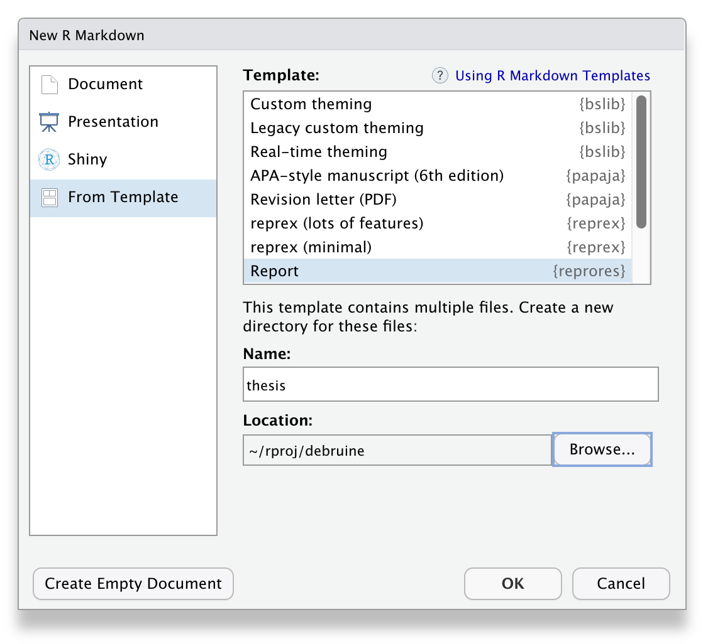

# Markdown

Bu bölümde kullanacağımız paketler şunlardır.

```{r , message=FALSE, warning = FALSE}
knitr::opts_chunk$set(message = FALSE, warning = FALSE)
# bu bölüm için gerekli paketler
library(tidyverse) # çeşitli veri manipülasyon fonksiyonları
library(knitr) # tablo ve görüntü gösterimi için
library(kableExtra) # tabloları şekillendirmek için
library(papaja) # APA tarzı tablolar için
library(gt) # süslü tablolar için
library(DT) # etkileşimli tablolar için

```

`r emo::ji("link")`İndir [R Markdown Cheat Sheet](https://www.rstudio.org/links/r_markdown_cheat_sheet).

## Neden tekrarlanabilir raporlar kullanılmalı?

Bir rapor hazırladığınızı düşünün

-   içinde analiz sonuçları olan tablolar

-   grafikler ve görsel olsun

-   bu raporu güncellemeniz gerektiğinde veri seti, grafikler, analizler başka dizinlerde olabilir.

-   Tekrarlanabilir raporlar, tüm analizleri gerçekleştirmek ve tabloları oluşturmak için gereken kodla birlikte rapor metnini tek bir belgede bir araya getirmektir.

-   Bu, başlangıçta biraz fazladan çaba gerektirse de, herhangi bir değişiklik olduğunda tek bir düğmeye basarak tüm raporunuzu güncellemenizi sağlayarak size fazlasıyla geri ödeme yapacaktır.

-   Araştırmalar ayrıca, bilimsel literatürdeki makalelerin çoğunda olmasa bile birçoğunda raporlama hataları olduğunu göstermektedir. Tekrarlanabilir raporlar, transkripsiyon ve yuvarlama hatalarını önlemeye yardımcı olur.

-   Rapor daha sonra orijinal formattan HTML, word ve ya PDF gibi daha taşınabilir başka bir formata "derlenir". Bu, örneğin Microsoft Excel'de veya SPSS gibi bir istatistik programında bir grafik oluşturup ardından bunu Microsoft Word'e yapıştırdığınız geleneksel kesme ve yapıştırma yaklaşımlarından farklıdır.

## Bir proje düzenlemek

-   İlk olarak, organize olmamız gerekiyor. RStudio'daki projeler, bir proje için ihtiyaç duyduğunuz tüm dosyaları gruplandırmanın bir yoludur. Çoğu proje komut dosyalarını, veri dosyalarını ve komut dosyası veya görüntüler tarafından oluşturulan PDF raporu gibi çıktı dosyalarını içerir.


### Dosya Sistemi

-    Bilgisayarınızın dosya sistemi, hem dosyaları hem de "alt dizinleri" içeren büyük dizin gibidir. Bir dosyanın konumunu adıyla ve içinde bulunduğu tüm dizinlerin adlarıyla belirtebilirsiniz.

-   Örneğin, Kubra Masaüstünde report.Rmd adında bir dosya arıyorsa, tam dosya yolunu şu şekilde belirtebilir: **/Users/Kubra/Desktop/report.Rmd** , çünkü Masaüstü dizini, tüm dosya sisteminin tabanında bulunan Kullanıcılar/Users dizininin içindeki Kubra dizininin içindedir. Bu dosya masaüstünüzde olsaydı, kullanıcı dizininizin adı da Kubra değilse muhtemelen farklı bir yola sahip olurdunuz. Şu anda oturum açmış olan kişinin kullanıcı dizinini temsil etmek için \~ kısayolunu da kullanabilirsiniz: **\~/Desktop/report.Rmd.**

### Çalışma Dizini

-   Tüm dosyalarınızı nereye koymalısınız? Genellikle tek bir proje için tüm komut dosyalarınızın ve veri dosyalarınızın bilgisayarınızdaki tek bir klasörde, o projenin çalışma dizininde olmasını istersiniz. Dosyaları bu ana proje dizini içindeki alt dizinlerde düzenleyebilirsiniz, örneğin tüm ham veri dosyalarını **data/import** adlı bir dizine koyabilir ve tüm görüntü dosyalarını **images** adlı bir dizine kaydedebilirsiniz.

-   Kodunuz, uygun biçimi kullanarak yalnızca üç tür konumdaki dosyalara başvurulmalıdır.

| Yer              | Örnek                                                  |
|--------------------------------|----------------------------------------|
| web              | "<https://atalay-k.github.io/OLC731/import/veri1.txt>" |
| dizin içinde     | "veri1.txt"                                            |
| alt dizin içinde | "import/veri1.txt"                                     |

::: {.warning data-latex=""}
Bir komut dosyasında asla çalışma dizininizi ayarlamayın veya değiştirmeyin.
:::

-   R Markdown dosyaları otomatik olarak **.Rmd** dosyasının bulunduğu dizini çalışma dizini olarak kullanacaktır.

-   Kodunuz çalışma dizininizin bir alt dizinindeki bir dosyaya ihtiyaç duyuyorsa (örneğin, import/veri1.txt), çalışma dizinini başka bir konuma veya bilgisayara taşıdığınızda erişilebilir olması için dosyayı göreli bir yol kullanarak yükleyin:

```{r eval=FALSE, message=FALSE, warning=FALSE, include=TRUE}
dat <- read_csv("import/veri1.txt")  # dogru
```

Bu dosyayı aşağıdaki gibi mutlak yol/adres ile yüklemeyin:

```{r eval=FALSE,  message=FALSE, warning=FALSE, include=TRUE}
dat <- read_csv("c:/Users/Kubra/Desktop/OLC731/import/veri1.txt")  # yanlıs
```

::: {.info data-latex=""}
Ayrıca, Windows'a özgü geriye doğru eğik çizgi kullanma kuralının aksine, ileriye doğru eğik çizgi kullanma kuralına dikkat edin. Bu, dosyalara yapılan referansların işletim sistemlerinden bağımsız olarak herkes için çalışmasını sağlamak içindir.
:::


### Nesneleri Adlandırma

Dosyaları, hem insanların hem de bilgisayarların kolayca bulabileceği şekilde adlandırın. İşte bazı önemli ilkeler:

-   dosya ve dizin adları yalnızca harf, rakam, tire ve alt çizgi içermeli, dosya adı ve uzantısı arasında nokta (.) olmalıdır (bu boşluk olmadığı anlamına gelir!)
-   Büyük harf kullanımı konusunda tutarlı olun (hatırlamayı kolaylaştırmak için bir kural belirleyin, örneğin her zaman küçük harf kullanın)
-   dosya adının bölümlerini ayırmak için alt çizgi (\_) ve bir bölümdeki sözcükleri ayırmak için tire (-) kullanın
-   dosyaları mantıklı bir sırayla alfabetik hale getiren ve aradığınız dosyayı bulmanızı kolaylaştıran bir kalıpla adlandırın
-   bir dosya adını listenin en üstüne taşımak için önüne alt çizgi ekleyin veya sıralarını kontrol etmek için tüm dosyaların önüne sayı ekleyin
-   tarihler için YYYY-MM-DD biçimini kullanın, böylece kronolojik sıraya göre sıralanırlar

Örneğin, bu dosya adları tam bir karmaşa:

-   `r path("Data (Participants) 11-15.xls")`
-   `r path("final report2.doc")`
-   `r path("Participants Data Nov 12.xls")`
-   `r path("project notes.txt")`
-   `r path("Questionnaire Data November 15.xls")`
-   `r path("report.doc")`
-   `r path("report final.doc")`

Benzer dosyaların aynı yapıya sahip olması ve dosyaları taramanın veya ilgili dosyaları bulmak için kod kullanmasının kolay olması için dosyaları yapılandırabilirsiniz.

-   `r path("_project-notes.txt")`
-   `r path("data_participants_2021-11-12.xls")`
-   `r path("data_participants_2021-11-15.xls")`
-   `r path("data_questionnaire_2021-11-15.xls")`
-   `r path("report_v1.doc")`
-   `r path("report_v2.doc")`
-   `r path("report_v3.doc")`

::: {.try data-latex=""}
Yukarıdaki dosyaları adlandırmak için başka yollar düşünün. Kendi proje dosyalarınızdan bazılarına bakın ve neleri geliştirebileceğinizi görün.
:::

### Yeni bir projeye başlamak

-   Artık dosya sisteminin nasıl çalıştığını ve komut dosyalarının bunlara erişmesini kolaylaştırmak için nesneleri nasıl adlandıracağımızı anladığımıza göre, projemizi yapmaya hazırız.

-   Öncelikle, bu sınıf için tüm materyallerinizi tutacağınız yeni bir dizin oluşturun (benimkine OLC731_2023 adını verdim). Bu dizini Global Options'ın general bölümü altında varsayılan çalışma dizini olarak ayarlayabilirsiniz. Bu, bir projede çalışmıyorsanız dosyaların varsayılan olarak buraya kaydedileceği anlamına gelir.

::: {.warning data-latex=""}
Bu dizin OneDrive'daysa veya tam dosya yolu özel karakterler içeriyorsa ya da bazı Windows makinelerinde 260 karakterden fazlaysa bazen sorunlara neden olabilir.
:::

-   Ardından, OLC731 adında yeni bir proje oluşturmak için **`File`** menüsü altında **`New Project...`** öğesini seçin. Yeni oluşturduğunuz dizinin içine kaydettiğinizden emin olun. RStudio kendini yeniden başlatacak ve çalışma dizini olarak bu yeni proje dizini ile açılacaktır.

Proje dizininin içeriğini görmek için sağ alt bölmedeki Files sekmesine tıklayın. Tüm proje bilgilerini içeren OLC731_OLC731_2023.Rproj adlı bir dosya göreceksiniz, projeyi açmak için üzerine çift tıklayabilirsiniz.

::: {.info data-latex=""}
Ayarlarınıza bağlı olarak, özel kullanıcı ayarlarınızı içeren .Rproj.user adlı bir dizin de görebilirsiniz. Bu ve nokta ile başlayan diğer "görünmez" dosyaları yok sayabilirsiniz.
:::
## R Markdown

-   Bu derste, bir içindekiler tablosu, uygun başlıklar, kod parçaları, tablolar, resimler, satır içi R ve bir kaynakça içeren bir R Markdown belgesi oluşturmayı öğreneceğiz.

::: {.info data-latex=""}
R Markdown'a çok benzeyen quarto adında yeni bir tür tekrarlanabilir rapor formatı var. Bu derste [quarto](https://quarto.org/){target="_blank"} kullanmayacağız çünkü aynı anda hem quarto hem de R Markdown öğreniyorsanız kafa karıştırıcı olabilecek birkaç küçük farkı var, ancak R Markdown'ı öğrendikten sonra quarto'yu çok kolay bir şekilde öğrenebilirsiniz.
:::

-   Tekrar üretilebilir raporlar oluşturmak için metin ve kodun karıştırılmasını sağlayan R Markdown kullanacağız. Yeniden üretilebilir bir komut dosyası, kod bloklarında kod bölümleri içerecektir. Bir kod bloğu arka arkaya üç backtick sembolü ile başlar ve biter, küme parantezleri arasında kod hakkında bazı bilgiler bulunur, örneğin {r chunk-name, echo=FALSE} (bu kodu çalıştırır, ancak derlenen belgede kod bloğunun metnini göstermez). Kod bloklarının dışındaki metin, başlıklar, paragraflar, listeler, kalınlaştırma ve bağlantılar gibi biçimlendirmeyi belirtmenin bir yolu olan markdown ile yazılır. [Örnek Dosyayı beraber inceleyelim.](https://raw.githubusercontent.com/atalay-k/OLC731/main/docs/repro.Rmd)
=======
-   Tekrar üretilebilir raporlar oluşturmak için metin ve kodun karıştırılmasını sağlayan R Markdown kullanacağız. Yeniden üretilebilir bir komut dosyası, kod bloklarında kod bölümleri içerecektir. Bir kod bloğu arka arkaya üç backtick sembolü ile başlar ve biter, küme parantezleri arasında kod hakkında bazı bilgiler bulunur, örneğin {r chunk-name, echo=FALSE} (bu kodu çalıştırır, ancak derlenen belgede kod bloğunun metnini göstermez). Kod bloklarının dışındaki metin, başlıklar, paragraflar, listeler, kalınlaştırma ve bağlantılar gibi biçimlendirmeyi belirtmenin bir yolu olan markdown ile yazılır. [Örnek Dosyayı beraber inceleyelim.](https://github.com/atalay-k/OLC731/blob/main/docs/repro.Rmd)
>>>>>>> 0d7dfe2e0520aad595526b603786ccc1fbe9b63c


-   Bir şablondan yeni bir R Markdown dosyası açarsanız, içinde birkaç kod bloğu bulunan örnek bir belge görürsünüz. Bir R Markdown (Rmd) belgesinden HTML veya PDF raporu oluşturmak için belgeyi derlersiniz. Bir belgeyi derlemeye RStudio'da örme denir. Dosyanızı bir rapora derlemek için üzerine tıkladığınız, içinden iğneler geçen bir iplik yumağına benzeyen bir düğme vardır.

::: {.try data-latex=""}
**`File > New File > R Markdown...`** menüsünden yeni bir R Markdown dosyası oluşturun. Başlığı ve yazarı değiştirin, dosyayı repro.Rmd olarak kaydedin, ardından bir html dosyası oluşturmak için ör düğmesine tıklayın.
:::

### YAML Header {#yaml}

-  `r emo::ji("link")` [YAML başlığı çeşitli seçenekleri ayarlayabileceğiniz bölümdür.](https://bookdown.org/yihui/rmarkdown/html-document.html)

```
---
title: "Demo"
author: "Kubra"
output:
  html_document:
    toc: true
    toc_float:
      collapsed: false
      smooth_scroll: false
      number_sections: false
---
```

::: {.info data-latex=""}
Seçeneklerin ne işe yaradığını görmek için değerleri `false` tan `true` ya değiştirmeyi deneyin.
:::

-   `df_print: kable` seçeneği `knitr::kable` kullanarak veri setleri yazdırır. Aşağıda tabloları nasıl daha fazla özelleştirebileceğinizi öğreneceksiniz.

-   Varsayılan temalar şunlardır: default, cerulean, cosmo, darkly, flatly, journal, lumen, paper, readable, sandstone, simplex, spacelab, united ve yeti. Linkten `r emo::ji("link")`[daha fazla temayı inceleyebilirsiniz.](https://rpubs.com/ranydc/rmarkdown_themes).

### Kurulum

-   Varsayılan şablonu kullanarak RStudio'da yeni bir R Markdown dosyası oluşturduğunuzda, otomatik olarak bir kurulum blogu oluşturulur.

```{r knitr-setup, eval=FALSE, verbatim="r setup, include=FALSE"}
knitr::opts_chunk$set(echo = TRUE)
```

-   Kod parçaları için daha fazla varsayılan seçeneği buradan ayarlayabilirsiniz. Olası seçeneklerin açıklamaları için knitr seçenekleri belgelerine bakın. [knitr dokumanı](https://yihui.name/knitr/options/){target="_blank"}

```{r knitr-setup2, eval=FALSE, verbatim="r setup, include=FALSE"}
knitr::opts_chunk$set(
  fig.width  = 8,
  fig.height = 5,
  fig.path   = 'images/',
  echo       = FALSE,
  warning    = TRUE,
  message    = FALSE,
  cache      = FALSE
)
```

Yukarıdaki kod aşağıdaki seçenekleri ayarlar:

-   fig.width = 8 : varsayılan şekil genişliği 8 inçtir (bunu tek tek şekiller için değiştirebilirsiniz)

-   fig.height = 5 : varsayılan şekil yüksekliği 5 inçtir fig.path = 'images/' : şekiller "images" dizinine kaydedilir

-   echo = FALSE : işlenen belgede kod parçalarını gösterme

-   warning = FALSE : herhangi bir işlev uyarısı gösterme

-   message = FALSE : herhangi bir işlev mesajı gösterme

-   cache = FALSE : her örgü ördüğünüzde tüm görüntüleri ve nesneleri oluşturmak için tüm kodu çalıştırın (zaman alıcı kodunuz varsa TRUE olarak ayarlayın) Konsola `r hl(str(knitr::opts_chunk$get()))` yazarak geçerli kod bloğu seçeneklerinin bir listesini bulun.

İhtiyacınız olan paketleri `r hl(library())`kullanarak da bu bloğunuza ekleyebilirsiniz. Genellikle bir komut dosyası üzerinde çalışırken, başka bir eklenti paketi yüklemeniz gerektiğini fark edersiniz. `library(...)` çağrısını kodun en altına gömmeyin. En üste koyun, böylece kullanıcı hangi paketlerin gerekli olduğuna dair genel bir fikir elde edilir.


::: {.try data-latex=""}
tidyverse paketinden fonksiyon kullanacağız, bu yüzden kurulum bloğunuza yükleyin.
:::

### Yapı

-   Bir içindekiler tablosu (`toc`) eklerseniz, bu tablo belge başlıklarınızdan oluşturulur. Markdown'daki başlıklar, başlık başlığının önüne bir veya daha fazla hash (\#) eklenerek oluşturulur.

-   Kendi analiz komut dosyalarınızı geliştirirken aşağıdaki yapıyı kullanın:

-   Kullanmanız gereken tüm eklenti paketlerini yükleyin

-   herhangi bir özel fonksiyon tanımlayın

-   birlikte çalışacağınız verileri yükleyin veya simüle edin

-   kaydetmeniz gereken her şeyi kaydedin

::: {.try data-latex=""}
Varsayılan metni silin ve başlıklar ve alt başlıklar oluşturarak belgenize biraz yapı ekleyin. Bazı verileri yükleyeceğiz, bir özet tablo oluşturacağız, verileri çizeceğiz ve analiz edeceğiz.
:::

### Kod Blokları

-   Metninize eklemek için görüntüler, tablolar veya hesaplamalar oluşturan ve görüntüleyen kod parçaları ekleyebilirsiniz. Bazı verileri yükleyerek başlayalım.

-   İlk olarak, belgenizde bir kod yığını oluşturun. Bu kod web'den bazı verileri yükler

```{r}
library(datasets)
data(iris)
```

### Yorumlar

-   Kod blokları içine hash sembolü (\#) ile yorum ekleyebilirsiniz. R yorumlayıcısı, hash'ten satır sonuna kadar olan karakterleri yoksayacaktır.

```{r message=FALSE, warning=FALSE}


n <- nrow(iris) # toplam satır sayısı
mu <- mean(iris$Petal.Length)  # yaprak uzunluğu ortalaması
sd <- sd(iris$Petal.Length) # yaprak uzunluğu ortalaması SD'si


simule_deger <- rnorm(n, mu, sd)
```

-   Bir kod parçasını, özellikle kod rapor metninde açıklanmamışsa, orada ne yaptığınızı açıklayan bir yorumla başlatmak genellikle iyi bir uygulamadır.

-   Nesnelerinizi açık bir şekilde adlandırırsanız, genellikle açıklayıcı yorumlar eklemeniz gerekmez. Örneğin, yukarıdaki üç nesneyi n_iris, ort_petal ve sd_petal olarak adlandırmış olsaydım, yorumları atlardım.

-   Yorumların bir başka kullanımı da çalıştırmak istemediğiniz ancak silmek de istemediğiniz bir kod bölümünü "yorumlamaktır". Örneğin, bir paketi yüklemek için kullanılan kodu kodunuza dahil edebilirsiniz, ancak kodun her çalıştırıldığında uzun bir yüklemeye zorlamaması için her zaman yorumlamanız gerekir.

```{r}
# install.packages("dplyr")
# install.packages("tidyr")
# install.packages("ggplot2")
```

::: {.info data-latex=""}
Satırları seçip Cmd-shift-C (Mac) veya Ctrl-shift-C (Windows) yazarak aynı anda birden fazla satıra yorum yazabilir veya yorumu kaldırabilirsiniz.
:::


-   Kodunuzu iyi bir şekilde yorumlamak biraz sanattır. Bu beceriyi geliştirmenin en iyi yolu, başkalarının kodlarını okumak ve başkalarının kodunuzu incelemesini sağlamaktır.

### Satır İçi kodlar {#inline-r}

-   Şimdi setosa ve virginica çiçek türlerinde yaprak uzunluklarını analiz edelim. Önce analiz kodunu çalıştıracağız. Daha sonra makalemizde kullanmak isteyebileceğimiz sayıları değişkenlere kaydedeceğiz ve uygun şekilde yuvarlayacağız. Son olarak, bir sonuçları biçimlendirmek için glue::glue() kullanacağız.

```{r}
# analiz
library(dplyr)
setosa_petal <- filter(iris, Species == "setosa") %>% pull(Petal.Length)
virginica_petal <- filter(iris, Species == "virginica") %>% pull(Petal.Length)
petal_test <- t.test(setosa_petal, virginica_petal)

# rapor edilecek degerleri yorumlama
t <- petal_test$statistic %>% round(2)
df <- petal_test$parameter %>% round(1)
p <- petal_test$p.value %>% round(3)
# handle p-values < .001
p_symbol <- ifelse(p < .001, "<", "=")
if (p < .001) p <- .001

# sonucları birleştirme
petal_result <- glue::glue("t = {t}, df = {df}, p {p_symbol} {p}")
```

-   Sonuçları, aşağıdaki gibi görünen satır içi R kodu ile bir paragrafa ekleyebilirsiniz:

```{=html}
<pre><code> virginica çiçeklerinin yaprakları setosa çiçeklerinin yapraklarından uzundur(&#96;r petal_result&#96;).</code></pre>
```
virginica çiçeklerinin yaprakları setosa çiçeklerinin yapraklarından uzundur (`r petal_result`).

### Tablolar {#repro-tables}

-   Çalışmaların yöntem bölümüne betimsel bilgiler eklemek istediğimizde

```{r}
ozet_tablo <- iris %>%
  group_by(Species) %>%
  summarise(
    n = n(),
    ortalama = mean(Petal.Length),
    sd = sd(Petal.Length)
  )
ozet_tablo
```

::: {.warning data-latex=""}
Yukarıdaki tablo etkileşimli görünümde tibble biçiminde yazdırılacak, ancak ördüğünüzde YAML başlığındaki df_print ayarındaki biçimi kullanacaktır.
:::


-   Yukarıdaki tabloda, sütun etiketlerini değiştirerek, ortalamaları yuvarlayarak ve bir başlık ekleyerek daha okuyucu dostu hale getirlebilir. Bunun için `r hl(knitr::kable())` işlevini veya tablolarınızı biçimlendirmek için diğer paketlerdeki daha özel işlevleri kullanabilirsiniz.


<div class="tab">
<button class="tablinks" onclick="openCity(event, &#39;knitr&#39;)">knitr</button>
<button class="tablinks" onclick="openCity(event, &#39;kableExtra&#39;)">kableExtra</button>
<button class="tablinks" onclick="openCity(event, &#39;papaja&#39;)">papaja</button>
<button class="tablinks" onclick="openCity(event, &#39;gt&#39;)">gt</button>


<div id="knitr" class="tabcontent">

```{r kable-demo}
yeni_ad <- c("Çiçek Türü", "Frekans", "Ortalama", "Sd")

knitr::kable(ozet_tablo,
             digits = 2,
             col.names = yeni_ad,
             caption = "Petal Uzulukları için Özet Tablo")
```

</div>


<div id="kableExtra" class="tabcontent">

**[kableExtra](https://haozhu233.github.io/kableExtra/awesome_table_in_html.html) paketi çok sayıda seçenek sunar.**

```{r kableExtra-demo, warning = FALSE}
library(kableExtra)

kable(ozet_tablo,
      digits = 2,
      col.names = c("Çiçek Türü", "Frekans", "Ortalama", "Sd"),
      caption = "Petal Uzulukları için Özet Tablo") |>
  kable_classic() |>
  kable_styling(full_width = FALSE, font_size = 20) |>
  add_header_above(c(" " = 2, "Degerler" = 2)) |>
  kableExtra::row_spec(2, bold = TRUE, background = "lightgrey")
```
</div>


<div id="papaja" class="tabcontent">

**[papaja](https://crsh.github.io/papaja_man/reporting.html#tables) paketi ile APA formatında tablolar elde edebilirsiniz.**

```{r papaja-demo}
papaja::apa_table(ozet_tablo,
                  col.names = c("Çiçek Türü", "Frekans", "Ortalama", "Sd"),
                  caption = "Petal Uzulukları için Özet Tablo",
                  col_spanners = list("Means" = c(3, 4)))
```

</div>

<div id="gt" class="tabcontent">

**[gt](https://gt.rstudio.com/index.html) paketinde de çok sayıda seçenek bulunmaktadır.**

```{r gt-demo}
library(gt)

gt(ozet_tablo, caption = "Petal Uzulukları için Özet Tablo") |>
  fmt_number(columns = c(ortalama, sd),
             decimals = 2) |>
  cols_label(Species = "Çiçek Türü",
             n = "Frekans",
             ortalama = "ortalama",
             sd = "sd") |>
  tab_spanner(label = "Degerler",
              columns = c(ortalama, sd)) |>
  opt_stylize(style = 6, color = "blue")
```

</div>
</div>

### Görseller {#repro-figures}


-   Şekil başlığının kod bloğında nasıl biçimlendirildiğine dikkat edin.

```{r  verbatim = 'r boxplot, fig.cap="Sekil 1 1. Türlere göre yaprak uzunluğu"'}
#| fig.cap: "Petal Uzunlukları ve Türler"

dat <- subset(iris, Species != "versicolor")
dat$Species <- factor(dat$Species)

ggplot(dat, aes(Species, Petal.Length)) +
  geom_boxplot(width = 0.25,
               show.legend = FALSE)  +
  labs(x = "", y = "Petal Uzunluğu") +
  theme(text = element_text(size = 20, family = "Times"))

```

```{r pet-plot-out, echo = FALSE}
#| fig.cap: " Petal Uzunlukları ve Türler"

dat <- subset(iris, Species != "versicolor")
dat$Species <- factor(dat$Species)

ggplot(dat, aes(Species, Petal.Length)) +
  geom_boxplot(width = 0.25,
               show.legend = FALSE)  +
  labs(x = "", y = "Petal Uzunluğu") +
  theme(text = element_text(size = 20, family = "Times"))
```

::: {.info data-latex=""}
Son satır varsayılan metin boyutunu ve yazı tipini değiştirir, bu da bir derginin gereksinimlerini karşılayan şekiller oluşturmak için yararlı olabilir.
:::

-   Kodlarla oluşturamadığınız şekilleri de resim dosyaları ile dökümana ekleyebilirsiniz:

``` md
{style="width: 50%"}
```

{style="width: 50%"}

### Bağlantılı Dökümanlar

-   Markdown bölümler arasında bağlantılar içeren daha uzun raporlar oluşturmanıza yardımcı olur.

-   Başlığı olan tüm şekillere veya tablolara otomatik olarak şekil ve tablo numaraları ekler ve bunlara referansla bağlantı vermenize olanak sağlar.

-   Tablolara ve şekillere bağlantılar oluşturmak için, şekillerinizi veya tablolarınızı oluşturan kod bloklarınız adlandırmanız ve ardından satır içi kodlamanızda bu adları çağırmanız gerekir:

```{r, eval = FALSE, verbatim="r tablo1"}
# kodlar
```

```{r, eval = FALSE, verbatim="r sekil1"}
# kodlar
```

```
Bakınız Tablo\ \@ref(tab:tablo1) or Sekil\ \@ref(fig:sekil1).
```

::: {.warning data-latex=""}
Kod blok adları yalnızca harf, rakam ve tire içerebilir. Boşluk veya alt çizgi gibi başka karakterler içeriyorlarsa, referanslama çalışmayacaktır.
:::

Başlıklarınızı {#} ile adlandırarak da raporunuzun farklı bölümlerine bağlantı verebilirsiniz:

```
# Baslık 1 {#baslık-1}

## Baslık 2 {#baslık-2}

Bakınız Bolum\ \@ref(baslık-1) and Bolum\ \@ref(baslık-2)
```

-   Aşağıdaki kod, ggplot2 paketindeki `diamonds` veri seti kullanarak tam bir raporda metnin şekillere veya tablolara nasıl bağlanacağını göstermektedir - bu belgeyi şimdi oluşturmak için aşağıdaki kodları kullanın.

`r hide("Dokuman burada")`

```{embed, file = "demo/html_document2.Rmd"}
# readLines("demo/html_document2.Rmd") |>
#   paste(collapse = "\n") |>
#   paste0("<code style='font-size: smaller;'><pre>\n", ., "\n</pre></code>") |>
#   cat()
```

`r unhide()`

Bu format varsayılan olarak numaralandırılmış bölümler bulunuyor, numaralandırma bunu istemiyorsanız `YAML` bölümünde `number_sections: false` ayarını yapın. Numaralandırılmış bölümleri kaldırırsanız, `\@ref(sonuclar)` gibi bağlantılar "??" gösterecektir, bu nedenle bunun yerine aşağıdaki gibi URL bağlantı sözdizimini kullanmanız gerekir:


```
Son açıklamalar için [son bölüme](#sonuclar) bakınız.
```

## Kaynakça

R Markdown'da metin içi referanslar yapmanın ve otomatik olarak bir kaynakça oluşturmanın birkaç yolu vardır. Markdown dosyalarının, atıfta bulunmanız gereken referansları içeren bir BibTex veya JSON dosyasına (referansları belirli bir formatta içeren düz bir metin dosyası) bağlanması gerekir. Bu dosyanın adını bibliography: refs.bib gibi YAML başlığında belirtirsiniz ve [@tidyverse] gibi bir @ sembolü ve kısa ad kullanarak metin içinde referanslara atıfta bulunursunuz. Referanslarınızı örneğin APA stilinde biçimlendirmek için bir Citation Style Language (.csl) dosyası da ekleyebilirsiniz.

a [bibliography](https://bookdown.org/yihui/rmarkdown-cookbook/bibliography.html){target="_blank"}

```
---
title: "My Paper"
author: "Me"
output:
  html_document:
    toc: true
bibliography: refs.bib
csl: apa.csl
---
```

### Referans yazılımdan dönüştürme

EndNote veya Zotero gibi çoğu referans yazılımı BibTeX formatına aktarabilen dışa aktarma seçeneklerine sahiptir. Ortaya çıkan dosyadaki kısa adları kontrol etmeniz yeterlidir.

::: {.warning data-latex=""}
Bir  referans programı kullanmak hayatınızı çok daha kolaylaştıracaktır. Zotero muhtemelen en iyisidir.
:::

Dışa aktarılan dosya şu şekilde görünmelidir:

```{embed, file = "demo/export-data.bib"}

```

### BibTeX Dosyası Oluşturma

Referansları manuel olarak da ekleyebilirsiniz. RStudio'da **`File`** \> **`New File...`** \> **`Text File`** seçeneğine gidin. \> Metin Dosyası'na gidin ve dosyayı "refs.bib" olarak kaydedin.

Ardından, YAML başlığınıza `bibliography: refs.bib` satırını ekleyin.

### Referans ekleme

Bir dergi makalesine aşağıdaki formatta referanslar ekleyebilirsiniz:

```
@article{shortname,
  author = {Author One and Author Two and Author Three},
  title = {Paper Title},
  journal = {Journal Title},
  volume = {vol},
  number = {issue},
  pages = {startpage--endpage},
  year = {year},
  doi = {doi}
}
```

Kitaplara, teknik raporlara ve daha fazlasına atıfta bulunma talimatları için BibTeX formatına ilişkin eksiksiz bir kılavuza bakın.

citation() ve toBibtex() fonksiyonlarını kullanarak bir R paketi için referans alabilirsiniz. Bibtex girişini bibliography.bib dosyanıza yapıştırabilirsiniz. Referansa atıfta bulunmak için ilk virgülden önce kısa bir ad (örneğin, "ggplot2") eklediğinizden emin olun.

See [A complete guide to the BibTeX format](https://www.bibtex.com/g/bibtex-format/){target="_blank"} kitaplara, teknik raporlara ve daha fazlasına atıfta bulunma talimatları için.

Bir R paketinin referansını `citation()` ve `toBibtex()` fonksiyonlarını kullanarak alabilirsiniz. Bibtex girişini bibliography.bib dosyanıza yapıştırabilirsiniz. Referansa atıfta bulunmak için ilk virgülden önce kısa bir ad (örneğin, "ggplot2") eklediğinizden emin olun.

```{r}
citation(package="ggplot2") %>% toBibtex()
```

[Google Scholar](https://scholar.google.com/)  girişlerinde BibTeX atıf seçeneği vardır. DOI'yi kendiniz eklemeniz gerekse de, Zotero tarayıcı bağlayıcısı aracılığıyla bir atıf ekleyemiyorsanız, ilgili değerleri almanın en kolay yolu genellikle budur. Önerilen kısa adı koruyabilir veya sizin için daha anlamlı olan bir adla değiştirebilirsiniz.

```{r google-scholar, echo = FALSE, fig.cap = "Get BibTex citations from Google Scholar."}
knitr::include_graphics("images/google-scholar.png")
```

### Referanslara atıfta bulunma

Metin içinde referansları bu şekilde gösterebilirsiniz:

```
This tutorial uses several R packages [@tidyverse;@rmarkdown].
```

Bu eğitimde çeşitli R paketleri kullanılmaktadır (Allaire vd., 2018; Wickham, 2017).


### Atıf yapılmayan referanslar

Bir öğeyi kaynak göstermeden referans bölümüne eklemek istiyorsanız, bunu YAML başlığına şu şekilde ekleyin:

```
nocite: |
  @kathawalla_easing_2021, @broman2018data, @nordmann2022data
```

Ya da .bib dosyasındaki tüm öğeleri şu şekilde ekleyin:

```
nocite: '@*'
```

### Atıf Stilleri

Çeşitli dergiler için [stil dosyalarının](https://www.zotero.org/styles){target="_blank"} bir listesini arayabilir ve kaynakçanızı belirli bir derginin stiline göre biçimlendirecek bir dosya indirebilirsiniz. YAML başlığınıza `csl: filename.csl` satırını eklemeniz gerekir.

::: {.try data-latex=""}
refs.bib dosyanıza bazı alıntılar ekleyin, metninizde bunlara atıfta bulunun ve otomatik olarak oluşturulan referans bölümünü görmek için makalenizi işleyin. Birkaç farklı atıf stili dosyası deneyin.
:::

### Referens Bölümü

Varsayılan olarak, referans bölümü belgenin sonuna eklenir. Konumu değiştirmek istiyorsanız (örneğin, referanslardan sonra şekil ve tablo eklemek için), referansları istediğiniz yere `<div id="refs"></div>` ekleyin.

::: {.try data-latex=""}
Raporunuza metin içi alıntılar ve bir referans listesi ekleyin.
:::

## Özel Şablonlar

Bazı paketler özel R Markdown şablonları sağlar. reprores, YAML başlığındaki tüm olası seçenekleri gösteren, kaynakça ve stil dosyalarına sahip olan ve bağlantılı şekil ve tabloların nasıl ayarlanacağını açıklayan bir Rapor şablonuna sahiptir. Birden fazla dosya içerdiğinden, RStudio sizden tüm dosyaları tutmak için yeni bir klasör oluşturmanızı isteyecektir.

```{r img-custom-rmd, echo=FALSE, fig.cap="Şablonlar", out.width = '75%'}


```

::: {.try data-latex=""}
Rapor şablonu ile bir rapor başlatın ve örün. Seçenekleri değiştirmeyi veya silmeyi deneyin.
:::

## Diğer Kaynaklar

-   [Chapter 27: R Markdown](http://r4ds.had.co.nz/r-markdown.html) in *R for Data Science*
-   [R Markdown Cheat Sheet](https://github.com/rstudio/cheatsheets/raw/master/rmarkdown.pdf)
-   [R Markdown reference Guide](https://www.rstudio.com/wp-content/uploads/2015/03/rmarkdown-reference.pdf)
-   [R Markdown Tutorial](https://rmarkdown.rstudio.com/lesson-1.html)
-   [R Markdown: The Definitive Guide](https://bookdown.org/yihui/rmarkdown/) by Yihui Xie, J. J. Allaire, & Garrett Grolemund
-   [Project Structure](https://slides.djnavarro.net/project-structure/) by Danielle Navarro
-   [How to name files](https://speakerdeck.com/jennybc/how-to-name-files) by Jenny Bryan
-   [Papaja](https://crsh.github.io/papaja_man/) Reproducible APA Manuscripts
-   [The Turing Way](https://the-turing-way.netlify.app/)

