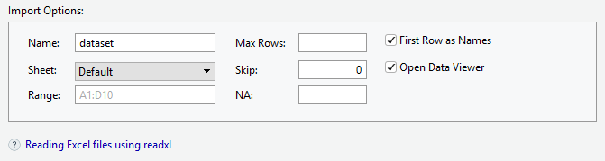

# Veri Okuma ve Yazma

-   Veri girişi istatistiksel analiz sürecinin ilk adımıdır.

-   R'da veri girişi diğer yazılımlarla kıyaslandığında **çok kullanışlı değildir.**

-   Bu nedenle aktarma/import yolu tercih edilir.

-   Veri aktarımı için çok sayıda fonksiyon ve paket bulunmaktadır.

-   Ayrıca **menü ile de aktarma** yapılabilir.

-   Bilgisayardan internetten farklı formattaki veriler okunabilir.

-   Veri setleri genellikle Excel, SPSS veya metin dosyaları (.txt, .csv, .dat, vb.) gibi uygun veri biçimlerinde kaydedilir

-   R, çeşitli veri formatlarını içe aktarabilir (yani okuyabilir).

Bir veri setini R'ye aktarmanın iki yolu vardır:

1.  RStudio'da "Veri Kümesini İçe Aktar" menü seçeneğini kullanarak


2.  Belirli bir R komutunu kullanarak

-   İçe aktarmak istediğiniz dosyaya göz atın.

-   Veri seti için bir isim verin.

-   İçe aktarılacak sayfayı seçin.

-   Değişken isimleri dosyanın ilk satırındaysa "First Row as Names".



### SPSS dosylarını içe aktarma

-   İçe aktarmak istediğiniz dosyaya göz atın.

-   Veri seti için bir isim verin.


## Veri Okuma

-   En temel veri okuma/aktarma fonksiyonları

    -   `scan()`
    -   `read.*`
    -   `read.table()`
    -   `read.csv()`
    -   `read.csv2()`
    -   `read.delim()`
    -   `read.delim2()`
    -   `readLines()`

-   Verinin düzgün girilmiş olması okumayı kolaylaştırır.

-   İlk satırda genellikle değişken adlarına (header), ilk sütunda ise kimlik veya sıra numarasına yer verilir.

-   Gözlemlere ve değişkenlere ilişkin veri girilirken karakterler veya sayısal değerler arasında boşluk bırakmaktan kaçınmak gerekmektedir. Değişken adı boşluklu yazılmışsa ne olur?

-   Eksik veri boyunca aynı şekilde girilmelidir.

-   Değişkenlerin birinden nasıl ayrıldığı önemlidir. (, ; :  / )

-   Tercihimiz **.csv** uzantılı veriler ama büyük veri setleri az yer kalması icin **.txt,.prn** formatında karşımıza çıkabilmektedir.

-   Temel pakette **read.csv** ve **read.table** gibi bazı fonksiyonlar bulunmaktadır.

-   Ayrıca, belirli formatlarını içe aktarmak için R paketleri bulunmaktadır.Örneğin, SPSS dosyaları için **foreign** ve Excel dosyaları için **xlsx** gibi

## read.\*() fonksiyonları

| **Argüman**     | **Açıklama**                                                                                 |
|:-----------------------------------|:-----------------------------------|
| **header**      | Mantıksal değerler ile verinin ilk satırında değişken isimlerinin olup olmadığını test eder. |
| **sep**         | Sütun ayracıdır.                                                                             |
| **na.strings**  | Kayıp değerleri belirtmek için kullanılır.                                                   |
| **dec**         | Ondalık sayıların ne ile ayrıldığını gösteren argümandır.                                    |
| **nrows**       | Okunmak istenilen satır sayısını belirtmek için kullanılır.                                  |
| **skip**        | Bir dosya okunurken okunmadan atlanmak istenilen satır sayısı için kullanılır.               |

##  Excel dosyası aktarma

```{r  eval=FALSE}
# yükle ve aktive et 
install.packages("xlsx")
library("xlsx")

# read.xlsx fonksiyonunun kullanımı
my_excel_file <- read.xlsx("dizin/dosyaadi.xlsx",sheetName = "sheetname")
```

### SPSS dosyası aktarma

```{r eval=FALSE}
# yükle ve aktive et 
install.packages("foreign")
library("foreign")

# read.spss fonksiyonunun kullanımı
my_spss_file <- read.spss("dizin/dosyaadi.sav",
                to.data.frame = TRUE)
```

### text dosyası aktarma

-   text dosyaları okumak için paket yüklemeye gerek yoktur.

```{r  eval=FALSE}
# , ile ayrılmış csv dosyaları
csv_dosya <- read.csv("dizin/dosyaadi.csv",header = TRUE)

# tab ile ayrılmış txt dosyaları
txt_dosya <- read.table("dizin/dosyaadi.txt",header = TRUE, sep = "\t")
```

-   Dikkat

-   `header = TRUE`

-   `sep="\t"`

-   `sep=","` for comma-separated files

-   

## Uygulama

-   `r emo::ji('link')`Dosyaları buradan klasör halinde indirebilirsiniz. [DOSYALAR](import/import.rar)

-   `r emo::ji('link')`[veri1.txt](import/veri1.txt)

```{r echo=FALSE}
veritxt <- read.table("import/veri1.txt", header=TRUE, sep=";",dec=",")
veritxt
```


-   `r emo::ji('link')`[veri1.csv](import/veri1.csv)


```{r echo=FALSE}
vericsv <- read.csv("import/veri1.csv",dec=",")
vericsv
```

- 
```{r  echo=FALSE}
vericsv_1<- read.csv("import/veri1.csv", 
row.names=c("001", "002", "003", "004"),
col.names=c("No", "M1", "M2", "M3", "M4", "M5"))
vericsv_1
```

- 
```{r  echo=FALSE}
vericsv_2 <- read.csv("import/veri1.csv",  
          row.names=c("001", "002", "003","004"),       
          col.names=c("No", "M1", "M2", "M3", "M4", "M5"))[,-1]
vericsv_2
```


-   `r emo::ji('link')`[verifwf.txt](import/fwf.txt)
-

```{r echo=FALSE}

verifwf <- read.fwf("import/fwf.txt", 
   widths=c(1, 3, 1, 1, 1, 1, 1, 1, 1, 1, 1, 1, 1))
head(verifwf,3)
```

- Değişkenlere isim verilmiş hali 

```{r echo=FALSE}
verifwf <- read.fwf("import/fwf.txt", 
widths=c(1, 3, 1, 1, 1, 1, 1, 1, 1, 1, 1, 1, 1), 
col.names=c("sira", "no", "kitapcik", 
            "m1", "m2", "m3", "m4", "m5",  
            "m6", "m7", "m8", "m9", "m10"))
head(verifwf,3)
```

-   `r emo::ji('link')`[factor.sav](import/factor.sav)

```{r echo=FALSE}
factor <- haven::read_sav("import/factor.sav")
factor
str(factor)
```


-   `r emo::ji('link')` <https://www.statmodel.com/usersguide/chap3/ex3.1.dat>

```{r echo=FALSE}

ex3_1 <- scan("https://www.statmodel.com/usersguide/chap3/ex3.1.dat", 
              what=list(y1=0, x1=0, x3=0))
# y1 değişkeni için ilk 10 bireye ilişkin verinin head() fonksiyonu ile 
# göterilmesi
head(ex3_1$y1, n = 10)

```

- 
```{r echo=FALSE}
sonuc <- readLines("https://www.statmodel.com/usersguide/chap3/ex3.1.dat")
sonuc[1:10]
```

## Veri Yazma

```{r}
ad  <-  c("Ali","Elif","Su","Deniz","Aras","Berk","Can","Ece","Efe","Arda")
boy <- c(160,165,170,155,167,162,169,158,160,164)
kilo <- c(50,55,57,50,48,65,58,62,45,47)
beden <- c("S","M","S","M","S","L","M","L","S","S")
df <- data.frame(ad, boy, kilo, beden)
df

```


```{r eval=FALSE}
write.table(df, file="df.txt")# df dosyasi nerede, gorunumu nasil

```

```{r eval=FALSE}
write.table(df, file="df.txt",row.names = FALSE,col.names = FALSE)
# karakter nesnler tirnak icinde ne yapmali?
```

```{r}
write.table(df, file="df.txt",row.names = FALSE,col.names = FALSE,quote=FALSE)
```


yeni gözlem eklemek istiyorsaniz append argümanı kullanılabilir.

```{r}
 ek <- data.frame(ad=c("Ahmet","Ali"), boy=c(180,170), kilo=c(60,70), 
                 beden=c("S","L"))
```

```{r eval=FALSE}
write.table(ek, "df.txt",row.names=FALSE,
            col.names=FALSE,
            quote=FALSE,append=TRUE)

```


- **write.csv()** fonksiyonu kullanılarak yazılan veri dosyaları "," ile,

- **write.csv2()** fonksiyonu kullanılarak yazılan veri dosyaları ise ";" ile ayrılır iki fonksiyonun bir diğer farkı ise ondalık sayı ayıracıdır.

- write.csv ile yazdırılan dosyaların excelde açılması


### **cat()** fonksiyonu

-   Döngülerde sıklıkla ekrana bilgi yazdırmak amacıyla kullanılır, ancak dosya yazdırmak amacıyla da kullanabilmektedir.
-   fonksiyonlarla yapılan hesaplama çıktısı da yazabilmektedir.
-   Bu nedenle bir R oturumu sırasında not alınmak istenilen bilgileri bir dosyaya yazdırmak için kullanılabilir.

```{r eval=FALSE}
 cat("ogrencilerin boy ortalamasi ", mean(boy), "\n",
      "ogrencilerin kilo ortalamasi", mean(kilo), "\n",
     file="bilgi.txt")
```

- \n ne ise yaradi?

## writeLines fonksiyonu

```{r}
writeLines("ogrencilerin boy ortalamasi: 163 cm\n",
            "ogrencilerin kilo ortalamasi: 53.7 kg",
            con="bilgi2.txt")
 
```

## ODEV

- `r emo::ji('link')` [Linkte](https://psyteachr.github.io/data-skills-v1/getting-to-know-the-data.html) yer alan sayfayı inceleyiniz. Bu sayfada  bir veri setini incelemeniz ve bu veri seti ile ilgili sorulara cevap vermeniz beklenemketedir.


- `r emo::ji('link')`[Linkte](https://psyteachr.github.io/data-skills-v1/loading-data.html)  yer alan sayfada sizden iki veri setini okumanız beklenmeketdir. Bu iki veri setini okuduktan sonra da hazır kodları incelemeniz ve bu kodlar ile ilgili sorulara cevap vermeniz beklenmektedir.


`r emo::ji('coffee')` 
