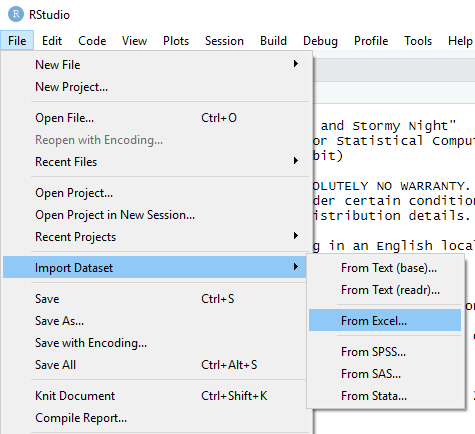

::: small_right

:::


# Ders Hakkında {.unnumbered}

Bu dersin amacı, R yazılımını kullanarak veri üzerinde istenilen çok değişkenli istatistiksel ve psikometrik işlemlerin yapılabilmesini sağlamaktır.

Tez ve makale çalışmalarında öğrencilerimizin analizlerini R yazılımı ile hiçbir paket programa ihtiyaç duymadan kendi başlarına yapmalarını sağlamaktır.

(İzlence) [**İzlence**](Izlence.html).

## Eğitmen {.unnumbered}

{height=1em width=0.88em} [Dr. Kübra Atalay Kabasakal](https://avesis.hacettepe.edu.tr/katalay)

{height=1em width=1em} [kkatalay\@gmail.com](mailto:kkatalay@gmail.com){.email}

{height=1em width=1em} [katalay\@hacettepe.edu.tr](mailto:katalay@hacettepe.edu.tr){.email}

## Kitaplar {.unnumbered}

-   Atar, B., Atalay Kabasakal, K, Unsal Ozberk, E. B., Ozberk, E. H. & Kibrislioglu Uysal, N. (2020). R ile Veri Analizi ve Psikometri Uygulamaları, Pegem Akademi, Ankara.🔗 [📖](https://pegem.net/urun/R-ile-Veri-Analizi-ve-Psikometri-Uygulamalari/60801)


-   Desjardins, C. D., & Bulut, O. (2018). Handbook of educational measurement and psychometrics using R. Boca Raton, FL: CRC Press. 🔗[📖](https://www.routledge.com/Handbook-of-Educational-Measurement-and-Psychometrics-Using-R/Desjardins-Bulut/p/book/9780367734671)

- Demir, E. R Diliyle İstatistik Uygulamaları. Pegem Akademi, Ankara.(2021). 🔗[📖](https://pegem.net/urun/R-Diliyle-Istatistik-Uygulamalari/61912)


## Kaynaklar {.unnumbered}

* Bu ders materyallerine ek olarak, R öğrenmek için bir dizi mükemmel kaynak vardır:

- 🔗 [R kurulumu ile ilgili bilgiler içerir. ](https://psyteachr.github.io/data-skills-v2/installing-r.html)

- 🔗 [R studio ve güncellemeler ile ilgili bilgiler içerir. ](https://psyteachr.github.io/analysis-v2/updating-r-rstudio-and-packages.html)

-   * 🔗[Alana ozgu paketlerini inceleyebilirsiniz ](https://cran.r* project.org/web/views/Psychometrics.html)


-  🔗 📖[R Cookbook](http://www.cookbook-r.com/)

-  🔗📖[Veri Bilimi için R](https://r4ds.had.co.nz/)

* 🔗 👨 [Hadley Wickham](https://hadley.nz/)


-  🔗[StackOverflow soru-cevap platfromu](https://stackoverflow.com/)

-  Twitter'da [#rstats](https://twitter.com/search?f=tweets&q=%23rstats&src=typd) hashtag'ini arayın veya kullanın. 
  
  -  e-posta gruplarındaki e-postalara `RSiteSearch ("sample.int")` "

* 🔗[R ile ilgili farklı ücretsiz kaynakları bulabilirsiniz (kitaplar, videolar, websiteleri). Bu kaynakların bazıları başlangıç seviyesinde.](https://www.learnr4free.com/tr/index.html){.uri}
* 🔗[Referans kartları](https://cran.r-project.org/doc/contrib/Short-refcard.pdf)

* 🔗[Cheat Sheets](https://www.rstudio.com/resources/cheatsheets/)


<!--chapter:end:index.Rmd-->

# R ve Rstudio Temeller

Bu bölümde, **R ve RStudio'nun** nasıl kullanılacağının yanı sıra bazı temel programlama kavramları ve terminolojisi, yaygın tuzaklar, faydalı ipuçları ve nereden yardım alınabileceği konularını ele alacağız. Programlama deneyimi olmayanlar bu bölümü özellikle yararlı bulacaktır, ancak daha önce R kullanmış olsanız bile bazı yararlı ipuçları ve püf noktaları bulabilirsiniz.

\begin{info}
Bu bölüm kendi kodunuzu yazmaya başlayana kadar bir anlam ifade
etmeyebilir:)

Biraz sabretmenizi bekliyorum !
\end{info}


## R Nedir?

-   R istatistiksel hesaplamalar yapabilen bir programlama dilidir.

-   1996 yılında Auckland Universitesi'nde **R**oss Ihaka ve **R**obert Gentleman tarafından geliştirilmiştir.

-   1960 yılında Bell Laboratories'de John Chambers ve arkadaşları tarafından geliştirilen **S dilinin** açık kaynak kodlu halidir.

-   R yazılımı Genel Kamu Lisansi (GNU\* General Public Licence) koşulları altında ücretsiz dağıtılmaktadır.

-   R ve Temel Geliştirme Takımı (R core team) ile ilgili bilgilere R'in internet sitesinden (<https://www.r-project.org/>) ulaşılabilir.

-   R dilinin ilk sürümü 29 Subat 2000 tarihinde yayınlanmıştır. Her iki-üç ayda bir sürümler güncellenmektedir.

    -   [**R version 4.3.1 (Beagle Scouts)**](https://cran.r-project.org/src/base/R-4) has been released on 2023-06-16.

-   RStudio, R ile çalışmayı kolaylaştıran bir Entegre Geliştirme Ortamıdır (Integrated Development Environment[IDE]).

-   Bunu İngilizce bilmek ve kitap yazmak için NotePad gibi düz bir metin editörü kullanmak ile Microsoft Word gibi bir kelime işlemci kullanmak gibi düşünün. Bunu yapabilirsiniz, ancak bu kadar iyi görünmez ve yazım denetimi ve biçimlendirme gibi şeyler olmadan çok daha zor olur. Benzer bir şekilde, **R Studio olmadan da R kullanabilirsiniz ancak bunu tavsiye etmiyorum.**

-   Unutmamanız gereken en önemli şey, bu ders için tüm çalışmalarınızı RStudio kullanarak yapacak olsanız da, aslında iki yazılım parçası kullanıyorsunuz, bu da zaman zaman her ikisinin de **ayrı güncellemeleri** olabileceği anlamına geliyor.

-   R'yi ölçme için kullanmanın iki yolu vardır. İlk olarak, web tarayıcınız aracılığıyla R ve R'nin çevrimiçi bir sürümünü kullanabilirsiniz (**R server/sunucusu)**. İkincisi, R ve RStudio'yu dizüstü veya masaüstü bilgisayarınıza ücretsiz olarak indirip kurabilirsiniz.

## Avantajları

-   R özgür istatiksel bir programlama dilidir.

-   R aynı zamanda bir yorumlayıcıdır (interpreter).

-   R, bir veri tabanı **değildir** ama veri tabanlarına bağlanabilir.

-   Önceki sürümleri kullancı dostu olmasa da, son zamanlarda kod editörlerine çok sayıda işlev eklenmiştir.

-   Ayrıca java gibi diller aracılığı ile ara yüz desteğine sahip bir yazılım geliştirme ortamıdır.

-   Tablolardan oluşan yazılım paketlerine (Excel, Minitab gibi) benzememekle birlikte, yeni geliştiren bazı paketler farklı ara yüzler sağlamaktadır.

-   Ücretsiz olması nedeniyle, ticari desteğe tabi bir yazılım değildir. Ancak destek alınabilecek çok sayıda kaynağa erisilebilir. (stackoverflow, mail listeleri)

## Neden R?

-   R istatistiksel programlama, veri analizi ve grafiksel gösterim için kullanılan ve ticari bir amaç gütmeyen ücretsiz bir yazılımdır.

-   R, UNIX, Windows ve MacOS gibi çeşitli platformlarda kodları derlemekte ve çalıştırmaktadır.

-   SPSS, SAS gibi veri analizi programları ücretlidir, ayrıca bazı özel psikometri analizleri için yeterli değildir.

-   R, açık kaynak kodlu olduğu için program kodlarına istenildiği zaman erişilebilir.

-   Diğer istatistiksel yazılımlar ile karşılaştırıldığında R **komut satırı** ara yüzünü kullanmaktadır.

-   **Basit koşullar, döngüler ve kişi** tanımlı fonksiyonlar yazmaya uyumlu basit ve etkili bir yazım diline sahiptir.

-   R'in ayrıca **grafiksel imkânları** oldukça fazladır; bu nedenle yayınlanabilir/basma uygun grafikler oluşturmak kolaydır.

-   R ekibi birçok alanda ayrıntılı dokümantasyonu yapılmış R paketleri geliştirmektedir.

-   Klasik istatistik yazılımlarında analiz sonuçları bir kez elde edilir. R yazılımında ise sonuçlar çalışma alanına kaydedilerek, ileriki analiz aşamalarında tekrar kullanabilir.

-   R, psikometri alanında sıklıkla kullanılan simülasyon çalışmaları için (tekrarlı işlemler için) de avantaj sağlamaktadır.

-   R, diğer programlama dilleri ve istatistik paket programları ile uyumludur.

## Dezavantajları

-   Basta öğrenilmesi kolay görünse de, R'da uzmanlaşmak oldukça zordur.

-   Menu ile kullanılan programlara alışkın olan kişiler için başlangıçta korkutucu olabilir.

-   R ile bir analizi yapabilmek için planlama yapılması gerekmektedir.

-   R kullanıcıları çoğunlukla programlamacı **değildir.** Programlamaya hâkim olmayan kişiler tarafından hazırlanan, okunması ve sürdürülebilirliği zor kodlar oluşturulabilir.

-   Başlangıçta kodları yazmak yıldırıcı olabilir; ancak çalışmaların tekrarlanabilirliği açısından avantaj sağlamaktadır.

-   Bu duruma bir örnek vermek gerekirse, 20 adet regresyon denklemi kurulup regresyon katsayıları karşılaştırılmak istenirse, R yazılımı sadece regresyon kat sayılarını gösterebilir ve tek bir satırda tüm regresyon sonuçlarını karşılaştırmaya olanak verir. Aynı işlem için diğer istatistiksel yazılımlarda 20 ayrı pencereden elde edilen sonuçların elle yazılarak karşılaştırılması gerekecektir.

-   R'da hata yapma olasılığı diğer programlara göre daha fazladır. Hata kaynağı için varsayımların iyi bilinmesi gerekmektedir.

-   Hız konusunda SPSS ve SAS'a göre avantajlı olsa da diğer dillere göre (Python, Matlab gibi) daha yavaştır.

-   Geliştirilen çok fazla paket olduğu için, ihtiyaca uygun en iyi paketin seçimi zor olabilmektedir.

-   Bu bir dezavantaj gibi görünse de istatistiksel işlemlerin arka planını anlamaya yardımcı olur.

-   Bu tarz zayıf hazırlanmış kodlar farklı koşullarda yavaş çalışabilmektedir.

-   Çoğu kullanıcı bu eksiklikleri gidermek için kodları değiştiremez. Özellikle çok iyi yapılandırılmamış olan kodlar R'da yavaş çalışabilmektedir.

## R ve Rstudio Yüklenmesi

-   Internet tarayıcısına R yazılımın internet sitesinin ana sayfasının adresi yazılır. <https://www.r-project.org/>

-   Sol menüde yer alan "download CRAN" bölümüne tıkladıktan sonra ülke seçilir. Seçilen ülkenin yakınlığı sadece yükleme hızını değiştirecektir.

-   Çıkan sayfada "Download and Install R" baslığı altından işletim sistemine uygun olan bağlantı seçilir.

-   R konsolda çalışmaya doğrudan başlanabilir; ancak konsol kullanımı bir kod editörü olmadığı için çok kullanışlı değildir.

-   Rstudio hata ayıklama, görselleştirme araçları ile birlikte yüklenen modern bir kod editörüdür.

-   <https://www.rstudio.com/> internet sitesinden kullanılan bilgisayar ve işletim sistemine uygun olarak seçilip indirilebilmektedir.

-   Rstudio R ile daha üretken olmanıza yardımcı olacak bir dizi araç içerir, örneğin:

    -   R kodlarınızı vurgulamak için bir sözdizimi vurgulama düzenleyicisi

    -   R kodlarını yazmanıza yardımcı olacak işlevler (otomatik tamamlama)

    -   Çeşitli grafikler oluşturmak ve kaydetmek için çeşitli araçlar (ör. histogramlar, dağılım grafiği)

    -   Verileri içe veya dışa aktarmak için bir çalışma alanı yönetim aracı

## Diğer Gerekli Yüklemeler

-   Benim açıklamalarım yetmediyse R'yi bilgisayarınızda kullanmak için, lütfen daha ayrıntılı talimatlar ve indirmeniz gereken dosyaların bağlantılarının yanı sıra R'yi farklı bilgisayar türlerine yüklemek için bir dizi kılavuza bağlantılar içeren [Installing R](https://psyteachr.github.io/data-skills-v1/installing-r.html) adresine bakın!!

-   Yüklemeler konusunda daha da fazlasına ihtiyacımız var ise [R studio R](https://psyteachr.github.io/data-skills-v1/appendix-updating-r.html) !

-   Verilen linkte yer alsa da ayrıca eklemeye ihtiyaç duyduğum bağlantılar:

-   [Java](https://javadl.oracle.com/webapps/download/AutoDL?BundleId=245479_4d5417147a92418ea8b615e228bb6935)

-   [Rtools](https://cloud.r-project.org/bin/windows/Rtools/) Rtools, kaynak koddan derleme yapmaya yarayan araçları içeren bir R yardımcısıdır. **Önemli:** Eğer Windows kullanıyorsanız, ayrıca Rtools yüklemeniz gerekir.

-   devtools


```r
install.packages("devtools")
```

## R STUDIO

-   Rstudio'da panellerin yerlerini değiştirebiliriz.

-   Bunun yanı sıra yazı tipi, büyüklüğü gibi özellikleri de değiştirebiliriz.

-   Varsayılan olarak, R Studio'yu açtığınızda, kodunuz ve oluşturduğunuz tüm nesneler dahil olmak üzere en son ne üzerinde çalıştığınızı gösterir. Bu yararlı gibi görünebilir, ancak aslında değerinden daha fazla soruna neden olma eğilimindedir, çünkü yanlışlıkla bir nesnenin eski bir sürümünü kullanma riskiniz olduğu anlamına gelir. R Studio'yu her başlattığınızda yeni bir kopya açacak şekilde ayarları değiştirmenizi öneririz. Bunu `Araçlar` - `Global Seçenekler` seçeneğine tıklayarak ve ardından aşağıdaki gibi görünmesi için kutuların seçimini kaldırarak yapabilirsiniz.

\begin{figure}

{\centering \includegraphics[width=1\linewidth]{images/global_options} 

}

\caption{Global options}(\#fig:img-options)
\end{figure}

-   Dönem boyunca Rstudio kullanımına aşina olacaksınız. Bu süreci kolaylaştırmak için bağlantıları verilen dökümanlara göz atabilirsiniz.

-   [Rstudio cheatsheet](Kaynaklar/rstudio-ide.pdf)

-   [Oscar Torres\* Reyna tutorial](Kaynaklar/rstudio_tutorial.pdf)

## Hangi R sürümünü kullanmalısınız?

-   R'yi bilgisayarınıza kurmanın avantajı, kullanmak için internete bağlı olmanız gerekmemesi, dosyalarınızı kaydetmenin ve yönetmenin daha kolay olması ve sunucunun çökmesi durumunda sorun yaşanmamasıdır (bu nadirdir, ancak olmuştur).

-   R sunucusunu kullanmanın avantajı, bilgisayarına herhangi bir şey yüklemenize gerek olmaması, sadece web tarayıcınız üzerinden erişebilmenizdir.

-   R'yi yükleyemeyeceğiniz bir bilgisayarınız varsa (örneğin Chromebook) veya R'yi bilgisayarınıza yüklemeyle ilgili ciddi sorunlarınız varsa sunucuyu kullanmanızı öneririz.

## R Studio Hakkında

-   R Studio, kodu deneyebileceğiniz bir konsola sahiptir (Şekil'de sol alt pencerede yer alır\@ref(fig:img-rstudio)).

-   Ayrıca kod editörü (sol üst), "Ortam" sekmesinde oluşturduğunuz fonksiyonları ve nesneleri gösteren bir pencere ( sağ üst pencere) ve grafikleri, dosya paketlerini ve yardım belgelerini gösteren bir pencere ise (sağ alt) bulunur.

\begin{figure}

{\centering \includegraphics[width=1\linewidth]{images/Rstudio} 

}

\caption{RStudio arayüzü}(\#fig:img-rstudio)
\end{figure}

-   Bu ders boyunca R Studio'da bulunan özelliklerin nasıl kullanılacağı hakkında daha fazla bilgi edineceksiniz, ancak R Studio ekibinden [RStudio Essentials 1](https://rstudio.com/resources/webinars/programming-part-1-writing-code-in-rstudio/) izlemenizi şiddetle tavsiye ederim. Video yaklaşık 30 dakika sürmekte ve R Studio'nun ana bölümlerini tanıtmaktadır.

## R Temel Özellikler

-   R konsolda görünen **\>** işareti, R yazılımının sizden komut beklediğini belirtir. R'in hesap makinesi olarak kullanım örnekleri sunulmuştur.


```r
2+2
```

```
[1] 4
```

-   R boşluklara duyarlı değildir.


```r
2  +       2 
```

```
[1] 4
```


```r
2+
  2
```

```
[1] 4
```

## Atama Operatoru

-   Atama operatörü olarak "küçüktür" simgesi ile "kısa çizgi" simgesi **`<-`** simgeleri kullanılabilir.

-   **`<-`** yerine "eşittir" **`=`** simgesi de atama operatörü olarak kullanılabilir.

-   Ancak **`=`** operatörü programlama yaparken matematiksel eşitlikle karışabilmektedir.

-   Atama yapılacak nesne isimlendirilirken harflerle (A\* Z veya a\* z) başlamalıdır.

-   İsimlendirmeye harfle başlandıktan sonra rakamlar (0\* 9), nokta (.) ve alt cizgi (\_) ile devam edilebilmektedir.

-   R harflerin küçük ve ya büyük olmasına karşı duyarlıdır.

-   R fonksiyonlarına benzer isimlerde nesne ismi kullanmamaya **dikkat edilmelidir.**

-   Ayrıca **c,C,D,F,I,q,t,T** gibi tek harfli nesne ismi kullanmaktan kaçınılmalıdır; bunların R'da özel anlamları bulunmaktadır.

-   R yazılımında **\#** işareti ile başlayan satır, yorum satırıdır.

-   Genellikle komutların anlamını açıklamak için kullanılmaktadır.

-   R, bu satırları dikkate almaz, bunlar sadece kullanıcılar için bilgi ve hatırlatıcı açıklamaları içermektedir.


```r
# Yorum satirlari kodlarinizi anlamli hale getirir.
a <-  2
y <-  a * a
y
```

```
[1] 4
```

## Basit İslemler

-   toplama işlemi için **+**,

-   çıkarma işlemi için **-**,

-   çarpma işlemi için **\***,

-   bölme işlemi için **/**,

-   üs alma işlemi için **\^** veya \*

-   mod alma icin ise **%%** operatorleri kullanılmaktadır.

-   Kodlamanızın büyük bir kısmı nesne oluşturmayı ve nesneleri manipüle etmeyi içerecektir. Nesneler bir şeyler içerir. Bu şeyler sayılar, kelimeler veya işlemlerin ve analizlerin sonucu olabilir

**Alıştırma Nesneler oluşturma**

-   Aşağıdaki kodu kopyalayıp konsola yapıştırın, kodu kendi adınızı ve yaşınızı kullanacak şekilde değiştirin ve çalıştırın. Enviroment bölmesinde `ad`, `yas`, `gun`, `yeniyil` ve `veri` nesnelerinin göründüğünü göreceksiniz.


```r
ad <- "ada"
yas <- 16 + 20 
gun <-Sys.Date()
yeniyil <- as.Date("2024-01-01")
veri <- rnorm(n = 10, mean = 15, sd = 3)
```

\begin{figure}

{\centering \includegraphics[width=1\linewidth]{images/objects-enviro} 

}

\caption{Calisma alanındaki nesneler}(\#fig:img-objects-enviro)
\end{figure}

-   Bu örneklerde, `ad`, `yas` ve `yeniyil` her zaman `ada`, `36` değerlerini ve 2024 Yeni Yıl Günü tarihini içerecektir, ancak `gun` tarihi işletim sisteminden alacaktır ve `veri` rastgele oluşturulmuş bir veri kümesi olacaktır, bu nedenle bu nesnelerin değerleri statik olmayacaktır.

-   Daha da önemlisi, nesneler hesaplamalara dahil olabilir ve birbirleriyle etkileşime girebilir. Örneğin:


```r
yas + 10
yeniyil - gun
mean(veri)
```

```
[1] 46
Time difference of 70 days
[1] 14.34768
```

-   Son olarak, bu işlemlerin sonucunu yeni bir nesnede saklayabilirsiniz:


```r
n1 <- yas + 10
```

\begin{try}
\textless-\texttt{ifadesini}içerir\texttt{şeklinde\ okumak\ faydalı\ olabilir,\ örneğin}ad\texttt{ifadesi}ada`
metnini içerir.
\end{try}

-   Bu ders boyunca sürekli olarak nesneler yaratacaksınız ve ilerledikçe onlar ve nasıl davrandıkları hakkında daha fazla bilgi edineceksiniz, ancak şimdilik bunların değerleri kaydetmenin bir yolu olduğunu, bu değerlerin sayı, metin veya işlemlerin sonucu olabileceğini ve yeni değişkenler oluşturmak için başka işlemlerde kullanılabileceğini anlamak yeterlidir.

\begin{info}
Nesnelerin `değişkenler' olarak adlandırıldığını da görebilirsiniz.
Programlama terimlerinde ikisi arasında fark vardır, ancak çok sık
eşanlamlı olarak kullanılırlar.
\end{info}

**Alıştırma Nesneler oluşturma**

-   Aşağıdaki kodu kopyalayıp konsola yapıştırın.
-   Eni 4 cm, boyu 10 cm bir dikdörtgenin alanı hesaplayınız.


```r
# en nesnesi tanimlama

# boy nesnesi tanimlama

# alan nesnesi tanimlama

# alan nesnesini yazdirma
```


```
[1] 40
```

-   Eni 4 cm, boyu 10 cm bir dikdörtgenin köşegen uzunluğunu hesaplayınız.


```r
# en nesnesi tanimlama

# boy nesnesi tanimlama

# kosegen nesnesi tanimlama

# kosegen nesnesini yazdirma
```


```
[1] 10.77033
```

### Ödev

Datacamp hesapınızda yer alan 🔗 datacamptan size atanan bölümü tamamlayınız ve kitabın ilk bölümünü tamamlayınız.

<!--chapter:end:01-Kurulum.Rmd-->

# R Paketler

- R'yi yüklediğinizde, veri işleme ve istatistiksel analiz seçenekleri de dahil olmak üzere bir dizi fonksiyona erişebilirsiniz. Varsayılan kurulumda yer alan fonksiyonlar genellikle **Temel R/Base R** olarak adlandırılır ve birçok Temel R fonksiyonunu gösteren faydalı bir cheatsheet sayfası vardır 🔗[cheatsheet](https://github.com/rstudio/cheatsheets/raw/main/base-r.pdf) 

- **Temel R**  telefonunuzda gelen varsayılan uygulamalar, paketleri ise ayrıca indirmeniz gereken ek uygulamalar olarak düşünmek faydalı olabilir.

*  R fonksiyonları **ayrı paketler** halinde düzenlenmişlerdir. Böylece gerekli paketlerle çalışarak daha az bellek kullanımı ve hızlı işlem gücü sağlanır.

*  Bu paketlerin bir başka avantajı da yazılan fonksiyonlardan oluşan paketlerin CRAN'den temin edilerek yüklenebilmesidir.

*  Her paketin bir yaratıcısı ve kendisine ait bir yardım dosyası bulunur.


```r
# paket yukleme
install.packages("CTT")
# paket aktive etme
library(CTT)
```
*  Paket yükleme işlemi Rstudio'da yer alan menüler aracılığı ile de yapılabilmektedir.


*  R paketleri R fonksiyonlarının, verilerinin ve iyi derlenmiş bir formatta kodların kombinasyonlarından oluşmaktadır. `library()` komutu ile kişisel kütüphanenizdeki yüklü paketleri görebilirsiniz.

*   Sadece temel pakette 1000'den fazla fonksiyon bulunmaktadır.


```r
# temel paket fonksiyonlarina ulasimak icin  
fonksiyonlar <-  builtins()
length(fonksiyonlar)
```

```
## [1] 1380
```


```r
fonksiyonlar[910:920]
```

```
##  [1] "Cstack_info"                "crossprod"                 
##  [3] "cospi"                      "cosh"                      
##  [5] "cos"                        "contributors"              
##  [7] "Conj"                       "conflicts"                 
##  [9] "conflictRules"              "conditionMessage.condition"
## [11] "conditionMessage"
```


{width=70%}


### Alıştırma :  tidyverse yükleme

- Bir paketi kullanabilmek için önce onu yüklemeniz gerekir. Aşağıdaki kod, bu derste çok sık kullanacağımız bir paket olan `tidyverse` paketini yükler.


```r
install.packages("tidyverse")
```

- Bir paketi yalnızca bir kez yüklemeniz gerekir, ancak R'yi her başlattığınızda kullanmak istediğiniz paketleri yüklemeniz gerekir, benzer şekilde telefonunuza bir uygulamayı bir kez yüklemeniz gerekir, ancak her kullanmak istediğinizde açmanız gerekir.

\begin{info}
\textbf{UYARI: WARNING: Rtools is required to build R packages'' gibi
bir hata mesajı alırsanız, {[}Rtools{]}
(https://cran.r-project.org/bin/windows/Rtools/) adlı ekstra bir yazılım
indirmeniz ve yüklemeniz gerekebilir.}
\end{info}


### Alıştırma : tidyverse etkinleştir

* Tidyverse'i etkinleştirmek için aşağıdaki kodu çalıştırın.  


```r
library(tidyverse)
```

- Bir hata mesajı gibi görünen bir şey alacaksınız - öyle değil. Bu sadece R'nin size ne yaptığını anlatmasıdır.

- Şimdi `tidyverse` paketini etkinleştirdiğimize göre, içerdiği fonksiyonlardan herhangi birini kullanabiliriz, ancak unutmayın, R'yi her başlattığınızda `library()` fonksiyonunu çalıştırmanız gerekir.


## Github paketleri yükleme

- Bazı R paketleri github üzerinden yayınlanmaktadır. Bu paketleri standart yollarla yükleyemiyiz. Bu paketleri yüklemek için ilk olarak devtools paketinin yüklü olmasına ihtiyaç vardır.

- Bu paketlere bir örnek yapısal eşitlik modelleri ile ilgili APA formatında tablolar üreten semtools verilebilir. Paketin github sayfası 🔗[linkte](https://github.com/dr-JT/semoutput) yer almaktadır.  Paketin yüklenemsi için örnek kod aşağıda verilmiştir.


```r
devtools::install_github("dr-JT/semoutput")
```


## Yardım Sayfaları

*  R'da temel ve diğer paketlerde yer alan fonksiyonların işlevleri görmek için yardım sayfalarını inceleyebilirsiniz. `?` ve `help()` fonksiyonları ayni işleve sahiptir.


```r
?is.na

help(sqrt)
```

*  Örneğin CTT paketini hem yüklediniz hem de etkinleştirdiniz. Paket fonksiyon ve veri içeriğini aşağıdaki komutlarla görebilirsiniz.


```r
# install.packages(CTT)
library(CTT)
ls("package:CTT") 
data(package = "CTT") # yeni bir sekmede acilir.
?reliability
```

*  Etkinleştirdiğiniz paketlerde yer alan fonksiyonların yardım sayfalarına ulaşabilirsiniz.


## Paket çakışmaları {#conflicts}

- Daha da fazla fonksiyona sahip binlerce farklı R paketi vardır. Ne yazık ki, bazen farklı paketler aynı fonksiyon isimlerine sahiptir. Örneğin, `dplyr` ve `MASS` paketlerinin her ikisi de `select()` adında bir fonksiyona sahiptir. Bu paketlerin her ikisini de yüklerseniz, R size bir çakışma olduğunu söyleyen bir uyarı üretecektir.


```r
library(dplyr)
library(MASS)
```

```
## 
## Attaching package: 'MASS'
```

```
## The following object is masked from 'package:dplyr':
## 
##     select
```

- Bu durumda, R size `dplyr` paketindeki `select()` fonksiyonunun aynı isimli başka bir fonksiyon tarafından gizlendiğini (veya 'maskelendiğini') söylüyor. Eğer `select()` fonksiyonunu kullanmayı deneseydiniz, R en son yüklenen paketteki fonksiyonu kullanacaktı - bu durumda `MASS` fonksiyonunu kullanacaktı.

- Belirli bir fonksiyon için hangi paketi kullanmak istediğinizi belirtmek istiyorsanız, örneğin `package::function` biçiminde kod kullanabilirsiniz:


```r
dplyr::select()
MASS::select()
```

## Paket Güncelleme

- R ve R Studio güncellemelerine ek olarak, paketlerin yazarları da bazen kodlarını günceller. Bu, bir pakete fonksiyon eklemek için olabileceği gibi hataları düzeltmek için de olabilir. **Kaçınılması gereken bir şey, yüklü bir paketi istemeden güncellemektir.**

- `install.packages()` fonksiyonunu çalıştırdığınızda, her zaman paketin en son sürümü yüklenir ve yüklemiş olabileceğiniz eski sürümlerin üzerine yazılır. Bazen bu bir sorun teşkil etmez, ancak bazen paket önemli ölçüde değiştiği için güncellemenin kodunuzun artık çalışmadığı anlamına geldiğini görürsünüz. Bir paketin eski bir sürümüne geri dönmek mümkündür ancak yine de bundan kaçınmaya çalışın.

\begin{info}
Bir paketin üzerine yanlışlıkla daha sonraki bir sürümün yazılmasını
önlemek için, sizin veya bir başkasının kodu yanlışlıkla çalıştırması
ihtimaline karşı analiz komut dosyalarınıza \texttt{install.packages()}
i \textbf{asla} dahil etmemelisiniz.
\end{info}


## R ve RStudio'ya nasıl alıntı yapılır

- R'a atıfta bulunmanız ve referans vermeniz gereken bilimsel bir rapor yazmaktan biraz uzak olabilirsiniz, ancak zamanı geldiğinde bunu onu geliştiren insanlara (çoğu ücretsiz!) kredi vermek için yapmak önemlidir. R, RStudio ve kullandığınız paketler için ayrı alıntılar sağlamalısınız.

- Kullandığınız R sürümü için atıf almak için, size her zaman en son atıfı sağlayacak olan `citation()` fonksiyonunu çalıştırmanız yeterlidir.


```r
citation()
```

```
## 
## To cite R in publications use:
## 
##   R Core Team (2022). R: A language and environment for statistical
##   computing. R Foundation for Statistical Computing, Vienna, Austria.
##   URL https://www.R-project.org/.
## 
## A BibTeX entry for LaTeX users is
## 
##   @Manual{,
##     title = {R: A Language and Environment for Statistical Computing},
##     author = {{R Core Team}},
##     organization = {R Foundation for Statistical Computing},
##     address = {Vienna, Austria},
##     year = {2022},
##     url = {https://www.R-project.org/},
##   }
## 
## We have invested a lot of time and effort in creating R, please cite it
## when using it for data analysis. See also 'citation("pkgname")' for
## citing R packages.
```

- Kullandığınız herhangi bir paket için atıf oluşturmak için, atıf yapmak istediğiniz paketin adıyla birlikte `citation()` işlevini de kullanabilirsiniz.


```r
citation("tidyverse")
```

```
## 
## To cite package 'tidyverse' in publications use:
## 
##   Wickham H, Averick M, Bryan J, Chang W, McGowan LD, François R,
##   Grolemund G, Hayes A, Henry L, Hester J, Kuhn M, Pedersen TL, Miller
##   E, Bache SM, Müller K, Ooms J, Robinson D, Seidel DP, Spinu V,
##   Takahashi K, Vaughan D, Wilke C, Woo K, Yutani H (2019). "Welcome to
##   the tidyverse." _Journal of Open Source Software_, *4*(43), 1686.
##   doi:10.21105/joss.01686 <https://doi.org/10.21105/joss.01686>.
## 
## A BibTeX entry for LaTeX users is
## 
##   @Article{,
##     title = {Welcome to the {tidyverse}},
##     author = {Hadley Wickham and Mara Averick and Jennifer Bryan and Winston Chang and Lucy D'Agostino McGowan and Romain François and Garrett Grolemund and Alex Hayes and Lionel Henry and Jim Hester and Max Kuhn and Thomas Lin Pedersen and Evan Miller and Stephan Milton Bache and Kirill Müller and Jeroen Ooms and David Robinson and Dana Paige Seidel and Vitalie Spinu and Kohske Takahashi and Davis Vaughan and Claus Wilke and Kara Woo and Hiroaki Yutani},
##     year = {2019},
##     journal = {Journal of Open Source Software},
##     volume = {4},
##     number = {43},
##     pages = {1686},
##     doi = {10.21105/joss.01686},
##   }
```

- Kullandığınız RStudio sürümüne ait alıntıyı oluşturmak için `RStudio.Vesion()` fonksiyonunu kullanabilirsiniz:


```r
RStudio.Version()
```

- Son olarak, yöntem bölümünüzün yazımında bunun nasıl görünebileceğine dair bir örnek:

> Analiz R (R Core Team, 2020), RStudio (Rstudio Team, 2020) ve tidyverse paketi (Wickham, 2017) kullanılarak gerçekleştirilmiştir.

- Belirtildiği gibi, bunu bir süre yapmak zorunda kalmayabilirsiniz, ancak yaptığınızda buna geri dönün çünkü açık kaynak topluluğuna çalışmaları için kredi vermek önemlidir.

<!--chapter:end:02-paketler.Rmd-->

# Fonksiyonlar

* Fonksiyon belli bir görevi yerine getirmek için yazılan bir grup komuttur.

* Fonksiyonların çalışması için girdilerinin olması gerekmektedir. Fonksiyonlar girdileri ile yaptıkları işlem sonucunda bir çıktı oluştururlar.

* Fonksiyonlar girdileri o fonksiyonun çalışması için önceden belirlenen **argümanlar** ve o argümanların değerlerinden oluşur. (dilbilimle ilgileniyorsanız, bunları bir özne ve nesne gerektiren fiiller olarak düşünmek isteyebilirsiniz)

* Fonksiyonların kullanımında üç noktaya dikkat edilmelidir.

  1.  argümanların sırası
  2.  argümanların olağan (default) değerleri
  3.  bazı argümanların zorunlu, bazı argümanların opsiyonel olmasıdır

- Bir fonksiyonun aldığı tüm argümanlara yardım dokümantasyonunu kullanarak `?function` formatını kullanarak bakabilirsiniz. Bazı argümanlar zorunlu, bazıları ise isteğe bağlıdır. İsteğe bağlı bağımsız değişkenler, herhangi bir değer girmezseniz genellikle varsayılan/olağan (normalde yardım belgelerinde belirtilen) bir değer kullanır.

- Örnek olarak, normal dağılıma sahip bir sayı kümesini rastgele üreten `rnorm()` fonksiyonunun yardım belgelerine bakalım. 

- Bir fonksiyonun aldığı tüm argümanlara yardım dokümantasyonunu kullanarak `?function` formatını kullanarak bakabilirsiniz. Bazı argümanlar zorunlu, bazıları ise isteğe bağlıdır. İsteğe bağlı bağımsız değişkenler, herhangi bir değer girmezseniz genellikle varsayılan/olağan (normalde yardım belgelerinde belirtilen) bir değer kullanır.

**Alıştırma **

* R Studio'yu açın ve konsola aşağıdaki kodu yazın:  


```r
?rnorm
```

- `rnorm()` için yardım belgeleri sağ alt yardım panelinde görünmelidir. Kullanım bölümünde, `rnorm()`un aşağıdaki formu aldığını görüyoruz:


```r
rnorm(n, mean = 0, sd = 1)
```

- Argümanlar bölümünde, her bir argüman için açıklamalar bulunmaktadır. `n` oluşturmak istediğimiz gözlem sayısı, `mean` oluşturacağımız veri noktalarının ortalaması ve `sd` verinin standart sapmasıdır. Ayrıntılar bölümünde, `mean` ve `sd` için herhangi bir değer girilmezse, bu değerler için varsayılan olarak 0 ve 1 kullanılacağı belirtilir. `n` için varsayılan bir değer olmadığından, belirtilmesi gerekir, aksi takdirde kod çalışmaz.

- Bir örnek deneyelim ve R'den 5 rastgele sayı üretmesini istemek için gerekli `n` argümanını değiştirelim. 

**Alıştırma II**

* Aşağıdaki kodu kopyalayıp konsola yapıştırın.  


```r
set.seed(12042016)
rnorm(n = 5)
```

```
## [1] -0.2896163 -0.6428964  0.5829221 -0.3286728 -0.5110101
```

- Bu sayıların ortalaması 0 ve SD'si 1'dir. Şimdi farklı bir sayı kümesi üretmek için ek argümanları değiştirebiliriz.


```r
rnorm(n = 5, mean = 10, sd = 2)
```

```
## [1] 13.320853  9.377956 10.235461  9.811793 13.019102
```

- Bu kez R yine 5 rastgele sayı üretti, ancak şimdi bu sayı kümesi belirtildiği gibi 10 ortalama ve 2 sd değerine sahip. Bir fonksiyonun hangi argümanları gerektirdiğini anlamanıza yardımcı olması için yardım belgelerini kullanmayı her zaman unutmayın.


\begin{info}
Eğer internette kod örneklerine bakıyorsanız, sık sık
\texttt{set.seed()} fonksiyonu ile başlayan kodlar görebilirsiniz. Bu
fonksiyon rastgele sayı üretecini kontrol eder - rastgele sayı üreten
herhangi bir fonksiyon kullanıyorsanız (\texttt{rnorm()} gibi),
\texttt{set.seed()} fonksiyonunu çalıştırmak aynı sonucu almanızı
sağlayacaktır (bazı durumlarda yapmak istediğiniz şey bu olmayabilir).
Bu örnekte \texttt{set.seed()} diyoruz, bu aynı rastgele sayıları
alacağınız anlamına geliyor.
\end{info}

## Argüman isimleri

- Yukarıdaki örneklerde, kodumuzdaki bağımsız değişken adlarını yazdık (örneğin, `n`, `mean`, `sd`), ancak bu kesinlikle gerekli değildir. Aşağıdaki iki kod satırının her ikisi de aynı sonucu üretecektir (`rnorm()` fonksiyonunu her çalıştırdığınızda rastgele olduğu için biraz farklı bir sayı kümesi üretecektir, ancak yine de aynı ortalama ve SD'ye sahip olacaklardır):


```r
rnorm(n = 6, mean = 3, sd = 1)
rnorm(6, 3, 1)
```

- Önemli olarak, eğer argüman isimlerini yazmazsanız, R argümanların varsayılan sırasını kullanacaktır, yani `rnorm` için girdiğiniz ilk sayının `n` olduğunu varsayacaktır. ikinci sayı `mean` ve üçüncü sayı `sd`dir. 

- Eğer argüman isimlerini yazarsanız, argümanları istediğiniz sırada yazabilirsiniz:


```r
rnorm(sd = 1, n = 6, mean = 3)
```

- R'yi ilk öğrenirken, fonksiyonun her bir parçasının ne yaptığını hatırlamanıza ve anlamanıza yardımcı olabileceğinden, argüman adlarını yazmayı yararlı bulabilirsiniz. Ancak, becerileriniz ilerledikçe argüman adlarını atlamayı daha hızlı bulabilirsiniz ve ayrıca argüman adlarını kullanmayan çevrimiçi kod örnekleri göreceksiniz, bu nedenle her bir kod parçasının hangi argümana atıfta bulunduğunu anlayabilmek önemlidir (veya kontrol etmek için yardım belgelerine bakın).

- Bu derste, her bir fonksiyonu ilk kez kullandığımızda argüman adlarını her zaman yazacağız, ancak sonraki kullanımlarda bunlar atlanabilir.


## TAB ile otomatik tamamlama

- R Studio'nun çok kullanışlı bir özelliği, fonksiyonlar için TAB otomatik tamamlama özelliğidir (bkz. Şekil \@ref(fig:img-autocomplete)). Fonksiyonun adını yazıp tab tuşuna basarsanız, R Studio size fonksiyonun aldığı argümanları kısa bir açıklama ile birlikte gösterecektir. Argüman adının üzerinde enter tuşuna basarsanız, tıpkı telefonunuzdaki otomatik tamamlama gibi adı sizin için dolduracaktır. Bu, R'yi ilk öğrenirken inanılmaz derecede kullanışlıdır ve bu özelliği sık sık kullanmayı **unutmamalısınız.** 

\begin{figure}

{\centering \includegraphics[width=1\linewidth]{images/autocomplete} 

}

\caption{Tab ile otomatik durdurma}(\#fig:img-autocomplete)
\end{figure}

## Kişisel tanımlı fonksiyon

- Kişisel tanımlı fonksiyon yazılması şablonu aşağıdaki gibidir.


```r
fonksiyonadi<-  function(argumanlar ve olagan degerleri){
  kodlar
  return()
}
```

- Oluşturulan fonksiyon çalıştırılırken ise aşağıdaki şeklinde çalıştırılır.


```r
fonksiyonadi(argumanlar ve degerleri)
```

*  Kare alma işlemi aşağıdaki şekilde yapılabilir.


```r
sayi <-  4
sayi * sayi
sayi ^2
```

```
## [1] 16
## [1] 16
```


*  Bu işlem sürekli yapılacaksa fonksiyon olarak yazılabilir.


```r
# kare alma fonksiyonu
kare_al <-  function(sayi){
  return(sayi*sayi)
  }
kare_al(4)
```

```
## [1] 16
```


- Farklı dereceden üsler alabilen bir fonksiyon yazalım.


```r
#üs alma
üs_al<-  function(x,us){
  return(x^us)
  }
üs_al(3,4)
```

```
## [1] 81
```

- Argümanlardan birine olağan değer girilmesi


```r
#üs alma
üs_al<-  function(x,us=2){
  return(x^us)
  }
üs_al(3) # us argumanin olagan degeri olan
# 2 olduğu için argumana 
# deger girilmediginde kare alir.
```

```
## [1] 9
```


- Aşağıdaki fonksiyona 3 ve 4 değerleri girilirse çıktı ne olur?


```r
myfunc <-  function(x,y)
{
a <-  x+y
b <-  x* y
return(a*b)
}
myfunc(3,4)
```


- `mean()` fonksiyonu en sık kullandığımız fonksiyonlardan biridir.


```r
x <-  c(1,2,3)
mean(x)
```

```
## [1] 2
```


- R base pakette yer alan bu fonksiyonu kendiniz de yazabilirsiniz. 
- R' da deneyim kazandıkça, yaptığınız işlemler karmaşıklaştıkça 
kendi fonksiyonlarınızı yazma ihtiyacı duyacaksınız.

- `avg()` isminde vektör ortalaması hesaplayan fonksiyon yazınız.


- Yazdığınız fonksiyon ile aşağıdaki işlemi yapınız.


```r
x <-  1:1000
avg(x)
```

```
## [1] 500.5
```

- Yazdığınız fonksiyon temel pakette yer alan `mean()` fonksiyonu ile aynı sonucu verdi mi?


```r
identical(avg(x),mean(x))
```

```
## [1] TRUE
```

*  Fonksiyon içinde tanımlanan nesneler çalışma alanına kaydedilmezler.

*  Fonksiyonlar da R nesnesidir.


```r
ls()
```

```
##  [1] "avg"               "backtick"          "hl"               
##  [4] "kare_al"           "path"              "pkg"              
##  [7] "psyteachr_colors"  "psyteachr_colours" "sayi"             
## [10] "üs_al"             "x"
```


## R Çalışma Alanı

* çalışma alanı, nesnelerin ve bilgilerin kaydedildiği alandır.

* `ls()` ve `objects()` fonksiyonları çalışma alanında kayıtlı nesneleri konsolda göstermektedir.

* `ls()` fonksiyonu ile nesneleri çağırma işlemi özelleştirilebilir.


* `ls.str()` fonksiyonu ise hafızadaki nesneleri ayrıntıları ile göstermektedir.


- Çok fazla kod yazıyorsanız, enviroment (veya çalışma alanının) birçok nesne ile darmadağın olduğunu fark edebilirsiniz. Bu, hangi nesneye ihtiyacınız olduğunu bulmanızı zorlaştırabilir ve bu nedenle yanlış veri seti kullanma riskiyle karşı karşıya kalabilirsiniz. Yeni bir veri kümesi üzerinde çalışıyorsanız veya son sürümü elde etmeden önce çok sayıda farklı kod denediyseniz, yanlış nesneyi kullanmaktan kaçınmak için ortamı/çalışma alanını temizlemeyi unutmamak iyi bir uygulamadır. Bunu birkaç şekilde yapabilirsiniz.

1. Nesneleri tek tek kaldırmak için konsola `rm(nesne_adı)` yazabilirsiniz. Önceki bölümde oluşturduğunuz nesnelerden birini kaldırmak için bunu şimdi deneyin. 
2. Ortamdaki tüm nesneleri temizlemek için konsolda `rm(list = ls())` komutunu çalıştırın.
3. Ortamdaki tüm nesneleri temizlemek için ortam bölmesindeki süpürge simgesine de tıklayabilirsiniz. 

4. Konsolda yer alan işlemleri silmek için ise: CTRL + L (clear console) ya da süpürge işareti kullanılabilir.


\begin{figure}

{\centering \includegraphics[width=1\linewidth]{images/broom} 

}

\caption{Clearing the workspace}(\#fig:img-broom)
\end{figure}


## R Çalışma Dizini

* R yazılımı Start/Baslangic menusu üzerinden çalıştırıldığında çalışma dizini **C:/Users/<kullanici adi>/Documents**

* Çalışma dizinini sorgulamak için kullanılacak olan fonksiyon

  * `getwd()` (get working directory)

* Çalışma dizinini değiştirmek için kullanılacak olan fonksiyon

  * `setwd()` (set working directory)

* Bu işlem Rstudio menusu **"Session"** sekmesinden ya da **CTRL +Shift + H** tuşları ile de yapılabilmektedir.


## R'i Kapatma


* Kaydet (Save) ya da CTLR + S `dosyadi.R` uzantısıyla kaydedilebilmektedir.


* Bu sayede tekrar kullanılabilmekte ya da başkaları ile kolaylıkla paylaşılabilmektedir.


* Tüm programlar gibi **"x"** işareti ile ya da **q()** fonksiyonunu ile sonlandırılabilir.

* R'dan çıkış yaparken, program çalışma alanının kaydedilip kaydedilmeyeceğini sormaktadır.


* Eger R'in çalışma alanını kaydetmesini istenirse, R çalışma dizinine `.Rdata uzantılı bir dosya kaydeder.
* Çalışma alanı kaydı için `save.image("dosyaadi")` komutu da kullanılabilmektedir.
* R'dan çıkış yapmadan yapılan işlem durdurulmak istenirse, konsol bölümündeki **"Stop"** işareti veya **Esc** tuşları kullanılabilir.


## R oturumları

- R'yi açıp kod yazmaya, paketleri yüklemeye ve nesneler oluşturmaya başladığınızda, bunu yeni bir **oturumda** yaparsınız. Çalışma alanını temizlemeye ek olarak, bazen yeni bir oturum başlatmak yararlı olabilir. Bu, bilgisayarınızda R'yi her başlattığınızda otomatik olarak gerçekleşir, ancak oturumlar sunucuda kalıcı olabilir. Kodunuzun çalışmadığını fark ederseniz ve nedenini bulamazsanız, yeni bir oturum başlatmaya değer olabilir. Bu, ortamı temizleyecek ve yüklü tüm paketleri ayıracaktır - bunu telefonunuzu yeniden başlatmak gibi düşünün.

## Alıştırma

'Oturum - R'yi Yeniden Başlat'a tıklayın. 

\begin{figure}

{\centering \includegraphics[width=1\linewidth]{images/new_session} 

}

\caption{The truth about programming}(\#fig:img-session)
\end{figure}

## Hata ayıklama ipuçları

- Kodlamanın büyük bir kısmı kodunuzun neden çalışmadığını anlamaya çalışmaktır ve bu acemi ya da uzman olmanız fark etmeksizin geçerlidir. 

- Bu ders boyunca ilerlerken yaptığınız hataların ve bunları nasıl düzelttiğinizin kaydını tutmalısınız. 

- Her bölümde dikkat etmeniz gereken bir dizi yaygın hata sunacağız, ancak şüphesiz kendiniz de yeni hatalar yapacaksınız (ve düzelteceksiniz!).

* Kullanmaya çalıştığınız fonksiyonlar için doğru paketleri yüklediniz mi? Çok yaygın bir hata, paketi yüklemek için kodu yazmaktır, örneğin `library(tidyverse)` ancak daha sonra çalıştırmayı unutmaktır.

* Bir yazım hatası mı yaptınız? Unutmayın `data` ile `DATA` aynı şey değildir ve `t.test` ile `t_test` aynı şey değildir.

* Bir paket çakışması mı var? Paket ve fonksiyonu `package::function` ile belirtmeyi denediniz mi?

* Bu kesinlikle bir hata mı? R'deki tüm kırmızı metinler hata anlamına gelmez - bazen size sadece bilgi içeren bir mesaj verir. 

## Yardımcı Kaynaklar


Programlamada iyi olmak demek, bir şeyler denemek, internette yardım aramak ve kopyalanacak kod örnekleri bulmak demektir. 

-  etkili bir şekilde problem çözmeyi öğrenmek, bu kurs boyunca geliştirmeniz gereken temel bir beceridir. 

* Yardım belgelerini kullanın. Bir fonksiyonun nasıl çalıştığını anlamakta zorlanıyorsanız, `?function` komutunu hatırlayın.

* Bir hata mesajı alırsanız, kopyalayıp Google'a yapıştırın - büyük olasılıkla başka biri de aynı sorunu yaşamıştır.

* Bu ders materyallerine ek olarak, R öğrenmek için bir dizi mükemmel kaynak vardır:

  * [R Cookbook](http://www.cookbook-r.com/)
  * [StackOverflow](https://stackoverflow.com/)
  * [Veri Bilimi için R](https://r4ds.had.co.nz/)
  * Twitter'da [#rstats](https://twitter.com/search?f=tweets&q=%23rstats&src=typd) hashtag'ini arayın veya kullanın
  
  

## Alıştırma : Kendini test et

**Soru 1.** Neden `install.packages()` kodunu analiz kodlarında asla dahil **etmemelisiniz**? 

* (A) Bunun yerine library() kullanmalısınız  
* (B) Paketler zaten temel R'ın bir parçasıdır  
* (C) Siz (veya bir başkası) yanlışlıkla kodunuzun çalışmasını durduran bir paket güncellemesi yükleyebilirsiniz  
* (D) Paketin en son sürümüne zaten sahipsiniz  

 


<div class='webex-solution'><button>Açıklama</button>

Unutmayın, `install.packages()` işlevini çalıştırdığınızda her zaman paketin en son sürümü yüklenir ve yüklemiş olabileceğiniz eski sürümlerin üzerine yazılır.

</div>
 
<br>
**Soru 2.**Aşağıdaki kod ne üretecektir?
  

```r
rnorm(6, 50, 10)
```


* (A) Ortalaması 6 ve SD'si 50 olan 10 sayıdan oluşan bir veri seti  
* (B) Ortalaması 50 ve SD'si 10 olan 6 sayıdan oluşan bir veri seti  
* (C) Ortalaması 10 ve SD'si 6 olan 50 sayıdan oluşan bir veri seti  
* (D) Ortalaması 10 ve SD'si 6 olan 50 sayıdan oluşan bir veri seti  

  


<div class='webex-solution'><button>Açıklama</button>

`rnorm()` için varsayılan biçim `rnorm(n, mean, sd)` şeklindedir. Bir fonksiyonun her bir argümanının ne işe yaradığını hatırlamak için yardıma ihtiyacınız varsa, `?rnorm` komutunu çalıştırarak yardım belgelerine bakın

</div>
  
<br>
**Soru 3.** Aynı isimde fonksiyonlara sahip iki paketiniz varsa ve tam olarak hangi paketin kullanılacağını belirtmek istiyorsanız, hangi kodu kullanırsınız? 


* (A) package::function  
* (B) function::package  
* (C) library(package)  
* (D) install.packages(package)  

  


<div class='webex-solution'><button>Açıklama</button>

Örneğin `dplyr::select` gibi `package::function` biçimini kullanmalısınız. Paketlerinizi ilk yüklediğinizde, herhangi bir fonksiyon aynı isme sahipse R'nin sizi uyaracağını unutmayın - buna dikkat etmeyi unutmayın!

</div>
  


**Soru 4.** Aşağıdakilerden hangisinin bir arguman olması en muhtemeldir? 

* (A) 35  
* (B) read_csv()  
* (C) <-  


**Soru 5.** Fonksiyonları oluşturmanın için aşağıdakilerden hangisini kullanmalıyız? 

* (A) ()  
* (B) []  
* (C) {}  

.

**Soru 6.** <-`'nin görevi, fonksiyondan elde edilen çıktıyı bir/bir  ..................... atamaktır. 

* (A) nesne  
* (B) atama  
* (C) arguman  

.


::: {.try data-latex=""}
🔗[Sıra Markdownda](https://atalay-k.github.io/OLC750/sunu/T_Dokumantasyon.html#1)
:::

::: {.try data-latex=""}
🔗[Codeacedemy](https://www.codecademy.com/learn)
:::


## Ödev 

*  Sadece temel pakette 1500'e yakın fonksiyon bulunduğu için ders dışı alıştırmalar yapmanız gereklidir.

*  [R kurulumu ile ilgili](https://learnr-examples.shinyapps.io/ex-setup-r/) learnr paketi hazırlanmış bir interaktif alıştırma örneğini inceleyeniz.

* Kitap Bölüm 1 alıştırmalarını tamamlayınız.

* Datacamp da üzerine atanan bölüm alıştırmalarını tamamlayınız.

*  swirl package **learn R in R** paketi yükleyerek alıştırma yapmayı deneyiniz.

*  [Referens kart](https://cran.r-project.org/doc/contrib/Short-refcard.pdf) sayfasının çıktısını alarak duvarınıza asmanızı öneririm. 


<!--chapter:end:03-fonksiyonlar.Rmd-->

# Vektörler

-   R lineer cebir temelli bir programlama dilidir.

-   Vektörler tek boyutludur.

-   R'da vektörler birleştirmek (combine/concatenate) anlamına gelen `c()` fonksiyonu ile oluşturulmaktadır.

-   R da veriler bir araya gelerek veri yapılarını oluşturur.

    -   vektör (vector)
    -   liste (list)
    -   matris (matrix)
    -   veri seti (data.frame)
    -   dizi (array)

## Vektör Oluşturma


```r
(sayisal_vektor <-  c(1,2,3))
```

```
## [1] 1 2 3
```


```r
(karakter_vektor <-  c("a","b","c"))  ## cift tirnak
```

```
## [1] "a" "b" "c"
```


```r
(mantiksal_vektor <- c(TRUE,TRUE,FALSE))
```

```
## [1]  TRUE  TRUE FALSE
```

## Vektör İşlemleri

-   Vektör uzunluğu `length()` fonksiyonu ile vektör türleri ise `class()`, `mode()` ya da `typeof()` fonksiyonları ise tur belirlemek için kullanılmaktadır.

-   Vektörler bir veya daha fazla elemandan oluşabilmektedir.


```r
a <- 1  # tek elemandan oluşur.
# Vektör uzunluğunu öğrenmek icin length() fonksiyonu
length(a)
```

```
## [1] 1
```


```r
x <- 1:10
```

-   bir vektöründeki verilerin toplanması `sum(x)` 55

-   bir vektöründeki verilerin çarpılması `prod(x)` \ensuremath{3.6288\times 10^{6}}

-   bir vektöründeki verilerin küçükten büyüğe sıralanması `sort(x)` 1, 2, 3, 4, 5, 6, 7, 8, 9, 10

-   bir vektörünün elemanların sıralarının tersine çevrilmesi `rev(x)` 10, 9, 8, 7, 6, 5, 4, 3, 2, 1

-   bir vektöründeki verilerin standart sapmasının hesaplanması `sd(x)` 3.0276504

-   bir vektöründeki en büyük verinin gösterilmesi `max(x)` 10

-   bir vektöründeki en küçük verinin gösterilmesi `min(x)` 1

-   En büyük verinin vektörün kaçıncı elemanı olduğunun gösterilmesi `which.max(x)` 10

-   En küçük verinin vektörün kaçıncı elemanı olduğunun gösterilmesi `which.min(x)` 1

-   Vektörlerden eleman sırası, isim ve mantıksal operatörler olmak üzere üç farklı yolla eleman seçilebilir.


```r
ad  <-  c("Ali","Elif","Su","Deniz",
"Aras","Berk","Can","Ece","Efe","Arda")
```

-   ad vektörünün 1. elemanı `ad[1]` Ali

-   ad vektörünün 5. elemanını yazdıracak kodu oluşturunuz. _____

-   ad vektörünün son elemanını yazdıracak kodu oluşturunuz. ______

-   ad vektörünün son elemanını yazdıracak kodu vektörün 10 elemanlı olduğunu bilmediğiniz de ne yaparsınız? ______________

-   Vektörün sadece 1., 5. 8 elemanının yazdıracak kodu oluşturunuz.____________

-   Vektörün sadece 1. elemanının hariç tutacak kodu oluşturunuz ______

-   Vektörün 1. ve 5. elemanının hariç tutacak kodu oluşturunuz ___________

-   Vektörün son üç elemanını yazdıracak kodu oluşturunuz ________

## Vektöre eleman eklenmesi


```r
ad[11] <- "Asu"; ad
```

```
##  [1] "Ali"   "Elif"  "Su"    "Deniz" "Aras"  "Berk"  "Can"   "Ece"   "Efe"  
## [10] "Arda"  "Asu"
```

-   vektöre birden fazla eleman eklenmesi


```r
ad[12:13] <- c("Ahu","Han"); ad
```

```
##  [1] "Ali"   "Elif"  "Su"    "Deniz" "Aras"  "Berk"  "Can"   "Ece"   "Efe"  
## [10] "Arda"  "Asu"   "Ahu"   "Han"
```

-   Vektörün ortasına eleman eklenmesi **append()** fonksiyonu ile yapılabilir. Fonksiyon yardım sayfasını inceleyiniz.


```r
(ad <- append(ad, "Taha", after = 3))
```

```
##  [1] "Ali"   "Elif"  "Su"    "Taha"  "Deniz" "Aras"  "Berk"  "Can"   "Ece"  
## [10] "Efe"   "Arda"  "Asu"   "Ahu"   "Han"
```

-   ya da `c()` fonksiyonu ile yapılabilir.


```r
ad <- c(ad[1:5],"Selim",ad[7:length(ad)]); ad
```

```
##  [1] "Ali"   "Elif"  "Su"    "Taha"  "Deniz" "Selim" "Berk"  "Can"   "Ece"  
## [10] "Efe"   "Arda"  "Asu"   "Ahu"   "Han"
```

## Alıştırma

-   10 kişiden oluşan bir gruptaki kişilerinin boy ve kilo ölçümleri için ise aşağıdaki vektör oluşturulmuştur.


```r
ad  <-  c("Ali","Elif","Su","Deniz",
"Aras","Berk","Can","Ece","Efe","Arda")
boy <- c(160,165,170,155,167,162,169,158,160,164)
kilo <-c(50,55,57,50,48,65,58,62,45,47)
```

-   Eğer elimizdeki vektör isimlendirilmiş bir vektör ise eleman seçimini isimle de yapabiliriz.


```r
#isimsiz boy vektoru
names(boy) # names() fonksiyonu ile isimlendirme yapılabilir.
```

```
## NULL
```

-   ad vektörünü boy vektörü ile  isimlendirirken nasıl kullanabiliriz? ______________

-   Arda 'nın boyunu isimlendirilmiş vektörü kullanarak `boy["Arda"]` ile yazdırırsınız 

## Örüntülerle Vektör Oluşturma

-   Vektör oluşturmanın farklı yolları bulunmaktadır.

-   En basit yolu iki nokta `":"` operatörünü kullanmaktır.


```r
rakamlar <- 0:9
rakamlar
```

```
##  [1] 0 1 2 3 4 5 6 7 8 9
```

-   büyükten küçüğe rakamlardan vektör oluşturulması


```r
rakamlar <- 9:0
rakamlar
```

```
##  [1] 9 8 7 6 5 4 3 2 1 0
```

### seq()

-   Belirli bir kurala göre sayı dizileri oluşturmak için ise `seq()`, `rep()` ve `paste()` fonksiyonlarından yararlanılabilir. İlk olarak bu fonksiyonların yardım sayfalarını inceleyelim.

-   1'den 10'a kadar birer birer artan sayılardan dizi oluşturulacak kodu oluşturunuz. `seq(from=1,to=10,by=...)` _

-   Bir önceki işlemi argümansız olarak oluşturunuz. ___________

-   Aynı çıktıyı tek bir argümanla elde edebilir misiniz? __________

-   length argümanını kullanarak aşağıdaki çıktıyı oluşturacak kodu oluşturunuz. _________________________


```
## [1] 1.0 1.4 1.8 2.2 2.6 3.0
```

-   by argümanını ile artış miktarını kullanarak aşağıdaki çıktıyı oluşturacak kodu oluşturunuz. _______________________


```
## [1] 1.0 1.5 2.0 2.5 3.0
```

-   Belirli bir aralıkta kaç elemanın yer alacağını length.out argümanı kullanarak aşağıdaki çıktıyı oluşturacak kodu oluşturunuz. _____________________________


```
## [1] 1.0 1.5 2.0 2.5 3.0
```

### rep()

`rep()` fonksiyonu için örnekler


```r
# üç elemanlı bir vektörün üç kere tekrar ettirilmesi
rep(c(3,4,5), 3)
```

```
## [1] 3 4 5 3 4 5 3 4 5
```


```r
# rakamların üç kere tekrar ettirilmesi
rep(0:9, times = 3) 
```

```
##  [1] 0 1 2 3 4 5 6 7 8 9 0 1 2 3 4 5 6 7 8 9 0 1 2 3 4 5 6 7 8 9
```

-   `a <- c(3,5,7)` vektörünü kullanarak aşağıdaki çıktıyı elde edecek kodu hazırlayınız. _____________


```
## [1] 3 3 3 5 5 5 7 7 7
```

-   `a <- c(3,5,7)` vektörünü kullanarak aşağıdaki çıktıyı elde edecek kodu hazırlayınız. _____________________


```
##  [1] 3 3 3 5 5 5 7 7 7 3 3 3 5 5 5 7 7 7 3 3 3 5 5 5 7 7 7
```

-   Çıktıyı elde edecek kodu hazırlayınız. __________


```
## [1] 1 1 2 2 3 3 4 4
```

-   Çıktıyı elde edecek kodu hazırlayınız. ____________


```
## [1] 1 2 2 3 3 3
```

### paste()

-   `paste()`fonksiyonu çıktısı her zaman için karakterdir.


```r
paste(1:4) # çıktısı karakterdir
```

```
## [1] "1" "2" "3" "4"
```


```r
class(paste(1:4))
```

```
## [1] "character"
```
   
-   Çıktıyı elde edecek kodu tamamlayınız `paste("test",...)` ____


```
##  [1] "test 1"  "test 2"  "test 3"  "test 4"  "test 5"  "test 6"  "test 7" 
##  [8] "test 8"  "test 9"  "test 10"
```


-   Çıktıyı elde edecek kodu tamamlayınız`paste("test",1:10,"...",sep="_")` ____


```
##  [1] "test_1_puan"  "test_2_puan"  "test_3_puan"  "test_4_puan"  "test_5_puan" 
##  [6] "test_6_puan"  "test_7_puan"  "test_8_puan"  "test_9_puan"  "test_10_puan"
```

-   Çıktıyı elde edecek kodu tamamlayınız `paste("test",c("A","B","C","D",...))`  ___ 


```
## [1] "test A" "test B" "test C" "test D" "test 1" "test 2" "test 3" "test 4"
```

## Rasgele Veri Oluşturma

-   Farklı fonksiyonlarla rastgele veri üretilebilir. Örneğin 0-100 arasında 20 farklı değer elde edilmek istenilsin. Bunu yapmak için `sample()`,`runif()` ya da `rnorm()` fonksiyonlarından yararlanılabilir.


```r
sample(0:100,5)
```

```
## [1] 83 54 94 87  1
```


```r
runif(10,  0, 5)
```

```
##  [1] 3.5227613 4.0081999 3.7562672 2.3261348 2.5009933 2.0598770 4.1288741
##  [8] 4.7385931 0.7225128 1.4613490
```


```r
rnorm(10,50,5)
```

```
##  [1] 42.88861 50.54615 47.05873 50.16599 46.81834 53.32444 43.01495 47.79592
##  [9] 40.80267 41.49262
```

-   Kullanılan üç fonksiyonun da yardım sayfalarını ve kullanım amaçlarını inceleyiniz.

## İşlemler

BKI vücut ağırlığınızın metre cinsinden boy uzunluğunun karesine bölünmesi ile elde edilmektedir. Her bir bireye ait BKI değerini hesaplayınız. BKI değerlerinin ortalaması kaçtır(iki ondalığa yuvarlayınız)?  _____ 


```r
ad  <-  c("Ali","Elif","Su","Deniz","Aras","Berk","Can","Ece","Efe","Arda")
boy <- c(160,165,170,155,167,162,169,158,160,164)
kilo <- c(55,55,57,50,48,65,58,62,45,47)
```


<div class='webex-solution'><button>Çözüm!,bakmadan yapmalısın!</button>


```r
# BKI  hesaplanması
boy_m  <- boy/100
BKI <- kilo/( boy_m * boy_m)
BKI
round(mean(BKI),2)
```

```
##  [1] 21.48437 20.20202 19.72318 20.81165 17.21109 24.76757 20.30741 24.83576
##  [9] 17.57812 17.47472
## [1] 20.44
```

</div>


### Kendinizi Test Edin

**S1.** Aşağıdaki tabloda yer alan üç sütun için birer vektör oluşturunuz. Öğrencilerin geçme notu her iki sınavın ortalaması olarak hesaplanacaktır. Bu öğrencilerin geçme notlarını hesaplayınız. Geçme notlarının betimsel istatistiklerini hesaplayınız.

| Öğrenci | Vize | Final |
|---|---|---|
| Ogrenci1 | 50 | 45 | 
| Ogrenci2 | 55 | 65 | 
| Ogrenci3 | 60 | 85 | 
| Ogrenci4 | 70 | 90 | 
| Ogrenci5 | 80 | 85 |

Geçme notlarının minumum değeri: ____

Geçme notlarının ortalama değeri: ____

Geçme notlarının maksimum değeri: ____


**S2.**  Birden n'e kadar olan sayların toplamını hesaplayan fonksiyon yazımı `toplam()` tek argümanlı fonksiyon oluşturunuz. Argüman değeri 5 olduğunda 1+2+3+4+5=15 değerini versin.

-   birden n'e kadar olan sayların toplamı: (n\*(n+1))/2


**S3.** 1'den n' e kadar olan sayıların toplamını hesaplayan fonksiyonu argümansız olarak aşağıdaki şekilde yazmayı deneyiniz. Fonksiyonu çalıştırdığınızda ekranda/konsolda kaça kadar olan sayların toplamı hesaplansın: yazsın, kullanıcının girdiği değere göre aşağıda çıktısı çıksın.


```r
toplam()

kaça kadar olan sayların toplamı hesaplansın: 10

[1 " 10 'e kadar olan sayların toplamı: 55
```


## **ODEV**

-   Kitap Bölüm 2 1. Soruyu tamamlayınız.

-   swirl package - learn R in R (Programming ilk 6 modul)

-   datacamp ödevinizi yapmayını unutmayın 😄

<!--chapter:end:04-vektorler.Rmd-->

# R Nesneler 

- Örnek bir veri seti


```r
library(tidyverse)
data(diamonds)
head(diamonds)
```

```
## # A tibble: 6 x 10
##   carat cut       color clarity depth table price     x     y     z
##   <dbl> <ord>     <ord> <ord>   <dbl> <dbl> <int> <dbl> <dbl> <dbl>
## 1  0.23 Ideal     E     SI2      61.5    55   326  3.95  3.98  2.43
## 2  0.21 Premium   E     SI1      59.8    61   326  3.89  3.84  2.31
## 3  0.23 Good      E     VS1      56.9    65   327  4.05  4.07  2.31
## 4  0.29 Premium   I     VS2      62.4    58   334  4.2   4.23  2.63
## 5  0.31 Good      J     SI2      63.3    58   335  4.34  4.35  2.75
## 6  0.24 Very Good J     VVS2     62.8    57   336  3.94  3.96  2.48
```


R nesne (object) yönelimli bir programlama dilidir.

-   Karakter (character)
-   Sayısal (numeric)
    -   tam sayı (integer)
    -   ondalıklı sayı (double)
    -   karmaşık sayı (complex)
-   Mantıksal (logical)
-   Faktör (factor)
-   Liste (list)
-   Fonksiyon (function)


## tam sayi
- tamsayı nesnesi oluşturulması

```r
tamsayi <- 2L
```
- tamsayi nesnesinin türünün sorgulanması

```r
typeof(tamsayi)
```

```
## [1] "integer"
```
- tamsayı nesnesinin yazdırılması


```r
tamsayi
```

```
## [1] 2
```


## ondalık sayı

- ondaliksayi nesnesinin oluşturulması

```r
ondaliksayi <- 2.5
```
- ondaliksayi nesnesinin türünün sorgulanması

```r
typeof(ondaliksayi)
```

```
## [1] "double"
```
- ondaliksayi nesnesinin yazdırılması

```r
ondaliksayi
```

```
## [1] 2.5
```


## İşlemler
- tek elemanlı vektörler

```r
x <- 1
y <- 1
```


```r
x+y
```

```
## [1] 2
```
- çok elemanlı vektörler


```r
x <- c(3,4,5)
y <- c(1,2,3)
# vektör eleman sayıları aynı mı?
length(x)==length(y)
```

```
## [1] TRUE
```


```r
x+y
```

```
## [1] 4 6 8
```


```r
x-y
```

```
## [1] 2 2 2
```


- çok elemanlı vektörler

```r
x <- 1:9
y <- c(1,2,3)
# vektör eleman sayıları farklı mı?
length(x)/length(y)
```

```
## [1] 3
```


```r
x+y
```

```
## [1]  2  4  6  5  7  9  8 10 12
```


```r
x/y
```

```
## [1] 1.0 1.0 1.0 4.0 2.5 2.0 7.0 4.0 3.0
```


- çok elemanlı vektörler


```r
x <- 1:5
y <- c(1,2)
# vektör eleman sayıları farklı olduğunda
length(x)/length(y)
```

```
## [1] 2.5
```

-   `x+y` işleminin sonucu nedir? _________


<div class='webex-solution'><button>Çözüm</button>


```r
x + y
```

```
## Warning in x + y: longer object length is not a multiple of shorter object
## length
```

```
## [1] 2 4 4 6 6
```


</div>


## Karakter Nesneler

- karakter nesnesi oluşturulması

```r
karakter <- "olcme"
```
- Oluşturulan nesnenin türünün sorgulanmasa

```r
typeof(karakter)
```

```
## [1] "character"
```

-  nesne yazdırılması

```r
karakter
```

```
## [1] "olcme"
```


```r
# karakter nesnesi oluşturulması
ad <- "Su"
soyad <- "Sevim"
```

- iki nesneyi arada  boşluk bırakarak birleştirir.

```r
paste(ad,soyad)
```

```
## [1] "Su Sevim"
```

- sep argümanı farklı şekillerde özelleştirilebilir.

```r
paste(ad,soyad, sep="")
```

```
## [1] "SuSevim"
```


```r
paste(ad,soyad,sep="_")
```

```
## [1] "Su_Sevim"
```

- base pakette yer alan bazı karakter vektörler bulunmaktadır.

```r
letters
```

```
##  [1] "a" "b" "c" "d" "e" "f" "g" "h" "i" "j" "k" "l" "m" "n" "o" "p" "q" "r" "s"
## [20] "t" "u" "v" "w" "x" "y" "z"
```


```r
LETTERS
```

```
##  [1] "A" "B" "C" "D" "E" "F" "G" "H" "I" "J" "K" "L" "M" "N" "O" "P" "Q" "R" "S"
## [20] "T" "U" "V" "W" "X" "Y" "Z"
```


```r
month.name
```

```
##  [1] "January"   "February"  "March"     "April"     "May"       "June"     
##  [7] "July"      "August"    "September" "October"   "November"  "December"
```


```r
month.abb
```

```
##  [1] "Jan" "Feb" "Mar" "Apr" "May" "Jun" "Jul" "Aug" "Sep" "Oct" "Nov" "Dec"
```

- Nesne birleştirme fonksiyonlarından en sık kullananı `paste()`
- `paste()` fonksiyonunun temel argümanları ise `sep` ve `collapse`'dir.


```r
harf5<- letters[1:5]
(harf51 <- paste(harf5,1:5,sep="_"))
```

```
## [1] "a_1" "b_2" "c_3" "d_4" "e_5"
```

```r
length(harf51)
```

```
## [1] 5
```


```r
(harf52 <- paste(harf5,1:5,sep="_",
                 collapse=" "))
```

```
## [1] "a_1 b_2 c_3 d_4 e_5"
```

```r
length(harf52)
```

```
## [1] 1
```


-   `paste()` fonksiyonun yardım sayfasını inceleyiniz.

### Günün Sorusu

-   Aşağıdaki çıktıyı oluşturacak olan kodu oluşturunuz. Madde güçlük değerlerini runif() fonksiyonu ile oluşturabilirsiniz. 


```
##  [1] "1. maddenin guclugu: 0.92"  "2. maddenin guclugu: 0.48" 
##  [3] "3. maddenin guclugu: 0.93"  "4. maddenin guclugu: 0.39" 
##  [5] "5. maddenin guclugu: 0.34"  "6. maddenin guclugu: 0.6"  
##  [7] "7. maddenin guclugu: 0.01"  "8. maddenin guclugu: 0.34" 
##  [9] "9. maddenin guclugu: 0.53"  "10. maddenin guclugu: 0.66"
```

Bunun birden fazla yolu olabilir, farklı şekillerde yapabilirsiniz. 


**Büyük Küçük Harf Düzenleme Fonksiyonları** `toupper()` ve `tolower()`


```r
toupper(harf5)
```

```
## [1] "A" "B" "C" "D" "E"
```


```r
tolower(harf5)
```

```
## [1] "a" "b" "c" "d" "e"
```


`casefold()` fonksiyonu da upper argümanı ile birlikte kullanılabilir.


```r
casefold(harf5, upper = FALSE)
```

```
## [1] "a" "b" "c" "d" "e"
```


```r
casefold(harf5, upper = TRUE)
```

```
## [1] "A" "B" "C" "D" "E"
```

- Karakter nesnelerin kaç harften oluştuğu `nchar()` fonksiyonu ile belirlenebilir.

```r
nchar(month.name)
```

```
##  [1] 7 8 5 5 3 4 4 6 9 7 8 8
```
- Karakter nesneleri belli bir yerden bölmek icin `substr()` ve `substring()` fonksiyonları kullanılabilir.


```r
substr("YILMAZ", 1,3)
```

```
## [1] "YIL"
```


-  ```substring("YILMAZ", 1:.. , 1:6)``` kodunda  "Y" "I" "L" "M" "A" "Z" çıktısı oluşturacak kodu yazınız _

-   ````substring("YILMAZ", ... , 4:6)``` kodunda "ILM"   "ILMA"  "ILMAZ"` çıktınısı oluşturacak kodu yazınız _

- Karakter nesnelerde daha fazlası için aşağıdaki fonksiyonları inceleyebilirsiniz.

-   `strsplit()`
-   `noquote()`
-   `cat()`
-   `grep()`
-   `duplicated()`
-   `agrep()`


## Mantıksal Nesneler


```r
mantiksal1 <-TRUE
```


```r
typeof(mantiksal1)
```

```
## [1] "logical"
```


```r
mantiksal1
```

```
## [1] TRUE
```

Mantıksal operatörler programlamanın temeli ve vazgeçilmezidir.


```r
# eşitlik sınaması
T==TRUE
```

```
## [1] TRUE
```

-   `4==5` kodunun sonucu nedir? _____

-   `4<5` kodunun sonucu nedir? ____

-   `10>100` kodunun sonucu nedir? _____


- Mantıksal operatörlerle yapılan sınamalar ile mantıksal nesneler oluşturulur.


```r
sonuc <- 4<5
typeof(sonuc)
```

```
## [1] "logical"
```


- Nesne türleri arasındaki değişim uygunluk durumuna göre `as.*()`fonksiyonları ile sağlanır.


```r
# Karakter veri numerik veriye
as.numeric("3.14")
```

```
## [1] 3.14
```


```r
# ondalık verin tam sayıya
as.integer(pi)
```

```
## [1] 3
```


```r
# karakter veri numerik veriye (NA)
as.numeric("olcme")
```

```
## Warning: NAs introduced by coercion
```

```
## [1] NA
```


```r
# mantıksal veri karakter veriye (NA)
as.character(TRUE)
```

```
## [1] "TRUE"
```


```r
# numerik veri karakter veriye
as.character(10)
```

```
## [1] "10"
```


```r
# mantıksal veri numerik veriye
as.numeric(TRUE)
```

```
## [1] 1
```


## Nesne Türleri Sorgulama

- Nesne türleri sorgulamak için ise `class()` ya da `mode()` fonksiyonları kullanabilir. Ancak bir nesne türüne ait olup olmadığını sorgulamak için ise `is.*()` fonksiyonları kullanılır.


```r
x<- 3.14; class(x)
```

```
## [1] "numeric"
```

```r
is.numeric(x)
```

```
## [1] TRUE
```

```r
is.logical(x)
```

```
## [1] FALSE
```


- Sayısal nesnelerin türü için `typeof()` fonksiyonu da kullanılabilir.


```r
y <- 2L; typeof(y); class(y) # satir içi kod ayırma
```

```
## [1] "integer"
## [1] "integer"
```

```r
is.integer(y)
```

```
## [1] TRUE
```

```r
is.double(y)
```

```
## [1] FALSE
```


### Günün Sorusu 

- aşağıda yer alan **ad_soyad** nesnesini kullanarak


```r
ad_soyad<- c("Ayse-Sel","Can-Yucel","Cem-Togay","Banu-Cift")
```


aşağıdaki çıktıyı oluşturmaya çalısınız.


```
## [1] "Ayse" "Can"  "Cem"  "Banu"
## [1] "Sel"   "Yucel" "Togay" "Cift"
```


<!--chapter:end:05-nesneler.Rmd-->

# Markdown

Bu bölümde kullanacağımız paketler şunlardır.


```r
knitr::opts_chunk$set(message = FALSE, warning = FALSE)
# bu bölüm için gerekli paketler
library(tidyverse) # çeşitli veri manipülasyon fonksiyonları
library(knitr) # tablo ve görüntü gösterimi için
library(kableExtra) # tabloları şekillendirmek için
library(papaja) # APA tarzı tablolar için
library(gt) # süslü tablolar için
library(DT) # etkileşimli tablolar için
```

🔗İndir [R Markdown Cheat Sheet](https://www.rstudio.org/links/r_markdown_cheat_sheet).


::: {.try data-latex=""}
🔗[R markdon sunusu](https://atalay-k.github.io/OLC750/sunu/T_Dokumantasyon.html#1)
:::

::: {.try data-latex=""}
🔗[markdown hatırlatıcı notlar](https://www.markdownguide.org/cheat-sheet/)
:::


## Neden tekrarlanabilir raporlar kullanılmalı?

Bir rapor hazırladığınızı düşünün

-   içinde analiz sonuçları olan tablolar

-   grafikler ve görsel olsun

-   bu raporu güncellemeniz gerektiğinde veri seti, grafikler, analizler başka dizinlerde olabilir.

-   Tekrarlanabilir raporlar, tüm analizleri gerçekleştirmek ve tabloları oluşturmak için gereken kodla birlikte rapor metnini tek bir belgede bir araya getirmektir.

-   Bu, başlangıçta biraz fazladan çaba gerektirse de, herhangi bir değişiklik olduğunda tek bir düğmeye basarak tüm raporunuzu güncellemenizi sağlayarak size fazlasıyla geri ödeme yapacaktır.

-   Araştırmalar ayrıca, bilimsel literatürdeki makalelerin çoğunda olmasa bile birçoğunda raporlama hataları olduğunu göstermektedir. Tekrarlanabilir raporlar, transkripsiyon ve yuvarlama hatalarını önlemeye yardımcı olur.

-   Rapor daha sonra orijinal formattan HTML, word ve ya PDF gibi daha taşınabilir başka bir formata "derlenir". Bu, örneğin Microsoft Excel'de veya SPSS gibi bir istatistik programında bir grafik oluşturup ardından bunu Microsoft Word'e yapıştırdığınız geleneksel kesme ve yapıştırma yaklaşımlarından farklıdır.

## Bir proje düzenlemek

-   İlk olarak, organize olmamız gerekiyor. RStudio'daki projeler, bir proje için ihtiyaç duyduğunuz tüm dosyaları gruplandırmanın bir yoludur. Çoğu proje komut dosyalarını, veri dosyalarını ve komut dosyası veya görüntüler tarafından oluşturulan PDF raporu gibi çıktı dosyalarını içerir.


### Dosya Sistemi

-    Bilgisayarınızın dosya sistemi, hem dosyaları hem de "alt dizinleri" içeren büyük dizin gibidir. Bir dosyanın konumunu adıyla ve içinde bulunduğu tüm dizinlerin adlarıyla belirtebilirsiniz.

-   Örneğin, Kubra Masaüstünde report.Rmd adında bir dosya arıyorsa, tam dosya yolunu şu şekilde belirtebilir: **/Users/Kubra/Desktop/report.Rmd** , çünkü Masaüstü dizini, tüm dosya sisteminin tabanında bulunan Kullanıcılar/Users dizininin içindeki Kubra dizininin içindedir. Bu dosya masaüstünüzde olsaydı, kullanıcı dizininizin adı da Kubra değilse muhtemelen farklı bir yola sahip olurdunuz. Şu anda oturum açmış olan kişinin kullanıcı dizinini temsil etmek için \~ kısayolunu da kullanabilirsiniz: **\~/Desktop/report.Rmd.**

### Çalışma Dizini

-   Tüm dosyalarınızı nereye koymalısınız? Genellikle tek bir proje için tüm komut dosyalarınızın ve veri dosyalarınızın bilgisayarınızdaki tek bir klasörde, o projenin çalışma dizininde olmasını istersiniz. Dosyaları bu ana proje dizini içindeki alt dizinlerde düzenleyebilirsiniz, örneğin tüm ham veri dosyalarını **data/import** adlı bir dizine koyabilir ve tüm görüntü dosyalarını **images** adlı bir dizine kaydedebilirsiniz.

-   Kodunuz, uygun biçimi kullanarak yalnızca üç tür konumdaki dosyalar kullanılmalıdır. 

| Yer              | Örnek                                                  |
|--------------------------------|----------------------------------------|
| web              | "<https://atalay-k.github.io/OLC731/import/veri1.txt>" |
| dizin içinde     | "veri1.txt"                                            |
| alt dizin içinde | "import/veri1.txt"                                     |

::: {.warning data-latex=""}
Bir komut dosyasında asla çalışma dizininizi ayarlamayın veya değiştirmeyin.
:::

-   R Markdown dosyaları otomatik olarak **.Rmd** dosyasının bulunduğu dizini çalışma dizini olarak kullanacaktır.

-   Kodunuz çalışma dizininizin bir alt dizinindeki bir dosyaya ihtiyaç duyuyorsa (örneğin, import/veri1.txt), çalışma dizinini başka bir konuma veya bilgisayara taşıdığınızda erişilebilir olması için dosyayı göreli bir yol kullanarak yükleyin:


```r
dat <- read.table("import/veri1.txt")  # dogru
```

Bu dosyayı aşağıdaki gibi mutlak yol/adres ile yüklemeyin:


```r
dat <- read.table("c:/Users/Kubra/Desktop/OLC731/import/veri1.txt")  # yanlıs
```

- Örnek veriyi düzgün aktarmak aşağıdaki kodla sağlanır.


```r
(veri1 <- read.table("import/veri1.txt",
                    header= TRUE,
                    sep= ";",
                    dec= ","))
```

```
##    no m_1  m_2 m_3  m_4 m_5
## 1 522  12 14.0  16 20.0  10
## 2 222   5   NA  20 10.0  10
## 3 454   5 10.2   6  4.0  10
## 4 567  10 20.0  NA 12.2  20
```


::: {.info data-latex=""}
Ayrıca, Windows'a özgü geriye doğru eğik çizgi kullanma kuralının aksine, ileriye doğru eğik çizgi kullanma kuralına dikkat edin. Bu, dosyalara yapılan referansların işletim sistemlerinden bağımsız olarak herkes için çalışmasını sağlamak içindir.
:::


### Nesneleri Adlandırma

Dosyaları, hem insanların hem de bilgisayarların kolayca bulabileceği şekilde adlandırın. İşte bazı önemli ilkeler:

-   dosya ve dizin adları yalnızca harf, rakam, tire ve alt çizgi içermeli, dosya adı ve uzantısı arasında nokta (.) olmalıdır (bu boşluk olmadığı anlamına gelir!)
-   Büyük harf kullanımı konusunda tutarlı olun (hatırlamayı kolaylaştırmak için bir kural belirleyin, örneğin her zaman küçük harf kullanın)
-   dosya adının bölümlerini ayırmak için alt çizgi (\_) ve bir bölümdeki sözcükleri ayırmak için tire (-) kullanın
-   dosyaları mantıklı bir sırayla alfabetik hale getiren ve aradığınız dosyayı bulmanızı kolaylaştıran bir kalıpla adlandırın
-   bir dosya adını listenin en üstüne taşımak için önüne alt çizgi ekleyin veya sıralarını kontrol etmek için tüm dosyaların önüne sayı ekleyin
-   tarihler için YYYY-MM-DD biçimini kullanın, böylece kronolojik sıraya göre sıralanırlar

Örneğin, bu dosya adları tam bir karmaşa:

-   <code class='path'>Veri (Katilimci) 04-15.xls</code>
-   <code class='path'>final raporu2.doc</code>
-   <code class='path'>Katilimci Veri Nisan 12.xls</code>
-   <code class='path'>proje notlari</code>
-   <code class='path'>Anket Veri Kasim 15.xls</code>
-   <code class='path'>rapor.doc</code>
-   <code class='path'>rapor son.doc</code>

Benzer dosyaların aynı yapıya sahip olması ve dosyaları taramanın veya ilgili dosyaları bulmak için kod kullanmasının kolay olması için dosyaları yapılandırabilirsiniz.

-   <code class='path'>proje-notlari</code>
-   <code class='path'>veri_katilimci_2021-04-12.xls</code>
-   <code class='path'>veri_katilimci_2021-04-15.xls</code>
-   <code class='path'>veri_anket_2021-04-15.xls</code>
-   <code class='path'>rapor_v1.doc</code>
-   <code class='path'>rapor_v2.doc</code>
-   <code class='path'>rapor_v3.doc</code>

::: {.try data-latex=""}
Yukarıdaki dosyaları adlandırmak için başka yollar düşünün. Kendi proje dosyalarınızdan bazılarına bakın ve neleri geliştirebileceğinizi görün.
:::

### Yeni bir projeye başlamak

-   Artık dosya sisteminin nasıl çalıştığını ve komut dosyalarının bunlara erişmesini kolaylaştırmak için nesneleri nasıl adlandıracağımızı anladığımıza göre, projemizi yapmaya hazırız.

-   Öncelikle, bu sınıf için tüm materyallerinizi tutacağınız yeni bir dizin oluşturun (benimki Ranaliz adınında). Bu dizini Global Options'ın general bölümü altında varsayılan çalışma dizini olarak ayarlayabilirsiniz. Bu, bir projede çalışmıyorsanız dosyaların varsayılan olarak buraya kaydedileceği anlamına gelir.

::: {.warning data-latex=""}
Bu dizin OneDrive'daysa veya tam dosya yolu özel karakterler içeriyorsa ya da bazı Windows makinelerinde 260 karakterden fazlaysa bazen sorunlara neden olabilir.
:::

-   Ardından, OLC731_2023 adında yeni bir proje oluşturmak için **`File`** menüsü altında **`New Project...`** öğesini seçin. Yeni oluşturduğunuz dizinin içine kaydettiğinizden emin olun. RStudio kendini yeniden başlatacak ve çalışma dizini olarak bu yeni proje dizini ile açılacaktır.

Proje dizininin içeriğini görmek için sağ alt bölmedeki Files sekmesine tıklayın. Tüm proje bilgilerini içeren Ranaliz.Rproj adlı bir dosya göreceksiniz, projeyi açmak için üzerine çift tıklayabilirsiniz.

::: {.info data-latex=""}
Ayarlarınıza bağlı olarak, özel kullanıcı ayarlarınızı içeren .Rproj.user adlı bir dizin de görebilirsiniz. Bu ve nokta ile başlayan diğer "görünmez" dosyaları yok sayabilirsiniz.
:::
## R Markdown

-   Bu derste, bir içindekiler tablosu, uygun başlıklar, kod parçaları, tablolar, resimler, satır içi R ve bir kaynakça içeren bir R Markdown belgesi oluşturmayı öğreneceğiz.

::: {.info data-latex=""}
R Markdown'a çok benzeyen quarto adında yeni bir tür tekrarlanabilir rapor formatı var. Bu derste [quarto](https://quarto.org/){target="_blank"} kullanmayacağız çünkü aynı anda hem quarto hem de R Markdown öğreniyorsanız kafa karıştırıcı olabilecek birkaç küçük farkı var, ancak R Markdown'ı öğrendikten sonra quarto'yu çok kolay bir şekilde öğrenebilirsiniz.
:::


-   Tekrar üretilebilir raporlar oluşturmak için metin ve kodun karıştırılmasını sağlayan R Markdown kullanacağız. Yeniden üretilebilir bir komut dosyası, kod bloklarında kod bölümleri içerecektir. Bir kod bloğu arka arkaya üç backtick sembolü ile başlar ve biter, küme parantezleri arasında kod hakkında bazı bilgiler bulunur, örneğin {r chunk-name, echo=FALSE} (bu kodu çalıştırır, ancak derlenen belgede kod bloğunun metnini göstermez). Kod bloklarının dışındaki metin, başlıklar, paragraflar, listeler, kalınlaştırma ve bağlantılar gibi biçimlendirmeyi belirtmenin bir yolu olan markdown ile yazılır. [Örnek Dosyayı beraber inceleyelim.](https://raw.githubusercontent.com/atalay-k/OLC731/main/docs/repro.Rmd)


-   Bir şablondan yeni bir R Markdown dosyası açarsanız, içinde birkaç kod bloğu bulunan örnek bir belge görürsünüz. Bir R Markdown (Rmd) belgesinden HTML veya PDF raporu oluşturmak için belgeyi derlersiniz. Bir belgeyi derlemeye RStudio'da örme denir. Dosyanızı bir rapora derlemek için üzerine tıkladığınız, içinden iğneler geçen bir iplik yumağına benzeyen bir düğme vardır.

::: {.try data-latex=""}
**`File > New File > R Markdown...`** menüsünden yeni bir R Markdown dosyası oluşturun. Başlığı ve yazarı değiştirin, dosyayı Ornek1.Rmd olarak kaydedin, ardından bir html dosyası oluşturmak için ör düğmesine tıklayın.
:::

### YAML Header {#yaml}

-  🔗 [YAML başlığı çeşitli seçenekleri ayarlayabileceğiniz bölümdür.](https://bookdown.org/yihui/rmarkdown/html-document.html)

```
---
title: "Demo"
author: "Kubra"
output:
  html_document:
    toc: true
    toc_float:
      collapsed: false
      smooth_scroll: false
      number_sections: false
---
```

::: {.info data-latex=""}
Seçeneklerin ne işe yaradığını görmek için değerleri `false` tan `true` ya değiştirmeyi deneyin.
:::

-   Varsayılan temalar şunlardır: default, cerulean, cosmo, darkly, flatly, journal, lumen, paper, readable, sandstone, simplex, spacelab, united ve yeti. Linkten 🔗[daha fazla temayı inceleyebilirsiniz.](https://rpubs.com/ranydc/rmarkdown_themes).

### Kurulum

-   Varsayılan şablonu kullanarak RStudio'da yeni bir R Markdown dosyası oluşturduğunuzda, otomatik olarak bir kurulum blogu oluşturulur.

<div class='verbatim'><pre class='sourceCode r'><code class='sourceCode R'>&#96;&#96;&#96;{r setup, include=FALSE}</code></pre>

```r
knitr::opts_chunk$set(echo = TRUE)
```

<pre class='sourceCode r'><code class='sourceCode R'>&#96;&#96;&#96;</code></pre></div>

-   Kod parçaları için daha fazla varsayılan seçeneği buradan ayarlayabilirsiniz. Olası seçeneklerin açıklamaları için knitr seçenekleri belgelerine bakın. [knitr dokumanı](https://yihui.name/knitr/options/){target="_blank"}

<div class='verbatim'><pre class='sourceCode r'><code class='sourceCode R'>&#96;&#96;&#96;{r setup, include=FALSE}</code></pre>

```r
knitr::opts_chunk$set(
  fig.width  = 8,
  fig.height = 5,
  fig.path   = 'images/',
  echo       = FALSE,
  warning    = TRUE,
  message    = FALSE,
  cache      = FALSE
)
```

<pre class='sourceCode r'><code class='sourceCode R'>&#96;&#96;&#96;</code></pre></div>

Yukarıdaki kod aşağıdaki seçenekleri ayarlar:

-   fig.width = 8 : varsayılan şekil genişliği 8 inçtir (bunu tek tek şekiller için değiştirebilirsiniz)

-   fig.height = 5 : varsayılan şekil yüksekliği 5 inçtir 

-   fig.path = 'images/' : şekiller "images" dizinine kaydedilir

-   echo = FALSE : işlenen belgede kod parçalarını gösterme

-   warning = FALSE : herhangi bir işlev uyarısı gösterme

-   message = FALSE : herhangi bir işlev mesajı gösterme

-   cache = FALSE : her örgü ördüğünüzde tüm görüntüleri ve nesneleri oluşturmak için tüm kodu çalıştırın (zaman alıcı kodunuz varsa TRUE olarak ayarlayın) Konsola <code><span><span class='fu'><a target='_blank' href='https://rdrr.io/r/utils/str.html'>str</a></span><span class='op'>(</span><span class='fu'>knitr</span><span class='fu'>::</span><span class='va'><a target='_blank' href='https://rdrr.io/pkg/knitr/man/opts_chunk.html'>opts_chunk</a></span><span class='op'>$</span><span class='fu'>get</span><span class='op'>(</span><span class='op'>)</span><span class='op'>)</span></span></code> yazarak geçerli kod bloğu seçeneklerinin bir listesini bulun.

İhtiyacınız olan paketleri <code><span><span class='kw'><a target='_blank' href='https://rdrr.io/r/base/library.html'>library</a></span><span class='op'>(</span><span class='op'>)</span></span></code>kullanarak da bu bloğunuza ekleyebilirsiniz. Genellikle bir komut dosyası üzerinde çalışırken, başka bir eklenti paketi yüklemeniz gerektiğini fark edersiniz. `library(...)` çağrısını kodun en altına gömmeyin. En üste koyun, böylece kullanıcı hangi paketlerin gerekli olduğuna dair genel bir fikir elde edilir.


::: {.try data-latex=""}
tidyverse paketinden fonksiyon kullanacağız, bu yüzden kurulum bloğunuza yükleyin.
:::

### Yapı

-   Bir içindekiler tablosu (`toc`) eklerseniz, bu tablo belge başlıklarınızdan oluşturulur. Markdown'daki başlıklar, başlık başlığının önüne bir veya daha fazla hash (\#) eklenerek oluşturulur.

-   Kendi analiz komut dosyalarınızı geliştirirken aşağıdaki yapıyı kullanın:

-   Kullanmanız gereken tüm eklenti paketlerini yükleyin

-   herhangi bir özel fonksiyon tanımlayın

-   birlikte çalışacağınız verileri yükleyin veya simüle edin

-   kaydetmeniz gereken her şeyi kaydedin

::: {.try data-latex=""}
Varsayılan metni silin ve başlıklar ve alt başlıklar oluşturarak belgenize biraz yapı ekleyin. Bazı verileri yükleyeceğiz, bir özet tablo oluşturacağız, verileri çizeceğiz ve analiz edeceğiz.
:::

### Kod Blokları

-   Metninize eklemek için görüntüler, tablolar veya hesaplamalar oluşturan ve görüntüleyen kod parçaları ekleyebilirsiniz. Bazı verileri yükleyerek başlayalım.

-   İlk olarak, belgenizde bir kod bloğu oluşturun. Bu kod iris veri setini yükler. 


```r
library(datasets)
data(iris)
```

### Yorumlar

-   Kod blokları içine hash sembolü (\#) ile yorum ekleyebilirsiniz. R yorumlayıcısı, hash'ten satır sonuna kadar olan karakterleri yoksayacaktır.


```r
n <- nrow(iris) # toplam satır sayısı
mu <- mean(iris$Petal.Length)  # taç yaprak uzunluğu ortalaması
sd <- sd(iris$Petal.Length) # taç yaprak uzunluğu standart sapması


simule_deger <- rnorm(n, mu, sd)
```

-   Bir kod parçasını, özellikle kod rapor metninde açıklanmamışsa, orada ne yaptığınızı açıklayan bir yorumla başlatmak genellikle iyi bir uygulamadır.

-   Nesnelerinizi açık bir şekilde adlandırırsanız, genellikle açıklayıcı yorumlar eklemeniz gerekmez. Örneğin, yukarıdaki üç nesneyi n_iris, ort_petal ve sd_petal olarak adlandırmış olsaydım, yorumları atlardım.

-   Yorumların bir başka kullanımı da çalıştırmak istemediğiniz ancak silmek de istemediğiniz bir kod bölümünü "yorumlamaktır". Örneğin, bir paketi yüklemek için kullanılan kodu kodunuza dahil edebilirsiniz, ancak kodun her çalıştırıldığında uzun bir yüklemeye zorlamaması için her zaman yorumlamanız gerekir.


```r
# install.packages("dplyr")
# install.packages("tidyr")
# install.packages("ggplot2")
```

::: {.info data-latex=""}
Satırları seçip Cmd-shift-C (Mac) veya Ctrl-shift-C (Windows) yazarak aynı anda birden fazla satıra yorum yazabilir veya yorumu kaldırabilirsiniz.
:::


-   Kodunuzu iyi bir şekilde yorumlamak biraz sanattır. Bu beceriyi geliştirmenin en iyi yolu, başkalarının kodlarını okumak ve başkalarının kodunuzu incelemesini sağlamaktır.

### Satır İçi kodlar {#inline-r}

-   Şimdi setosa ve virginica çiçek türlerinde yaprak uzunluklarını analiz edelim. Önce analiz kodunu çalıştıracağız. Daha sonra makalemizde kullanmak isteyebileceğimiz sayıları değişkenlere kaydedeceğiz ve uygun şekilde yuvarlayacağız. Son olarak, bir sonuçları biçimlendirmek için glue::glue() kullanacağız.


```r
# analiz
library(dplyr)
setosa_petal <- filter(iris, Species == "setosa") %>% pull(Petal.Length)
virginica_petal <- filter(iris, Species == "virginica") %>% pull(Petal.Length)
petal_test <- t.test(setosa_petal, virginica_petal)

# rapor edilecek degerleri yorumlama
t <- petal_test$statistic %>% round(2)
df <- petal_test$parameter %>% round(1)
p <- petal_test$p.value %>% round(3)
# handle p-values < .001
p_symbol <- ifelse(p < .001, "<", "=")
if (p < .001) p <- .001

# sonucları birleştirme
petal_result <- glue::glue("t = {t}, df = {df}, p {p_symbol} {p}")
```

-   Sonuçları, aşağıdaki gibi görünen satır içi R kodu ile bir paragrafa ekleyebilirsiniz:

```{=html}
<pre><code> virginica çiçeklerinin yaprakları setosa çiçeklerinin yapraklarından uzundur(&#96;r petal_result&#96;).</code></pre>
```
virginica çiçeklerinin yaprakları setosa çiçeklerinin yapraklarından uzundur (t = -49.99, df = 58.6, p < 0.001).

### Tablolar {#repro-tables}

-   Çalışmaların yöntem bölümüne betimsel bilgiler eklemek istediğimizde


```r
ozet_tablo <- iris %>%
  group_by(Species) %>%
  summarise(
    n = n(),
    ortalama = mean(Petal.Length),
    sd = sd(Petal.Length)
  )
ozet_tablo
```

```
## # A tibble: 3 x 4
##   Species        n ortalama    sd
##   <fct>      <int>    <dbl> <dbl>
## 1 setosa        50     1.46 0.174
## 2 versicolor    50     4.26 0.470
## 3 virginica     50     5.55 0.552
```

::: {.warning data-latex=""}
Yukarıdaki tablo etkileşimli görünümde tibble biçiminde yazdırılacak, ancak ördüğünüzde YAML başlığındaki df_print ayarındaki biçimi kullanacaktır.
:::


-   Yukarıdaki tabloda, sütun etiketlerini değiştirerek, ortalamaları yuvarlayarak ve bir başlık ekleyerek daha okuyucu dostu hale getirlebilir. Bunun için <code><span><span class='fu'>knitr</span><span class='fu'>::</span><span class='fu'><a target='_blank' href='https://rdrr.io/pkg/knitr/man/kable.html'>kable</a></span><span class='op'>(</span><span class='op'>)</span></span></code> işlevini veya tablolarınızı biçimlendirmek için diğer paketlerdeki daha özel işlevleri kullanabilirsiniz.


<div class="tab">
<button class="tablinks" onclick="openCity(event, &#39;knitr&#39;)">knitr</button>
<button class="tablinks" onclick="openCity(event, &#39;kableExtra&#39;)">kableExtra</button>
<button class="tablinks" onclick="openCity(event, &#39;papaja&#39;)">papaja</button>
<button class="tablinks" onclick="openCity(event, &#39;gt&#39;)">gt</button>


<div id="knitr" class="tabcontent">


```r
yeni_ad <- c("Çiçek Türü", "Frekans", "Ortalama", "Sd")

knitr::kable(ozet_tablo,
             digits = 2,
             col.names = yeni_ad,
             caption = "Petal Uzulukları için Özet Tablo")
```

\begin{table}

\caption{(\#tab:kable-demo)Petal Uzulukları için Özet Tablo}
\centering
\begin{tabular}[t]{l|r|r|r}
\hline
Çiçek Türü & Frekans & Ortalama & Sd\\
\hline
setosa & 50 & 1.46 & 0.17\\
\hline
versicolor & 50 & 4.26 & 0.47\\
\hline
virginica & 50 & 5.55 & 0.55\\
\hline
\end{tabular}
\end{table}

</div>


<div id="kableExtra" class="tabcontent">

**[kableExtra](https://haozhu233.github.io/kableExtra/awesome_table_in_html.html) paketi çok sayıda seçenek sunar.**


```r
library(kableExtra)

kable(ozet_tablo,
      digits = 2,
      col.names = c("Çiçek Türü", "Frekans", "Ortalama", "Sd"),
      caption = "Petal Uzulukları için Özet Tablo") |>
  kable_classic() |>
  kable_styling(full_width = FALSE, font_size = 20) |>
  add_header_above(c(" " = 2, "Degerler" = 2)) |>
  kableExtra::row_spec(2, bold = TRUE, background = "lightgrey")
```

\begin{table}

\caption{(\#tab:kableExtra-demo)Petal Uzulukları için Özet Tablo}
\centering
\fontsize{20}{22}\selectfont
\begin{tabular}[t]{l|r|r|r}
\hline
\multicolumn{2}{c|}{ } & \multicolumn{2}{c}{Degerler} \\
\cline{3-4}
Çiçek Türü & Frekans & Ortalama & Sd\\
\hline
setosa & 50 & 1.46 & 0.17\\
\hline
\cellcolor{lightgrey}{\textbf{versicolor}} & \cellcolor{lightgrey}{\textbf{50}} & \cellcolor{lightgrey}{\textbf{4.26}} & \cellcolor{lightgrey}{\textbf{0.47}}\\
\hline
virginica & 50 & 5.55 & 0.55\\
\hline
\end{tabular}
\end{table}
</div>


<div id="papaja" class="tabcontent">

**[papaja](https://crsh.github.io/papaja_man/reporting.html#tables) paketi ile APA formatında tablolar elde edebilirsiniz.**


```r
papaja::apa_table(ozet_tablo,
                  col.names = c("Çiçek Türü", "Frekans", "Ortalama", "Sd"),
                  caption = "Petal Uzulukları için Özet Tablo",
                  col_spanners = list("Means" = c(3, 4)))
```


\begin{table}[tbp]

\begin{center}
\begin{threeparttable}

\caption{\label{tab:papaja-demo}Petal Uzulukları için Özet Tablo}

\begin{tabular}{llll}
\toprule
 &  & \multicolumn{2}{c}{Means} \\
\cmidrule(r){3-4}
Çiçek Türü & Frekans & Ortalama & Sd\\
\midrule
setosa & 50 & 1.46 & 0.17\\
versicolor & 50 & 4.26 & 0.47\\
virginica & 50 & 5.55 & 0.55\\
\bottomrule
\end{tabular}

\end{threeparttable}
\end{center}

\end{table}

</div>

<div id="gt" class="tabcontent">

**[gt](https://gt.rstudio.com/index.html) paketinde de çok sayıda seçenek bulunmaktadır.**


```r
library(gt)

gt(ozet_tablo, caption = "Petal Uzulukları için Özet Tablo") |>
  fmt_number(columns = c(ortalama, sd),
             decimals = 2) |>
  cols_label(Species = "Çiçek Türü",
             n = "Frekans",
             ortalama = "ortalama",
             sd = "sd") |>
  tab_spanner(label = "Degerler",
              columns = c(ortalama, sd)) |>
  opt_stylize(style = 6, color = "blue")
```

\begin{longtable}{crrr}
\toprule
 &  & \multicolumn{2}{c}{Degerler} \\ 
\cmidrule(lr){3-4}
Çiçek Türü & Frekans & ortalama & sd \\ 
\midrule\addlinespace[2.5pt]
setosa & 50 & $1.46$ & $0.17$ \\ 
versicolor & 50 & $4.26$ & $0.47$ \\ 
virginica & 50 & $5.55$ & $0.55$ \\ 
\bottomrule
\end{longtable}

</div>
</div>

### Görseller {#repro-figures}


-   Şekil başlığının kod bloğında nasıl biçimlendirildiğine dikkat edin.

<div class='verbatim'><pre class='sourceCode r'><code class='sourceCode R'>&#96;&#96;&#96;{r boxplot, fig.cap="Sekil 1 1. Türlere göre yaprak uzunluğu"}</code></pre>

```r
dat <- subset(iris, Species != "versicolor")
dat$Species <- factor(dat$Species)

ggplot(dat, aes(Species, Petal.Length)) +
  geom_boxplot(width = 0.25,
               show.legend = FALSE)  +
  labs(x = "", y = "Petal Uzunluğu") +
  theme(text = element_text(size = 20, family = "Times"))
```

\begin{figure}

{\centering \includegraphics[width=1\linewidth]{06-markdown_files/figure-latex/unnamed-chunk-10-1} 

}

\caption{Petal Uzunlukları ve Türler}(\#fig:unnamed-chunk-10)
\end{figure}
<pre class='sourceCode r'><code class='sourceCode R'>&#96;&#96;&#96;</code></pre></div>

\begin{figure}

{\centering \includegraphics[width=1\linewidth]{06-markdown_files/figure-latex/pet-plot-out-1} 

}

\caption{ Petal Uzunlukları ve Türler}(\#fig:pet-plot-out)
\end{figure}

::: {.info data-latex=""}
Son satır varsayılan metin boyutunu ve yazı tipini değiştirir, bu da bir derginin gereksinimlerini karşılayan şekiller oluşturmak için yararlı olabilir.
:::

-   Kodlarla oluşturamadığınız şekilleri de resim dosyaları ile dökümana ekleyebilirsiniz:

``` md
{style="width: 50%"}
```

{style="width: 50%"}

### Bağlantılı Dökümanlar

-   Markdown bölümler arasında bağlantılar içeren daha uzun raporlar oluşturmanıza yardımcı olur.

-   Başlığı olan tüm şekillere veya tablolara otomatik olarak şekil ve tablo numaraları ekler ve bunlara referansla bağlantı vermenize olanak sağlar.

-   Tablolara ve şekillere bağlantılar oluşturmak için, şekillerinizi veya tablolarınızı oluşturan kod bloklarınız adlandırmanız ve ardından satır içi kodlamanızda bu adları çağırmanız gerekir:

<div class='verbatim'><pre class='sourceCode r'><code class='sourceCode R'>&#96;&#96;&#96;{r tablo1}</code></pre>

```r
# kodlar
```

<pre class='sourceCode r'><code class='sourceCode R'>&#96;&#96;&#96;</code></pre></div>

<div class='verbatim'><pre class='sourceCode r'><code class='sourceCode R'>&#96;&#96;&#96;{r sekil1}</code></pre>

```r
# kodlar
```

<pre class='sourceCode r'><code class='sourceCode R'>&#96;&#96;&#96;</code></pre></div>

```
Bakınız Tablo\ \@ref(tab:tablo1) or Sekil\ \@ref(fig:sekil1).
```

::: {.warning data-latex=""}
Kod blok adları yalnızca harf, rakam ve tire içerebilir. Boşluk veya alt çizgi gibi başka karakterler içeriyorlarsa, referanslama çalışmayacaktır.
:::

Başlıklarınızı {#} ile adlandırarak da raporunuzun farklı bölümlerine bağlantı verebilirsiniz:

```
# Baslık 1 {#baslık-1}

## Baslık 2 {#baslık-2}

Bakınız Bolum\ \@ref(baslık-1) and Bolum\ \@ref(baslık-2)
```

-   Aşağıdaki kod, ggplot2 paketindeki `diamonds` veri seti kullanarak tam bir raporda metnin şekillere veya tablolara nasıl bağlanacağını göstermektedir - bu belgeyi şimdi oluşturmak için aşağıdaki kodları kullanın.


<div class='webex-solution'><button>Dokuman burada</button>


````md
---
title: "Ornek Dosya"
output: 
  bookdown::html_document2:
    number_sections: true
---

```{r setup, include=FALSE}
knitr::opts_chunk$set(echo = FALSE,
                      message = FALSE,
                      warning = FALSE)
library(tidyverse)
library(kableExtra)
theme_set(theme_minimal())
```

Pırlanta ücretleri çeşitli faktörlere bağlıdır

- cut (See Table\ \@ref(tab:kesim))
- colour (See Table\ \@ref(tab:renk))
- clarity (See Figure\ \@ref(fig:parlaklık))
- carats (See Figure\ \@ref(fig:karat))
- Bakınız Bolum\ \@ref(sonuclar) sonuclar icin

## Tablolar

### Kesim

```{r tab:kesim}
diamonds %>%
  group_by(cut) %>%
  summarise(avg = mean(price),
            .groups = "drop") %>%
  kable(digits = 0, 
        col.names = c("Cut", "Average Price"),
        caption = "Kesime göre ortalama pırlanta fiyatı.") %>%
  kable_material()
```

### Renk

```{r renk}
diamonds %>%
  group_by(color) %>%
  summarise(avg = mean(price),
            .groups = "drop") %>%
  kable(digits = 0, 
        col.names = c("Cut", "Average Price"),
        caption = "Renge göre ortalama pırlanta fiyatı.") %>%
  kable_material()
```

## Grafikler

### Parlaklık

```{r parlaklık, fig.cap = "Parlaklığa göre pırlanta fiyatı"}
ggplot(diamonds, aes(x = clarity, y = price)) +
  geom_boxplot() 
```

### Karat

```{r karat, fig.cap = "Karata göre pırlanta fiyatı"}
ggplot(diamonds, aes(x = carat, y = price)) +
  stat_smooth()
```

### Sonuclar {#sonuclar}

"Kodlar haricinde pırlantalarla ilgilenmiyorum :) "
````


</div>


Bu format varsayılan olarak numaralandırılmış bölümler bulunuyor, numaralandırma bunu istemiyorsanız `YAML` bölümünde `number_sections: false` ayarını yapın. Numaralandırılmış bölümleri kaldırırsanız, `\@ref(sonuclar)` gibi bağlantılar "??" gösterecektir, bu nedenle bunun yerine aşağıdaki gibi URL bağlantı sözdizimini kullanmanız gerekir:


```
Son açıklamalar için [son bölüme](#sonuclar) bakınız.
```

## Kaynakça

R Markdown'da metin içi referanslar yapmanın ve otomatik olarak bir kaynakça oluşturmanın birkaç yolu vardır. Markdown dosyalarının, atıfta bulunmanız gereken referansları içeren bir BibTex veya JSON dosyasına (referansları belirli bir formatta içeren düz bir metin dosyası) bağlanması gerekir. Bu dosyanın adını bibliography: refs.bib gibi YAML başlığında belirtirsiniz ve [@tidyverse] gibi bir @ sembolü ve kısa ad kullanarak metin içinde referanslara atıfta bulunursunuz. Referanslarınızı örneğin APA stilinde biçimlendirmek için bir Citation Style Language (.csl) dosyası da ekleyebilirsiniz.

a [bibliography](https://bookdown.org/yihui/rmarkdown-cookbook/bibliography.html){target="_blank"}

```
---
title: "My Paper"
author: "Me"
output:
  html_document:
    toc: true
bibliography: refs.bib
csl: apa.csl
---
```

### Referans yazılımdan dönüştürme

EndNote veya Zotero gibi çoğu referans yazılımı BibTeX formatına aktarabilen dışa aktarma seçeneklerine sahiptir. Ortaya çıkan dosyadaki kısa adları kontrol etmeniz yeterlidir.

::: {.warning data-latex=""}
Bir  referans programı kullanmak hayatınızı çok daha kolaylaştıracaktır. Zotero muhtemelen en iyisidir.
:::

Dışa aktarılan dosya şu şekilde görünmelidir:


```bib

@article{kathawalla_easing_2021,
	title = {Easing {Into} {Open} {Science}: {A} {Guide} for {Graduate} {Students} and {Their} {Advisors}},
	volume = {7},
	issn = {2474-7394},
	shorttitle = {Easing {Into} {Open} {Science}},
	url = {https://doi.org/10.1525/collabra.18684},
	doi = {10.1525/collabra.18684},
	abstract = {This article provides a roadmap to assist graduate students and their advisors to engage in open science practices. We suggest eight open science practices that novice graduate students could begin adopting today. The topics we cover include journal clubs, project workflow, preprints, reproducible code, data sharing, transparent writing, preregistration, and registered reports. To address concerns about not knowing how to engage in open science practices, we provide a difficulty rating of each behavior (easy, medium, difficult), present them in order of suggested adoption, and follow the format of what, why, how, and worries. We give graduate students ideas on how to approach conversations with their advisors/collaborators, ideas on how to integrate open science practices within the graduate school framework, and specific resources on how to engage with each behavior. We emphasize that engaging in open science behaviors need not be an all or nothing approach, but rather graduate students can engage with any number of the behaviors outlined.},
	number = {1},
	urldate = {2022-09-07},
	journal = {Collabra: Psychology},
	author = {Kathawalla, Ummul-Kiram and Silverstein, Priya and Syed, Moin},
	month = jan,
	year = {2021},
	pages = {18684},
}
```

### BibTeX Dosyası Oluşturma

Referansları manuel olarak da ekleyebilirsiniz. RStudio'da **`File`** \> **`New File...`** \> **`Text File`** seçeneğine gidin. \> Metin Dosyası'na gidin ve dosyayı "refs.bib" olarak kaydedin.

Ardından, YAML başlığınıza `bibliography: refs.bib` satırını ekleyin.

### Referans ekleme

Bir dergi makalesine aşağıdaki formatta referanslar ekleyebilirsiniz:

```
@article{shortname,
  author = {Author One and Author Two and Author Three},
  title = {Paper Title},
  journal = {Journal Title},
  volume = {vol},
  number = {issue},
  pages = {startpage--endpage},
  year = {year},
  doi = {doi}
}
```

Kitaplara, teknik raporlara ve daha fazlasına atıfta bulunma talimatları için BibTeX formatına ilişkin eksiksiz bir kılavuza bakın.

citation() ve toBibtex() fonksiyonlarını kullanarak bir R paketi için referans alabilirsiniz. Bibtex girişini bibliography.bib dosyanıza yapıştırabilirsiniz. Referansa atıfta bulunmak için ilk virgülden önce kısa bir ad (örneğin, "ggplot2") eklediğinizden emin olun.

See [A complete guide to the BibTeX format](https://www.bibtex.com/g/bibtex-format/){target="_blank"} kitaplara, teknik raporlara ve daha fazlasına atıfta bulunma talimatları için.

Bir R paketinin referansını `citation()` ve `toBibtex()` fonksiyonlarını kullanarak alabilirsiniz. Bibtex girişini bibliography.bib dosyanıza yapıştırabilirsiniz. Referansa atıfta bulunmak için ilk virgülden önce kısa bir ad (örneğin, "ggplot2") eklediğinizden emin olun.


```r
citation(package="ggplot2") %>% toBibtex()
```

```
## @Book{,
##   author = {Hadley Wickham},
##   title = {ggplot2: Elegant Graphics for Data Analysis},
##   publisher = {Springer-Verlag New York},
##   year = {2016},
##   isbn = {978-3-319-24277-4},
##   url = {https://ggplot2.tidyverse.org},
## }
```

[Google Scholar](https://scholar.google.com/)  girişlerinde BibTeX atıf seçeneği vardır. DOI'yi kendiniz eklemeniz gerekse de, Zotero tarayıcı bağlayıcısı aracılığıyla bir atıf ekleyemiyorsanız, ilgili değerleri almanın en kolay yolu genellikle budur. Önerilen kısa adı koruyabilir veya sizin için daha anlamlı olan bir adla değiştirebilirsiniz.

\begin{figure}

{\centering \includegraphics[width=1\linewidth]{images/google-scholar} 

}

\caption{Get BibTex citations from Google Scholar.}(\#fig:google-scholar)
\end{figure}

### Referanslara atıfta bulunma

Metin içinde referansları bu şekilde gösterebilirsiniz:

```
This tutorial uses several R packages [@tidyverse;@rmarkdown].
```

Bu eğitimde çeşitli R paketleri kullanılmaktadır (Allaire vd., 2018; Wickham, 2017).


### Atıf yapılmayan referanslar

Bir öğeyi kaynak göstermeden referans bölümüne eklemek istiyorsanız, bunu YAML başlığına şu şekilde ekleyin:

```
nocite: |
  @kathawalla_easing_2021, @broman2018data, @nordmann2022data
```

Ya da .bib dosyasındaki tüm öğeleri şu şekilde ekleyin:

```
nocite: '@*'
```

### Atıf Stilleri

Çeşitli dergiler için [stil dosyalarının](https://www.zotero.org/styles){target="_blank"} bir listesini arayabilir ve kaynakçanızı belirli bir derginin stiline göre biçimlendirecek bir dosya indirebilirsiniz. YAML başlığınıza `csl: filename.csl` satırını eklemeniz gerekir.

::: {.try data-latex=""}
refs.bib dosyanıza bazı alıntılar ekleyin, metninizde bunlara atıfta bulunun ve otomatik olarak oluşturulan referans bölümünü görmek için makalenizi işleyin. Birkaç farklı atıf stili dosyası deneyin.
:::

### Referens Bölümü

Varsayılan olarak, referans bölümü belgenin sonuna eklenir. Konumu değiştirmek istiyorsanız (örneğin, referanslardan sonra şekil ve tablo eklemek için), referansları istediğiniz yere `<div id="refs"></div>` ekleyin.

::: {.try data-latex=""}
Raporunuza metin içi alıntılar ve bir referans listesi ekleyin.
:::

## Özel Şablonlar

Bazı paketler özel R Markdown şablonları sağlar. reprores, YAML başlığındaki tüm olası seçenekleri gösteren, kaynakça ve stil dosyalarına sahip olan ve bağlantılı şekil ve tabloların nasıl ayarlanacağını açıklayan bir Rapor şablonuna sahiptir. Birden fazla dosya içerdiğinden, RStudio sizden tüm dosyaları tutmak için yeni bir klasör oluşturmanızı isteyecektir.

\begin{figure}

{\centering \includegraphics[width=0.75\linewidth]{images/custom-rmd} 

}

\caption{Şablonlar}(\#fig:img-custom-rmd)
\end{figure}

::: {.try data-latex=""}
Rapor şablonu ile bir rapor başlatın ve örün. Seçenekleri değiştirmeyi veya silmeyi deneyin.
:::

## Diğer Kaynaklar

-   [Chapter 27: R Markdown](http://r4ds.had.co.nz/r-markdown.html) in *R for Data Science*
-   [R Markdown Cheat Sheet](https://github.com/rstudio/cheatsheets/raw/master/rmarkdown.pdf)
-   [R Markdown reference Guide](https://www.rstudio.com/wp-content/uploads/2015/03/rmarkdown-reference.pdf)
-   [R Markdown Tutorial](https://rmarkdown.rstudio.com/lesson-1.html)
-   [R Markdown: The Definitive Guide](https://bookdown.org/yihui/rmarkdown/) by Yihui Xie, J. J. Allaire, & Garrett Grolemund
-   [Project Structure](https://slides.djnavarro.net/project-structure/) by Danielle Navarro
-   [How to name files](https://speakerdeck.com/jennybc/how-to-name-files) by Jenny Bryan
-   [Papaja](https://crsh.github.io/papaja_man/) Reproducible APA Manuscripts
-   [The Turing Way](https://the-turing-way.netlify.app/)


<!--chapter:end:06-markdown.Rmd-->

# Veri Setleri

- Veri setleri iki boyutludur.

- R'da bir çok fonksiyonun veri setleri ile çalışmaktadır. 

- Veri setleri R ortamında `data.frame()` fonksiyonu ile oluşturulabilir.

- `data.frame()` fonksiyonu ile aynı uzunluktaki vektörlerden bir veri seti oluşturulabilir.


```r
ad  <-  c("Ali","Elif","Su","Deniz","Aras", "Berk","Can","Ece","Efe","Arda")
boy <- c(160,165,170,155,167,162, 169,158,160,164)
kilo <- c(55,55,57,50,48,65, 58,62,45,47)
beden <- c("S","M","S","M","S", "L","M","L","S","S")
beden <- factor(beden)


(df <- data.frame(ad,boy, kilo, beden))
```

```
##       ad boy kilo beden
## 1    Ali 160   55     S
## 2   Elif 165   55     M
## 3     Su 170   57     S
## 4  Deniz 155   50     M
## 5   Aras 167   48     S
## 6   Berk 162   65     L
## 7    Can 169   58     M
## 8    Ece 158   62     L
## 9    Efe 160   45     S
## 10  Arda 164   47     S
```

- Eğer uzunlukları farklı olan vektörlerle veri setleri oluşturulmaya çalışılırsa kısa vektör, uzun vektör uzunluğunda tekrar eder.


```r
# 4 farklı uzunlukta vektör oluşturulması
x <- 11:14; y <- 10; M <- c(10,35); N <- 2:4
```


```r
data.frame(x, y) # (4,1)
```

```
##    x  y
## 1 11 10
## 2 12 10
## 3 13 10
## 4 14 10
```


```r
data.frame(x, M) # (4,2)
```

```
##    x  M
## 1 11 10
## 2 12 35
## 3 13 10
## 4 14 35
```


```r
data.frame(x,N)  #(4,3) hata
```

```
## Error in data.frame(x, N): arguments imply differing number of rows: 4, 3
```


```r
data.frame(y, M) #(1,2)
```

```
##    y  M
## 1 10 10
## 2 10 35
```


```r
data.frame(y, N) #(1,3)
```

```
##    y N
## 1 10 2
## 2 10 3
## 3 10 4
```


```r
data.frame(M, N) #(2,3)
```

```
## Error in data.frame(M, N): arguments imply differing number of rows: 2, 3
```

## Hazır Veri Setleri

- Temel pakette yer alan veri setlerinin bir listesine aşağıdaki komutla ulaşabilirsiniz.


```r
data() # yeni bir pencerede açılır.
```

- Veri setlerinin yer aldığı paketlerde bulunmaktadır.


```r
# install.packages("datasets")
library (datasets)
# install.packages("dslabs")
library (dslabs)
```

- Hazır veri setleri çalışma ortamına `data()` fonksiyonu ile aktarılabilir.


```r
data(WorldPhones) # environmet(calisma alanini) kontrol ediniz. 
```

- hazır veri setlerini incelememek için aşağıdaki komutlar kullanılabilir. 


```r
data(cars) # enviromente ekler
iris      # enviromente eklemez!
```

## İnceleme

- Boyut sorgulamamak için farklı fonksiyonlar kullanılabilir.


```r
dim(cars) # satir Sutun
```

```
## [1] 50  2
```


```r
nrow(cars)
```

```
## [1] 50
```


```r
ncol(cars)
```

```
## [1] 2
```


- Veri setlerin ilk satırları `head()`, son satırları ise `tail()` fonksiyonu ile incelenebilir. `head()` fonksiyonu olağan olarak ilk 6 satırı yazdırır.


```r
head(WorldPhones)
```

```
##      N.Amer Europe Asia S.Amer Oceania Africa Mid.Amer
## 1951  45939  21574 2876   1815    1646     89      555
## 1956  60423  29990 4708   2568    2366   1411      733
## 1957  64721  32510 5230   2695    2526   1546      773
## 1958  68484  35218 6662   2845    2691   1663      836
## 1959  71799  37598 6856   3000    2868   1769      911
## 1960  76036  40341 8220   3145    3054   1905     1008
```

- Yazdırılacak satır sayısı `n` argümanı ile ayarlanır.

```r
head(WorldPhones,n=2)
```

```
##      N.Amer Europe Asia S.Amer Oceania Africa Mid.Amer
## 1951  45939  21574 2876   1815    1646     89      555
## 1956  60423  29990 4708   2568    2366   1411      733
```

- WorldPhones veri setinin son 8 satırını yazdıracak kodu yazınız. _____________________

- `datasets` paketinde yer alan veri setlerinde `examples()` bölümünde çeşitli örneklere yer verilmiştir. Örneğin `example(WorldPhones)`


```r
matplot(rownames(WorldPhones), WorldPhones, type = "b", log = "y",
        xlab = "Year", ylab = "Number of telephones (1000's)")
legend("bottomright", colnames(WorldPhones), col = 1:6, lty = 1:5,
       pch = rep(21, 7))
title(main = "World phones data: log scale for response")
```


\begin{center}\includegraphics[width=1\linewidth]{07-veriseti_files/figure-latex/unnamed-chunk-18-1} \end{center}


-  Temel paket hariç diğer paketlerdeki veri setlerine `data(veriseti, package="packagename")` şeklinde ulaşılabilir.


```r
data(CTTdata, package="CTT") 
head(CTTdata)
```

- 🔗[sık kullanılan veri setleri ile ilgili bir yazı:](http://r-tutorials.com/famous-useful-pre-installed-exercise-datasets-r/)

- 🔗[tüm veri setlerine ulaşabilmek için ise:](https://vincentarelbundock.github.io/Rdatasets/datasets.html)


- Kullanışlı olmasa da excel, spps gibi veri girişi sağlayan bir arayüz bulunmaktadır.


- Ali, Su ve Ece'nin boylarının ve kilolarının seçilmesi

```r
df1<- data.frame() 
df1 <- edit(df1)
# duzenlemek icin
fix(df)
# gozatmak icin 
View(df)
```


## Eleman Seçme

Veri setlerinde eleman seçme matrislerdeki gibidir.

`df[satirindeks, sutunindeks]`


- df'nin birinci satir elemanlarının seçilmesi  ______


```
##    ad boy kilo beden
## 1 Ali 160   55     S
```

- df'nin birinci sütun elemanlarının seçilmesi  ______
 

```
##  [1] "Ali"   "Elif"  "Su"    "Deniz" "Aras"  "Berk"  "Can"   "Ece"   "Efe"  
## [10] "Arda"
```

- df'nin ikinci satır elemanlarının seçilmesi  ______

 

```
##     ad boy kilo beden
## 2 Elif 165   55     M
```

- df'nin ikinci sütun elemanlarının seçilmesi   ______


```
##  [1] 160 165 170 155 167 162 169 158 160 164
```

- df'nin birinci satır üçüncü sütun elemanlarının seçilmesi  _______


```
## [1] 55
```

- Veri setlerinde satır elemanları yazdırıldığında veri seti (`data.frame)`, sütun elemanları yazdırıldığında ise vektör (`vector)` oluşmaktadır.


```r
# satir secimi
is.data.frame(df[1,])
```

```
## [1] TRUE
```


```r
# sutun secimi
is.data.frame(df[,1])
```

```
## [1] FALSE
```

- Sütun seçimi veri seti (`data.frame`) olarak yapılmak istenirse, `drop` argümanı FALSE değeri ile kullanılır.


```r
df[,1,drop=FALSE]
```

```
##       ad
## 1    Ali
## 2   Elif
## 3     Su
## 4  Deniz
## 5   Aras
## 6   Berk
## 7    Can
## 8    Ece
## 9    Efe
## 10  Arda
```


- Veri seçim işlemi için `subset()` fonksiyonu kullanılabilir.

- `?subset` bir fonksiyonu ilk daha kullanıyorsanız, mutlaka yardım sayfasını inceleyin. 

`subset(veriseti, kosul/Kosullar)`

- Boyu 165cm'den uzun öğrencilerin bilgilerinin seçilmesi


```r
subset(df, boy >165)
```

```
##     ad boy kilo beden
## 3   Su 170   57     S
## 5 Aras 167   48     S
## 7  Can 169   58     M
```


- `subset()` fonksiyonun yardım sayfasındaki örnekleri inceleyebilirsiniz.


```r
subset(airquality, Temp > 90,select = c(Ozone, Temp))
```

```
##     Ozone Temp
## 42     NA   93
## 43     NA   92
## 69     97   92
## 70     97   92
## 75     NA   91
## 102    NA   92
## 120    76   97
## 121   118   94
## 122    84   96
## 123    85   94
## 124    96   91
## 125    78   92
## 126    73   93
## 127    91   93
```


```r
subset(airquality, Day == 1, select = -Temp)
```

```
##     Ozone Solar.R Wind Month Day
## 1      41     190  7.4     5   1
## 32     NA     286  8.6     6   1
## 62    135     269  4.1     7   1
## 93     39      83  6.9     8   1
## 124    96     167  6.9     9   1
```

- df verisinde beden değişkeni "S" olan satırların seçimi  `subset(df,beden =="S")` 


- df verisinde kilosu 50'in altında olan kişilerden oluşan veri seti oluşturma kodunu tamamlayınız `subset(df,.......)` _______


## Eleman ekleme 

- Veri setine yeni sütun ekleme isleme `$` operatörü ile `[[]]` operatörü ile `cbind()` fonksiyonları ile yapılabilmektedir.


```r
df2 <- data.frame(
      S1 = sample(0:100,20),
      S2 = runif(n=20 ,min= 50 , max=70)
)
head(df2)
```

```
##   S1       S2
## 1 46 54.38738
## 2 78 69.60219
## 3 94 64.10908
## 4 74 67.37621
## 5 90 57.12122
## 6 58 50.20062
```


- `$` operatörü ile sütun ekleme


```r
df2$S3 <- sample(60:80,20,replace = TRUE)
head(df2)
```

```
##   S1       S2 S3
## 1 46 54.38738 69
## 2 78 69.60219 75
## 3 94 64.10908 64
## 4 74 67.37621 72
## 5 90 57.12122 72
## 6 58 50.20062 76
```

- `[[]]` operatörü ile sütun ekleme

- df2 veri setinin ilk üç sütunun `rowMeans()` fonksiyonu ile ortalamasının alınarak ort isimi ile veri setine eklenmesi


```r
df2[["ort"]] <- round(rowMeans(df2),2)
head(df2)
```

```
##   S1       S2 S3   ort
## 1 46 54.38738 69 56.46
## 2 78 69.60219 75 74.20
## 3 94 64.10908 64 74.04
## 4 74 67.37621 72 71.13
## 5 90 57.12122 72 73.04
## 6 58 50.20062 76 61.40
```


- `cbind()` fonksiyonu ile sütun ekleme


```r
cbind( df2, S4 = 10)
```

```
##    S1       S2 S3   ort S4
## 1  46 54.38738 69 56.46 10
## 2  78 69.60219 75 74.20 10
## 3  94 64.10908 64 74.04 10
## 4  74 67.37621 72 71.13 10
## 5  90 57.12122 72 73.04 10
## 6  58 50.20062 76 61.40 10
## 7  41 53.76829 66 53.59 10
## 8  61 64.36432 62 62.45 10
## 9  51 56.25751 79 62.09 10
## 10 48 50.65278 70 56.22 10
## 11 93 60.00597 75 76.00 10
## 12 36 65.94416 64 55.31 10
## 13 60 68.96220 63 63.99 10
## 14  8 54.16946 63 41.72 10
## 15 63 54.20682 67 61.40 10
## 16 57 64.21036 77 66.07 10
## 17 33 64.77966 67 54.93 10
## 18 67 54.32018 70 63.77 10
## 19 55 67.90852 78 66.97 10
## 20 16 65.45204 80 53.82 10
```


## Eleman çıkarma 

- Veri setinden istenilen sütunun çıkarılabilir. Bu işlemi yapmak için iki farklı yol kullanılabilir. 

- `-` operatörü


```r
head(df2,3)
```

```
##   S1       S2 S3   ort
## 1 46 54.38738 69 56.46
## 2 78 69.60219 75 74.20
## 3 94 64.10908 64 74.04
```


```r
df2 <- df2[,-4] 
head(df2,3)
```

```
##   S1       S2 S3
## 1 46 54.38738 69
## 2 78 69.60219 75
## 3 94 64.10908 64
```

- `NULL` operatörü


```r
df2$S3 <- NULL
head(df2,3)
```

```
##   S1       S2
## 1 46 54.38738
## 2 78 69.60219
## 3 94 64.10908
```


## Satır ekleme 

- Veri setlerine değişken ekleyip, çıkarabileceğiniz gibi gözlem de ekleyip, çıkarabilirsiniz. Veri setine iki satır ekleme


```r
dim(df2)
```

```
## [1] 20  2
```


```r
# eklenecek iki satırlık veri seti oluşturma
df3 <- data.frame(S1=c(50,60),S2=c(55.3,65.5))
# yeni veri seti
df4 <- rbind (df2,df3)
dim(df4)
```

```
## [1] 22  2
```

## Veri yapısı inceleme

- Veri setlerinin yapısını incelemek icin `str()` fonksiyonundan yararlanılmaktadır.


```r
str(df)
```

```
## 'data.frame':	10 obs. of  4 variables:
##  $ ad   : chr  "Ali" "Elif" "Su" "Deniz" ...
##  $ boy  : num  160 165 170 155 167 162 169 158 160 164
##  $ kilo : num  55 55 57 50 48 65 58 62 45 47
##  $ beden: Factor w/ 3 levels "L","M","S": 3 2 3 2 3 1 2 1 3 3
```

- "df" veri seti 10 gözlemden, 4 değişken. Her bir değişkenin önünde `$` operatörü olduğuna dikkat ediniz.


- veri setinin incelenmek için kullanılabilecek diğer fonksiyon ise `attributes()`


```r
attributes(df)
```

```
## $names
## [1] "ad"    "boy"   "kilo"  "beden"
## 
## $class
## [1] "data.frame"
## 
## $row.names
##  [1]  1  2  3  4  5  6  7  8  9 10
```


## Isimlendirme

- Veri setleri vektör birleştirme üzerinden yapılırsa, vektör adları sütun ismi olarak kullanılır. Ancak bu isimler değiştirilebilir. Bu işlem `data.frame()` fonksiyonu içinde yapılabilir.


```r
df <- data.frame(isim = ad,
                 boyolcum = boy,
                 kiloolcum= kilo, 
                 bedenolcum=beden)
df
```

```
##     isim boyolcum kiloolcum bedenolcum
## 1    Ali      160        55          S
## 2   Elif      165        55          M
## 3     Su      170        57          S
## 4  Deniz      155        50          M
## 5   Aras      167        48          S
## 6   Berk      162        65          L
## 7    Can      169        58          M
## 8    Ece      158        62          L
## 9    Efe      160        45          S
## 10  Arda      164        47          S
```


- Veri seti isimlendirme de diğer bir yol ise `names()` ya da `colnames()` fonksiyonlarıdır.


```r
df <- data.frame(ad,boy,kilo,beden)
names(df) <- c("isim","boyolcum ","kiloolcum","bedenolcum")
df
```

```
##     isim boyolcum  kiloolcum bedenolcum
## 1    Ali       160        55          S
## 2   Elif       165        55          M
## 3     Su       170        57          S
## 4  Deniz       155        50          M
## 5   Aras       167        48          S
## 6   Berk       162        65          L
## 7    Can       169        58          M
## 8    Ece       158        62          L
## 9    Efe       160        45          S
## 10  Arda       164        47          S
```


## Betimsel istatistikler

- Veri setinin tümüne ilişkin betimsel istatistikler


```r
summary(cars)
```

```
##      speed           dist       
##  Min.   : 4.0   Min.   :  2.00  
##  1st Qu.:12.0   1st Qu.: 26.00  
##  Median :15.0   Median : 36.00  
##  Mean   :15.4   Mean   : 42.98  
##  3rd Qu.:19.0   3rd Qu.: 56.00  
##  Max.   :25.0   Max.   :120.00
```


- Veri setinin tek değişkenine ilişkin betimsel istatistikler


```r
summary(cars$speed)
```

```
##    Min. 1st Qu.  Median    Mean 3rd Qu.    Max. 
##     4.0    12.0    15.0    15.4    19.0    25.0
```


`attach()` fonksiyonu ile bir veri setinin sütunları sütun isimi ile enviromente eklenir. Aynı işlem `detach()` fonksiyonu ile tersine alınabilir.


```r
summary(women$height)   
attach(women)
summary(height)   # Ayni nesne isimi ile çağırılır.
height <- height*2.54   # Bunu yapmamaya calisin!!
find("height")
```

```
##    Min. 1st Qu.  Median    Mean 3rd Qu.    Max. 
##    58.0    61.5    65.0    65.0    68.5    72.0 
##    Min. 1st Qu.  Median    Mean 3rd Qu.    Max. 
##    58.0    61.5    65.0    65.0    68.5    72.0 
## [1] ".GlobalEnv" "women"
```


```r
summary(height)         # Yeni değişken
rm(height)
detach("women")
summary(women$height)   # unchanged
```

```
##    Min. 1st Qu.  Median    Mean 3rd Qu.    Max. 
##   147.3   156.2   165.1   165.1   174.0   182.9 
##    Min. 1st Qu.  Median    Mean 3rd Qu.    Max. 
##    58.0    61.5    65.0    65.0    68.5    72.0
```


### Kendinizi Test Edin

**S1.** Sırayla değişken adları TamSayi, OndalikSayi, Karakter, Mantıksal, Faktör olan 5 değişkenli hiçbir gözlemi olmayan bir data.frame oluşturmanızı ve bu data.framenin yapısını yazdırmanızı bekliyorum. Beklenen çıktı aşağıdaki gibi olmalıdır.


```r
[1] "Bos data.framenin yapısı:"
'data.frame':	0 obs. of  5 variables:  
 $ TamSayi    : int   
 $ OndalikSayi: num  
 $ Karakter   : chr  
 $ Mantiksal  : logi  
 $ Faktor     : Factor w/ 0 levels:  
NULL
```


**S2.** Aşağıda size verilen dört vektörden bir veri seti oluşturunuz. Oluşturduğunuz veri setinin deneme sütunundaki eksik veri sayısını hesaplayan komut yazınız.


```r
ad = c('Su','Pera','Sule','Can','Cem','Name','Aras','Mete','Kaan','Pelin')
puan = c(12.5, 9, 16.5, 12, 9, 20, 14.5, 13.5, 8, 19)
deneme = c(1, NA, 2, NA, 2, NA, 1, NA, 2, 1)
bonus = c(1,0,1, 0, 0, 1, 1, 0,0, 1)
```

"Deneme sütunundaki NA sayısı:"
[1] 4


## Odev

Lütfen aşağıdaki bölümleri haftaya kadar okuyunuz.

-   <http://adv-r.had.co.nz/Data-structures.html>

-   <http://adv-r.had.co.nz/Subsetting.html>

- Veri düzenleme konusunda 🔗 [**DataEditR**](https://dillonhammill.github.io/DataEditR/) paketini inceleyiniz. 

<!--chapter:end:07-veriseti.Rmd-->

# Veri Okuma ve Yazma

-   Veri girişi istatistiksel analiz sürecinin ilk adımıdır.

-   R'da veri girişi diğer yazılımlarla kıyaslandığında **çok kullanışlı değildir.**

-   Bu nedenle aktarma/import yolu tercih edilir.

-   Veri aktarımı için çok sayıda fonksiyon ve paket bulunmaktadır.

-   Ayrıca **menü ile de aktarma** yapılabilir.

-   Bilgisayardan internetten farklı formattaki veriler okunabilir.

-   Veri setleri genellikle Excel, SPSS veya metin dosyaları (.txt, .csv, .dat, vb.) gibi uygun veri biçimlerinde kaydedilir

-   R, çeşitli veri formatlarını içe aktarabilir (yani okuyabilir).

Bir veri setini R'ye aktarmanın iki yolu vardır:

1.  RStudio'da "Veri Kümesini İçe Aktar" menü seçeneğini kullanarak



2.  Belirli bir R komutunu kullanarak

-   İçe aktarmak istediğiniz dosyaya göz atın.

-   Veri seti için bir isim verin.

-   İçe aktarılacak sayfayı seçin.

-   Değişken isimleri dosyanın ilk satırındaysa "First Row as Names".


### SPSS dosylarını içe aktarma

-   İçe aktarmak istediğiniz dosyaya göz atın.

-   Veri seti için bir isim verin.


## Veri Okuma

-   En temel veri okuma/aktarma fonksiyonları

    -   `scan()`
    -   `read.*`
    -   `read.table()`
    -   `read.csv()`
    -   `read.csv2()`
    -   `read.delim()`
    -   `read.delim2()`
    -   `readLines()`

-   Verinin düzgün girilmiş olması okumayı kolaylaştırır.

-   İlk satırda genellikle değişken adlarına (header), ilk sütunda ise kimlik veya sıra numarasına yer verilir.

-   Gözlemlere ve değişkenlere ilişkin veri girilirken karakterler veya sayısal değerler arasında boşluk bırakmaktan kaçınmak gerekmektedir. Değişken adı boşluklu yazılmışsa ne olur?

-   Eksik veri boyunca aynı şekilde girilmelidir.

-   Değişkenlerin birinden nasıl ayrıldığı önemlidir. (, ; :  / )

-   Tercihimiz **.csv** uzantılı veriler ama büyük veri setleri az yer kalması icin **.txt,.prn** formatında karşımıza çıkabilmektedir.

-   Temel pakette **read.csv** ve **read.table** gibi bazı fonksiyonlar bulunmaktadır.

-   Ayrıca, belirli formatlarını içe aktarmak için R paketleri bulunmaktadır.Örneğin, SPSS dosyaları için **foreign** ve Excel dosyaları için **xlsx** gibi

## read.\*() fonksiyonları

| **Argüman**     | **Açıklama**                                                                                 |
|:-----------------------------------|:-----------------------------------|
| **header**      | Mantıksal değerler ile verinin ilk satırında değişken isimlerinin olup olmadığını test eder. |
| **sep**         | Sütun ayracıdır.                                                                             |
| **na.strings**  | Kayıp değerleri belirtmek için kullanılır.                                                   |
| **dec**         | Ondalık sayıların ne ile ayrıldığını gösteren argümandır.                                    |
| **nrows**       | Okunmak istenilen satır sayısını belirtmek için kullanılır.                                  |
| **skip**        | Bir dosya okunurken okunmadan atlanmak istenilen satır sayısı için kullanılır.               |

##  Excel dosyası aktarma


```r
# yükle ve aktive et 
install.packages("xlsx")
library("xlsx")

# read.xlsx fonksiyonunun kullanımı
my_excel_file <- read.xlsx("dizin/dosyaadi.xlsx",sheetName = "sheetname")
```

### SPSS dosyası aktarma


```r
# yükle ve aktive et 
install.packages("foreign")
library("foreign")

# read.spss fonksiyonunun kullanımı
my_spss_file <- read.spss("dizin/dosyaadi.sav",
                to.data.frame = TRUE)
```

### text dosyası aktarma

-   text dosyaları okumak için paket yüklemeye gerek yoktur.


```r
# , ile ayrılmış csv dosyaları
csv_dosya <- read.csv("dizin/dosyaadi.csv",header = TRUE)

# tab ile ayrılmış txt dosyaları
txt_dosya <- read.table("dizin/dosyaadi.txt",header = TRUE, sep = "\t")
```

-   Dikkat

-   `header = TRUE`

-   `sep="\t"`

-   `sep=","` for comma-separated files

-   

## Uygulama

-   🔗Dosyaları buradan klasör halinde indirebilirsiniz. [DOSYALAR](import/import.rar)

-   🔗[veri1.txt](import/veri1.txt)


```
##    no m_1  m_2 m_3  m_4 m_5
## 1 522  12 14.0  16 20.0  10
## 2 222   5   NA  20 10.0  10
## 3 454   5 10.2   6  4.0  10
## 4 567  10 20.0  NA 12.2  20
```


-   🔗[veri1.csv](import/veri1.csv)


```
##    no m_1  m_2 m_3  m_4 m_5
## 1 522  12 14.0  16 20.0  10
## 2 222   5   NA  20 10.0  10
## 3 454   5 10.2   6  4.0  10
## 4 567  10 20.0  NA 12.2  20
```

- 

```
##      No M1   M2 M3   M4 M5
## 001 522 12   14 16   20 10
## 002 222  5 <NA> 20   10 10
## 003 454  5 10,2  6    4 10
## 004 567 10   20 NA 12,2 20
```

- 

```
##     M1   M2 M3   M4 M5
## 001 12   14 16   20 10
## 002  5 <NA> 20   10 10
## 003  5 10,2  6    4 10
## 004 10   20 NA 12,2 20
```


-   🔗[verifwf.txt](import/fwf.txt)
-


```
##   V1  V2 V3 V4 V5 V6 V7 V8 V9 V10 V11 V12 V13
## 1  1 689  A  1  0  1  0  1  0   1   0   1   0
## 2  2 654  B  1  1  1  1  0  1   0   1   0   1
## 3  3 436  A  1  0  1  0  1  1   1   1   1   1
```

- Değişkenlere isim verilmiş hali 


```
##   sira  no kitapcik m1 m2 m3 m4 m5 m6 m7 m8 m9 m10
## 1    1 689        A  1  0  1  0  1  0  1  0  1   0
## 2    2 654        B  1  1  1  1  0  1  0  1  0   1
## 3    3 436        A  1  0  1  0  1  1  1  1  1   1
```

-   🔗[factor.sav](import/factor.sav)


```
## # A tibble: 50 x 3
##       id bolge  puan
##    <dbl> <dbl> <dbl>
##  1     1     1     9
##  2     2     1     8
##  3     3     1     6
##  4     4     1     8
##  5     5     1    10
##  6     6     1     4
##  7     7     1     6
##  8     8     1     5
##  9     9     1     7
## 10    10     1     7
## # i 40 more rows
## tibble [50 x 3] (S3: tbl_df/tbl/data.frame)
##  $ id   : num [1:50] 1 2 3 4 5 6 7 8 9 10 ...
##   ..- attr(*, "format.spss")= chr "F6.2"
##  $ bolge: num [1:50] 1 1 1 1 1 1 1 1 1 1 ...
##   ..- attr(*, "format.spss")= chr "F6.2"
##  $ puan : num [1:50] 9 8 6 8 10 4 6 5 7 7 ...
##   ..- attr(*, "format.spss")= chr "F6.2"
```


-   🔗 <https://www.statmodel.com/usersguide/chap3/ex3.1.dat>


```
##  [1] -0.354517  0.561655  0.315551  3.347049 -0.122389 -0.251276 -0.517996
##  [8]  1.888854  0.461254  2.237483
```

- 

```
##  [1] "   -0.354517     0.573051    -0.175230"
##  [2] "    0.561655    -0.368095     1.090042"
##  [3] "    0.315551    -0.577052     0.425472"
##  [4] "    3.347049     1.088520     1.149353"
##  [5] "   -0.122389    -0.694153    -0.766538"
##  [6] "   -0.251276    -0.017487    -1.367410"
##  [7] "   -0.517996    -0.817974    -1.559255"
##  [8] "    1.888854    -0.658335     1.007614"
##  [9] "    0.461254     0.463916    -0.898300"
## [10] "    2.237483     1.533398     0.180512"
```

## Veri Yazma


```r
ad  <-  c("Ali","Elif","Su","Deniz","Aras","Berk","Can","Ece","Efe","Arda")
boy <- c(160,165,170,155,167,162,169,158,160,164)
kilo <- c(50,55,57,50,48,65,58,62,45,47)
beden <- c("S","M","S","M","S","L","M","L","S","S")
df <- data.frame(ad, boy, kilo, beden)
df
```

```
##       ad boy kilo beden
## 1    Ali 160   50     S
## 2   Elif 165   55     M
## 3     Su 170   57     S
## 4  Deniz 155   50     M
## 5   Aras 167   48     S
## 6   Berk 162   65     L
## 7    Can 169   58     M
## 8    Ece 158   62     L
## 9    Efe 160   45     S
## 10  Arda 164   47     S
```


```r
write.table(df, file="df.txt")# df dosyasi nerede, gorunumu nasil
```


```r
write.table(df, file="df.txt",row.names = FALSE,col.names = FALSE)
# karakter nesnler tirnak icinde ne yapmali?
```


```r
write.table(df, file="df.txt",row.names = FALSE,col.names = FALSE,quote=FALSE)
```


yeni gözlem eklemek istiyorsaniz append argümanı kullanılabilir.


```r
 ek <- data.frame(ad=c("Ahmet","Ali"), boy=c(180,170), kilo=c(60,70), 
                 beden=c("S","L"))
```


```r
write.table(ek, "df.txt",row.names=FALSE,
            col.names=FALSE,
            quote=FALSE,append=TRUE)
```


- **write.csv()** fonksiyonu kullanılarak yazılan veri dosyaları "," ile,

- **write.csv2()** fonksiyonu kullanılarak yazılan veri dosyaları ise ";" ile ayrılır iki fonksiyonun bir diğer farkı ise ondalık sayı ayıracıdır.

- write.csv ile yazdırılan dosyaların excelde açılması


### **cat()** fonksiyonu

-   Döngülerde sıklıkla ekrana bilgi yazdırmak amacıyla kullanılır, ancak dosya yazdırmak amacıyla da kullanabilmektedir.
-   fonksiyonlarla yapılan hesaplama çıktısı da yazabilmektedir.
-   Bu nedenle bir R oturumu sırasında not alınmak istenilen bilgileri bir dosyaya yazdırmak için kullanılabilir.


```r
 cat("ogrencilerin boy ortalamasi ", mean(boy), "\n",
      "ogrencilerin kilo ortalamasi", mean(kilo), "\n",
     file="bilgi.txt")
```

- \n ne ise yaradi?

## writeLines fonksiyonu


```r
writeLines("ogrencilerin boy ortalamasi: 163 cm\n",
            "ogrencilerin kilo ortalamasi: 53.7 kg",
            con="bilgi2.txt")
```

## ODEV

- 🔗 [Linkte](https://psyteachr.github.io/data-skills-v1/getting-to-know-the-data.html) yer alan sayfayı inceleyiniz. Bu sayfada  bir veri setini incelemeniz ve bu veri seti ile ilgili sorulara cevap vermeniz beklenemketedir.


- 🔗[Linkte](https://psyteachr.github.io/data-skills-v1/loading-data.html)  yer alan sayfada sizden iki veri setini okumanız beklenmeketdir. Bu iki veri setini okuduktan sonra da hazır kodları incelemeniz ve bu kodlar ile ilgili sorulara cevap vermeniz beklenmektedir.


☕ 

<!--chapter:end:08-veriokumayazma.Rmd-->

# Veri duzenleme - I


## dplyr paket tanıtımı 

-   Veri düzenlemede en sık kullanılan paketlerden biri **dplyr** paketidir.

-   Veri manipulasyonunun `grammeri` paketin tanıtımında kullanılmıştır. 
  
-  Paketin en sık kullanılan fonksiyonları ise

    - `select():`   istenilen değişkenlere gore yeni bir veri seti oluşturma
    
    - `mutate():`   yeni degişkenlerin veri setine eklenmesi
    <br>
    
    - `filter():`   istenilen gözlemlerle yeni bir veri oluşturma
    
    - `arrange():`  gözlemlerin seçilen degişkenlere göre yeniden sıralanması
    
    - `group_by():`  veride grup bazinda işlem yapma
    
    - `summarise():` veriden özet istatisikleri elde etme
    
    - `baglama (pipe)` `%>%` - işlemleri bağlama
    
    - `join()` - veri birleştirme


## Paket vignetteleri 📊

- 🔗 [From base R to dplyr](https://cran.r-project.org/web/packages/dplyr/vignettes/base.html)

-  🔗 [colwise](https://cran.r-project.org/web/packages/dplyr/vignettes/colwise.html)

- 🔗 [dplyr compatibility](https://cran.r-project.org/web/packages/dplyr/vignettes/compatibility.html)

- 🔗 [Introduction to dplyr](https://cran.r-project.org/web/packages/dplyr/vignettes/dplyr.html)

- 🔗 [Grouped data](https://cran.r-project.org/web/packages/dplyr/vignettes/grouping.html)

- 🔗 [Programming with dplyr](https://cran.r-project.org/web/packages/dplyr/vignettes/programming.html)

- 🔗 [rowwise](https://cran.r-project.org/web/packages/dplyr/vignettes/rowwise.html)

- 🔗  [Two-table verbs](https://cran.r-project.org/web/packages/dplyr/vignettes/two-table.html)

- 🔗  [Window functions](https://cran.r-project.org/web/packages/dplyr/vignettes/window-functions.html)


- 🔗 paketin cran sayfası  [link](https://cran.r-project.org/web/packages/dplyr/index.html)

-  🔗 paketin indirilme  istatistikleri [link](https://ipub.com/dev-corner/apps/r-package-downloads/)


## Uluslararası Eğitim Araştırmaları

### PISA

- Program for International Student Assessment-PISA (Uluslararası Öğrenci Değerlendirme Programı)

- 15 yaş grubundaki öğrencilerin matematik, fen ve okuma
becerilerindeki durumlarını belirlemeye yönelik bir çalışmadır.

- Ekonomik İşbirliği ve Kalkınma Örgütü (OECD) tarafından düzenlenir.


### TIMSS

- Trends in International Mathematics and Science Study (Uluslararası Matematik ve Fen Eğilimleri Araştırması)

- Öğrencilerin matematik ve fen alanlarında kazandıkları bilgi ve becerilerin değerlendirilmesine yönelik bir tarama araştırmasıdır. 

- Uluslararası Eğitim Başarılarını Değerlendirme Kuruluşu'nun bir projesidir.


## Veri Setleri

- 🔗 [PISA database](https://www.oecd.org/pisa/data/) <br>


- 🔗 [TIMSS 2019 database](https://timss2019.org/international-database/) 

- 🔗 [TIMSS 2015 database](https://timssandpirls.bc.edu/timss2015/international-database/) 
- 🔗 [TIMSS 2015 database](https://timssandpirls.bc.edu/timss2011/international-database.html)

## Uluslararası Sınavlarla İlgili R paketleri

### **instvy** paketi: International Assessment Data Manager 
- **intsvy** paketi (Caro ve Biecek, 2017) TIMSS, PIRLS, PISA ve ICILS gibi uluslararası değerlendirme çalışmalarının verilerini aktarma, birleştirme ve analiz etme amacıyla geliştirilmiştir. 

- **intsvy** paketindeki **pisa.select.merge()** fonksiyonuyla aşağıdaki komutlar kullanılarak istenilen ülke/ülkelerin istenilen değişkenlerine ilişkin veri seti oluşturulabilir.

- İlgili fonksiyon bir SPSS dosyası okuduğu için **.sav** uzantılı dosyaların okunmasında kullanılan **foreign**  paketi  sistemde yüklü olmalıdır. 


- Türkiye öğrenci anketi veri dosyasında yer alan sekiz ve Türkiye okul anketi veri dosyasında yer alan üç değişken seçilerek ve “pisa2015” nesnesi oluşturmuştur.


```r
library("intsvy")
library("foreign")
pisa2015 <- pisa.select.merge(folder="F:\\PISA", # folder=getwd()
student.file="CY6_MS_CMB_STU_QQQ.sav",
school.file="CY6_MS_CMB_SCH_QQQ.sav",
student=c("ST001D01T","ST004D01T","STRATUM","MISCED","FISCED","IMMIG","LANGN","ESCS",)
school=c("SCHSIZE","CLSIZE","STRATIO"),
  countries=c("TUR"))
```

Komutların çalısması uzun zaman alabilir. Büyük dosyaların okunması sırasında, dosya büyüklüğüne ve bilgisayar özelliklerine bağlı olarak, mevcut  **bellek (memory)** hata mesajı alınabilir.

### **EdSurvey** paketi

- PISA, TALIS, PIAAC, TIMSS, PIRLS, ICILS gibi sınavların veri setlerini indirmede, karmaşık veri setlerini **olası puanları** dikkate alarak analiz etmede kullanılan bir pakettir. 


```r
library(EdSurvey)
```

- Örnek olarak aşağıda yer alan kod 2012 yılı PISA veri setini, bilgisayarınızda istediğiniz yere indirecektir.


```r
downloadPISA(years = 2012, database = c("INT"), root=getwd())
```

- bu işlem de bilgisayar özelliklerine bağlı da olsa **zaman alan** bir işlemdir.


- Aşağıdaki kod sgp olarak kodlu olan Singapur ülkesine ilişkin verileri çeker.
 

```r
sgp2012 <- readPISA(path = "sunum/PISA/2012", database = "INT", countries = "sgp")
```

- bu işlem de bilgisayar özelliklerine bağlı da olsa zaman alan bir işlemdir.

- Bu tarz uzun süren işlemleri tekrarlamamak için, oluşan veriyi daha sonra R  ortamına kolayca aktarmak için **saveRDS()** fonkisyonu ile **.Rds**, **save()** ile **.Rdata** bir dosyaya kaydedebilirsiniz.

- Oluşan dosya tekrar R ortamına **readRDS()** ya da **load()** fonksiyonu ile aktarılabilir.

- Oluşan sgp2012 verisinden istediğiniz sütunları **getData()** fonksiyonu ile seçebilirsiniz.


```r
# okuma ve agirlandirma degiskenlerini gg nesnesine atama
gg <- EdSurvey::getData(sgp2012, c("cnt","read","w_fstuwt"))  
head(gg)
```


```r
edsurveyTable(read ~ st04q01 + st20q01, data = sgp2012)
```


### RALSA

- 🔗 [RALSA](http://ralsa.ineri.org/user-guide/)

- The R Analyzer for Large-Scale Assessments (RALSA)

```r
library(RALSA)
```


## Olası Değer

- 450 kişilik bir grupta 150 kadın 300 erkek olduğu bir evrenden 60 kişinin oluşturduğu bir örneklemin rastgele seçildiğini düşünelim.

- Bu seçim sonucu 30 kadın 30 erkek seçilmiş olsun. 

- Evrende erkekler kadınlardan daha çok temsil edilirken örneklemde eşit temsil edilmektedirler. 

- Kadınların örnekleme seçilme olasılığı = 30/150=0.2
- Erkeklerin örnekleme seçilme olasılığı = 30/300=0.1

-  örnekleme ilişkin ölçümler

```r
set.seed(41)
kadin <- sample(50:90,30)
erkek <- sample(30:70,30)

kadin
```

```
##  [1] 89 84 54 81 57 78 55 71 80 62 87 67 70 83 82 61 66 53 50 69 79 64 85 51 73
## [26] 74 88 52 72 90
```


```r
erkek
```

```
##  [1] 45 56 57 39 37 42 47 50 68 49 62 63 58 69 31 59 52 64 65 66 55 48 30 33 46
## [26] 53 51 67 40 41
```


```r
mean(kadin)
```

```
## [1] 70.9
```


```r
mean(erkek)
```

```
## [1] 51.43333
```

- örneklem ağırlıklandırılması **kullanılmadan** ortalama

```r
(sum(kadin)+sum(erkek))/60
```

```
## [1] 61.16667
```

- örneklem ağırlıklandırılması **kullanılarak** ortalama

```r
(sum(kadin)*(1/0.2) + sum(erkek)*(1/0.1))/450
```

```
## [1] 57.92222
```


## Türkiye Veri Setleri

- Türkiye Uluslararası Eğitim Verisi **(tuev)** geniş kapsamlı uluslararası başarı değerlendirme programlarından **PISA** ve **TIMSS** Türkiye verilerini depolayan bir R kütüphanesidir. 

- Bu eğitimde 
  - **PISA 2018** (OECD, 2019) <br>      
  - **TIMSS 2019** (Mullis, Martin, Foy, Kelly, & Fishbein; 2020) <br>  
veri setleri kullanılacaktır. 


## **tuev** paketin yüklenmesi


- githubdan paket yükleyebilmek için yüklenmesi gereken paket 📦 <br>

```r
install.packages("devtools")
# devtools paketinin etkinleştirilmesi
library(devtools)
```

- tuev paketinin yüklenmesi 📦 <br>

```r
devtools::install_github("tuevpaket/tuev")
#paketin etkinleştirilmesi
library(tuev)
```

-

## PISA 2018 Verisi

- bilissel veri seti

```r
load("import/PISA_COG_2018.rda")
```
- ogrenci veri seti

```r
load("import/PISA_STU_2018.rda") # ogrenci verisi
```
- okul veri seti

```r
load("import/PISA_SCH_2018.rda") # okul verisi
```


## pipe **%>%**

- **dplyr()** paketindeki tüm fonksiyonlar daha az değişken oluşturmak amacıyla pipe operatorü **%>%** ile kullanılabilir.

- **%>%** operatorü sık kullanılan bir operatördür.
- kısa yolu: **Ctrl+Shift+M**
- kısa yolu(mac) :**Cmd + Shift + M**


- **%>%** operatorün yer aldığı paket ise **magrittr**


```r
library(magrittr)
```


- **%>%** solundaki nesneye sağındaki fonksiyonu uygular.

```r
x %>% f(y) = f(x, y)
```

- **%>%**  👉<br>


```r
library(gapminder)
gapminder %>%
  filter(country == "Canada") %>%
  head(2)
```

```
## # A tibble: 2 x 6
##   country continent  year lifeExp      pop gdpPercap
##   <fct>   <fct>     <int>   <dbl>    <int>     <dbl>
## 1 Canada  Americas   1952    68.8 14785584    11367.
## 2 Canada  Americas   1957    70.0 17010154    12490.
```

  - bizi fazla yazmaktan kurtarır.
  - kodu okunabilir kılar.
  - zincirlemeye/bağlamaya izin verir.
  - Veri düzenleme işlerinde her zaman kullanışlıdır.


- pipe, her bir fonksiyonu ayrı bir satırda bulundurduğunuzda en net şekilde okunur.


```r
veri %>%
  ilk_fonksiyon(.....) %>%
  ikinci_fonksiyon(.....) %>%
  ucuncu_fonksiyon(.....) %>% ...
```


- pipenin solundaki öğeler, sağdaki fonksiyonun ilk argümanına iletilir.

- Fonksiyon ilk argümanı olan veriyi pipenin **solundan** alır, kalan argümanlar fonksiyonun **sağındadır.**


- Bazı fonksiyonların, ilk argümanı veri seti olmayabilir. Bu durumda veri seti argüman değeri  **.**  olarak kullanılabilir.

- Veri seti regresyon modelinde ilk argüman değildir.


```r
veri %>% lm(degisken1 ~ degisken2, data= .)
```


- pipe kullanımı ile oluşan çıktıdan yeni bir nesne oluşturmak istiyorsanız, atama operatorü **<-**
kullanmalısınız 🔗.


```r
yeninesne <- veri %>% lm(degisken1 ~ degisken2, data= .)
```

Bağlama işlemleri ne kadar uzun olursa olsun **<-** operatorü en başta olmalıdır.


- Veri setlerinde yapı incelemek için **glimpse()**, **str()** gibi fonksiyonlar kullanılabilir.


```r
glimpse(PISA_COG_2018)
```


- Veri setlerinde yapı incelemek için **glimpse()**, **str()** gibi fonksiyonlar kullanılabilir.


```r
glimpse(PISA_STU_2018)
```


```r
glimpse(PISA_SCH_2018)
```


## **select()**

- Veri setinden sütun bazında seçim yapmak için **select()** fonksiyonu kullanılabilir.

- **select()** fonksiyonu kullanımı

```r
select(veri_seti, degisken_adi, degisken_adi,..)
```

- **select()** fonksiyonunun pipe ile kullanımı

```r
veri_seti %>% select(degisken_adi, degisken_adi,..)
```


-  6890 satır 1119 sütunlu veri seti
PISA_STU_2018'yı kullanarak yeni bir veri seti oluşturalım.


```r
PISA_STU_2018 %>% select(CNTSTUID,ST001D01T,ST004D01T,ESCS) %>%
head(6)
```

```
## # A tibble: 6 x 4
##   CNTSTUID  ST001D01T  ST004D01T       ESCS
##      <dbl> <hvn_lbll> <hvn_lbll> <hvn_lbll>
## 1 79200768         10          2    -2.4521
## 2 79201064         10          2    -2.1042
## 3 79201118         10          1    -2.2700
## 4 79201275          9          2     0.0324
## 5 79201481          9          2    -0.0674
## 6 79201556         10          2     0.3978
```

## **arrange()**

- **arrange()** veri setini satırlara göre tekrar sıralar.
- Bu sıralamayı alfabetik yapar.

- **arrange()** fonksiyonu kullanımı

```r
arrange(veri_seti, degisken_adi) %>% head(3)
```

- **arrange()** fonksiyonunun pipe ile kullanımı


```r
veri_seti %>% arrange(degisken_adi)
```

- Veri setinden dört değişken seçip yeni bir veri setine atama


```r
df1 <- PISA_STU_2018 %>% select(CNTSTUID,ST001D01T,ST004D01T,ESCS)
```

- Yeni oluşan df1 veri setini ESCS (sosyaekonomik düzey) puanlarına göre sıralama


```r
arrange(df1,ESCS) %>% head(6)
```

```
## # A tibble: 6 x 4
##   CNTSTUID  ST001D01T  ST004D01T       ESCS
##      <dbl> <hvn_lbll> <hvn_lbll> <hvn_lbll>
## 1 79201575         11          2    -4.7546
## 2 79205397         10          1    -4.7171
## 3 79200690          8          2    -4.2914
## 4 79201907         10          2    -4.2855
## 5 79206542         10          2    -4.1966
## 6 79200541         11          2    -4.1934
```


- **desc()** fonksiyonu ile sıralama büyükten küçüğe de yapılabilir.


```r
arrange(df1,desc(ESCS)) %>% head(6)
```

```
## # A tibble: 6 x 4
##   CNTSTUID  ST001D01T  ST004D01T       ESCS
##      <dbl> <hvn_lbll> <hvn_lbll> <hvn_lbll>
## 1 79201409         10          2     2.7617
## 2 79207242         10          2     2.6174
## 3 79203361         10          2     2.2757
## 4 79206271         10          2     2.1771
## 5 79203677          9          1     1.9913
## 6 79200191          9          1     1.9197
```


- Yaptığımız işlemleri pipe operatoru ile bağlayabilirsiniz.


```r
PISA_STU_2018 %>%
  select(CNTSTUID,ST001D01T,ST004D01T,ESCS) %>%
  arrange(ESCS) %>%
  head(6)
```

```
## # A tibble: 6 x 4
##   CNTSTUID  ST001D01T  ST004D01T       ESCS
##      <dbl> <hvn_lbll> <hvn_lbll> <hvn_lbll>
## 1 79201575         11          2    -4.7546
## 2 79205397         10          1    -4.7171
## 3 79200690          8          2    -4.2914
## 4 79201907         10          2    -4.2855
## 5 79206542         10          2    -4.1966
## 6 79200541         11          2    -4.1934
```

## **filter()**

- Satır bazında veri seçim işlemi yapmak amacıyla kullanılır.

- **filter()** fonksiyonu kullanımı

```r
filter(veri_seti, kosul ve/veya kosullar)
```

- **filter()** fonksiyonunun pipe ile kullanımı

```r
veri_seti %>% filter(kosul ve/veya kosullar)
```


- **filter()** fonksiyonunu **mantıksal operatorler** kullanarak satır bazında seçim yapar.

- **mantıksal operatorler** koşulları test eder.


```r
x <- 1
x==1
```

```
## [1] TRUE
```


```r
x <- 1
x!=1
```

```
## [1] FALSE
```

- TRUE, FALSE ve NA değerleri alırlar.
- **filter()** fonksiyonunu ise koşulun sağlandığı satırları seçer.

  - **==**         : eşittir.
  - **!= **        : eşit değildir.
  - **>,>=,<,<= ** : büyüktür, büyük eşittir,....
  - **%in%**       : bir ya da birden fazla değerin varlığını kontrol eder.

- Mantıksal Operatörlerin kombinasyonları da kullanılabilir.
  - **&**: ve
  - **|**: ve ya
  - **!**: değil


- PISA verisinde anne eğitim düzeyi lisansüstü olan öğrencilerin seçilmesi


```r
df2 <- expss::drop_var_labs(PISA_STU_2018)
df2 %>%  filter(MISCED== 6) %>% head(4)
```

```
## # A tibble: 4 x 1,119
##   CNTRYID CNT   CNTSCHID CNTSTUID CYC   NatCen STRATUM SUBNATIO  OECD ADMINMODE
##     <dbl> <chr>    <dbl>    <dbl> <chr> <chr>  <chr>   <chr>    <dbl>     <dbl>
## 1     792 TUR   79200001 79201275 07MS  079200 TUR0112 7920000      1         2
## 2     792 TUR   79200001 79202343 07MS  079200 TUR0112 7920000      1         2
## 3     792 TUR   79200001 79203553 07MS  079200 TUR0112 7920000      1         2
## 4     792 TUR   79200001 79204714 07MS  079200 TUR0112 7920000      1         2
## # i 1,109 more variables: LANGTEST_QQQ <dbl>, LANGTEST_COG <dbl>,
## #   LANGTEST_PAQ <dbl>, BOOKID <dbl>, ST001D01T <dbl>, ST003D02T <dbl>,
## #   ST003D03T <dbl>, ST004D01T <dbl>, ST005Q01TA <dbl>, ST006Q01TA <dbl>,
## #   ST006Q02TA <dbl>, ST006Q03TA <dbl>, ST006Q04TA <dbl>, ST007Q01TA <dbl>,
## #   ST008Q01TA <dbl>, ST008Q02TA <dbl>, ST008Q03TA <dbl>, ST008Q04TA <dbl>,
## #   ST011Q01TA <dbl>, ST011Q02TA <dbl>, ST011Q03TA <dbl>, ST011Q04TA <dbl>,
## #   ST011Q05TA <dbl>, ST011Q06TA <dbl>, ST011Q07TA <dbl>, ST011Q08TA <dbl>, ...
```


- PISA verisinde anne eğitim düzeyi **ve** baba eğitim düzeyi lisansüstü olan öğrencilerin seçilmesi


```r
df2 %>% filter(MISCED==6 & FISCED==6)  %>% head(4)
```

```
## # A tibble: 4 x 1,119
##   CNTRYID CNT   CNTSCHID CNTSTUID CYC   NatCen STRATUM SUBNATIO  OECD ADMINMODE
##     <dbl> <chr>    <dbl>    <dbl> <chr> <chr>  <chr>   <chr>    <dbl>     <dbl>
## 1     792 TUR   79200001 79201275 07MS  079200 TUR0112 7920000      1         2
## 2     792 TUR   79200001 79202343 07MS  079200 TUR0112 7920000      1         2
## 3     792 TUR   79200002 79201796 07MS  079200 TUR0231 7920000      1         2
## 4     792 TUR   79200002 79202928 07MS  079200 TUR0231 7920000      1         2
## # i 1,109 more variables: LANGTEST_QQQ <dbl>, LANGTEST_COG <dbl>,
## #   LANGTEST_PAQ <dbl>, BOOKID <dbl>, ST001D01T <dbl>, ST003D02T <dbl>,
## #   ST003D03T <dbl>, ST004D01T <dbl>, ST005Q01TA <dbl>, ST006Q01TA <dbl>,
## #   ST006Q02TA <dbl>, ST006Q03TA <dbl>, ST006Q04TA <dbl>, ST007Q01TA <dbl>,
## #   ST008Q01TA <dbl>, ST008Q02TA <dbl>, ST008Q03TA <dbl>, ST008Q04TA <dbl>,
## #   ST011Q01TA <dbl>, ST011Q02TA <dbl>, ST011Q03TA <dbl>, ST011Q04TA <dbl>,
## #   ST011Q05TA <dbl>, ST011Q06TA <dbl>, ST011Q07TA <dbl>, ST011Q08TA <dbl>, ...
```


- PISA verisinde anne eğitim düzeyi **ve ya** baba eğitim düzeyi lisansüstü olan öğrencilerin seçilmesi


```r
df2 %>% filter(MISCED==6 | FISCED==6) %>% head(4)
```

```
## # A tibble: 4 x 1,119
##   CNTRYID CNT   CNTSCHID CNTSTUID CYC   NatCen STRATUM SUBNATIO  OECD ADMINMODE
##     <dbl> <chr>    <dbl>    <dbl> <chr> <chr>  <chr>   <chr>    <dbl>     <dbl>
## 1     792 TUR   79200001 79201275 07MS  079200 TUR0112 7920000      1         2
## 2     792 TUR   79200001 79201556 07MS  079200 TUR0112 7920000      1         2
## 3     792 TUR   79200001 79202343 07MS  079200 TUR0112 7920000      1         2
## 4     792 TUR   79200001 79203553 07MS  079200 TUR0112 7920000      1         2
## # i 1,109 more variables: LANGTEST_QQQ <dbl>, LANGTEST_COG <dbl>,
## #   LANGTEST_PAQ <dbl>, BOOKID <dbl>, ST001D01T <dbl>, ST003D02T <dbl>,
## #   ST003D03T <dbl>, ST004D01T <dbl>, ST005Q01TA <dbl>, ST006Q01TA <dbl>,
## #   ST006Q02TA <dbl>, ST006Q03TA <dbl>, ST006Q04TA <dbl>, ST007Q01TA <dbl>,
## #   ST008Q01TA <dbl>, ST008Q02TA <dbl>, ST008Q03TA <dbl>, ST008Q04TA <dbl>,
## #   ST011Q01TA <dbl>, ST011Q02TA <dbl>, ST011Q03TA <dbl>, ST011Q04TA <dbl>,
## #   ST011Q05TA <dbl>, ST011Q06TA <dbl>, ST011Q07TA <dbl>, ST011Q08TA <dbl>, ...
```


<!--chapter:end:09-veri_duzenlemeI.Rmd-->

# Veri duzenleme  - II


- Veriyi üst düzeyde toplama 📊


- **count()** fonksiyonu

- **grup_by()** ve **summarize()**

- **summarize_all()** ve **summarize_if()** ve **summarize_at()**

- **top_n()**


## count() fonksiyonu

- **count()** fonksiyonu frekans tablosu oluşturmak için kullanılabilir.

- **count()** fonksiyonunun pipe ile kullanımıı

```r
veri_seti %>% count(degisken_adı)
```


```r
library(dplyr)
load("import/PISA_OGR_2018.rda") # ogrenci verisi
load("import/PISA_STU_2018.rda") # ogrenci verisi
PISA_STU_2018 %>% count()
```

```
## # A tibble: 1 x 1
##       n
##   <int>
## 1  6890
```

- Cinsiyete göre dağılım
👦 👧

```r
PISA_STU_2018 %>% count(ST004D01T)
```

```
## # A tibble: 2 x 2
##    ST004D01T     n
##   <hvn_lbll> <int>
## 1          1  3396
## 2          2  3494
```

- Cinsiyete göre dağılım - **sort** argümanı ile sıralanabilir.
👦 👧


```r
PISA_STU_2018 %>% count(ST004D01T,sort=TRUE)
```

```
## # A tibble: 2 x 2
##    ST004D01T     n
##   <hvn_lbll> <int>
## 1          2  3494
## 2          1  3396
```

- PISA_OGR_2018 öğrenci verisindeki değişken adlarının türkçeleştirilmiş halidir.

- Bu veri setini kullanarak öğrencilerin göçmenlik durumları ve cinsiyetlere göre dağılımını inceleyelim.


```r
PISA_OGR_2018 %>% count(CINSIYET,Gocmenlik)
```

```
## # A tibble: 8 x 3
##     CINSIYET  Gocmenlik     n
##   <hvn_lbll> <hvn_lbll> <int>
## 1          1          1  3306
## 2          1          2    17
## 3          1          3    10
## 4          1         NA    63
## 5          2          1  3357
## 6          2          2    20
## 7          2          3     7
## 8          2         NA   110
```


- `PISA_OGR_2018 %>% count(CINSIYET,Gocmenlik) %>% ...` birey sayısını büyükten küçüğe sıralayınız. 
___________


```
## # A tibble: 8 x 3
##     CINSIYET  Gocmenlik     n
##   <hvn_lbll> <hvn_lbll> <int>
## 1          2          1  3357
## 2          1          1  3306
## 3          2         NA   110
## 4          1         NA    63
## 5          2          2    20
## 6          1          2    17
## 7          1          3    10
## 8          2          3     7
```


```r
PISA_OGR_2018 %>% count(SINIF, sort=TRUE)
```

```
## # A tibble: 6 x 2
##        SINIF     n
##   <hvn_lbll> <int>
## 1         10  5360
## 2          9  1295
## 3         11   207
## 4          8    19
## 5         12     6
## 6          7     3
```

- `PISA_OGR_2018 %>% count(.....)` siz de  SINIF ve CINSIYET'e göre dağılımı bulunuz? ________________________


```
## # A tibble: 12 x 3
##      CINSIYET      SINIF     n
##    <hvn_lbll> <hvn_lbll> <int>
##  1          1         10  2707
##  2          2         10  2653
##  3          2          9   747
##  4          1          9   548
##  5          1         11   124
##  6          2         11    83
##  7          1          8    11
##  8          2          8     8
##  9          1         12     5
## 10          2          7     2
## 11          1          7     1
## 12          2         12     1
```

- **count()** fonksiyonunun yardım sayfasını inceleyiniz **wt** argümanını ne amaçala kullanılmıştır açıklayınız. 


## summarize() fonksiyonları

- **summarize()** seçilen sütunlar için her satırı kullanarak istatistikler hesaplar.

- kaç satır olduğu

- ortalamanın ne olduğu

- toplamın ne olduğu

- minumum ve maksimum değerlerin ne olduğu gibi..


- Tek satırlık veri setini özetleyerek yeni bir veri seti oluşturan fonksiyondur.

  - **min(x)** x vektöründeki minumum değer
  - **max(x)** x vektöründeki maksimum değer
  - **mean(x)** x vektöründeki ortalama değer
  - **median(x)** x vektöründeki ortanca değer
  - **quantile(x, p)** x vektöründeki q. yuzdelik
  - **sd(x)** x vektöründeki standart sapma
  - **var(x)** x vektöründeki varyans
  - **diff(range(x))** x vektöründeki değiskenlik
  - **first(x)** x vektöründeki ilk eleman
  - **last(x)** x vektöründeki son eleman
  - **nth(x, n)** x vektöründeki n. eleman
  - **n()** x vektöründeki eleman sayısı
  - **n_distinct(x)** x vektöründeki farklı değerlerin sayısı
  
- PISA veri setindeki başarısı için  hesaplanan 10 olası puan değerinden (plausible value) ilki kullanılmıştır. 


```r
PISA_OGR_2018 %>% 
summarise(mean(ODOKUMA1))
```

```
## # A tibble: 1 x 1
##   `mean(ODOKUMA1)`
##              <dbl>
## 1             464.
```

- **summarise()** fonksiyonu içinde isimlendirme yapmazsanız, oluşan veri setinde isimlendirme fonksiyon adı/ları olacaktır.

- isimlendirilmiş çıktı


```r
PISA_OGR_2018 %>%
  summarise(ortalama=mean(ODOKUMA1))
```

```
## # A tibble: 1 x 1
##   ortalama
##      <dbl>
## 1     464.
```


- Özet bilgiler elde etmek için birden fazla özetleyici fonksiyon kullanabilirsiniz.


```r
PISA_OGR_2018 %>%
  summarise(n = n(),
            ortalama=mean(ODOKUMA1),
            sd=sd(ODOKUMA1),
            min=min(ODOKUMA1),
            max=max(ODOKUMA1))
```

```
## # A tibble: 1 x 5
##       n ortalama    sd   min   max
##   <int>    <dbl> <dbl> <dbl> <dbl>
## 1  6890     464.  87.8  176.  772.
```


- Özet bilgileri veri setinde yer alan alt gruplar için ise ayrı ayrı **group_by()** fonksiyonu ile hesaplayabilirsiniz.

- **group_by()** dan sonra kullanılan fonksiyonlar her grup için hesaplanır. Fonksiyonu içinde sürekli değişken **kullanılmaz.**

- Cinsiyete göre ODOKUMA1 puanlarına ilişkin istatistikler

```r
PISA_OGR_2018 %>%
  group_by(CINSIYET) %>%
  summarise(n = n(),ortalama=mean(ODOKUMA1),sd=sd(ODOKUMA1),min=min(ODOKUMA1),max=max(ODOKUMA1))
```

```
## # A tibble: 2 x 6
##     CINSIYET     n ortalama    sd   min   max
##   <hvn_lbll> <int>    <dbl> <dbl> <dbl> <dbl>
## 1          1  3396     478.  83.7  236.  772.
## 2          2  3494     451.  89.6  176.  747.
```


- siz de bu işlemi göçmenlik statüsüne göre  yapınız.


- Özet bilgileri veri setinde yer alan birden fazla kategorik değişken içinde hesaplayabilirsiniz.

- Öğrencilerin cinsiyet ve sınıf düzeylerine göre elde edilen betimsel istatistikleri ortalamaya göre sıralandırılmıştır.


```r
betimsel  <- PISA_OGR_2018 %>%
  group_by(CINSIYET,SINIF) %>%
  summarise(n = n(),ortalama=mean(ODOKUMA1),sd=sd(ODOKUMA1)) %>%  
  arrange(desc(ortalama)) 

betimsel
```

```
## # A tibble: 12 x 5
## # Groups:   CINSIYET [2]
##      CINSIYET      SINIF     n ortalama    sd
##    <hvn_lbll> <hvn_lbll> <int>    <dbl> <dbl>
##  1          1         10  2707     482.  79.9
##  2          1         11   124     473.  85.0
##  3          1          9   548     462.  96.9
##  4          2         10  2653     459.  85.0
##  5          2         11    83     448.  87.9
##  6          2          9   747     422.  98.7
##  7          1         12     5     422.  96.6
##  8          2          8     8     363.  82.8
##  9          1          8    11     356.  62.5
## 10          1          7     1     344.  NA  
## 11          2          7     2     330.  62.1
## 12          2         12     1     322.  NA
```


- **group_by()** fonksiyonu ile elde ettiğiniz çıktılarda aşağıdaki gibi 
gruplandırılmış veri **Groups**  çıktısı ile alınır.


```r
# A tibble: 12 x 5
# Groups:   CINSIYET [2]
```


- Gruplandırılmış elde edilen veri setlerinde tekrar işlem yapmak istiyorsanız bunu **ungroup()** fonksiyonu ile yapabilirsiniz.


```r
PISA_OGR_2018 %>%
  group_by(CINSIYET,SINIF) %>%
  summarise(n = n(),ortalama=mean(ODOKUMA1),sd=sd(ODOKUMA1)) %>%
  arrange(desc(ortalama)) %>% 
  ungroup()
```

```
## # A tibble: 12 x 5
##      CINSIYET      SINIF     n ortalama    sd
##    <hvn_lbll> <hvn_lbll> <int>    <dbl> <dbl>
##  1          1         10  2707     482.  79.9
##  2          1         11   124     473.  85.0
##  3          1          9   548     462.  96.9
##  4          2         10  2653     459.  85.0
##  5          2         11    83     448.  87.9
##  6          2          9   747     422.  98.7
##  7          1         12     5     422.  96.6
##  8          2          8     8     363.  82.8
##  9          1          8    11     356.  62.5
## 10          1          7     1     344.  NA  
## 11          2          7     2     330.  62.1
## 12          2         12     1     322.  NA
```


### summarize_at()

- dplyr paket fonksiyonlarının **_at**, **_if**, **_all** uzantılı varyasyonları bulunmaktadır.

- Sadece bir grup sütunun ortalamasını ve standart sapmasını hesaplamanız gerektiğinde **summarize_at()** fonksiyonunu kullanabilirsiniz.


- **summarize_at()** fonksiyonu ile secilecek değişkenler **vars()**
fonksiyonu içinde belirtilebilir. Bu işlem **select** işlemi yerine geçmektedir.

- Hesaplama işlemlerini ise **list()** fonksiyonu içinde tanımlayabilirsiniz.


```r
# adlandırmaya dikkat edin!
PISA_OGR_2018 %>%
    summarize_at(vars(ODOKUMA1, ODFEN1), list(~mean(.), ~sd(.)))
```

```
## # A tibble: 1 x 4
##   ODOKUMA1_mean ODFEN1_mean ODOKUMA1_sd ODFEN1_sd
##           <dbl>       <dbl>       <dbl>     <dbl>
## 1          464.        467.        87.8      83.1
```


### summarize_all() ve summarize_if()

- Elinizde tüm sütunları sayısal (numeric) olan bir veri seti olsun. Tüm sütunların ortalamasını **summarize_all()** fonksiyonu ile hesaplayabilirsiniz.


```r
veriseti %>% summarize_all(funs(mean, sd))
```

- Elinizdeki bir veri setinin sayısal (numeric) olan sütunlarının ortalamasını **summarize_if()** fonksiyonu ile hesaplayabilirsiniz.


```r
expss::drop_var_labs(PISA_OGR_2018) %>% 
    select(CINSIYET,Gocmenlik,ODOKUMA1) %>% 
    summarize_if(is.numeric, funs(mean, sd))
```

```
## # A tibble: 1 x 6
##   CINSIYET_mean Gocmenlik_mean ODOKUMA1_mean CINSIYET_sd Gocmenlik_sd
##           <dbl>          <dbl>         <dbl>       <dbl>        <dbl>
## 1          1.51             NA          464.       0.500           NA
## # i 1 more variable: ODOKUMA1_sd <dbl>
```


## top_n()

- **top_n()** fonksiyonu ile istediğiniz bir değişkenin **en yüksek** ya da **en düşük** değerlerine  göre verisetinde seçim yapılabilir.


```r
df <- data.frame(x = c(10, 4, 1, 6, 3, 1, 1))
df %>% top_n(2)
```

```
## Selecting by x
```

```
##    x
## 1 10
## 2  6
```


- Okuma puanı **en yüksek** olan üç kız ve üç erkek öğrencinin bilgileri

```r
PISA_OGR_2018 %>%
  select(CINSIYET,ODOKUMA1)%>% 
  arrange(desc(ODOKUMA1))%>% 
  group_by(CINSIYET) %>% 
  top_n(3,ODOKUMA1)
```

```
## # A tibble: 6 x 2
## # Groups:   CINSIYET [2]
##     CINSIYET ODOKUMA1
##   <hvn_lbll>    <dbl>
## 1          1     772.
## 2          1     748.
## 3          2     747.
## 4          1     743.
## 5          2     737.
## 6          2     714.
```


## top_n() & - operatoru

- Okuma puanı **en düşük** olan üç kız ve beş erkek öğrencinin bilgileri


```r
PISA_OGR_2018 %>%
  select(CINSIYET,ODOKUMA1)%>% 
  arrange(desc(ODOKUMA1))%>% 
  group_by(CINSIYET) %>% 
  top_n(-3,ODOKUMA1)
```

```
## # A tibble: 6 x 2
## # Groups:   CINSIYET [2]
##     CINSIYET ODOKUMA1
##   <hvn_lbll>    <dbl>
## 1          1     250.
## 2          1     242.
## 3          1     236.
## 4          2     199.
## 5          2     177.
## 6          2     176.
```


## DataEditR paketi

Bu paketi paketin [github sayfasından](https://github.com/DillonHammill/DataEditR) inceleyelim.


teşekkürler !


🍵


<!--chapter:end:11-veri_duzenlemeII.Rmd-->

# Veri duzenleme  - III


- Seçme ve Dönüştürme 📊

- **select()** fonksiyonu
- **select()** fonksiyonu içinde çalışan fonksiyonlar
- **rename()** fonksiyonu
- **mutate()** ve **transmute()** fonksiyonları

## select() fonksiyonu

- **select()** fonksiyonu ile sütun bazında seçim yapılabilir.

- Veri yapısının incelenmesi.


```r
library(dplyr)
load("import/PISA_OGR_2018.rda") # ogrenci verisi
dim(PISA_OGR_2018)
```

```
## [1] 6890  673
```

- 673 sütunla çalışmayacaksanız, problem durumunuza uygun sütunları seçebilirsiniz. Fonksiyon içinde degişkenler tek tek virgül `,` ile ayrılarak seçim yapılabilir.


```r
select(veri seti, degisken adi, degisken adi,..)
veri seti %>% select(degisken adi, degisken adi,..)
```


- OKULID, OGRENCIID, CINSIYET ,SES değişkenlerinin seçimi


```r
select(PISA_OGR_2018, OKULID, OGRENCIID, CINSIYET ,SES) %>% head(6)
```

```
## # A tibble: 6 x 4
##     OKULID OGRENCIID   CINSIYET     SES
##      <dbl>     <dbl> <hvn_lbll>   <dbl>
## 1 79200001  79200768          2 -2.45  
## 2 79200001  79201064          2 -2.10  
## 3 79200001  79201118          1 -2.27  
## 4 79200001  79201275          2  0.0324
## 5 79200001  79201481          2 -0.0674
## 6 79200001  79201556          2  0.398
```

Aynı işlem `c()` fonksiyonu içinde de yapılabilir.


```r
select(PISA_OGR_2018, c(OKULID, OGRENCIID, CINSIYET ,SES))
```

- **select()** fonksiyonu ile sütun bazında seçim yapılabilir.


```r
PISA_OGR_2018 %>% select(OKULID, OGRENCIID, CINSIYET ,SES) %>% head(6)
```

```
## # A tibble: 6 x 4
##     OKULID OGRENCIID   CINSIYET     SES
##      <dbl>     <dbl> <hvn_lbll>   <dbl>
## 1 79200001  79200768          2 -2.45  
## 2 79200001  79201064          2 -2.10  
## 3 79200001  79201118          1 -2.27  
## 4 79200001  79201275          2  0.0324
## 5 79200001  79201481          2 -0.0674
## 6 79200001  79201556          2  0.398
```


- **select()** fonksiyonu belirli bir aralıktaki değişkenler iki nokta `:` opertorü ile seçilebilir.

- örneğin okumadan alınan zevke ilişkin maddeler aşağıdaki şekilde seçilebilir.


```r
PISA_OGR_2018 %>% select(ST097Q01TA:ST097Q05TA) %>% head(6)
```

```
## # A tibble: 6 x 5
##   ST097Q01TA ST097Q02TA ST097Q03TA ST097Q04TA ST097Q05TA
##   <hvn_lbll> <hvn_lbll> <hvn_lbll> <hvn_lbll> <hvn_lbll>
## 1          1          2          1          1          1
## 2          3          2          3          3          3
## 3          2          3          3          3          3
## 4          2          2          3          1          1
## 5          3          3          4          3          1
## 6          3          3          2          2          3
```


- **select()**  fonksiyonu belirli bir aralıkta yer alan değişkenler iki nokta **:** opertorü ile seçilirken, bu aralıkta dahil edilmek istenmeyen degişkenler kısa çizgi **-** operatorü ile hariç tutulabilir.


```r
PISA_OGR_2018 <- expss::drop_var_labs(PISA_OGR_2018)
PISA_OGR_2018 %>% select(OKULID:SINIF,-KITAPCIK) %>% head(6)
```

```
## # A tibble: 6 x 4
##     OKULID OGRENCIID OKUL_TUR SINIF
##      <dbl>     <dbl> <chr>    <dbl>
## 1 79200001  79200768 TUR0112     10
## 2 79200001  79201064 TUR0112     10
## 3 79200001  79201118 TUR0112     10
## 4 79200001  79201275 TUR0112      9
## 5 79200001  79201481 TUR0112      9
## 6 79200001  79201556 TUR0112     10
```


### **starts_with()**

- Sadece **select()** fonksiyonu içinde çalışan birtakım fonksiyonlar değişken seçim işini kolaylaştırır.

- **ST097** ile başlayan degişkenlerin seçilmesi


```r
select(PISA_OGR_2018, starts_with("ST097")) %>% head(6)
```

```
## # A tibble: 6 x 5
##   ST097Q01TA ST097Q02TA ST097Q03TA ST097Q04TA ST097Q05TA
##        <dbl>      <dbl>      <dbl>      <dbl>      <dbl>
## 1          1          2          1          1          1
## 2          3          2          3          3          3
## 3          2          3          3          3          3
## 4          2          2          3          1          1
## 5          3          3          4          3          1
## 6          3          3          2          2          3
```


### **ends_with()**

- **NA** ile **biten** degişkenlerin seçilmesi


```r
select(PISA_OGR_2018, ends_with("NA")) %>% head(6)
```

```
## # A tibble: 6 x 48
##   ST104Q02NA ST104Q03NA ST104Q04NA ST016Q01NA ST123Q02NA ST123Q03NA ST123Q04NA
##        <dbl>      <dbl>      <dbl>      <dbl>      <dbl>      <dbl>      <dbl>
## 1          2          2          2         NA          4          4          4
## 2          2          2          3          7          4          3          1
## 3          2          2          2          4          3          3          3
## 4          3          2          3          3          3         NA          3
## 5          3          2          4          1          1          1          1
## 6          3          2          3          4          3          3          3
## # i 41 more variables: ST060Q01NA <dbl>, ST061Q01NA <dbl>, ST038Q03NA <dbl>,
## #   ST038Q04NA <dbl>, ST038Q05NA <dbl>, ST038Q06NA <dbl>, ST038Q07NA <dbl>,
## #   ST038Q08NA <dbl>, IC009Q05NA <dbl>, IC009Q06NA <dbl>, IC009Q07NA <dbl>,
## #   IC009Q10NA <dbl>, IC009Q11NA <dbl>, IC008Q07NA <dbl>, IC008Q13NA <dbl>,
## #   IC010Q02NA <dbl>, IC010Q05NA <dbl>, IC010Q06NA <dbl>, IC010Q09NA <dbl>,
## #   IC010Q10NA <dbl>, IC013Q01NA <dbl>, IC013Q04NA <dbl>, IC013Q05NA <dbl>,
## #   IC013Q11NA <dbl>, IC013Q12NA <dbl>, IC013Q13NA <dbl>, IC014Q03NA <dbl>, ...
```


### **contains()**

- **OKUMA** geçen değişkenlerin seçilmesi


```r
select(PISA_OGR_2018,contains("OKUMA")) %>% head(6)
```

```
## # A tibble: 6 x 12
##   OKUMA_BAGLILIGI OKUMA_ZEVK ODOKUMA1 ODOKUMA2 ODOKUMA3 ODOKUMA4 ODOKUMA5
##             <dbl>      <dbl>    <dbl>    <dbl>    <dbl>    <dbl>    <dbl>
## 1          -0.922     -0.289     376.     418.     421.     414.     434.
## 2           1.07       0.604     512.     473.     564.     485.     500.
## 3          -0.62       0.638     396.     414.     423.     452.     392.
## 4          -0.62      -1.15      393.     429.     365.     383.     379.
## 5           0.378      0.667     552.     570.     563.     531.     532.
## 6          -0.62       0.357     441.     416.     407.     437.     473.
## # i 5 more variables: ODOKUMA6 <dbl>, ODOKUMA7 <dbl>, ODOKUMA8 <dbl>,
## #   ODOKUMA9 <dbl>, ODOKUMA10 <dbl>
```


###  **matches()**

- içinde **02** geçen değişkenlerin seçilmesi


```r
select(PISA_OGR_2018,matches("02")) %>% head(6)
```

```
## # A tibble: 6 x 59
##   ST097Q02TA ST100Q02TA ST102Q01TA ST102Q02TA ST102Q03TA ST102Q04TA ST211Q02HA
##        <dbl>      <dbl>      <dbl>      <dbl>      <dbl>      <dbl>      <dbl>
## 1          2          2          2          2          3          2          3
## 2          2          3          2          3          2          2          2
## 3          3          2          2          2          3          3          2
## 4          2          2          2          3          4          3          2
## 5          3          3          3          1          2          2          2
## 6          3          3          3          3          3          3          3
## # i 52 more variables: ST212Q02HA <dbl>, ST104Q02NA <dbl>, ST213Q02HA <dbl>,
## #   ST150Q02IA <dbl>, ST153Q02HA <dbl>, ST158Q02HA <dbl>, ST160Q02IA <dbl>,
## #   ST167Q02IA <dbl>, ST176Q02IA <dbl>, ST161Q02HA <dbl>, ST163Q02HA <dbl>,
## #   ST164Q02IA <dbl>, ST165Q02IA <dbl>, ST166Q02HA <dbl>, ST225Q02HA <dbl>,
## #   ST181Q02HA <dbl>, ST183Q02HA <dbl>, ST185Q02HA <dbl>, ST186Q02HA <dbl>,
## #   ST208Q02HA <dbl>, ST188Q02HA <dbl>, ST034Q02TA <dbl>, ST196Q02HA <dbl>,
## #   ST197Q02HA <dbl>, ST215Q02HA <dbl>, ST216Q02HA <dbl>, ST218Q02HA <dbl>, ...
```


### **num_range()**

-  ardışık ilerleyen değişkenlerin seçilmesi


```r
select(PISA_OGR_2018,num_range("AGIRLIKLANDIRMA",1:5)) %>% head(6)
```

```
## # A tibble: 6 x 5
##   AGIRLIKLANDIRMA1 AGIRLIKLANDIRMA2 AGIRLIKLANDIRMA3 AGIRLIKLANDIRMA4
##              <dbl>            <dbl>            <dbl>            <dbl>
## 1             71.0             213.             71.0             213.
## 2             71.0             213.             71.0             213.
## 3             71.0             213.             71.0             213.
## 4             71.0             213.             71.0             213.
## 5             71.0             213.             71.0             213.
## 6             71.0             213.             71.0             213.
## # i 1 more variable: AGIRLIKLANDIRMA5 <dbl>
```


###  Matıksal operatorler ile seçim

- farklı fonksiyonları aynı anda mantıksal operatörlerle kullanarak da seçim yapabilirsiniz.

- veya **|** operatorünün kullanılması


```r
select(PISA_OGR_2018,contains("OKUMA") | matches("2")) %>% head(6)
```

```
## # A tibble: 6 x 198
##   OKUMA_BAGLILIGI OKUMA_ZEVK ODOKUMA1 ODOKUMA2 ODOKUMA3 ODOKUMA4 ODOKUMA5
##             <dbl>      <dbl>    <dbl>    <dbl>    <dbl>    <dbl>    <dbl>
## 1          -0.922     -0.289     376.     418.     421.     414.     434.
## 2           1.07       0.604     512.     473.     564.     485.     500.
## 3          -0.62       0.638     396.     414.     423.     452.     392.
## 4          -0.62      -1.15      393.     429.     365.     383.     379.
## 5           0.378      0.667     552.     570.     563.     531.     532.
## 6          -0.62       0.357     441.     416.     407.     437.     473.
## # i 191 more variables: ODOKUMA6 <dbl>, ODOKUMA7 <dbl>, ODOKUMA8 <dbl>,
## #   ODOKUMA9 <dbl>, ODOKUMA10 <dbl>, ST097Q02TA <dbl>, ST100Q02TA <dbl>,
## #   ST102Q01TA <dbl>, ST102Q02TA <dbl>, ST102Q03TA <dbl>, ST102Q04TA <dbl>,
## #   ST211Q01HA <dbl>, ST211Q02HA <dbl>, ST211Q03HA <dbl>, ST212Q01HA <dbl>,
## #   ST212Q02HA <dbl>, ST212Q03HA <dbl>, ST104Q02NA <dbl>, ST213Q01HA <dbl>,
## #   ST213Q02HA <dbl>, ST213Q03HA <dbl>, ST213Q04HA <dbl>, ST150Q02IA <dbl>,
## #   ST152Q05IA <dbl>, ST152Q06IA <dbl>, ST152Q07IA <dbl>, ST152Q08IA <dbl>, ...
```


- ve **&** operatorunun kullanılması


```r
select(PISA_OGR_2018,contains("OKUMA") & matches("2")) %>% head(6)
```

```
## # A tibble: 6 x 1
##   ODOKUMA2
##      <dbl>
## 1     418.
## 2     473.
## 3     414.
## 4     429.
## 5     570.
## 6     416.
```


- hariç tutmak amacıyla **-** operatorü kullanılabilir.


```r
select(PISA_OGR_2018,-contains("OKUMA"),-matches("02"))  %>% head(5)
```

```
## # A tibble: 5 x 602
##     OKULID OGRENCIID OKUL_TUR KITAPCIK SINIF DOGUMAY CINSIYET ANNE_OKUL
##      <dbl>     <dbl> <chr>       <dbl> <dbl>   <dbl>    <dbl>     <dbl>
## 1 79200001  79200768 TUR0112        20    10      10        2         3
## 2 79200001  79201064 TUR0112         5    10       2        2         3
## 3 79200001  79201118 TUR0112        16    10       1        1         4
## 4 79200001  79201275 TUR0112        21     9       9        2         1
## 5 79200001  79201481 TUR0112         1     9       9        2         1
## # i 594 more variables: ANNE_LISANSUSTU <dbl>, ANNE_LISANS <dbl>,
## #   ANNE_ONLISANS <dbl>, BABA_OKUL <dbl>, BABA_LISANSUSTU <dbl>,
## #   BABA_LISANS <dbl>, BABA_ONLISANS <dbl>, OLANAK_MASA <dbl>,
## #   OLANAK_ODA <dbl>, OLANAK_SESSIZYER <dbl>, OLANAK_BILGISAYAR <dbl>,
## #   OLANAK_YAZILIM <dbl>, OLANAK_INTERNET <dbl>, OLANAK_KLASIKKITAP <dbl>,
## #   OLANAK_SIIRKITAP <dbl>, OLANAK_SANATESER <dbl>, OLANAK_KAYNAKKITAP <dbl>,
## #   OLANAK_TEKNIKKITAP <dbl>, OLANAK_SOZLUK <dbl>, OLANAK_SANATKITAP <dbl>, ...
```


### **rename()** fonksiyonu

- **select()** fonksiyonu icinde değişken seçimi sırasında değişken adı değişimi yapılabilir.

- Örnekte **ODOKUMA1** degişkeninin adını **okumapuan** olarak değiştirip seçebilirsiniz.


```r
PISA_OGR_2018 %>%
select(OGRENCIID,OKUL_TUR,CINSIYET,SES,okumapuan = ODOKUMA1) %>%
head(2)
```

```
## # A tibble: 2 x 5
##   OGRENCIID OKUL_TUR CINSIYET   SES okumapuan
##       <dbl> <chr>       <dbl> <dbl>     <dbl>
## 1  79200768 TUR0112         2 -2.45      376.
## 2  79201064 TUR0112         2 -2.10      512.
```


- Örnekte ise **ODOKUMA1** degişkeninin adı okumapuan olarak **rename()** fonksiyonu ile de değiştirilebilir.


```r
PISA_OGR_2018 %>%
select(OGRENCIID,OKUL_TUR,CINSIYET,SES,ODOKUMA1) %>%
rename(okumapuan=ODOKUMA1)%>%
head(2)
```

```
## # A tibble: 2 x 5
##   OGRENCIID OKUL_TUR CINSIYET   SES okumapuan
##       <dbl> <chr>       <dbl> <dbl>     <dbl>
## 1  79200768 TUR0112         2 -2.45      376.
## 2  79201064 TUR0112         2 -2.10      512.
```


### mutate fonksiyonu

- **mutate()** fonksiyonu ile veri setine yeni değişken ekleyebilirsiniz.

- **transmute()** fonksiyonu ile veri setine yeni değişken eklenirken, eski değişken/ler veri setiden çıkarılır.

- Okumadan zevk alma maddelerinden bir veri seti oluşturup, bu veri setine toplam puan ekleme


```r
zevk  <- select(PISA_OGR_2018, starts_with("ST097"))
zevk  <- expss::drop_var_labs(zevk)
zevk %>%
mutate(toplam =ST097Q01TA+ST097Q02TA+ST097Q03TA+ST097Q04TA+ ST097Q05TA) %>% head(2)
```

```
## # A tibble: 2 x 6
##   ST097Q01TA ST097Q02TA ST097Q03TA ST097Q04TA ST097Q05TA toplam
##        <dbl>      <dbl>      <dbl>      <dbl>      <dbl>  <dbl>
## 1          1          2          1          1          1      6
## 2          3          2          3          3          3     14
```


- Değişken değerleri bir önceki örnekteki gibi tek tek **+** ile toplanacağı gibi **rowSums()** fonksiyonu ile de aşağıdaki gibi toplanabilir

```r
zevk %>%
mutate(toplam=rowSums(select(., ST097Q01TA:ST097Q05TA))) %>%
head(2)
```

```
## # A tibble: 2 x 6
##   ST097Q01TA ST097Q02TA ST097Q03TA ST097Q04TA ST097Q05TA toplam
##        <dbl>      <dbl>      <dbl>      <dbl>      <dbl>  <dbl>
## 1          1          2          1          1          1      6
## 2          3          2          3          3          3     14
```


- Yeni eklenecek yeri `.before` ya da `.after` argumanları ile düzenleyebilirsiniz.


```r
zevk %>%
mutate(toplam=rowSums(select(., ST097Q01TA:ST097Q05TA)),.before= ST097Q01TA)%>% head(2)
```

```
## # A tibble: 2 x 6
##   toplam ST097Q01TA ST097Q02TA ST097Q03TA ST097Q04TA ST097Q05TA
##    <dbl>      <dbl>      <dbl>      <dbl>      <dbl>      <dbl>
## 1      6          1          2          1          1          1
## 2     14          3          2          3          3          3
```


### transmute() fonksiyonu

- **transmute()** fonksiyonu kullanılarak yeni değişken oluşturulduğunda, işlemde kullanılan değişkenler veri setinden çıkarılır.


```r
zevk %>%
transmute(toplam=rowSums(select(., ST097Q01TA:ST097Q05TA))) %>%
head(2)
```

```
## # A tibble: 2 x 1
##   toplam
##    <dbl>
## 1      6
## 2     14
```


- Fonksiyonda üretilen ilk değişken kullanılarak da yeni değişken üretilebilir.

- Ilk olarak özyeterliği ölçen maddelerden yeni bir veri oluşturulmuş, daha sonra bu puanların önce toplam puanları daha sonra toplam puanların kareleri alınmıştır.


```r
ozyeterlik <- PISA_OGR_2018 %>%
  expss::drop_var_labs() %>%
  select(ST196Q02HA:ST196Q07HA)

ozyeterlik%>%
  rowwise() %>%
  mutate(toplam = sum(across()))%>%
  mutate(toplam_kare=toplam*toplam) %>% head(2)
```

### ifelse()

- **ifelse()** programlama dillerinde sıklıkla kullanılan koşullu önermelerden biridir.


```r
ifelse(test = x<0, evet = ilkdeger , hayır = ikincideger)
```


```r
x <- c(-2,1,-1,-3,3)
ifelse(x<0,"Negatif", "Pozitif")
```

```
## [1] "Negatif" "Pozitif" "Negatif" "Negatif" "Pozitif"
```


- Uygulama 7.,8.,9.,10.,11. ve 12. sınıf öğrencileri katılmaktadır.


```r
table(PISA_OGR_2018$SINIF)
```

```
## 
##    7    8    9   10   11   12 
##    3   19 1295 5360  207    6
```

- **SINIF** değişkenini kullanarak ortaokul ve lise olmak üzere iki düzeyli **OKUL** adlı bir değişken oluşturalım.


```r
PISA_OGR_2018 %>%
  select(1:5) %>%
  mutate(okul = ifelse(SINIF == 7 | SINIF == 8,
                       "Ortaokul", "Lise")) %>%
    head(3)
```

```
## # A tibble: 3 x 6
##     OKULID OGRENCIID OKUL_TUR KITAPCIK SINIF okul 
##      <dbl>     <dbl> <chr>       <dbl> <dbl> <chr>
## 1 79200001  79200768 TUR0112        20    10 Lise 
## 2 79200001  79201064 TUR0112         5    10 Lise 
## 3 79200001  79201118 TUR0112        16    10 Lise
```


## case_when()

- **case_when()** fonksiyonu çoklu **ifelse() ** kullanımı ile benzer işlevi sağlar.

- **case_when()** birden fazla koşula dayalı karşılaştırmalarda yeni bir değişken oluşturmak amacıyla kullanılır.

- Sosyoekomik düzeye ilişikin betimsel istatistikler

```r
summary(PISA_OGR_2018$SES)
```

```
##    Min. 1st Qu.  Median    Mean 3rd Qu.    Max.    NA's 
## -4.7546 -2.0633 -1.3002 -1.1712 -0.3228  2.7617      35
```


- SES değişkeninin kategorik hale getirilmesi


```r
v1 <- PISA_OGR_2018 %>%
  mutate(SES_kategorik =
    case_when(
      SES <=  -2 ~ "dusuk",
      SES > -2 & SES <  0 ~ "orta",
      SES >=0 ~ "yuksek" )) %>%
      select(SES,SES_kategorik)
```


- Olusturulan yeni SES_kategorik degişkeninin veri setinde nasıl dağıldığını inceleme


```r
v1 %>% group_by(SES_kategorik) %>% summarize(f=n())
```

```
## # A tibble: 4 x 2
##   SES_kategorik     f
##   <chr>         <int>
## 1 dusuk          1856
## 2 orta           3676
## 3 yuksek         1323
## 4 <NA>             35
```


teşekkürler !


- [Siz de yapın](https://learnr-examples.shinyapps.io/ex-data-filter/#section-welcome>)

- [Siz de yapın](https://learnr-examples.shinyapps.io/ex-data-summarise/)
--


<!--chapter:end:12-veri_duzenlemeIII.Rmd-->

# Veri duzenleme  - IV


- **join()** fonksiyonlari
  - **left_join()**
  - **right_join()**
  - **full_join()**
  - **inner_join()**
  - **semi_join()**
  - **anti_join()**


## **join()** fonksiyonu

- **join()** fonksiyonları iki veri setini istenilen şekilde birleştirme amacıyla kullanılırlar..

- **A** ve **B** veri setlerini birleştirmek istediğimizde 

  - Her iki veri setinden de hangi **satırları** almak istiyoruz?

  - Her iki veri setinden de hangi **sütunları** almak istiyoruz?

  - Satırların **eşleşip eşleşmeyeceğini** hangi değişkenlerle belirleyeceğiz?


## Join Türleri

- Çok sayıda **join()** fonksiyonu bulunmaktadır. 
- **A %>% left_join(B)**

`A` dan tüm satırları, mümkün olduğunda `B` ile eşleştir (olmadığında "NA" verir), hem `A` hem de `B` den gelen sütunları alır.


\begin{center}\includegraphics[width=0.6\linewidth]{images/left_join} \end{center}

- **A %>% right_join(B)**

`B` den tüm satırları, mümkün olduğunda `A` ile eşleştir (olmadığında "NA" verir), hem `A` hem de `B` den gelen sütunları alır.


\begin{center}\includegraphics[width=0.6\linewidth]{images/right_join} \end{center}

-  Pratikte genellike **left_join()** kullanılır.


- **A %>% inner_join(B)**
<br>
yanlızca `A` ve `B` nin eşleşen satırlarını birleştirir. Hem `A` hem de `B` den gelen sütunları alır.


\begin{center}\includegraphics[width=0.75\linewidth]{images/inner_join} \end{center}


- **A %>% full_join(B)** 

`A` ve `B` den tüm satırları birleştirir. Hem `A` hem de `B` den gelen sütunları alır.


\begin{center}\includegraphics[width=0.75\linewidth]{images/full_join} \end{center}


- **A %>% semi_join(B)**

`A` nın `B` ile eşleşen satırlarını alır.  Sadece `A` dan gelen sütunları alır.


\begin{center}\includegraphics[width=0.75\linewidth]{images/semi_join} \end{center}


-  **A %>% anti_join(B)**
<br>
`A` nın `B` ile eşleşemeyen satırlarını alır. Sadece `A` dan gelen sütunları alır.


\begin{center}\includegraphics[width=0.75\linewidth]{images/anti_join} \end{center}


- Aynı değerleri içeren satırların olduğu sütunların *eşleşmesi* gerektiğini söylüyoruz.

- Bunları birleştirme için bir **by =** argümanını kullanıyoruz.

- Eğer birleştirme yapmak istediğimiz sütun/ların isimleri aynı ise **by =** argümanını kullanmaya gerek yoktur. 


cinsiyet1


```r
cinsiyet1
```

```
##        ogrenci cinsiyet
## 1    Mert Kaya    Erkek
## 2 Zeynep Turan      Kiz
## 3  Zeynep Inal      Kiz
```

kangrubu1


```r
kangrubu1
```

```
##        ogrenci kangrubu
## 1 Zeynep Turan  A Rh(-)
## 2  Zeynep Inal 0 Rh (+)
## 3     Can Eser   ARh(+)
```


```r
left_join(cinsiyet1,kangrubu1)
```

```
## Joining with `by = join_by(ogrenci)`
```

```
##        ogrenci cinsiyet kangrubu
## 1    Mert Kaya    Erkek     <NA>
## 2 Zeynep Turan      Kiz  A Rh(-)
## 3  Zeynep Inal      Kiz 0 Rh (+)
```


```r
right_join(cinsiyet1,kangrubu1)
```

```
## Joining with `by = join_by(ogrenci)`
```

```
##        ogrenci cinsiyet kangrubu
## 1 Zeynep Turan      Kiz  A Rh(-)
## 2  Zeynep Inal      Kiz 0 Rh (+)
## 3     Can Eser     <NA>   ARh(+)
```


cinsiyet1

```r
cinsiyet1
```

```
##        ogrenci cinsiyet
## 1    Mert Kaya    Erkek
## 2 Zeynep Turan      Kiz
## 3  Zeynep Inal      Kiz
```

kangrubu1

```r
kangrubu1
```

```
##        ogrenci kangrubu
## 1 Zeynep Turan  A Rh(-)
## 2  Zeynep Inal 0 Rh (+)
## 3     Can Eser   ARh(+)
```


```r
inner_join(cinsiyet1,kangrubu1)
```

```
## Joining with `by = join_by(ogrenci)`
```

```
##        ogrenci cinsiyet kangrubu
## 1 Zeynep Turan      Kiz  A Rh(-)
## 2  Zeynep Inal      Kiz 0 Rh (+)
```


```r
full_join(cinsiyet1,kangrubu1)
```

```
## Joining with `by = join_by(ogrenci)`
```

```
##        ogrenci cinsiyet kangrubu
## 1    Mert Kaya    Erkek     <NA>
## 2 Zeynep Turan      Kiz  A Rh(-)
## 3  Zeynep Inal      Kiz 0 Rh (+)
## 4     Can Eser     <NA>   ARh(+)
```


cinsiyet1

```r
cinsiyet1
```

```
##        ogrenci cinsiyet
## 1    Mert Kaya    Erkek
## 2 Zeynep Turan      Kiz
## 3  Zeynep Inal      Kiz
```

kangrubu1

```r
kangrubu1
```

```
##        ogrenci kangrubu
## 1 Zeynep Turan  A Rh(-)
## 2  Zeynep Inal 0 Rh (+)
## 3     Can Eser   ARh(+)
```


```r
semi_join(cinsiyet1,kangrubu1)
```

```
## Joining with `by = join_by(ogrenci)`
```

```
##        ogrenci cinsiyet
## 1 Zeynep Turan      Kiz
## 2  Zeynep Inal      Kiz
```


```r
anti_join(cinsiyet1,kangrubu1)
```

```
## Joining with `by = join_by(ogrenci)`
```

```
##     ogrenci cinsiyet
## 1 Mert Kaya    Erkek
```


cinsiyet1

```r
cinsiyet2
```

```
##        ogrenci cinsiyet
## 1    Mert Kaya    Erkek
## 2 Zeynep Turan      Kiz
## 3  Zeynep Inal      Kiz
```

kangrubu1

```r
kangrubu2
```

```
##             ad kangrubu
## 1 Zeynep Turan  A Rh(-)
## 2  Zeynep Inal 0 Rh (+)
## 3     Can Eser   ARh(+)
```


```r
cinsiyet2 %>% 
left_join(kangrubu2,by=c("ogrenci"="ad"))
```

```
##        ogrenci cinsiyet kangrubu
## 1    Mert Kaya    Erkek     <NA>
## 2 Zeynep Turan      Kiz  A Rh(-)
## 3  Zeynep Inal      Kiz 0 Rh (+)
```


```r
kangrubu2 %>% 
left_join(cinsiyet2,by=c("ad"="ogrenci"))
```

```
##             ad kangrubu cinsiyet
## 1 Zeynep Turan  A Rh(-)      Kiz
## 2  Zeynep Inal 0 Rh (+)      Kiz
## 3     Can Eser   ARh(+)     <NA>
```


\begin{center}\includegraphics[width=0.7\linewidth]{images/kumeislemleri} \end{center}


```r
intersect(1:5, 4:8)
union(1:5, 4:8)
setdiff(1:5, 4:8)
setdiff(4:8, 1:5)
```

```
## [1] 4 5
## [1] 1 2 3 4 5 6 7 8
## [1] 1 2 3
## [1] 6 7 8
```


## Aynı değişken adları


```r
load("import/PISA_STU_2018.rda")
load("import/PISA_SCH_2018.rda")
load("import/PISA_COG_2018.rda")
load("import/PISA_OGR_2018.rda")
intersect(names(PISA_STU_2018), names(PISA_SCH_2018))
```

```
##  [1] "CNTRYID"   "CNT"       "CNTSCHID"  "CYC"       "NatCen"    "STRATUM"  
##  [7] "SUBNATIO"  "OECD"      "ADMINMODE" "BOOKID"    "SENWT"     "VER_DAT"
```


```r
intersect(names(PISA_STU_2018), names(PISA_COG_2018))
```

```
##  [1] "CNTRYID"      "CNT"          "CNTSCHID"     "CNTSTUID"     "CYC"         
##  [6] "NatCen"       "STRATUM"      "SUBNATIO"     "OECD"         "ADMINMODE"   
## [11] "LANGTEST_QQQ" "LANGTEST_COG" "LANGTEST_PAQ" "BOOKID"       "VER_DAT"
```


## join 


```r
miniOGR <- PISA_OGR_2018 %>% select(OKULID,OGRENCIID,CINSIYET,KITAPSAYISI,ST196Q02HA:ST196Q07HA)
miniOGR %>% head(2)
```

```
## # A tibble: 2 x 10
##     OKULID OGRENCIID   CINSIYET KITAPSAYISI ST196Q02HA ST196Q03HA ST196Q04HA
##      <dbl>     <dbl> <hvn_lbll>  <hvn_lbll> <hvn_lbll> <hvn_lbll> <hvn_lbll>
## 1 79200001  79200768          2           2          3          3          4
## 2 79200001  79201064          2           3          3          3          4
## # i 3 more variables: ST196Q05HA <hvn_lbll>, ST196Q06HA <hvn_lbll>,
## #   ST196Q07HA <hvn_lbll>
```


```r
miniSCH <- PISA_SCH_2018 %>% select(CNTSCHID,okulbuyukluk = SCHSIZE,sinifbuyuk= CLSIZE)
miniSCH %>% head(2)
```

```
## # A tibble: 2 x 3
##   CNTSCHID okulbuyukluk sinifbuyuk
##      <dbl>   <hvn_lbll> <hvn_lbll>
## 1 79200001          775         33
## 2 79200002         1178         53
```


- veri setinde eşleştirme yapılması istenilen değişkenin farklı adları olduğunda 

```r
left_join(miniOGR,miniSCH,by=c("OKULID"="CNTSCHID")) %>% head(6)
```

```
## # A tibble: 6 x 12
##     OKULID OGRENCIID   CINSIYET KITAPSAYISI ST196Q02HA ST196Q03HA ST196Q04HA
##      <dbl>     <dbl> <hvn_lbll>  <hvn_lbll> <hvn_lbll> <hvn_lbll> <hvn_lbll>
## 1 79200001  79200768          2           2          3          3          4
## 2 79200001  79201064          2           3          3          3          4
## 3 79200001  79201118          1           1          1          2          3
## 4 79200001  79201275          2           1          1          1          1
## 5 79200001  79201481          2           2          1          4          4
## 6 79200001  79201556          2           2          1          1          1
## # i 5 more variables: ST196Q05HA <hvn_lbll>, ST196Q06HA <hvn_lbll>,
## #   ST196Q07HA <hvn_lbll>, okulbuyukluk <hvn_lbll>, sinifbuyuk <hvn_lbll>
```


- konu ile ilgili daha fazla alıştırma için [adresini](https://rpubs.com/williamsurles/293454) inceleyebilirsiniz.

teşekkürler !


<!--chapter:end:13-veri_duzenlemeIV.Rmd-->

# Veri duzenleme  - V


- **tiydr** paketi
- **gather()** fonksiyonu
- **separete()** fonksiyonu
- **spread()** fonksiyonu
- **unite()** fonksiyonu 


## Veriyi İnceleme

- Bir veriyi R ortamamına aktardıktan sonra

  - Veri setinizde yer alan tüm satırlar/sütunlar doğru bir şekilde aktarılmış mı?
  
  - Sütun isimleri düzgün mü? 
  
  - Özellikle sütun adlarında boşluk olması ya da farklı      karakterler bulunması sıkıntı yaratabilir.


- Aktarılan boş satır ve sütunlar var mı?

  - **filter()** ve **select()** gibi fonksiyonlarla            incelebilir. 
   
- Eksik veriler nasıl temsil ediliyor?

  - **NA**,**" "** (bosluk), **.**, **999** ,  **9999**
  
  - eksik veriler **mutate()** ve **ifelse()** ile             düzenlebilir.
  
- character ve factor değişkenler düzgün tanımlanımış mı?
  
## Dağınık Veri

.pull-left-narrow[
  
    
| **Program**     | **Kadın** | **Erkek**|
|-----------------|----------:|---------:|
| Olcme           |      6    |    6     |
| Program         |      5    |    5     |
| Yonetim         |      7    |    8     |
| PDR             |      5    |    3     |


- Gözlem nedir?
  - Her bir programda yer alan öğrencilerin cinsiyeti
- Değişkenler nelerdir?
  - Program, Cinsiyet, Frekans
- Değerler nelerdir?
    + Program: Olcme, Program, Yonetim, PDR
    + Cinsiyet: Kadın, Erkek 
- Bunların degisken değeri olması gerekiyor, sutun baslığı değil!
    + Frekans: ***Frekanslar iki sütuna dağılmış !!!**


## Düzgün Veri


| **Program**     | **Cinsiyet** | **Frekans** |
|-----------------|-------------:|------------:|
| Olcme           |     Kadın    |    6        |
| Olcme           |     Erkek    |    6        |
| Program         |     Kadın    |    5        |
| Program         |     Erkek    |    5        |
| Yonetim         |     Kadın    |    7        |
| Yonetim         |     Erkek    |    8        |
| PDR             |     Kadın    |    5        |
| PDR             |     Erkek    |    3        |


- Değişkenler sütunda


- Gözlemler Satırlarda olmalıdır !


- Çok sayıda **satırı** anlamlandırmak, çok sayıda **sütunu** anlamlandırmaktan daha kolaydır.

- **ggplot2**,**plotly**,**lattice** gibi paketleri rahat kullanabilmek için düzenli veri gereklidir.

- hiyerarşik ve karma modeller için de verinin düzgün olması önemlidir.

- Değişken adları mümkün olduğunca anlamlı olmalıdır.

- Eksik değerler ve **dengesiz** tekrarlanan ölçüm verileriyle ilgili daha az sorun sağlar.


- **tidyr** paketi **reshape** paketi gibi veri düzenlemede kullanılabilir.

- **gather()**: bir dizi sütun alır ve onları iki yeni sütuna (kendi adını verebileceğin) dönüştürür.

  - A key:  Orijinal sütun adlarını saklayan bir anahtar
  - A value: Bu orijinal sütunlardaki değerlere sahip bir değer.

## **gather()** fonksiyonu

- Fonksiyonun kullanım şekli

```r
gather(data, key, value, ..., na.rm = FALSE, 
       convert = FALSE, factor_key = FALSE)
```

- Fonksiyonun kullanımı göstermek için veri seti oluşturma


```r
n=20
genisveri <- data.frame(
  ID = paste("ID",101:120,sep=""),
  Sure_1 = sample(50:60,20,replace=TRUE),
  Sure_2 = sample(40:55,20,replace=TRUE),
  Sure_3 = sample(35:50,20,replace=TRUE)
)
```


```r
genisveri %>% head(6)
```

```
##      ID Sure_1 Sure_2 Sure_3
## 1 ID101     55     49     46
## 2 ID102     60     51     42
## 3 ID103     50     41     36
## 4 ID104     51     40     45
## 5 ID105     59     53     48
## 6 ID106     55     49     42
```


- gather() fonksiyonu geniş veriyi, uzun veri haline getirir.


```r
uzun <- genisveri %>% gather(Sure, Zaman, Sure_1:Sure_3)
```

- Olusan veride Sure_1,Sure_2 ve Sure_3, Sure değişkenin değerleri haline geldi.


```r
uzun %>% head(3)
```

```
##      ID   Sure Zaman
## 1 ID101 Sure_1    55
## 2 ID102 Sure_1    60
## 3 ID103 Sure_1    50
```


```r
uzun %>% tail(3)
```

```
##       ID   Sure Zaman
## 58 ID118 Sure_3    37
## 59 ID119 Sure_3    40
## 60 ID120 Sure_3    41
```

- Gördüğünüz gibi, şimdi iki sütunumuz var: Biri *Sure* için, diğeri **Zaman** için. Her katılımcı icin üc farkli süre degeri olduğu için her bir ID değeri üç kere tekrarlamaktadır.


## **separate()**

- **separate()** bir sütunu birden çok sütuna ayırır.

- değerlerin sütun adlarına gömüldüğü toplanmış verilerde ortaktır.

- Olusan veride Sure_1,Sure_2 ve Sure_3 değerlerinin karakter ve sayısal değerlerini ayırmak için **separate():** fonkisyonu kullanabilirsiniz.


```r
uzun_ayrı <- uzun %>% 
            separate(Sure, c("Sure","Sayı"),"_") 

uzun_ayrı %>% head(3)
```

```
##      ID Sure Sayı Zaman
## 1 ID101 Sure    1    55
## 2 ID102 Sure    1    60
## 3 ID103 Sure    1    50
```


## **unite()** fonksiyonu

- **gather*()** fonksiyonun tam tersi olarak iki sütunu alıp
tek sutunda birlestirir.


```r
uzun_birles <- uzun_ayrı %>% unite(SURE, Sure, Sayı, sep = ".")
uzun_birles %>% head(3)
```

```
##      ID   SURE Zaman
## 1 ID101 Sure.1    55
## 2 ID102 Sure.1    60
## 3 ID103 Sure.1    50
```


## **spread()** fonksiyonu

- **spread():**  **gather*()** fonksiyonun tam tersini yaparak uzun veriden genis veri olusturmaya yarar.


```r
tekrar_genis <- uzun_birles %>% spread(SURE, Zaman)
tekrar_genis %>% head(6)
```

```
##      ID Sure.1 Sure.2 Sure.3
## 1 ID101     55     49     46
## 2 ID102     60     51     42
## 3 ID103     50     41     36
## 4 ID104     51     40     45
## 5 ID105     59     53     48
## 6 ID106     55     49     42
```


<!--chapter:end:14-veri_duzenlemeV.Rmd-->

# Betimleyici İstatistik 

<!-- https://statsandr.com/blog/descriptive-statistics-in-r/ -->

<!-- https://rpubs.com/williamsurles/298945 -->

 <!-- https://rpubs.com/odenipinedo/introduction-to-data-visualization-with-ggplot2 -->

## Veri Yükleme


-  🔗 [PISA_STU_2018](import/PISA_STU_2018.rda) ve 🔗 [PISA_OGR_2018]((import/PISA_OGR_2018.rda)) veri setlerini kullanacağız. 

- veri seti R'de varsayılan olarak içe aktarılır, yalnızca PISA_STU_2018 çalıştırarak yüklemeniz gerekir:


```r
load("import/PISA_STU_2018.rda") # ogrenci verisi
head(PISA_STU_2018)
```

```
## # A tibble: 6 x 1,119
##    CNTRYID CNT   CNTSCHID CNTSTUID CYC   NatCen STRATUM SUBNATIO  OECD ADMINMODE
##   <hvn_lb> <hvn>    <dbl>    <dbl> <chr> <hvn_> <hvn_l> <hvn_lb> <hvn> <hvn_lbl>
## 1      792 TUR   79200001 79200768 07MS  079200 TUR0112 7920000      1         2
## 2      792 TUR   79200001 79201064 07MS  079200 TUR0112 7920000      1         2
## 3      792 TUR   79200001 79201118 07MS  079200 TUR0112 7920000      1         2
## 4      792 TUR   79200001 79201275 07MS  079200 TUR0112 7920000      1         2
## 5      792 TUR   79200001 79201481 07MS  079200 TUR0112 7920000      1         2
## 6      792 TUR   79200001 79201556 07MS  079200 TUR0112 7920000      1         2
## # i 1,109 more variables: LANGTEST_QQQ <hvn_lbll>, LANGTEST_COG <hvn_lbll>,
## #   LANGTEST_PAQ <hvn_lbll>, BOOKID <hvn_lbll>, ST001D01T <hvn_lbll>,
## #   ST003D02T <hvn_lbll>, ST003D03T <hvn_lbll>, ST004D01T <hvn_lbll>,
## #   ST005Q01TA <hvn_lbll>, ST006Q01TA <hvn_lbll>, ST006Q02TA <hvn_lbll>,
## #   ST006Q03TA <hvn_lbll>, ST006Q04TA <hvn_lbll>, ST007Q01TA <hvn_lbll>,
## #   ST008Q01TA <hvn_lbll>, ST008Q02TA <hvn_lbll>, ST008Q03TA <hvn_lbll>,
## #   ST008Q04TA <hvn_lbll>, ST011Q01TA <hvn_lbll>, ST011Q02TA <hvn_lbll>, ...
```
- Veri seti 6890 gözlem ve 1119 değişken içermektedir. 


### Minimum and maximum

- `min()` ve `max()` fonksiyonları sayesinde minimum ve maksimum bulunabilir:


```r
min(PISA_STU_2018$PV1READ)
```

```
## [1] 175.608
```


```r
max(PISA_STU_2018$PV1READ)
```

```
## [1] 771.508
```

- Alternatif olarak `range()` fonksiyonu: size doğrudan minimum ve maksimum değerleri verir. `range()` fonksiyonunun çıktısının aslında minimum ve maksimum değerleri (bu sırayla) içeren bir nesne olduğuna dikkat edin. Bu, aslında minimuma şu şekilde erişebileceğiniz anlamına gelir:


```r
range(PISA_STU_2018$PV1READ)[1]
```

```
## [1] 175.608
```

### Ortalama

Ortalama, `mean()` fonksiyonu ile hesaplanabilir:


```r
mean(PISA_STU_2018$PV1READ)
```

```
## [1] 464.2299
```

:::{.info data-latex=""}
İpuçları:

- Veri setinizde en az bir eksik değer varsa, ortalamayı NA hariç tutarak hesaplamak için `mean(PISA_STU_2018$PV1READ, na.rm = TRUE)` kullanın. Bu argüman sadece ortalama için değil, R'da sunulan çoğu fonksiyon için kullanılabilir.
- Kırpılmış  bir ortalama için `mean(PISA_STU_2018$PV1READ, trim = 0.10)` kullanın ve trim bağımsız değişkenini ihtiyaçlarınıza göre değiştirin.
:::


### Medyan

- Medyan, `median()` fonksiyonu sayesinde hesaplanabilir:


```r
median(PISA_STU_2018$PV1READ)
```

```
## [1] 463.403
```

- veya quantile() fonksiyonu ile:


```r
quantile(PISA_STU_2018$PV1READ, 0.5)
```

```
##     50% 
## 463.403
```

## I. ve III. Çeyrek

- Medyan gibi, birinci ve üçüncü çeyrekler de `quantile()` işlevi sayesinde ve ikinci bağımsız değişkenin 0.25 veya 0.75 olarak ayarlanmasıyla hesaplanabilir:


```r
quantile(PISA_STU_2018$PV1READ, 0.25) # birinci çeyrek
```

```
##      25% 
## 402.5635
```


```r
quantile(PISA_STU_2018$PV1READ, 0.75) # ücüncü çeyrek
```

```
##      75% 
## 525.7188
```

### Standart sapma ve varyans

- Standart sapma ve varyans `sd()` ve `var()` fonksiyonları ile hesaplanır:


```r
sd(PISA_STU_2018$PV1READ) # standard deviation
```

```
## [1] 87.78006
```


```r
var(PISA_STU_2018$PV1READ) # standard deviation
```

```
## [1] 7705.339
```

- İstatistik dersinden, standart sapma ve varyansın bir örneklem veya popülasyon için hesaplanmasının farklı olduğunu hatırlayın (örneklem ve popülasyon arasındaki farka bakın). R'de standart sapma ve varyans, veriler bir örneklem temsil ediyormuş gibi hesaplanır. 


:::{.info data-latex=""}
İpucu: Birden fazla değişkenin standart sapmasını (veya varyansını) aynı anda hesaplamak için, ikinci bağımsız değişken olarak uygun istatistiklerle birlikte lapply() fonksiyonu ile kullanın
:::


```r
library(dplyr)
PISA_STU_2018 %>% 
  select(starts_with("PV") & ends_with("READ")) %>%
  lapply(.,sd)
```

```
## $PV1READ
## [1] 87.78006
## 
## $PV2READ
## [1] 87.696
## 
## $PV3READ
## [1] 87.07692
## 
## $PV4READ
## [1] 87.40305
## 
## $PV5READ
## [1] 87.21323
## 
## $PV6READ
## [1] 88.08828
## 
## $PV7READ
## [1] 87.45377
## 
## $PV8READ
## [1] 86.65004
## 
## $PV9READ
## [1] 87.56395
## 
## $PV10READ
## [1] 87.37984
```

### Tüm özet istatistikler


```r
summary(PISA_STU_2018$PV1READ)
```

```
##    Min. 1st Qu.  Median    Mean 3rd Qu.    Max. 
##   175.6   402.6   463.4   464.2   525.7   771.5
```

:::{.info data-latex=""}
İpucu: Bu tanımlayıcı istatistikleri gruba göre hesaplamak istiyorsanız `by()` fonksiyonunu kullanın:
:::


```r
PISA_STU_2018 <- expss::drop_var_labs(PISA_STU_2018)
by(PISA_STU_2018$PV1READ, PISA_STU_2018$IMMIG, summary)
```

```
## PISA_STU_2018$IMMIG: 1
##    Min. 1st Qu.  Median    Mean 3rd Qu.    Max. 
##   175.6   404.7   465.4   465.8   526.9   771.5 
## ------------------------------------------------------------ 
## PISA_STU_2018$IMMIG: 2
##    Min. 1st Qu.  Median    Mean 3rd Qu.    Max. 
##   310.7   425.5   462.7   473.4   529.5   645.1 
## ------------------------------------------------------------ 
## PISA_STU_2018$IMMIG: 3
##    Min. 1st Qu.  Median    Mean 3rd Qu.    Max. 
##   353.9   401.8   417.5   438.1   458.2   597.6
```

```r
by(PISA_STU_2018$PV1READ, PISA_STU_2018$ST004D01T, summary)
```

```
## PISA_STU_2018$ST004D01T: 1
##    Min. 1st Qu.  Median    Mean 3rd Qu.    Max. 
##   236.4   418.2   477.6   478.1   536.9   771.5 
## ------------------------------------------------------------ 
## PISA_STU_2018$ST004D01T: 2
##    Min. 1st Qu.  Median    Mean 3rd Qu.    Max. 
##   175.6   387.5   448.0   450.7   512.2   747.5
```

- `lapply()` kullanımında bağımsız değişkenler veri setinin adı, gruplama değişkeni ve özet fonksiyonudur. Bu sırayı takip edin veya bu sırayı takip etmiyorsanız argümanların adını belirtin.

- Daha açıklayıcı istatistiklere ihtiyacınız varsa, **psych** paketindeki `describe()` fonksiyonunu kullanın:


```r
library(psych)
describe(PISA_STU_2018 %>% 
  select(ESCS,JOYREAD))
```

```
##         vars    n  mean   sd median trimmed  mad   min  max range skew kurtosis
## ESCS       1 6855 -1.17 1.18  -1.30   -1.21 1.26 -4.75 2.76  7.52 0.25    -0.64
## JOYREAD    2 6821  0.68 0.98   0.64    0.65 0.88 -2.73 2.66  5.39 0.12     0.22
##           se
## ESCS    0.01
## JOYREAD 0.01
```
### Değişkenlik katsayısı

- Değişkenlik katsayısı `stat.desc()` ile veya manuel olarak hesaplanarak bulunabilir (Değişkenlik katsayısının standart sapmanın ortalamaya bölünmesi olduğunu unutmayın):


```r
library(pastecs)
round(stat.desc(PISA_STU_2018 %>% 
  select(ESCS,JOYREAD)),2)
```

```
##                  ESCS JOYREAD
## nbr.val       6855.00 6821.00
## nbr.null         0.00    0.00
## nbr.na          35.00   69.00
## min             -4.75   -2.73
## max              2.76    2.66
## range            7.52    5.39
## sum          -8028.94 4659.70
## median          -1.30    0.64
## mean            -1.17    0.68
## SE.mean          0.01    0.01
## CI.mean.0.95     0.03    0.02
## var              1.39    0.95
## std.dev          1.18    0.98
## coef.var        -1.01    1.43
```


### Mod

- Bildiğim kadarıyla bir değişkenin modunu bulmak için bir fonksiyon yok. Ancak `table()` ve `sort()` fonksiyonları sayesinde bunu kolayca bulabiliriz:


```r
tab <- table(PISA_STU_2018$MISCED) # her benzersiz değer için oluşum sayısı
```


```r
sort(tab, decreasing = TRUE) # en yüksekten en düşüğe doğru sırala
```

```
## 
##    1    2    6    5    0    4    3 
## 1882 1362  887  759  695  675  575
```

- `table()` her bir benzersiz değer için oluşum sayısını verir, ardından `sort() decreasing  = TRUE` argümanı ile oluşum sayısını en yüksekten en düşüğe doğru görüntüler. 

```r
sort(table(PISA_STU_2018$MISCED), decreasing = TRUE)
```

```
## 
##    1    2    6    5    0    4    3 
## 1882 1362  887  759  695  675  575
```

## Frekans tablosu oluşturma

- Herhangi bir ek işlem (yani veri işleme) yapmadan içe aktarılan veri setini kullanarak örneklemimizin demografik özellikleri hakkında bazı temel tanımlayıcı bilgileri hesaplayabilir ve çizebilirsiniz. Aşağıdaki kod, boru olarak da bilinen %>% operatörünü kullanır ve "ve sonra" olarak çevrilebilir. Örneğin, aşağıdaki kod şu şekilde okunabilir:

    - Veri kümesi PISA_STU_2018 ile başlayın ve ardından;
    
    - Değişken MISCED (anne eğitim) göre gruplayın ve ardından;
    
    - Her gruptaki gözlemlerin sayısını sayın ve ardından;
    
    - Gruplandırmayı kaldırın

```r
PISA_STU_2018 %>%
  group_by(MISCED) %>%
  count() %>%
  ungroup()
```

```
## # A tibble: 8 x 2
##   MISCED     n
##    <dbl> <int>
## 1      0   695
## 2      1  1882
## 3      2  1362
## 4      3   575
## 5      4   675
## 6      5   759
## 7      6   887
## 8     NA    55
```

- `group_by()` fonkisyonu veri setinin yüzey düzeyinde değişikliklere neden olmaz, bunun yerine temel yapıyı değiştirir, böylece gruplar belirtilirse, daha sonra çağrılan fonkisyonlar gruplama değişkeninin her düzeyinde ayrı ayrı gerçekleştirilir. Bu gruplama oluşturulan nesnede kalır, bu nedenle nesne üzerinde gelecekte yapılacak işlemlerin gruplar tarafından bilinmeden gerçekleştirilmesini önlemek için `ungroup()` ile kaldırılması önemlidir.

- Bu nedenle yukarıdaki kod, MISCED değişkeninin her bir grubundaki gözlem sayısını sayar. Eğer sadece toplam gözlem sayısına ihtiyacınız varsa, group_by() ve ungroup() satırlarını kaldırabilirsiniz, böylece işlemi gruplar yerine tüm veri seti üzerinde gerçekleştirebilirsiniz:

- Benzer şekilde, örneklemin ortalama başarısını (ve SD'sini) hesaplamak isteyebiliriz ve bunu dplyr/tidyverse paketindeki `summarise()` fonkisyonu kullanarak yapabiliriz.


```r
PISA_STU_2018 %>%
  summarise(ort = mean(PV1READ),
            sd = sd(PV1READ),
            n = n())
```

```
## # A tibble: 1 x 3
##     ort    sd     n
##   <dbl> <dbl> <int>
## 1  464.  87.8  6890
```

- Bu kod, başarı ortalamasının hesaplanmasının sonucunu içeren ort adlı bir sütun biçiminde özet veriler üretir. Daha sonra aynı işlemi standart sapma için yapan sd sütununu oluşturur. Son olarak, istatistiği hesaplamak için kullanılan değerlerin sayısını n adlı bir sütuna eklemek için `n()` fonksiyonu kullanır.

- Yukarıdaki kodun bu işlemin sonucunu kaydetmeyeceğini, sadece konsolda çıktısını vereceğini unutmayın. İleride kullanmak üzere kaydetmek isterseniz, <- notasyonunu kullanarak bir nesnede saklayabilir ve daha sonra nesne adını yazarak yazdırabilirsiniz.

- Son olarak, `group_by()` fonksiyonu özet istatistikleri hesaplarken aynı şekilde çalışacaktır 

- `group_by()` fonksiyonundan  sonra çağrılan işlevin çıktısı gruplama değişkeninin her düzeyi için üretilecektir.


## Görselleştirme

{width=50%}


{width=50%}

- Grafikler bir **veri kümesini anlamamıza yardımcı olur ve örüntüyü yorumlayabilmek** önemli bir araçtır.

- Grafikler veriyi betimlemek amacıyla kullanılır. 


- Garfiklerin olabildiğince ayrıntı içermesine bunu yaparken de ayrıntıların ne kadarına yorumlayabileceğinize odaklanın.

- Grafikleri sunarken editoryal kararlar gereklidir. Vurgulamak istediğiniz temel özellikleri vurgulayın. Gereksiz ayrıntıları ortadan kaldırın.

- Grafik sistemleri

    - **Base:** öğrenmesi en kolay olan
    
    - **Grid:** diğer araçları geliştirmek için güçlü moduller
    
    - **lattice:** gridler üzerine kurulu genel amaçlı grafikler
    
    - **ggplot2:** grafiklerin grammeri

- `tidyverse` paketi veri düzenlemeleri, görselleştirmeleri, modellemeleri kolay bir şekilde yapabilmemizi sağlayan, R'ın birçok paketini içinde bulunduran pakettir. Bu paketin içeriğinde veri görselleştirme amacıyla `ggplot2` paketi de yer almaktadır.


```r
# install.packages("tidyverse", repos="https://cran.rstudio.com")
library("tidyverse")
library(expss)
```

- Grafikler oluşturulurken, genellikle birden fazla değişkene ilişkin gözlemlerin yer aldığı veri setleri kullanılır.

- Grafiklerin kolay okunması adına `PISA_OGR_2018`  veri setinden veri sayısının azaltılması amacıyla sınıf düzeylerine ilişkin değişkenin her düzeyinden 15'şer kişilik örneklem seçilip toplam 60 gözlemle "df1" nesnesi oluşturulmuştur. 

- Grafik çizimlerinde grup değişkenlerine ihtiyaç duyulduğu için sınıf düzeylerine ve cinsiyete ilişkin değişkenler `as.factor()`fonksiyonuyla kategorik hale getirilmiştir.


```r
load("import/PISA_OGR_2018.rda")
df1 <- PISA_OGR_2018 %>%
dplyr::select(SINIF,CINSIYET,OK_YETERLIK,ODOKUMA1,starts_with("ST097"))  %>%   
  na.omit()%>%
 expss::drop_var_labs() 

head(df1)
```

```
## # A tibble: 6 x 9
##   SINIF CINSIYET OK_YETERLIK ODOKUMA1 ST097Q01TA ST097Q02TA ST097Q03TA
##   <dbl>    <dbl>       <dbl>    <dbl>      <dbl>      <dbl>      <dbl>
## 1    10        2      -0.671     376.          1          2          1
## 2    10        2       1.24      512.          3          2          3
## 3    10        1      -0.409     396.          2          3          3
## 4     9        2      -0.825     393.          2          2          3
## 5     9        2       1.88      552.          3          3          4
## 6    10        2       0.122     441.          3          3          2
## # i 2 more variables: ST097Q04TA <dbl>, ST097Q05TA <dbl>
```


```r
df2 <- df1 %>% 
  drop_var_labs() %>% 
  filter(SINIF %in%c(8,9,10,11))%>% 
  group_by(SINIF)%>%
  sample_n(15, replace=TRUE) %>%
    ungroup()%>%  
  mutate(SINIF=as.factor(SINIF), CINSIYET=as.factor(CINSIYET)) 
```


## ggplot

- Grafikleri iyi bilinen **ggplot2** paketi grafikleri üzerinden işleyeceğiz.

- **ggplot2** paketindeki grafikler genellikle daha iyi bir görünüme sahiptir ancak daha gelişmiş kodlama becerileri gerektirir (daha fazla bilgi edinmek için "Graphics in R with ggplot2" makalesine bakın). 

- Grafiklerinizi yayınlamanız veya paylaşmanız gerekiyorsa, mümkünse **ggplot2** kullanmanızı öneririm, aksi takdirde varsayılan grafikler işinizi görecektir.

:::{.info data-latex=""}
İpucu: Yakın zamanda [**esquisse**](https://dreamrs.github.io/esquisse/index.html) eklentilerinden ggplot2 oluşturucusunu keşfettim. Kendiniz kodlamak zorunda kalmadan **ggplot2** paketinden nasıl kolayca grafik çizebileceğinizi görün.
:::

- Bu sayfa görüntülenen tüm grafikler özelleştirilebilir. Örneğin, başlığı, x ve y ekseni etiketlerini, rengi vb. düzenlemek mümkündür. 


```r
library(ggplot2)
ggplot(PISA_STU_2018,aes(x=PV1READ)) + geom_histogram()
```

```
## `stat_bin()` using `bins = 30`. Pick better value with `binwidth`.
```


\begin{center}\includegraphics[width=1\linewidth]{15-betimleyici-istatistik_files/figure-latex/unnamed-chunk-24-1} \end{center}

-   **ggplot2** paketi, **lattice** paketi gibi verilerdeki birden çok değişkeni aynı grafik üzerinde göstermek ve veriler arasındaki çok düzeyli ilişkileri özetlemek amacıyla geliştirilmiştir.

-   Açılımı grafiğin grameri (grammer of graphics) şeklindedir.

-   **lattice** grafiklerindeki gibi grafikler nesneler olarak kaydedilmekte ve birden çok grafiği tek bir grafiğin üzerinde gösterebilmektedir.

-   **lattice** paketine göre en önemli farkı **katman** mantığıyla çalışmasıdır.
      -   Metin ekleme,
      -   renklendirme,
      -   açıklama kutucukları vb... özelleştirmeler toplama **(+)** işareti ile kodlara eklenebilmektedir.


- **ggplot2** paketnde  Temel Fonksiyonların Kullanımı aşağıdaki şekildedir.
      
      -   **qplot()** ve **ggplot()** fonksiyonları
      -   **qplot()**, hızlı grafik (quick plot) çizimi anlamına gelmektedir.
      
        -   **qplot(x, y, data, geom)** veya
      
        -   **ggplot(x, y, data, geom)** veya
      
        -   **ggplot( data, aes(x, y)) + geom.grafikismi()**

-   **aes()** her bir değişkenin alacağı rolü belirlemede kullanılır.

-   **geom()** argümanı çizilecek grafiği türünü belirlemek için kullanılmaktadır. Geometrik nesneler (geometric objects) olarak adlandırılmaktadır.

- Örneğin **yoğunluk grafiği** çizilmek istendiğinde; 

  - **ggplot(x, y, data, geom="density")** veya  
  
  - **ggplot( data, aes(x, y)) + geom.density()**


- ggplot2 paketinde yer alan tüm grafikler aşağıda listelenmiştir.


```r
library(ggplot2)
ls(pattern = '^geom_', env = as.environment('package:ggplot2'))
```

```
##  [1] "geom_abline"            "geom_area"              "geom_bar"              
##  [4] "geom_bin_2d"            "geom_bin2d"             "geom_blank"            
##  [7] "geom_boxplot"           "geom_col"               "geom_contour"          
## [10] "geom_contour_filled"    "geom_count"             "geom_crossbar"         
## [13] "geom_curve"             "geom_density"           "geom_density_2d"       
## [16] "geom_density_2d_filled" "geom_density2d"         "geom_density2d_filled" 
## [19] "geom_dotplot"           "geom_errorbar"          "geom_errorbarh"        
## [22] "geom_freqpoly"          "geom_function"          "geom_hex"              
## [25] "geom_histogram"         "geom_hline"             "geom_jitter"           
## [28] "geom_label"             "geom_line"              "geom_linerange"        
## [31] "geom_map"               "geom_path"              "geom_point"            
## [34] "geom_pointrange"        "geom_polygon"           "geom_qq"               
## [37] "geom_qq_line"           "geom_quantile"          "geom_raster"           
## [40] "geom_rect"              "geom_ribbon"            "geom_rug"              
## [43] "geom_segment"           "geom_sf"                "geom_sf_label"         
## [46] "geom_sf_text"           "geom_smooth"            "geom_spoke"            
## [49] "geom_step"              "geom_text"              "geom_tile"             
## [52] "geom_violin"            "geom_vline"
```


## Saçılım Grafiği

- Aşağıdaki kod sadece ilk katmanı oluşturur.


```r
grafik_1 <- ggplot(df1, aes(x=ODOKUMA1))
grafik_1 
```


\begin{center}\includegraphics[width=0.8\linewidth]{15-betimleyici-istatistik_files/figure-latex/unnamed-chunk-26-1} \end{center}

### Katman eklenmesi


```r
grafik_1 + geom_histogram()
```

```
## `stat_bin()` using `bins = 30`. Pick better value with `binwidth`.
```


\begin{center}\includegraphics[width=0.5\linewidth]{15-betimleyici-istatistik_files/figure-latex/unnamed-chunk-27-1} \end{center}

###  Yüzey eklenmesi


```r
grafik_1 +
  geom_histogram()  +
  facet_wrap(~CINSIYET, nrow=2)
```

```
## `stat_bin()` using `bins = 30`. Pick better value with `binwidth`.
```


\begin{center}\includegraphics[width=0.5\linewidth]{15-betimleyici-istatistik_files/figure-latex/unnamed-chunk-28-1} \end{center}


```r
grafik_1 + 
  geom_histogram() +
   facet_wrap(~SINIF, nrow=2)
```

```
## `stat_bin()` using `bins = 30`. Pick better value with `binwidth`.
```


\begin{center}\includegraphics[width=0.5\linewidth]{15-betimleyici-istatistik_files/figure-latex/unnamed-chunk-29-1} \end{center}

- **facet_grid** fonksiyonu ise hem tek hem de iki değişkenin panellerde gösterimi için 

  - **facet_grid(satırdeğişkeni~sütundeğişkeni)** 
  
  - **facet_grid(satırdeğişkeni~.)** veya     
  
  - **facet_grid(.~sütundeğişkeni)**


- Yüzeyde kategorik değişkenlerin düzeylerini görebilmek için **factor** değişken olarak tanımlamak gerekir.


```r
library(haven)
PISA_OGR_2018 <- 
  PISA_OGR_2018 %>% 
  mutate_if(is.labelled, funs(as_factor(.)))
```


```r
 ggplot(PISA_OGR_2018, aes(x=ODOKUMA1)) +
  geom_histogram()+
  facet_grid(SINIF~CINSIYET)
```

```
## `stat_bin()` using `bins = 30`. Pick better value with `binwidth`.
```


\begin{center}\includegraphics[width=0.8\linewidth]{15-betimleyici-istatistik_files/figure-latex/unnamed-chunk-31-1} \end{center}


- Yüzeylerin sütunda oluşturulması


```r
ggplot(PISA_OGR_2018,aes(x=ODOKUMA1))+
  geom_histogram()+
  facet_grid(.~CINSIYET)
```


\begin{center}\includegraphics[width=0.4\linewidth]{15-betimleyici-istatistik_files/figure-latex/unnamed-chunk-32-1} \end{center}

- Yüzeylerin satırlarda oluşturulması

```r
ggplot(PISA_OGR_2018,aes(x=ODOKUMA1))+
  geom_histogram()+
  facet_grid(CINSIYET~.)
```


\begin{center}\includegraphics[width=0.4\linewidth]{15-betimleyici-istatistik_files/figure-latex/unnamed-chunk-33-1} \end{center}


```r
ggplot(PISA_OGR_2018,aes(x=ODOKUMA1))+
  geom_histogram()+
  facet_grid(.~SINIF)
```

```
## `stat_bin()` using `bins = 30`. Pick better value with `binwidth`.
```


\begin{center}\includegraphics[width=1\linewidth]{15-betimleyici-istatistik_files/figure-latex/unnamed-chunk-34-1} \end{center}


```r
ggplot(PISA_OGR_2018,aes(x=ODOKUMA1))+
  geom_histogram()+
  facet_grid(SINIF~.)
```

```
## `stat_bin()` using `bins = 30`. Pick better value with `binwidth`.
```


\begin{center}\includegraphics[width=1\linewidth]{15-betimleyici-istatistik_files/figure-latex/unnamed-chunk-35-1} \end{center}


###  gruplama değişkenleri

- Renklendirme, sembol şekli, sembol büyüklüğü ve çizgi türü belirleyen fonksiyonlar yardımıyla gruplama yapılmaktadır.


#### color ile gruplandırma

- Açıklama kutucukları otomatik çıkar!


```r
p1 <- ggplot(
      PISA_OGR_2018 %>% 
      group_by(SINIF,CINSIYET) %>%
      mutate(ort=mean(ODOKUMA1)) %>% ungroup(),
     aes(x=SINIF, y=ort, color=CINSIYET )) +
  geom_point() +  
  xlab("Sınıf Düzeyi")+
  ylab("Ortalama Puan") 

p1
```


\begin{center}\includegraphics[width=1\linewidth]{15-betimleyici-istatistik_files/figure-latex/unnamed-chunk-36-1} \end{center}

- Yüzey eklenmiş garfiklerde de gruplama değişkeni kullanılabilir.


```r
ggplot(PISA_OGR_2018,aes(x=ODOKUMA1,y=OK_YETERLIK,color=CINSIYET)) +
  geom_point()+
  facet_grid(.~SINIF)	
```

```
## Warning: Removed 199 rows containing missing values (`geom_point()`).
```


\begin{center}\includegraphics[width=1\linewidth]{15-betimleyici-istatistik_files/figure-latex/unnamed-chunk-37-1} \end{center}


## Grafik nesnesi

- Oluşturulan grafik **p** nesnesine atanmıştır. **p** nesnesine **+** ile katmanlar eklenebilir.
- Kategorik degişkenler eksen değerlerini belirler.


```r
p <- ggplot(mtcars, aes(cyl, mpg)) +
  geom_point()
p
```


\begin{center}\includegraphics[width=1\linewidth]{15-betimleyici-istatistik_files/figure-latex/unnamed-chunk-38-1} \end{center}


- cyl değişkenin sadece 4,6 ve 8 değerlerini eksende belirtmek için factor olarak tanımlamak gerekir.


```r
ggplot(mtcars, aes(factor(cyl), mpg)) +
  geom_point()
```


\begin{center}\includegraphics[width=1\linewidth]{15-betimleyici-istatistik_files/figure-latex/unnamed-chunk-39-1} \end{center}

- Grafikler üç bölümden oluşur


## **AESTHETICS** 

    -   fill
    -   color
    -   size
    -   shape
    -   alpha
    -   linetype
    -   labels


### **color** parametresi


```r
ggplot(PISA_OGR_2018, aes(CINSIYET, OK_YETERLIK)) +
  geom_point(color = "blue")
```

```
## Warning: Removed 199 rows containing missing values (`geom_point()`).
```


\begin{center}\includegraphics[width=1\linewidth]{15-betimleyici-istatistik_files/figure-latex/unnamed-chunk-40-1} \end{center}

### **size** ve **shape** parametresi

- her iki parametrenin de olağan değeri 1 dir. 

```r
ggplot(PISA_OGR_2018, aes(CINSIYET, OK_YETERLIK)) +
  geom_point(color = "blue",size=5,shape="a")
```

```
## Warning: Removed 199 rows containing missing values (`geom_point()`).
```


\begin{center}\includegraphics[width=1\linewidth]{15-betimleyici-istatistik_files/figure-latex/unnamed-chunk-41-1} \end{center}


- Veri seti her bir okul türünden 5 kişi alınarak veri seti boyutu küçültülmüştür.


```r
df <- PISA_OGR_2018 %>% group_by(OKUL_TUR)%>% sample_n(5) %>% ungroup()

ggplot(df, aes(CINSIYET, OK_YETERLIK, color = SINIF)) +
  geom_point()
```

```
## Warning: Removed 4 rows containing missing values (`geom_point()`).
```


\begin{center}\includegraphics[width=1\linewidth]{15-betimleyici-istatistik_files/figure-latex/unnamed-chunk-42-1} \end{center}


- Üstüse gelen noktalar için **position**

-   identity
-   dodge
-   stack
-   fill
-   jitter
-   jitterdodge
-   nudge


```r
ggplot(df, aes(CINSIYET, OK_YETERLIK, color = SINIF)) +
  geom_point()
```

```
## Warning: Removed 4 rows containing missing values (`geom_point()`).
```


\begin{center}\includegraphics[width=1\linewidth]{15-betimleyici-istatistik_files/figure-latex/unnamed-chunk-43-1} \end{center}


```r
ggplot(df, aes(CINSIYET, OK_YETERLIK, color = SINIF)) +
  geom_point(position = "jitter")
```

```
## Warning: Removed 4 rows containing missing values (`geom_point()`).
```


\begin{center}\includegraphics[width=1\linewidth]{15-betimleyici-istatistik_files/figure-latex/unnamed-chunk-44-1} \end{center}

### **size** parametresi

- parametreler için veri setinden bir değişken değeri seçilebilir.


```r
ggplot(df, aes(CINSIYET, OK_YETERLIK, size = SINIF)) +
  geom_point()
```

```
## Warning: Using size for a discrete variable is not advised.
```

```
## Warning: Removed 4 rows containing missing values (`geom_point()`).
```


\begin{center}\includegraphics[width=1\linewidth]{15-betimleyici-istatistik_files/figure-latex/unnamed-chunk-45-1} \end{center}

- **size** parametresi  üst üste binen noktaları kaydırarak ayırma


```r
ggplot(df, aes(CINSIYET, OK_YETERLIK, size = SINIF)) +
  geom_point(position = "jitter")
```

```
## Warning: Using size for a discrete variable is not advised.
```

```
## Warning: Removed 4 rows containing missing values (`geom_point()`).
```


\begin{center}\includegraphics[width=1\linewidth]{15-betimleyici-istatistik_files/figure-latex/unnamed-chunk-46-1} \end{center}


## Katmanlar


### alpha

- Şeffaflık düzeyi için **alpa**

```r
ggplot(df, aes(ODOKUMA1, OK_YETERLIK, color = SINIF)) +
  geom_point(alpha = 0.4)
```

```
## Warning: Removed 4 rows containing missing values (`geom_point()`).
```


\begin{center}\includegraphics[width=1\linewidth]{15-betimleyici-istatistik_files/figure-latex/unnamed-chunk-47-1} \end{center}

- Katmanları nesneye ekleme
**grafik1** adlı nesneye istenilen katmanlar eklenebilir.


```r
grafik1 <- ggplot(df, aes(ODOKUMA1, OK_YETERLIK, color = SINIF))
grafik1 +geom_point(alpha = 1.2)
```

```
## Warning: Removed 4 rows containing missing values (`geom_point()`).
```


\begin{center}\includegraphics[width=1\linewidth]{15-betimleyici-istatistik_files/figure-latex/unnamed-chunk-48-1} \end{center}


**grafik1** adlı nesneye CINSIYET değişkenine göre şekil ekleme

```r
grafik1 +geom_point(aes(shape=CINSIYET))
```

```
## Warning: Removed 4 rows containing missing values (`geom_point()`).
```


\begin{center}\includegraphics[width=1\linewidth]{15-betimleyici-istatistik_files/figure-latex/unnamed-chunk-49-1} \end{center}


### **text**

Değişken adları **text** komutu ile veri sembolu olarak eklenebilir. Gösterim amacıyla **df** veri setinin sadece ilk 10 satırı kullanılmıştır.


```r
ggplot(df[1:10,], aes(ODOKUMA1, OK_YETERLIK))+
         geom_text(aes(label = CINSIYET))
```


\begin{center}\includegraphics[width=1\linewidth]{15-betimleyici-istatistik_files/figure-latex/unnamed-chunk-50-1} \end{center}

### Scale

Scale fonksiyonları
  -   scale_x() 
  -   scale_y() 
  -   scale_color() 
  -   scale_fill() 
  -   scale_shape() 
  -   scale_linetype() 
  -   scale_size() 
  -   scale_x_continuous() 
  -   scale_y() 
  -   scale_color_discrete() 
  -   scale_fill() 
  -   scale_shape() 
  -   scale_linetype() 
  -   scale_size() 


```r
ggplot(df, aes(x = ODOKUMA1,y = OK_YETERLIK, color = CINSIYET)) +
geom_point(position = "jitter") +
scale_x_continuous("Okuma Puanları") +
scale_color_discrete("Cinsiyet")
```

```
## Warning: Removed 4 rows containing missing values (`geom_point()`).
```


\begin{center}\includegraphics[width=1\linewidth]{15-betimleyici-istatistik_files/figure-latex/unnamed-chunk-51-1} \end{center}

### *limits**


```r
ggplot(df, aes(x = ODOKUMA1,
y = OK_YETERLIK,
color = CINSIYET)) +
geom_point(position = "jitter") +
scale_x_continuous("Okuma Puanları",limits = c(100,900)) +
scale_color_discrete("Cinsiyet")
```

```
## Warning: Removed 4 rows containing missing values (`geom_point()`).
```


\begin{center}\includegraphics[width=1\linewidth]{15-betimleyici-istatistik_files/figure-latex/unnamed-chunk-52-1} \end{center}

### *breaks


```r
ggplot(df, aes(x = ODOKUMA1,
y = OK_YETERLIK,
color = CINSIYET)) +
geom_point(position = "jitter") +
scale_x_continuous("Okuma Puanları",limits = c(100,900),
         breaks=seq(100,900,100)) +
scale_color_discrete("Cinsiyet")
```

```
## Warning: Removed 4 rows containing missing values (`geom_point()`).
```


\begin{center}\includegraphics[width=1\linewidth]{15-betimleyici-istatistik_files/figure-latex/unnamed-chunk-53-1} \end{center}


###  expand


```r
ggplot(df, aes(x = ODOKUMA1,
y = OK_YETERLIK,
color = CINSIYET)) +
geom_point(position = "jitter") +
scale_x_continuous("Okuma Puanları",limits = c(100,900),
                   breaks=seq(100,900,100),
                   expand=c(0,0)) +
scale_color_discrete("Cinsiyet")
```

```
## Warning: Removed 4 rows containing missing values (`geom_point()`).
```


\begin{center}\includegraphics[width=1\linewidth]{15-betimleyici-istatistik_files/figure-latex/unnamed-chunk-54-1} \end{center}

### labs


```r
ggplot(df, aes(x = ODOKUMA1,
y = OK_YETERLIK,
color = CINSIYET)) +
geom_point(position = "jitter") +
  labs(x = "\nBasari Puanları",
       y = "\nYeterlik Puanları",
       color = "Grup")
```

```
## Warning: Removed 4 rows containing missing values (`geom_point()`).
```


\begin{center}\includegraphics[width=1\linewidth]{15-betimleyici-istatistik_files/figure-latex/unnamed-chunk-55-1} \end{center}

## Bar Grafiği


```r
ggplot(df, aes(CINSIYET, fill = SINIF)) +   geom_bar() +
  labs(x = "Cinsiyet",
       y = "Frekans")
```


\begin{center}\includegraphics[width=1\linewidth]{15-betimleyici-istatistik_files/figure-latex/unnamed-chunk-56-1} \end{center}

## scale_fill


```r
ggplot(df, aes(CINSIYET, fill = SINIF)) +
  geom_bar() +
   labs(x = "Cinsiyet",
       y = "Frekans") +
  scale_fill_manual("CINSIYET", values = c("red","blue","orange","green",
                                           "darkblue","purple"))
```


\begin{center}\includegraphics[width=1\linewidth]{15-betimleyici-istatistik_files/figure-latex/unnamed-chunk-57-1} \end{center}


## Bar Grafikleri

```r
dat <- PISA_STU_2018 %>%
  group_by(ST004D01T) %>%
  summarise(ort = mean(PV1READ),
            sd = sd(PV1READ),
            n = n()) %>%
  ungroup()

ggplot(data = PISA_STU_2018, mapping = aes(x = ST004D01T)) +
  geom_bar()
```


\begin{center}\includegraphics[width=1\linewidth]{15-betimleyici-istatistik_files/figure-latex/unnamed-chunk-58-1} \end{center}

```r
dat <- mutate(PISA_STU_2018, Cinsiyet = factor(
  ST004D01T,
  c(1, 2),
  c("kiz", "erkek")
))

ggplot(data = dat, mapping = aes(x = Cinsiyet)) +
  geom_bar()
```


\begin{center}\includegraphics[width=1\linewidth]{15-betimleyici-istatistik_files/figure-latex/unnamed-chunk-59-1} \end{center}


```r
ggplot(data = dat, mapping = aes(x = Cinsiyet)) + 
  geom_bar(aes(y = (..count..)/sum(..count..))) + 
  scale_y_continuous(name = "Yüzde", labels=scales::percent) 
```

```
## Warning: The dot-dot notation (`..count..`) was deprecated in ggplot2 3.4.0.
## i Please use `after_stat(count)` instead.
## This warning is displayed once every 8 hours.
## Call `lifecycle::last_lifecycle_warnings()` to see where this warning was
## generated.
```


\begin{center}\includegraphics[width=1\linewidth]{15-betimleyici-istatistik_files/figure-latex/unnamed-chunk-60-1} \end{center}


- teşekkürler !

--


- 😕

- 😃


<!--chapter:end:15-betimleyici-istatistik.Rmd-->

# (APPENDIX) Appendices {-} 

<!--chapter:end:appendix-0.Rmd-->

# Installing `R` {#installing-r}

Installing R and RStudio is usually straightforward. The sections below explain how and [there is a helpful YouTube video here](https://www.youtube.com/watch?v=lVKMsaWju8w){target="_blank"}.

## Installing Base R

[Install base R](https://cran.rstudio.com/){target="_blank"}. Choose the download link for your operating system (Linux, Mac OS X, or Windows).

If you have a Mac, install the latest release from the newest `R-x.x.x.pkg` link (or a legacy version if you have an older operating system). After you install R, you should also install [XQuartz](http://xquartz.macosforge.org/){target="_blank"} to be able to use some visualisation packages.

If you are installing the Windows version, choose the "[base](https://cran.rstudio.com/bin/windows/base/)" subdirectory and click on the download link at the top of the page. After you install R, you should also install [RTools](https://cran.rstudio.com/bin/windows/Rtools/){target="_blank"}; use the "recommended" version highlighted near the top of the list.

If you are using Linux, choose your specific operating system and follow the installation instructions.

## Installing RStudio

Go to [rstudio.com](https://www.rstudio.com/products/rstudio/download/#download){target="_blank"} and download the RStudio Desktop (Open Source License) version for your operating system under the list titled **Installers for Supported Platforms**.

## RStudio Settings

There are a few settings you should fix immediately after updating RStudio. Go to **`Global Options...`** under the **`Tools`** menu (&#8984;,), and in the General tab, uncheck the box that says **`Restore .RData into workspace at startup`**.  If you keep things around in your workspace, things will get messy, and unexpected things will happen. You should always start with a clear workspace. This also means that you never want to save your workspace when you exit, so set this to **`Never`**. The only thing you want to save are your scripts.

You may also want to change the appearance of your code. Different fonts and themes can sometimes help with visual difficulties or [dyslexia](https://datacarpentry.org/blog/2017/09/coding-and-dyslexia){target="_blank"}. 

\begin{figure}

{\centering \includegraphics[width=1\linewidth]{images/rstudio_settings_general_appearance} 

}

\caption{RStudio General and Appearance settings}(\#fig:settings-general)
\end{figure}

You may also want to change the settings in the Code tab. Foe example, Lisa prefers two spaces instead of tabs for my code and likes to be able to see the <a class='glossary'>whitespace<span class='def'></span></a> characters. But these are all a matter of personal preference.

\begin{figure}

{\centering \includegraphics[width=1\linewidth]{images/rstudio_settings_code} 

}

\caption{RStudio Code settings}(\#fig:settings-code)
\end{figure}


## Installing LaTeX

You can install the LaTeX typesetting system to produce PDF reports from RStudio. Without this additional installation, you will be able to produce reports in HTML but not PDF. This course will not require you to make PDFs. To generate PDF reports, you will additionally need to install <code class='package'>tinytex</code> [@R-tinytex] and run the following code:


```r
tinytex::install_tinytex()
```

<!--chapter:end:appendix-a-installing-r.Rmd-->

# Updating R, RStudio, and packages {#appendix-updating-r}

From time-to-time, updated version of R, RStudio, and the packages you use (e.g., ggplot) will become available. Remember that each of these are separate, so they each have a different process and come with different considerations. We recommend updating to the latest version of all three at the start of each academic year.

## Updating RStudio

RStudio is the easiest component to update. Typically, updates to RStudio won't affect your code, instead they add in new features, like spell-check or upgrades to what RStudio can do. There's usually very little downside to updating RStudio and it's easy to do.

Click `Help - Check for updates`

\begin{figure}

{\centering \includegraphics[width=1\linewidth]{images/update_rstudio} 

}

\caption{Updating RStudio}(\#fig:img-updaterstudio)
\end{figure}

If an update is available, it will prompt you to download it and you can install it as usual.

## Updating R

Finally, you may also wish to update R itself. The key thing to be aware of is that when you update R, if you just download the latest version from the website, you will lose all your packages. 

### Windows

The easiest way to update R on Windows and not cause yourself a huge headache is to use the `installr` package. When you use the `updateR()` function, a series of dialogue boxes will appear. These should be fairly self-explanatory but there is a [full step-by-step guide available](https://www.r-statistics.com/2015/06/a-step-by-step-screenshots-tutorial-for-upgrading-r-on-windows/) for how to use `installr`, the important bit is to select "Yes" when it asked if you would like to copy your packages from the older version of R.


```r
# Install the installr package
install.packages("installr")

# Run the update function
installR::updateR()
```

### Mac

For a Mac, you can use the <code class='package'><a href='https://github.com/AndreaCirilloAC/updateR' target='_blank'>updateR</a></code> package. You'll need to install this from GitHub. You will be asked to type your system password (that you use to log into your computer) in the console pane. If relevant, it will ask you if you want to restore your packages for a new major version.


```r
# install from github
devtools::install_github("AndreaCirilloAC/updateR")

# update your R version, you will need your system password
updateR::updateR()
```


## Updating packages

Package developers will occasionally release updates to their packages. This is typically to add in new functions to the package, or to fix or amend existing functions. **Be aware that some package updates may cause your previous code to stop working**. This does not tend to happen with minor updates to packages, but occasionally with major updates, you can have serious issues if the developer has made fundamental changes to how the code works. For this reason, we recommend updating all your packages once at the beginning of each academic year (or semester) - don't do it before an assessment or deadline just in case!

To update an individual package, the easiest way is to use the `install.packages()` function, as this always installs the most recent version of the package.


```r
install.packages("tidyverse")
```

To update multiple packages, or indeed all packages, RStudio provides helpful tools. Click `Tools - Check for Package Updates`. A dialogue box will appear and you can select the packages you wish to update. Be aware that if you select all packages, this may take some time and you will be unable to use R whilst the process completes.

\begin{figure}

{\centering \includegraphics[width=1\linewidth]{images/update_packages} 

}

\caption{Updating packages with RStudio}(\#fig:img-updateall)
\end{figure}


## Troubleshooting {#package-install-troubleshooting}

Occasionally, you might have a few problem packages that seemingly refuse to update. For me, `rlang` and `vctrs` cause me no end of trouble. These aren't packages that you will likely every explicitly load, but they're required beneath the surface for R to do things like knit your Markdown files etc.

### Non-zero exit status

If you try to update a package and get an error message that says something like `Warning in install.packages : installation of package ‘vctrs’ had non-zero exit status` or perhaps `Error in loadNamespace(i, c(lib.loc, .libPaths()), versionCheck = vI[[i]]) :  namespace 'rlang' 0.4.9 is being loaded, but >= 0.4.10 is required` one solution I have found is to manually uninstall the package, restart R, and then install the package new, rather than trying to update an existing version. The `installr` package also has a useful function for uninstalling packages.


```r
# Load installr
library(installr)

# Uninstall the problem package
uninstall.packages("package_name")

# Then restart R using session - restart R
# Then install the package fresh

install.packages("package")
```

### Cannot open file

You may get the following error after trying to install any packages at all:

> Error in install packages : Cannot open file 'C:/.....': Permission denied

This usually indicates a permissions problem with writing to the default library (the folder that packages are kept in). Sometimes this means that you need to install R and RStudio as administrator or run it as administrator. 

One other fix may be to change the library location using the following code (check in "C:/Program Files/R" for what version you should have instead of "R-3.5.2"):


```r
# change the library path
.libPaths(c("C:/Program Files/R/R-3.5.2/library"))
```

If that works and you can install packages, set this library path permanently:

1. Install the <code class='package'>usethis</code> package
2. Run `usethis::edit_r_profile()` in the console; it will open up a blank file
3. Paste into the file (your version of): `.libPaths(c("C:/Program Files/R/R-3.5.2/library"))`
4. Save and close the file
5. Restart R for changes to take effect

The code in your .Rprofile will now run every time you start up R. 

As always, if you're having issues, please ask on Teams or come to office hours.

<!--chapter:end:appendix-b-updating-r.Rmd-->

# Conventions

This book will use the following conventions:

* Generic code: `list(number = 1, letter = "A")`
* Highlighted code: <code><span><span class='fu'>dplyr</span><span class='fu'>::</span><span class='fu'><a target='_blank' href='https://dplyr.tidyverse.org/reference/slice.html'>slice_max</a></span><span class='op'>(</span><span class='op'>)</span></span></code>
* File paths: <code class='path'>data/sales.csv</code>
* R Packages: <code class='package'>tidyverse</code>
* Functions: <code><span><span class='fu'><a target='_blank' href='https://rdrr.io/r/base/paste.html'>paste</a></span><span class='op'>(</span><span class='op'>)</span></span></code>
* Strings: <code><span><span class='st'>"psyTeachR"</span></span></code>
* Numbers: <code><span><span class='fl'>100</span></span></code>, <code><span><span class='fl'>3.14</span></span></code>
* Logical values: <code><span><span class='cn'>TRUE</span></span></code>, <code><span><span class='cn'>FALSE</span></span></code>
* Glossary items: <a class='glossary'>ordinal<span class='def'></span></a>
* Citations: @R-tidyverse
* Internal links: Chapter\ \@ref(inclusion)
* External links: [R for Data Science](https://r4ds.had.co.nz/){target="_blank"}
* Menu/interface options: **`New File...`**

## Webexercises

See [webexercises](https://psyteachr.github.io/webexercises/) for more details about how to use this in your materials.

* Type an integer: _
* I am going to learn a lot: 

* (A) TRUE  
* (B) FALSE  


* What is a p-value? 

* (A) the probability that the null hypothesis is true  
* (B) the probability of the observed (or more extreme) data, under the assumption that the null-hypothesis is true  
* (C) the probability of making an error in your conclusion  


<div class='webex-solution'><button>Hidden Text</button>
You found some hidden text!
</div>


<div class='webex-solution'><button>Hidden Code</button>

```r
print("You found some hidden code!")
```

```
## [1] "You found some hidden code!"
```


</div>

## Alert boxes

::: {.info data-latex=""}
Informational asides.
:::

::: {.warning data-latex=""}
Notes to warn you about something.
:::

::: {.dangerous data-latex=""}
Notes about things that could cause serious errors.
:::

::: {.try data-latex=""}
Try it yourself.
:::

## Code Chunks


```r
# code chunks
paste("Applied", "Data", "Skills", 1, sep = " ")
```

```
## [1] "Applied Data Skills 1"
```


<div class='verbatim'><pre class='sourceCode r'><code class='sourceCode R'>&#96;&#96;&#96;{r setup, message = FALSE}</code></pre>

```r
# code chunks with visible r headers
library(tidyverse)
```

<pre class='sourceCode r'><code class='sourceCode R'>&#96;&#96;&#96;</code></pre></div>

## Glossary

\begin{table}
\centering
\begin{tabular}{l|l}
\hline
term & definition\\
\hline
ordinal & \\
\hline
\end{tabular}
\end{table}


<!--chapter:end:appendix-c-conventions.Rmd-->

# Glossary

You can use the `glossary()` function to automatically link to a term in the [psyTeachR glossary](https://psyteachr.github.io/glossary/) or make your own project-specific glossary.

This will create a link to the glossary and include a tooltip with a short definition when you hover over the term. Use the following syntax in inline r: `glossary("word")`. For example, common <a class='glossary'>data types<span class='def'></span></a> are <a class='glossary'>integer<span class='def'></span></a>, <a class='glossary'>double<span class='def'></span></a>, and <a class='glossary'>character<span class='def'></span></a>.

If you need to link to a definition, but are using a different form of the word, add the display version as the second argument (`display`). You can also override the automatic short definition by providing your own in the third argument (`def`). Add the argument `link = FALSE` if you just want the hover definition and not a link to the psyTeachR glossary.


```r
# glossary("data type", 
#          display = "Data Types", 
#          def = "My custom definition of data types", 
#          link = FALSE)
```

You can add a glossary table to the end of a chapter with the following code. It creates a table of all terms used in that chapter previous to the `glossary_table()` function. It uses `kableExtra()`, so if you use it in a code chunk, set `results='asis'`.

<div class='verbatim'><pre class='sourceCode r'><code class='sourceCode R'>&#96;&#96;&#96;{r, echo=FALSE, results='asis'}</code></pre>

```r
glossary_table()
```

<pre class='sourceCode r'><code class='sourceCode R'>&#96;&#96;&#96;</code></pre></div>

\begin{table}
\centering
\begin{tabular}{l|l}
\hline
term & definition\\
\hline
character & \\
\hline
data type & \\
\hline
double & \\
\hline
integer & \\
\hline
\end{tabular}
\end{table}


If you want to contribute to the glossary, fork the [github project](https://github.com/PsyTeachR/glossary), add your terms and submit a pull request, or suggest a new term at the [issues page](https://github.com/PsyTeachR/glossary/issues).

<!--chapter:end:appendix-d-glossary.Rmd-->

# License {-}

This book is licensed under Creative Commons Attribution-ShareAlike 4.0 International License [(CC-BY-SA 4.0)](https://creativecommons.org/licenses/by-sa/4.0/){target="_blank"}. You are free to share and adapt this book. You must give appropriate credit [@psyteachr-template], provide a link to the license, and indicate if changes were made. If you adapt the material, you must distribute your contributions under the same license as the original. 


<!--chapter:end:appendix-y-license.Rmd-->


<!--chapter:end:appendix-z-refs.Rmd-->

