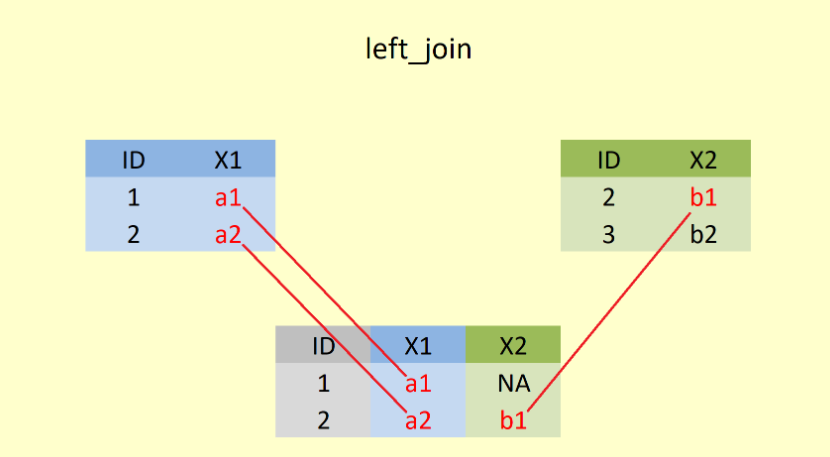

# Veri duzenleme  - IV


- **join()** fonksiyonlari
  - **left_join()**
  - **right_join()**
  - **full_join()**
  - **inner_join()**
  - **semi_join()**
  - **anti_join()**


## **join()** fonksiyonu

- **join()** fonksiyonları iki veri setini istenilen şekilde birleştirme amacıyla kullanılırlar..

- **A** ve **B** veri setlerini birleştirmek istediğimizde 

  - Her iki veri setinden de hangi **satırları** almak istiyoruz?

  - Her iki veri setinden de hangi **sütunları** almak istiyoruz?

  - Satırların **eşleşip eşleşmeyeceğini** hangi değişkenlerle belirleyeceğiz?


## Join Türleri

- Çok sayıda **join()** fonksiyonu bulunmaktadır. 
- **A %>% left_join(B)**

`A` dan tüm satırları, mümkün olduğunda `B` ile eşleştir (olmadığında "NA" verir), hem `A` hem de `B` den gelen sütunları alır.



- **A %>% right_join(B)**

`B` den tüm satırları, mümkün olduğunda `A` ile eşleştir (olmadığında "NA" verir), hem `A` hem de `B` den gelen sütunları alır.


-  Pratikte genellike **left_join()** kullanılır.


- **A %>% inner_join(B)**
<br>
yanlızca `A` ve `B` nin eşleşen satırlarını birleştirir. Hem `A` hem de `B` den gelen sütunları alır.


- **A %>% full_join(B)** 

`A` ve `B` den tüm satırları birleştirir. Hem `A` hem de `B` den gelen sütunları alır.


- **A %>% semi_join(B)**

`A` nın `B` ile eşleşen satırlarını alır.  Sadece `A` dan gelen sütunları alır.


-  **A %>% anti_join(B)**
<br>
`A` nın `B` ile eşleşemeyen satırlarını alır. Sadece `A` dan gelen sütunları alır.


- Aynı değerleri içeren satırların olduğu sütunların *eşleşmesi* gerektiğini söylüyoruz.

- Bunları birleştirme için bir **by =** argümanını kullanıyoruz.

- Eğer birleştirme yapmak istediğimiz sütun/ların isimleri aynı ise **by =** argümanını kullanmaya gerek yoktur. 


cinsiyet1


```r
cinsiyet1
```

<div class="kable-table">

|ogrenci      |cinsiyet |
|:------------|:--------|
|Mert Kaya    |Erkek    |
|Zeynep Turan |Kiz      |
|Zeynep Inal  |Kiz      |

</div>

kangrubu1


```r
kangrubu1
```

<div class="kable-table">

|ogrenci      |kangrubu |
|:------------|:--------|
|Zeynep Turan |A Rh(-)  |
|Zeynep Inal  |0 Rh (+) |
|Can Eser     |ARh(+)   |

</div>


```r
left_join(cinsiyet1,kangrubu1)
```

```
## Joining with `by = join_by(ogrenci)`
```

<div class="kable-table">

|ogrenci      |cinsiyet |kangrubu |
|:------------|:--------|:--------|
|Mert Kaya    |Erkek    |NA       |
|Zeynep Turan |Kiz      |A Rh(-)  |
|Zeynep Inal  |Kiz      |0 Rh (+) |

</div>


```r
right_join(cinsiyet1,kangrubu1)
```

```
## Joining with `by = join_by(ogrenci)`
```

<div class="kable-table">

|ogrenci      |cinsiyet |kangrubu |
|:------------|:--------|:--------|
|Zeynep Turan |Kiz      |A Rh(-)  |
|Zeynep Inal  |Kiz      |0 Rh (+) |
|Can Eser     |NA       |ARh(+)   |

</div>


cinsiyet1

```r
cinsiyet1
```

<div class="kable-table">

|ogrenci      |cinsiyet |
|:------------|:--------|
|Mert Kaya    |Erkek    |
|Zeynep Turan |Kiz      |
|Zeynep Inal  |Kiz      |

</div>

kangrubu1

```r
kangrubu1
```

<div class="kable-table">

|ogrenci      |kangrubu |
|:------------|:--------|
|Zeynep Turan |A Rh(-)  |
|Zeynep Inal  |0 Rh (+) |
|Can Eser     |ARh(+)   |

</div>


```r
inner_join(cinsiyet1,kangrubu1)
```

```
## Joining with `by = join_by(ogrenci)`
```

<div class="kable-table">

|ogrenci      |cinsiyet |kangrubu |
|:------------|:--------|:--------|
|Zeynep Turan |Kiz      |A Rh(-)  |
|Zeynep Inal  |Kiz      |0 Rh (+) |

</div>


```r
full_join(cinsiyet1,kangrubu1)
```

```
## Joining with `by = join_by(ogrenci)`
```

<div class="kable-table">

|ogrenci      |cinsiyet |kangrubu |
|:------------|:--------|:--------|
|Mert Kaya    |Erkek    |NA       |
|Zeynep Turan |Kiz      |A Rh(-)  |
|Zeynep Inal  |Kiz      |0 Rh (+) |
|Can Eser     |NA       |ARh(+)   |

</div>


cinsiyet1

```r
cinsiyet1
```

<div class="kable-table">

|ogrenci      |cinsiyet |
|:------------|:--------|
|Mert Kaya    |Erkek    |
|Zeynep Turan |Kiz      |
|Zeynep Inal  |Kiz      |

</div>

kangrubu1

```r
kangrubu1
```

<div class="kable-table">

|ogrenci      |kangrubu |
|:------------|:--------|
|Zeynep Turan |A Rh(-)  |
|Zeynep Inal  |0 Rh (+) |
|Can Eser     |ARh(+)   |

</div>


```r
semi_join(cinsiyet1,kangrubu1)
```

```
## Joining with `by = join_by(ogrenci)`
```

<div class="kable-table">

|ogrenci      |cinsiyet |
|:------------|:--------|
|Zeynep Turan |Kiz      |
|Zeynep Inal  |Kiz      |

</div>


```r
anti_join(cinsiyet1,kangrubu1)
```

```
## Joining with `by = join_by(ogrenci)`
```

<div class="kable-table">

|ogrenci   |cinsiyet |
|:---------|:--------|
|Mert Kaya |Erkek    |

</div>


cinsiyet1

```r
cinsiyet2
```

<div class="kable-table">

|ogrenci      |cinsiyet |
|:------------|:--------|
|Mert Kaya    |Erkek    |
|Zeynep Turan |Kiz      |
|Zeynep Inal  |Kiz      |

</div>

kangrubu1

```r
kangrubu2
```

<div class="kable-table">

|ad           |kangrubu |
|:------------|:--------|
|Zeynep Turan |A Rh(-)  |
|Zeynep Inal  |0 Rh (+) |
|Can Eser     |ARh(+)   |

</div>


```r
cinsiyet2 %>% 
left_join(kangrubu2,by=c("ogrenci"="ad"))
```

<div class="kable-table">

|ogrenci      |cinsiyet |kangrubu |
|:------------|:--------|:--------|
|Mert Kaya    |Erkek    |NA       |
|Zeynep Turan |Kiz      |A Rh(-)  |
|Zeynep Inal  |Kiz      |0 Rh (+) |

</div>


```r
kangrubu2 %>% 
left_join(cinsiyet2,by=c("ad"="ogrenci"))
```

<div class="kable-table">

|ad           |kangrubu |cinsiyet |
|:------------|:--------|:--------|
|Zeynep Turan |A Rh(-)  |Kiz      |
|Zeynep Inal  |0 Rh (+) |Kiz      |
|Can Eser     |ARh(+)   |NA       |

</div>


```r
intersect(1:5, 4:8)
union(1:5, 4:8)
setdiff(1:5, 4:8)
setdiff(4:8, 1:5)
```

```
## [1] 4 5
## [1] 1 2 3 4 5 6 7 8
## [1] 1 2 3
## [1] 6 7 8
```


## Aynı değişken adları


```r
load("import/PISA_STU_2018.rda")
load("import/PISA_SCH_2018.rda")
load("import/PISA_COG_2018.rda")
load("import/PISA_OGR_2018.rda")
intersect(names(PISA_STU_2018), names(PISA_SCH_2018))
```

```
##  [1] "CNTRYID"   "CNT"       "CNTSCHID"  "CYC"       "NatCen"    "STRATUM"  
##  [7] "SUBNATIO"  "OECD"      "ADMINMODE" "BOOKID"    "SENWT"     "VER_DAT"
```


```r
intersect(names(PISA_STU_2018), names(PISA_COG_2018))
```

```
##  [1] "CNTRYID"      "CNT"          "CNTSCHID"     "CNTSTUID"     "CYC"         
##  [6] "NatCen"       "STRATUM"      "SUBNATIO"     "OECD"         "ADMINMODE"   
## [11] "LANGTEST_QQQ" "LANGTEST_COG" "LANGTEST_PAQ" "BOOKID"       "VER_DAT"
```


## join 


```r
miniOGR <- PISA_OGR_2018 %>% select(OKULID,OGRENCIID,CINSIYET,KITAPSAYISI,ST196Q02HA:ST196Q07HA)
miniOGR %>% head(2)
```

<div class="kable-table">

|   OKULID| OGRENCIID| CINSIYET| KITAPSAYISI| ST196Q02HA| ST196Q03HA| ST196Q04HA| ST196Q05HA| ST196Q06HA| ST196Q07HA|
|--------:|---------:|--------:|-----------:|----------:|----------:|----------:|----------:|----------:|----------:|
| 79200001|  79200768|        2|           2|          3|          3|          4|          4|          3|          4|
| 79200001|  79201064|        2|           3|          3|          3|          4|          4|          3|          2|

</div>


```r
miniSCH <- PISA_SCH_2018 %>% select(CNTSCHID,okulbuyukluk = SCHSIZE,sinifbuyuk= CLSIZE)
miniSCH %>% head(2)
```

<div class="kable-table">

| CNTSCHID| okulbuyukluk| sinifbuyuk|
|--------:|------------:|----------:|
| 79200001|          775|         33|
| 79200002|         1178|         53|

</div>


- veri setinde eşleştirme yapılması istenilen değişkenin farklı adları olduğunda 

```r
left_join(miniOGR,miniSCH,by=c("OKULID"="CNTSCHID")) %>% head(6)
```

<div class="kable-table">

|   OKULID| OGRENCIID| CINSIYET| KITAPSAYISI| ST196Q02HA| ST196Q03HA| ST196Q04HA| ST196Q05HA| ST196Q06HA| ST196Q07HA| okulbuyukluk| sinifbuyuk|
|--------:|---------:|--------:|-----------:|----------:|----------:|----------:|----------:|----------:|----------:|------------:|----------:|
| 79200001|  79200768|        2|           2|          3|          3|          4|          4|          3|          4|          775|         33|
| 79200001|  79201064|        2|           3|          3|          3|          4|          4|          3|          2|          775|         33|
| 79200001|  79201118|        1|           1|          1|          2|          3|          2|          2|          2|          775|         33|
| 79200001|  79201275|        2|           1|          1|          1|          1|          1|          1|          1|          775|         33|
| 79200001|  79201481|        2|           2|          1|          4|          4|          1|          4|          4|          775|         33|
| 79200001|  79201556|        2|           2|          1|          1|          1|          1|          1|          1|          775|         33|

</div>


- konu ile ilgili daha fazla alıştırma için [adresini](https://rpubs.com/williamsurles/293454) inceleyebilirsiniz.

teşekkürler !


