# Betimleyici İstatistik 

<!-- https://statsandr.com/blog/descriptive-statistics-in-r/ -->

<!-- https://rpubs.com/williamsurles/298945 -->

 <!-- https://rpubs.com/odenipinedo/introduction-to-data-visualization-with-ggplot2 -->

## Veri Yükleme


-  🔗 [PISA_STU_2018](import/PISA_STU_2018.rda) ve 🔗 [PISA_OGR_2018]((import/PISA_OGR_2018.rda)) veri setlerini kullanacağız. 

- veri seti R'de varsayılan olarak içe aktarılır, yalnızca PISA_STU_2018 çalıştırarak yüklemeniz gerekir:


```r
load("import/PISA_STU_2018.rda") # ogrenci verisi
head(PISA_STU_2018)
```

<div class="kable-table">

| CNTRYID|CNT | CNTSCHID| CNTSTUID|CYC  |NatCen |STRATUM |SUBNATIO | OECD| ADMINMODE| LANGTEST_QQQ| LANGTEST_COG| LANGTEST_PAQ| BOOKID| ST001D01T| ST003D02T| ST003D03T| ST004D01T| ST005Q01TA| ST006Q01TA| ST006Q02TA| ST006Q03TA| ST006Q04TA| ST007Q01TA| ST008Q01TA| ST008Q02TA| ST008Q03TA| ST008Q04TA| ST011Q01TA| ST011Q02TA| ST011Q03TA| ST011Q04TA| ST011Q05TA| ST011Q06TA| ST011Q07TA| ST011Q08TA| ST011Q09TA| ST011Q10TA| ST011Q11TA| ST011Q12TA| ST011Q16NA|ST011D17TA |ST011D18TA |ST011D19TA | ST012Q01TA| ST012Q02TA| ST012Q03TA| ST012Q05NA| ST012Q06NA| ST012Q07NA| ST012Q08NA| ST012Q09NA| ST013Q01TA| ST019AQ01T| ST019BQ01T| ST019CQ01T| ST021Q01TA| ST125Q01NA| ST126Q01TA| ST127Q01TA| ST127Q02TA| ST127Q03TA| ST022Q01TA| ST023Q01TA| ST023Q02TA| ST023Q03TA| ST023Q04TA| ST023Q05TA| ST097Q01TA| ST097Q02TA| ST097Q03TA| ST097Q04TA| ST097Q05TA| ST100Q01TA| ST100Q02TA| ST100Q03TA| ST100Q04TA| ST102Q01TA| ST102Q02TA| ST102Q03TA| ST102Q04TA| ST211Q01HA| ST211Q02HA| ST211Q03HA| ST212Q01HA| ST212Q02HA| ST212Q03HA| ST104Q02NA| ST104Q03NA| ST104Q04NA| ST213Q01HA| ST213Q02HA| ST213Q03HA| ST213Q04HA| ST150Q01IA| ST150Q02IA| ST150Q03IA| ST150Q04HA| ST152Q05IA| ST152Q06IA| ST152Q07IA| ST152Q08IA| ST154Q01HA| ST153Q01HA| ST153Q02HA| ST153Q03HA| ST153Q04HA| ST153Q05HA| ST153Q06HA| ST153Q08HA| ST153Q09HA| ST153Q10HA| ST158Q01HA| ST158Q02HA| ST158Q03HA| ST158Q04HA| ST158Q05HA| ST158Q06HA| ST158Q07HA| ST160Q01IA| ST160Q02IA| ST160Q03IA| ST160Q04IA| ST160Q05IA| ST167Q01IA| ST167Q02IA| ST167Q03IA| ST167Q04IA| ST167Q05IA| ST168Q01HA| ST175Q01IA| ST176Q01IA| ST176Q02IA| ST176Q03IA| ST176Q05IA| ST176Q06IA| ST176Q07IA| ST161Q01HA| ST161Q02HA| ST161Q03HA| ST161Q06HA| ST161Q07HA| ST161Q08HA| ST163Q02HA| ST163Q03HA| ST163Q04HA| ST164Q01IA| ST164Q02IA| ST164Q03IA| ST164Q04IA| ST164Q05IA| ST164Q06IA| ST165Q01IA| ST165Q02IA| ST165Q03IA| ST165Q04IA| ST165Q05IA| ST166Q01HA| ST166Q02HA| ST166Q03HA| ST166Q04HA| ST166Q05HA| ST016Q01NA| ST036Q05TA| ST036Q06TA| ST036Q08TA| ST225Q01HA| ST225Q02HA| ST225Q03HA| ST225Q04HA| ST225Q05HA| ST225Q06HA| ST181Q02HA| ST181Q03HA| ST181Q04HA| ST182Q03HA| ST182Q04HA| ST182Q05HA| ST182Q06HA| ST183Q01HA| ST183Q02HA| ST183Q03HA| ST184Q01HA| ST185Q01HA| ST185Q02HA| ST185Q03HA| ST186Q05HA| ST186Q06HA| ST186Q07HA| ST186Q10HA| ST186Q09HA| ST186Q02HA| ST186Q01HA| ST186Q08HA| ST186Q03HA| ST208Q01HA| ST208Q02HA| ST208Q04HA| ST188Q01HA| ST188Q02HA| ST188Q03HA| ST188Q06HA| ST188Q07HA| ST034Q01TA| ST034Q02TA| ST034Q03TA| ST034Q04TA| ST034Q05TA| ST034Q06TA| ST196Q02HA| ST196Q03HA| ST196Q04HA| ST196Q05HA| ST196Q06HA| ST196Q07HA| ST197Q01HA| ST197Q02HA| ST197Q04HA| ST197Q07HA| ST197Q08HA| ST197Q09HA| ST197Q12HA| ST215Q01HA| ST215Q02HA| ST215Q03HA| ST215Q04HA| ST215Q05HA| ST216Q01HA| ST216Q02HA| ST216Q03HA| ST216Q04HA| ST216Q05HA| ST216Q06HA| ST218Q01HA| ST218Q02HA| ST218Q03HA| ST218Q04HA| ST218Q05HA| ST218Q06HA| ST218Q07HA| ST222Q01HA| ST222Q03HA| ST222Q04HA| ST222Q05HA| ST222Q06HA| ST222Q08HA| ST222Q09HA| ST222Q10HA| ST214Q01HA| ST214Q02HA| ST214Q03HA| ST214Q06HA| ST220Q01HA| ST220Q02HA| ST220Q03HA| ST220Q04HA| ST217Q01HA| ST217Q02HA| ST217Q03HA| ST217Q04HA| ST217Q05HA| ST219Q01HA| ST219Q02HA| ST219Q03HA| ST219Q04HA| ST219Q05HA| ST219Q06HA| ST204Q02HA| ST204Q03HA| ST204Q04HA| ST204Q05HA| ST177Q01HA| ST177Q02HA| ST177Q03HA| ST189Q01HA| ST221Q01HA| ST221Q02HA| ST221Q03HA| ST221Q04HA| ST221Q05HA| ST221Q06HA| ST221Q07HA| ST221Q08HA| ST221Q09HA| ST221Q11HA| ST223Q02HA| ST223Q04HA| ST223Q05HA| ST223Q08HA| ST123Q02NA| ST123Q03NA| ST123Q04NA| ST205Q01HA| ST205Q02HA| ST205Q03HA| ST205Q04HA| ST059Q01TA| ST059Q02TA| ST059Q03TA| ST059Q04HA| ST060Q01NA| ST061Q01NA| ST062Q01TA| ST062Q02TA| ST062Q03TA| ST038Q03NA| ST038Q04NA| ST038Q05NA| ST038Q06NA| ST038Q07NA| ST038Q08NA| ST207Q01HA| ST207Q02HA| ST207Q03HA| ST207Q04HA| ST207Q05HA| ST206Q01HA| ST206Q02HA| ST206Q03HA| ST206Q04HA| IC001Q01TA| IC001Q02TA| IC001Q03TA| IC001Q04TA| IC001Q05TA| IC001Q06TA| IC001Q07TA| IC001Q08TA| IC001Q09TA| IC001Q10TA| IC001Q11TA| IC009Q01TA| IC009Q02TA| IC009Q03TA| IC009Q05NA| IC009Q06NA| IC009Q07NA| IC009Q08TA| IC009Q09TA| IC009Q10NA| IC009Q11NA| IC002Q01HA| IC004Q01HA| IC005Q01TA| IC006Q01TA| IC007Q01TA| IC150Q01HA| IC150Q02HA| IC150Q03HA| IC150Q04HA| IC150Q05HA| IC150Q06HA| IC150Q07HA| IC150Q08HA| IC150Q09HA| IC151Q01HA| IC151Q02HA| IC151Q03HA| IC151Q04HA| IC151Q05HA| IC151Q06HA| IC151Q07HA| IC151Q08HA| IC151Q09HA| IC152Q01HA| IC152Q02HA| IC152Q03HA| IC152Q04HA| IC152Q05HA| IC152Q06HA| IC152Q07HA| IC152Q08HA| IC152Q09HA| IC008Q01TA| IC008Q02TA| IC008Q03TA| IC008Q04TA| IC008Q05TA| IC008Q07NA| IC008Q08TA| IC008Q09TA| IC008Q10TA| IC008Q11TA| IC008Q12TA| IC008Q13NA| IC010Q01TA| IC010Q02NA| IC010Q03TA| IC010Q04TA| IC010Q05NA| IC010Q06NA| IC010Q07TA| IC010Q08TA| IC010Q09NA| IC010Q10NA| IC010Q11HA| IC010Q12HA| IC011Q01TA| IC011Q02TA| IC011Q03TA| IC011Q04TA| IC011Q05TA| IC011Q06TA| IC011Q07TA| IC011Q08TA| IC011Q09TA| IC011Q10HA| IC013Q01NA| IC013Q04NA| IC013Q05NA| IC013Q11NA| IC013Q12NA| IC013Q13NA| IC014Q03NA| IC014Q04NA| IC014Q06NA| IC014Q08NA| IC014Q09NA| IC015Q02NA| IC015Q03NA| IC015Q05NA| IC015Q07NA| IC015Q09NA| IC016Q01NA| IC016Q02NA| IC016Q04NA| IC016Q05NA| IC016Q07NA| IC169Q01HA| EC031Q01TA| EC032Q01TA| EC033Q01NA| EC150Q01WA| EC150Q02WA| EC150Q03WA| EC150Q04WA| EC150Q05WA| EC150Q06WA| EC150Q07WA| EC150Q08WA| EC150Q09WA| EC150Q10WA| EC151Q01WA| EC151Q01WB| EC151Q01WC| EC151Q02WA| EC151Q02WB| EC151Q02WC| EC151Q03WA| EC151Q03WB| EC151Q03WC| EC151Q04WA| EC151Q04WB| EC151Q04WC| EC151Q05WA| EC151Q05WB| EC151Q05WC| EC152Q01HA| EC153Q01HA| EC153Q02HA| EC153Q03HA| EC153Q04HA| EC153Q05HA| EC153Q06HA| EC153Q07HA| EC153Q08HA| EC153Q09HA| EC153Q10HA| EC153Q11HA| EC160Q01HA| EC158Q01HA| EC158Q02HA| EC159Q01HA| EC159Q02HA| EC163Q01HA| EC163Q02HA| EC163Q03HA| EC163Q04HA| EC163Q05HA| EC163Q06HA| EC163Q07HA| EC162Q01HA| EC162Q02HA| EC162Q03HA| EC162Q04HA| EC162Q05HA| EC162Q06HA| EC162Q07HA| EC162Q08HA| EC154Q01IA| EC154Q02IA| EC154Q03IA| EC154Q04HA| EC154Q05IA| EC154Q06IA| EC154Q07IA| EC154Q08HA| EC154Q09IA| EC012Q01NA| EC012Q02NA| EC012Q04NA| EC012Q06NA| EC012Q07NA| EC012Q08NA| EC012Q13HA| EC012Q12NA| EC155Q01DA| EC155Q02DA| EC155Q03DA| EC155Q04HA| EC155Q05HA| WB150Q01HA| WB151Q01HA| WB152Q01HA| WB153Q01HA| WB153Q02HA| WB153Q03HA| WB153Q04HA| WB153Q05HA| WB154Q01HA| WB154Q02HA| WB154Q03HA| WB154Q04HA| WB154Q05HA| WB154Q06HA| WB154Q07HA| WB154Q08HA| WB154Q09HA| WB155Q01HA| WB155Q02HA| WB155Q03HA| WB155Q04HA| WB155Q05HA| WB155Q06HA| WB155Q07HA| WB155Q08HA| WB155Q09HA| WB155Q10HA| WB156Q01HA| WB158Q01HA| WB160Q01HA| WB161Q01HA| WB162Q01HA| WB162Q02HA| WB162Q03HA| WB162Q04HA| WB162Q05HA| WB162Q06HA| WB162Q07HA| WB162Q08HA| WB162Q09HA| WB163Q01HA| WB163Q02HA| WB163Q03HA| WB163Q04HA| WB163Q05HA| WB163Q06HA| WB163Q07HA| WB163Q08HA| WB164Q01HA| WB165Q01HA| WB166Q01HA| WB166Q02HA| WB166Q03HA| WB166Q04HA| WB167Q01HA| WB168Q01HA| WB168Q02HA| WB168Q03HA| WB168Q04HA| WB171Q01HA| WB171Q02HA| WB171Q03HA| WB171Q04HA| WB172Q01HA| WB173Q01HA| WB173Q02HA| WB173Q03HA| WB173Q04HA| WB176Q01HA| WB177Q01HA| WB177Q02HA| WB177Q03HA| WB177Q04HA| WB032Q01NA| WB032Q02NA| WB031Q01NA| WB178Q01HA| WB178Q02HA| WB178Q03HA| WB178Q04HA| WB178Q05HA| WB178Q06HA| WB178Q07HA| FL150Q01TA| FL150Q02TA| FL150Q03TA| FL151Q01HA| FL151Q02HA| FL164Q01HA| FL164Q02HA| FL164Q03HA| FL164Q04HA| FL164Q05HA| FL164Q06HA| FL164Q07HA| FL164Q08HA| FL164Q09HA| FL164Q10HA| FL164Q11HA| FL164Q12HA| FL164Q13HA| FL164Q14HA| FL164Q15HA| FL164Q16HA| FL164Q17HA| FL164Q18HA| FL165Q01HA| FL165Q02HA| FL165Q03HA| FL165Q04HA| FL166Q01HA| FL166Q02HA| FL166Q03HA| FL166Q05HA| FL166Q06HA| FL166Q07HA| FL153Q01HA| FL153Q02HA| FL153Q03HA| FL153Q04HA| FL153Q05HA| FL153Q06HA| FL167Q01HA| FL167Q02HA| FL167Q03HA| FL167Q04HA| FL167Q05HA| FL156Q01TA| FL156Q02TA| FL156Q03TA| FL156Q04TA| FL156Q05TA| FL156Q06TA| FL156Q07HA| FL159Q01HA| FL159Q02HA| FL159Q03HA| FL159Q04HA| FL160Q01HA| FL160Q02HA| FL160Q03HA| FL160Q04HA| FL161Q01HA| FL161Q02HA| FL161Q03HA| FL162Q01HA| FL162Q02HA| FL162Q03HA| FL162Q04HA| FL162Q05HA| FL162Q06HA| FL163Q01HA| FL163Q02HA| FL163Q03HA| FL163Q04HA| FL163Q05HA| FL168Q01HA| FL168Q02HA| FL168Q03HA| FL168Q04HA| FL168Q05HA| FL168Q06HA| FL168Q07HA| FL168Q08HA| FL169Q01HA| FL169Q02HA| FL169Q03HA| FL169Q04HA| PA001Q01TA| PA001Q02TA| PA001Q03TA| PA003Q01TA| PA003Q02TA| PA003Q03TA| PA003Q04HA| PA003Q05IA| PA003Q06IA| PA003Q07IA| PA154Q01IA| PA154Q02IA| PA154Q03IA| PA154Q04IA| PA154Q05IA| PA154Q06IA| PA154Q07IA| PA154Q08IA| PA154Q09IA| PA154Q10HA| PA155Q01IA| PA156Q01HA| PA156Q02HA| PA156Q03HA| PA156Q04HA| PA004Q02NA| PA004Q03NA| PA004Q04NA| PA008Q01TA| PA008Q02TA| PA008Q03TA| PA008Q04TA| PA008Q05TA| PA008Q06NA| PA008Q07NA| PA008Q08NA| PA008Q09NA| PA008Q10NA| PA009Q01NA| PA009Q02NA| PA009Q03NA| PA009Q04NA| PA009Q05NA| PA009Q06NA| PA009Q07NA| PA009Q08NA| PA009Q09NA| PA009Q10NA| PA009Q11NA| PA007Q01TA| PA007Q02TA| PA007Q03TA| PA007Q04TA| PA007Q05TA| PA007Q06TA| PA007Q07TA| PA007Q09NA| PA007Q11NA| PA007Q12NA| PA007Q13NA| PA007Q14NA| PA007Q15NA| PA005Q01TA| PA006Q01TA| PA006Q02TA| PA006Q03TA| PA006Q04TA| PA006Q05TA| PA006Q06TA| PA006Q07TA| PA006Q08TA| PA006Q09TA| PA006Q10TA| PA006Q11TA| PA006Q12HA| PA006Q13HA| PA006Q14HA| PA158Q01HA| PA158Q02IA| PA158Q03HA| PA158Q04IA| PA158Q05HA| PA159Q01HA| PA160Q01HA| PA160Q02HA| PA160Q03HA| PA160Q04HA| PA160Q05HA| PA161Q01HA| PA161Q02HA| PA161Q03HA| PA161Q05HA| PA161Q06HA| PA161Q07HA| PA162Q01HA| PA163Q01HA| PA166Q01HA| PA167Q02HA| PA167Q03HA| PA167Q04HA| PA167Q05HA| PA168Q01HA| PA168Q02HA| PA168Q03HA| PA168Q06HA| PA169Q01HA| PA169Q02HA| PA169Q03HA| PA169Q04HA| PA169Q05HA| PA169Q06HA| PA170Q01HA| PA170Q02HA| PA170Q04HA| PA170Q07HA| PA170Q08HA| PA170Q09HA| PA170Q12HA| PA171Q01HA| PA171Q03HA| PA171Q04HA| PA171Q05HA| PA171Q06HA| PA171Q08HA| PA171Q09HA| PA171Q10HA| PA172Q01WA| PA172Q02WA| PA172Q03WA| PA172Q04WA| PA172Q05WA| PA172Q06WA| PA018Q01NA| PA018Q02NA| PA018Q03NA| PA177Q01HA| PA177Q02HA| PA177Q03HA| PA177Q04HA| PA177Q05HA| PA177Q06HA| PA177Q07HA| PA177Q08HA| PA180Q01HA| PA182Q01HA| PA175Q01HA| PA175Q02HA| PA041Q01TA| PA042Q01TA| EFFORT1| EFFORT2|OCOD1 |OCOD2 |OCOD3 | GRADE|   AGE|PROGN    |COBN_S |COBN_M |COBN_F | LANGN| ISCEDL| ISCEDD| ISCEDO| MISCED| FISCED| HISCED| PARED| MISCED_D| FISCED_D| HISCED_D| PAREDINT| BMMJ1| BFMJ2| HISEI| LANGMOTHER| LANGFATHER| LANGSIBLINGS| LANGFRIEND| LANGSCHMATES| IMMIG| DURECEC| REPEAT|  BSMJ| MMINS| LMINS| SMINS| TMINS| FCFMLRTY| SCCHANGE| CHANGE| STUBMI|    ESCS| UNDREM| METASUM| METASPAM| ICTHOME| ICTSCH| HOMEPOS| CULTPOSS|  HEDRES|  WEALTH|  ICTRES| DISCLIMA| TEACHSUP|  DIRINS| PERFEED| EMOSUPS| STIMREAD| ADAPTIVITY| TEACHINT| JOYREAD| SCREADCOMP| SCREADDIFF| PISADIFF| PERCOMP| PERCOOP| ATTLNACT| COMPETE| WORKMAST| GFOFAIL|   EUDMO|    SWBP| RESILIENCE| MASTGOAL| GCSELFEFF| GCAWARE|  ATTIMM| INTCULT| PERSPECT| COGFLEX| RESPECT|  AWACOM| GLOBMIND| DISCRIM|  BELONG| BEINGBULLIED|  ENTUSE| HOMESCH|  USESCH|  INTICT| COMPICT|  AUTICT| SOIAICT| ICTCLASS| ICTOUTSIDE| INFOCAR| INFOJOB1| INFOJOB2| FLCONFIN| FLCONICT| FLSCHOOL| FLFAMILY| CURSUPP| EMOSUPP| PQSCHOOL| PASCHPOL| PRESUPP| JOYREADP| ATTIMMP| INTCULTP| GCAWAREP| BODYIMA| SOCONPA| W_FSTUWT| W_FSTURWT1| W_FSTURWT2| W_FSTURWT3| W_FSTURWT4| W_FSTURWT5| W_FSTURWT6| W_FSTURWT7| W_FSTURWT8| W_FSTURWT9| W_FSTURWT10| W_FSTURWT11| W_FSTURWT12| W_FSTURWT13| W_FSTURWT14| W_FSTURWT15| W_FSTURWT16| W_FSTURWT17| W_FSTURWT18| W_FSTURWT19| W_FSTURWT20| W_FSTURWT21| W_FSTURWT22| W_FSTURWT23| W_FSTURWT24| W_FSTURWT25| W_FSTURWT26| W_FSTURWT27| W_FSTURWT28| W_FSTURWT29| W_FSTURWT30| W_FSTURWT31| W_FSTURWT32| W_FSTURWT33| W_FSTURWT34| W_FSTURWT35| W_FSTURWT36| W_FSTURWT37| W_FSTURWT38| W_FSTURWT39| W_FSTURWT40| W_FSTURWT41| W_FSTURWT42| W_FSTURWT43| W_FSTURWT44| W_FSTURWT45| W_FSTURWT46| W_FSTURWT47| W_FSTURWT48| W_FSTURWT49| W_FSTURWT50| W_FSTURWT51| W_FSTURWT52| W_FSTURWT53| W_FSTURWT54| W_FSTURWT55| W_FSTURWT56| W_FSTURWT57| W_FSTURWT58| W_FSTURWT59| W_FSTURWT60| W_FSTURWT61| W_FSTURWT62| W_FSTURWT63| W_FSTURWT64| W_FSTURWT65| W_FSTURWT66| W_FSTURWT67| W_FSTURWT68| W_FSTURWT69| W_FSTURWT70| W_FSTURWT71| W_FSTURWT72| W_FSTURWT73| W_FSTURWT74| W_FSTURWT75| W_FSTURWT76| W_FSTURWT77| W_FSTURWT78| W_FSTURWT79| W_FSTURWT80| UNIT| WVARSTRR| PV1MATH| PV2MATH| PV3MATH| PV4MATH| PV5MATH| PV6MATH| PV7MATH| PV8MATH| PV9MATH| PV10MATH| PV1READ| PV2READ| PV3READ| PV4READ| PV5READ| PV6READ| PV7READ| PV8READ| PV9READ| PV10READ| PV1SCIE| PV2SCIE| PV3SCIE| PV4SCIE| PV5SCIE| PV6SCIE| PV7SCIE| PV8SCIE| PV9SCIE| PV10SCIE| PV1GLCM| PV2GLCM| PV3GLCM| PV4GLCM| PV5GLCM| PV6GLCM| PV7GLCM| PV8GLCM| PV9GLCM| PV10GLCM| PV1RCLI| PV2RCLI| PV3RCLI| PV4RCLI| PV5RCLI| PV6RCLI| PV7RCLI| PV8RCLI| PV9RCLI| PV10RCLI| PV1RCUN| PV2RCUN| PV3RCUN| PV4RCUN| PV5RCUN| PV6RCUN| PV7RCUN| PV8RCUN| PV9RCUN| PV10RCUN| PV1RCER| PV2RCER| PV3RCER| PV4RCER| PV5RCER| PV6RCER| PV7RCER| PV8RCER| PV9RCER| PV10RCER| PV1RTSN| PV2RTSN| PV3RTSN| PV4RTSN| PV5RTSN| PV6RTSN| PV7RTSN| PV8RTSN| PV9RTSN| PV10RTSN| PV1RTML| PV2RTML| PV3RTML| PV4RTML| PV5RTML| PV6RTML| PV7RTML| PV8RTML| PV9RTML| PV10RTML|   SENWT|VER_DAT          | test|
|-------:|:---|--------:|--------:|:----|:------|:-------|:--------|----:|---------:|------------:|------------:|------------:|------:|---------:|---------:|---------:|---------:|----------:|----------:|----------:|----------:|----------:|----------:|----------:|----------:|----------:|----------:|----------:|----------:|----------:|----------:|----------:|----------:|----------:|----------:|----------:|----------:|----------:|----------:|----------:|:----------|:----------|:----------|----------:|----------:|----------:|----------:|----------:|----------:|----------:|----------:|----------:|----------:|----------:|----------:|----------:|----------:|----------:|----------:|----------:|----------:|----------:|----------:|----------:|----------:|----------:|----------:|----------:|----------:|----------:|----------:|----------:|----------:|----------:|----------:|----------:|----------:|----------:|----------:|----------:|----------:|----------:|----------:|----------:|----------:|----------:|----------:|----------:|----------:|----------:|----------:|----------:|----------:|----------:|----------:|----------:|----------:|----------:|----------:|----------:|----------:|----------:|----------:|----------:|----------:|----------:|----------:|----------:|----------:|----------:|----------:|----------:|----------:|----------:|----------:|----------:|----------:|----------:|----------:|----------:|----------:|----------:|----------:|----------:|----------:|----------:|----------:|----------:|----------:|----------:|----------:|----------:|----------:|----------:|----------:|----------:|----------:|----------:|----------:|----------:|----------:|----------:|----------:|----------:|----------:|----------:|----------:|----------:|----------:|----------:|----------:|----------:|----------:|----------:|----------:|----------:|----------:|----------:|----------:|----------:|----------:|----------:|----------:|----------:|----------:|----------:|----------:|----------:|----------:|----------:|----------:|----------:|----------:|----------:|----------:|----------:|----------:|----------:|----------:|----------:|----------:|----------:|----------:|----------:|----------:|----------:|----------:|----------:|----------:|----------:|----------:|----------:|----------:|----------:|----------:|----------:|----------:|----------:|----------:|----------:|----------:|----------:|----------:|----------:|----------:|----------:|----------:|----------:|----------:|----------:|----------:|----------:|----------:|----------:|----------:|----------:|----------:|----------:|----------:|----------:|----------:|----------:|----------:|----------:|----------:|----------:|----------:|----------:|----------:|----------:|----------:|----------:|----------:|----------:|----------:|----------:|----------:|----------:|----------:|----------:|----------:|----------:|----------:|----------:|----------:|----------:|----------:|----------:|----------:|----------:|----------:|----------:|----------:|----------:|----------:|----------:|----------:|----------:|----------:|----------:|----------:|----------:|----------:|----------:|----------:|----------:|----------:|----------:|----------:|----------:|----------:|----------:|----------:|----------:|----------:|----------:|----------:|----------:|----------:|----------:|----------:|----------:|----------:|----------:|----------:|----------:|----------:|----------:|----------:|----------:|----------:|----------:|----------:|----------:|----------:|----------:|----------:|----------:|----------:|----------:|----------:|----------:|----------:|----------:|----------:|----------:|----------:|----------:|----------:|----------:|----------:|----------:|----------:|----------:|----------:|----------:|----------:|----------:|----------:|----------:|----------:|----------:|----------:|----------:|----------:|----------:|----------:|----------:|----------:|----------:|----------:|----------:|----------:|----------:|----------:|----------:|----------:|----------:|----------:|----------:|----------:|----------:|----------:|----------:|----------:|----------:|----------:|----------:|----------:|----------:|----------:|----------:|----------:|----------:|----------:|----------:|----------:|----------:|----------:|----------:|----------:|----------:|----------:|----------:|----------:|----------:|----------:|----------:|----------:|----------:|----------:|----------:|----------:|----------:|----------:|----------:|----------:|----------:|----------:|----------:|----------:|----------:|----------:|----------:|----------:|----------:|----------:|----------:|----------:|----------:|----------:|----------:|----------:|----------:|----------:|----------:|----------:|----------:|----------:|----------:|----------:|----------:|----------:|----------:|----------:|----------:|----------:|----------:|----------:|----------:|----------:|----------:|----------:|----------:|----------:|----------:|----------:|----------:|----------:|----------:|----------:|----------:|----------:|----------:|----------:|----------:|----------:|----------:|----------:|----------:|----------:|----------:|----------:|----------:|----------:|----------:|----------:|----------:|----------:|----------:|----------:|----------:|----------:|----------:|----------:|----------:|----------:|----------:|----------:|----------:|----------:|----------:|----------:|----------:|----------:|----------:|----------:|----------:|----------:|----------:|----------:|----------:|----------:|----------:|----------:|----------:|----------:|----------:|----------:|----------:|----------:|----------:|----------:|----------:|----------:|----------:|----------:|----------:|----------:|----------:|----------:|----------:|----------:|----------:|----------:|----------:|----------:|----------:|----------:|----------:|----------:|----------:|----------:|----------:|----------:|----------:|----------:|----------:|----------:|----------:|----------:|----------:|----------:|----------:|----------:|----------:|----------:|----------:|----------:|----------:|----------:|----------:|----------:|----------:|----------:|----------:|----------:|----------:|----------:|----------:|----------:|----------:|----------:|----------:|----------:|----------:|----------:|----------:|----------:|----------:|----------:|----------:|----------:|----------:|----------:|----------:|----------:|----------:|----------:|----------:|----------:|----------:|----------:|----------:|----------:|----------:|----------:|----------:|----------:|----------:|----------:|----------:|----------:|----------:|----------:|----------:|----------:|----------:|----------:|----------:|----------:|----------:|----------:|----------:|----------:|----------:|----------:|----------:|----------:|----------:|----------:|----------:|----------:|----------:|----------:|----------:|----------:|----------:|----------:|----------:|----------:|----------:|----------:|----------:|----------:|----------:|----------:|----------:|----------:|----------:|----------:|----------:|----------:|----------:|----------:|----------:|----------:|----------:|----------:|----------:|----------:|----------:|----------:|----------:|----------:|----------:|----------:|----------:|----------:|----------:|----------:|----------:|----------:|----------:|----------:|----------:|----------:|----------:|----------:|----------:|----------:|----------:|----------:|----------:|----------:|----------:|----------:|----------:|----------:|----------:|----------:|----------:|----------:|----------:|----------:|----------:|----------:|----------:|----------:|----------:|----------:|----------:|----------:|----------:|----------:|----------:|----------:|----------:|----------:|----------:|----------:|----------:|----------:|----------:|----------:|----------:|----------:|----------:|----------:|----------:|----------:|----------:|----------:|----------:|----------:|----------:|----------:|----------:|----------:|----------:|----------:|----------:|----------:|----------:|----------:|----------:|----------:|----------:|----------:|----------:|----------:|----------:|----------:|----------:|----------:|----------:|----------:|----------:|----------:|----------:|----------:|----------:|----------:|----------:|----------:|----------:|----------:|----------:|----------:|----------:|----------:|----------:|----------:|----------:|----------:|----------:|----------:|----------:|----------:|----------:|----------:|----------:|----------:|----------:|----------:|----------:|----------:|----------:|----------:|----------:|----------:|----------:|----------:|----------:|----------:|----------:|----------:|----------:|----------:|----------:|----------:|----------:|----------:|----------:|----------:|----------:|----------:|----------:|----------:|----------:|----------:|----------:|----------:|----------:|----------:|----------:|----------:|----------:|----------:|----------:|----------:|----------:|----------:|----------:|----------:|----------:|----------:|----------:|----------:|----------:|----------:|----------:|----------:|----------:|----------:|----------:|----------:|----------:|----------:|----------:|----------:|----------:|----------:|----------:|----------:|----------:|----------:|----------:|----------:|----------:|----------:|----------:|----------:|----------:|----------:|----------:|----------:|----------:|----------:|----------:|----------:|----------:|----------:|----------:|----------:|----------:|----------:|----------:|----------:|----------:|----------:|----------:|----------:|----------:|----------:|----------:|----------:|----------:|----------:|----------:|----------:|----------:|----------:|----------:|----------:|----------:|----------:|----------:|----------:|----------:|----------:|----------:|----------:|----------:|----------:|----------:|----------:|-------:|-------:|:-----|:-----|:-----|-----:|-----:|:--------|:------|:------|:------|-----:|------:|------:|------:|------:|------:|------:|-----:|--------:|--------:|--------:|--------:|-----:|-----:|-----:|----------:|----------:|------------:|----------:|------------:|-----:|-------:|------:|-----:|-----:|-----:|-----:|-----:|--------:|--------:|------:|------:|-------:|------:|-------:|--------:|-------:|------:|-------:|--------:|-------:|-------:|-------:|--------:|--------:|-------:|-------:|-------:|--------:|----------:|--------:|-------:|----------:|----------:|--------:|-------:|-------:|--------:|-------:|--------:|-------:|-------:|-------:|----------:|--------:|---------:|-------:|-------:|-------:|--------:|-------:|-------:|-------:|--------:|-------:|-------:|------------:|-------:|-------:|-------:|-------:|-------:|-------:|-------:|--------:|----------:|-------:|--------:|--------:|--------:|--------:|--------:|--------:|-------:|-------:|--------:|--------:|-------:|--------:|-------:|--------:|--------:|-------:|-------:|--------:|----------:|----------:|----------:|----------:|----------:|----------:|----------:|----------:|----------:|-----------:|-----------:|-----------:|-----------:|-----------:|-----------:|-----------:|-----------:|-----------:|-----------:|-----------:|-----------:|-----------:|-----------:|-----------:|-----------:|-----------:|-----------:|-----------:|-----------:|-----------:|-----------:|-----------:|-----------:|-----------:|-----------:|-----------:|-----------:|-----------:|-----------:|-----------:|-----------:|-----------:|-----------:|-----------:|-----------:|-----------:|-----------:|-----------:|-----------:|-----------:|-----------:|-----------:|-----------:|-----------:|-----------:|-----------:|-----------:|-----------:|-----------:|-----------:|-----------:|-----------:|-----------:|-----------:|-----------:|-----------:|-----------:|-----------:|-----------:|-----------:|-----------:|-----------:|-----------:|-----------:|-----------:|-----------:|-----------:|-----------:|-----------:|-----------:|----:|--------:|-------:|-------:|-------:|-------:|-------:|-------:|-------:|-------:|-------:|--------:|-------:|-------:|-------:|-------:|-------:|-------:|-------:|-------:|-------:|--------:|-------:|-------:|-------:|-------:|-------:|-------:|-------:|-------:|-------:|--------:|-------:|-------:|-------:|-------:|-------:|-------:|-------:|-------:|-------:|--------:|-------:|-------:|-------:|-------:|-------:|-------:|-------:|-------:|-------:|--------:|-------:|-------:|-------:|-------:|-------:|-------:|-------:|-------:|-------:|--------:|-------:|-------:|-------:|-------:|-------:|-------:|-------:|-------:|-------:|--------:|-------:|-------:|-------:|-------:|-------:|-------:|-------:|-------:|-------:|--------:|-------:|-------:|-------:|-------:|-------:|-------:|-------:|-------:|-------:|--------:|-------:|:----------------|----:|
|     792|TUR | 79200001| 79200768|07MS |079200 |TUR0112 |7920000  |    1|         2|          344|          344|           NA|     20|        10|        10|      2002|         2|          3|          2|          2|          2|         NA|          3|          2|          2|          2|         NA|          1|          1|          1|          2|          2|          2|          1|          1|          2|          1|          2|          1|          2|0792002    |0792002    |0792002    |          2|          1|          2|          2|          1|          2|          1|          3|          2|          1|          1|          1|         NA|          6|          5|          1|          1|          1|          1|          4|          4|          4|          4|          4|          1|          2|          1|          1|          1|          2|          2|          2|          3|          2|          2|          3|          2|          2|          3|          3|          3|          2|          2|          2|          2|          2|          2|          2|          2|          2|          3|          3|          3|          4|          2|          1|          2|          2|          2|          2|          2|          2|          2|          2|          2|          2|          1|          2|          1|          2|          2|          1|          1|          2|          2|          4|          1|          3|          2|          1|          1|          1|          2|          1|          1|          1|         NA|          3|          4|          4|          5|          2|          4|          1|          4|          3|          2|          2|          2|          2|          2|          2|          3|          2|          1|          1|          3|          1|          1|          2|          1|          1|          1|          5|          5|          3|          1|          6|         NA|          1|          1|          2|          0|          0|          0|         NA|          0|          1|          4|          4|          4|          4|          4|          4|          3|          4|          1|          1|          1|          4|          1|          2|          2|          1|          2|          1|          3|          3|          3|          3|          3|         NA|          5|          5|          4|          4|          4|          4|          4|          3|          3|          3|          3|          3|          3|          3|          3|          4|          4|          3|          4|          3|          2|          3|          3|          3|          3|          3|          4|          3|          3|          4|          5|          2|          2|          2|          2|          2|          2|          3|          3|          3|          3|          3|          3|          3|          1|          1|          1|          1|          1|          1|          1|          1|          2|          1|         NA|          3|          2|          2|          2|          2|          1|          1|          1|          1|          1|          1|          1|          1|          1|          1|          1|          4|          4|          4|          4|          1|          1|          1|          2|          1|          1|          1|          1|          1|          1|         NA|          1|          1|          1|          2|          2|          2|          2|          4|          4|          4|          4|          4|          4|          4|          5|          6|          7|          6|         NA|         NA|          2|          2|          3|          1|          1|          1|          1|          1|          1|          4|          4|          4|          4|          4|          4|          4|          4|          4|          3|          3|          2|          3|          3|          1|          1|          2|          3|          3|          3|          2|          3|          3|          2|          2|          2|          2|          2|          2|          1|          5|          4|          1|          5|          7|          1|          1|          3|          2|          1|          1|          1|          1|          1|          1|          1|          1|          1|          1|          1|          1|          1|          1|          1|          1|          1|          1|          1|          1|          1|          1|          1|          1|          1|          2|          3|          4|          1|          4|          3|          4|          2|          1|          2|          1|          1|          1|          1|          2|          1|          1|          1|          1|          5|          2|          2|          1|          1|          1|          1|          1|          1|          1|          1|          1|          1|          4|          4|          4|          2|          4|          4|          3|          3|          3|          3|          3|          4|          4|          4|          4|          4|          3|          3|          3|          3|          3|          2|         NA|         NA|         NA|         NA|         NA|         NA|         NA|         NA|         NA|         NA|         NA|         NA|         NA|         NA|         NA|         NA|         NA|         NA|         NA|         NA|         NA|         NA|         NA|         NA|         NA|         NA|         NA|         NA|         NA|         NA|         NA|         NA|         NA|         NA|         NA|         NA|         NA|         NA|         NA|         NA|         NA|         NA|         NA|         NA|         NA|         NA|         NA|         NA|         NA|         NA|         NA|         NA|         NA|         NA|         NA|         NA|         NA|         NA|         NA|         NA|         NA|         NA|         NA|         NA|         NA|         NA|         NA|         NA|         NA|         NA|         NA|         NA|         NA|         NA|         NA|         NA|         NA|         NA|         NA|         NA|         NA|         NA|         NA|         NA|         NA|         NA|         NA|         NA|         NA|         NA|         NA|         NA|         NA|         NA|         NA|         NA|         NA|         NA|         NA|         NA|         NA|         NA|         NA|         NA|         NA|         NA|         NA|         NA|         NA|         NA|         NA|         NA|         NA|         NA|         NA|         NA|         NA|         NA|         NA|         NA|         NA|         NA|         NA|         NA|         NA|         NA|         NA|         NA|         NA|         NA|         NA|         NA|         NA|         NA|         NA|         NA|         NA|         NA|         NA|         NA|         NA|         NA|         NA|         NA|         NA|         NA|         NA|         NA|         NA|         NA|         NA|         NA|         NA|         NA|         NA|         NA|         NA|         NA|         NA|         NA|         NA|         NA|         NA|         NA|         NA|         NA|         NA|         NA|         NA|         NA|         NA|         NA|         NA|         NA|         NA|         NA|         NA|         NA|         NA|         NA|         NA|         NA|         NA|         NA|         NA|         NA|         NA|         NA|         NA|         NA|         NA|         NA|         NA|         NA|         NA|         NA|         NA|         NA|         NA|         NA|         NA|         NA|         NA|         NA|         NA|         NA|         NA|         NA|         NA|         NA|         NA|         NA|         NA|         NA|         NA|         NA|         NA|         NA|         NA|         NA|         NA|         NA|         NA|         NA|         NA|         NA|         NA|         NA|         NA|         NA|         NA|         NA|         NA|         NA|         NA|         NA|         NA|         NA|         NA|         NA|         NA|         NA|         NA|         NA|         NA|         NA|         NA|         NA|         NA|         NA|         NA|         NA|         NA|         NA|         NA|         NA|         NA|         NA|         NA|         NA|         NA|         NA|         NA|         NA|         NA|         NA|         NA|         NA|         NA|         NA|         NA|         NA|         NA|         NA|         NA|         NA|         NA|         NA|         NA|         NA|         NA|         NA|         NA|         NA|         NA|         NA|         NA|         NA|         NA|         NA|         NA|         NA|         NA|         NA|         NA|         NA|         NA|         NA|         NA|         NA|         NA|         NA|         NA|         NA|         NA|         NA|         NA|         NA|         NA|         NA|         NA|         NA|         NA|         NA|         NA|         NA|         NA|         NA|         NA|         NA|         NA|         NA|         NA|         NA|         NA|         NA|         NA|         NA|         NA|         NA|         NA|         NA|         NA|         NA|         NA|         NA|         NA|         NA|         NA|         NA|         NA|         NA|         NA|         NA|         NA|         NA|         NA|         NA|         NA|         NA|         NA|         NA|         NA|         NA|         NA|         NA|         NA|         NA|         NA|         NA|         NA|         NA|         NA|         NA|         NA|         NA|         NA|         NA|         NA|         NA|         NA|         NA|         NA|         NA|         NA|         NA|         NA|         NA|         NA|         NA|         NA|         NA|         NA|         NA|         NA|         NA|         NA|         NA|         NA|         NA|         NA|         NA|         NA|         NA|         NA|         NA|         NA|         NA|         NA|      10|      10|9701  |6111  |9704  |     0| 15.50|07920002 |079200 |079200 |079200 |   344|      3|      1|      1|      2|      2|      2|     8|        2|        2|        2|        9| 17.00| 11.56| 17.00|         NA|         NA|           NA|         NA|           NA|     1|       1|      0|    NA|    NA|    NA|    NA|    NA|       NA|       NA|     NA|     NA| -2.4521|  -0.94|   -1.72|    -0.04|       4|      8| -2.3750|  -0.5921| -1.3835| -2.8866| -2.4931|  -1.9119|  -0.3971| -0.2546| -0.3253|  1.0346|  -0.9225|    -0.1716|  -1.0615| -0.2891|    -0.6712|    -0.0697|   0.2705|  2.0378|  1.6762|   0.4626|  2.0054|   1.8164| -1.1090| -0.8382| -1.1889|     2.3693|       NA|    0.9683| -0.2736|  1.4992|  0.1208|  -1.2292|  0.2165|  0.9289| -0.1577|  -2.8778|  0.5881| -0.6659|      -0.7823| -0.5131| -0.3817| -1.7161|  1.0435|  0.0537|  2.0258|  0.5149|   0.0390|    -1.3048|      NA|       NA|       NA|       NA|       NA|       NA|       NA|      NA|      NA|       NA|       NA|      NA|       NA|      NA|       NA|       NA|      NA|      NA| 142.0572|    71.0286|   213.0858|    71.0286|   213.0858|    71.0286|    71.0286|    71.0286|    71.0286|   213.0858|    213.0858|     71.0286|    213.0858|    213.0858|     71.0286|     71.0286|    213.0858|    213.0858|    213.0858|    213.0858|     71.0286|    213.0858|     71.0286|    213.0858|     71.0286|    213.0858|    213.0858|    213.0858|    213.0858|     71.0286|     71.0286|    213.0858|     71.0286|     71.0286|    213.0858|    213.0858|     71.0286|     71.0286|     71.0286|     71.0286|    213.0858|     71.0286|    213.0858|     71.0286|    213.0858|     71.0286|     71.0286|     71.0286|     71.0286|    213.0858|    213.0858|     71.0286|    213.0858|    213.0858|     71.0286|     71.0286|    213.0858|    213.0858|    213.0858|    213.0858|     71.0286|    213.0858|     71.0286|    213.0858|     71.0286|    213.0858|    213.0858|    213.0858|    213.0858|     71.0286|     71.0286|    213.0858|     71.0286|     71.0286|    213.0858|    213.0858|     71.0286|     71.0286|     71.0286|     71.0286|    213.0858|    2|        3| 483.048| 477.281| 480.638| 494.293| 507.554| 522.458| 538.795| 402.822| 485.275|  540.275| 376.022| 417.746| 420.630| 413.837| 434.434| 424.054| 470.450| 446.634| 440.164|  443.152| 462.325| 427.972| 456.810| 434.988| 444.467| 457.415| 453.608| 447.165| 463.464|  463.425|      NA|      NA|      NA|      NA|      NA|      NA|      NA|      NA|      NA|       NA| 424.897| 436.019| 444.568| 449.735| 403.609| 458.672| 457.902| 452.226| 411.985|  451.702| 439.127| 469.127| 474.409| 484.051| 459.989| 492.256| 496.422| 483.753| 461.741|  436.576| 448.889| 465.273| 467.666| 513.751| 437.552| 546.952| 468.595| 465.507| 503.251|  469.400| 473.404| 443.435| 455.826| 487.585| 514.687| 468.640| 462.800| 473.295| 487.510|  460.414| 475.910| 440.472| 437.323| 465.047| 466.901| 418.813| 483.735| 445.559| 475.808|  462.321| 0.80261|02MAY19:09:49:49 |   NA|
|     792|TUR | 79200001| 79201064|07MS |079200 |TUR0112 |7920000  |    1|         2|          344|          344|           NA|      5|        10|         2|      2002|         2|          3|          2|          2|          2|         NA|          3|          2|          2|          2|         NA|          1|          2|          1|          2|          2|          2|          1|          1|          1|          1|          2|          1|          2|0792001    |0792002    |0792002    |          2|          2|          2|          4|          1|          1|          1|          4|          3|          1|          1|          1|         NA|          6|          5|          1|          1|          1|          1|          4|          4|          4|          4|          4|          3|          2|          3|          3|          3|          4|          3|          3|          2|          2|          3|          2|          2|          3|          2|          1|          4|          2|          2|          2|          2|          3|          1|          1|          2|          2|          1|          1|          1|          4|          3|          4|          3|          4|          5|          1|          1|          2|          1|          1|          1|          1|          2|          2|          2|          1|          2|          2|          1|          1|          1|          2|          4|          3|          4|          2|          2|          4|          5|          2|          5|          4|          3|          2|          5|          5|          5|          5|          5|          4|          3|          4|          2|          3|          1|          3|          3|          4|          5|          5|          2|          6|          2|          3|          6|          6|          5|          6|          6|          2|          6|          4|          1|          6|          7|          1|          1|          1|          0|          0|          0|         NA|          0|          1|          4|          4|          4|          3|          4|          3|          3|          4|          4|          4|          2|          3|          2|          1|          3|          1|          2|          2|          3|          4|          3|          3|          2|          4|          5|          4|          3|          3|          1|          4|          4|          3|          4|          2|          3|          3|          4|          3|          3|          4|          4|          3|          2|          3|          3|          4|          3|          4|          4|          2|          1|          1|          1|          3|          4|          2|          2|          1|          4|          2|          3|          3|          4|          3|          4|          2|          3|          4|          1|          1|          1|          1|          1|          1|          1|          1|          1|          4|          3|          2|          2|          2|          2|          1|          1|          1|          1|          1|          2|          4|          3|          4|          4|          3|          4|          3|          1|          3|          2|          3|          1|          1|          2|          1|          1|          2|          2|          2|          1|          1|          2|          1|          1|          2|          3|          3|          3|          4|          3|          1|          3|          3|          3|          4|          6|          6|          6|          6|         60|         35|          1|          1|          3|          4|          4|          2|          1|          2|          3|          2|          3|          3|          3|          3|          2|          3|          2|          1|          2|          3|          3|          3|          3|          2|          1|          1|          3|          1|          3|          2|          3|          3|          3|          3|          3|          1|          3|          3|          1|          3|          4|          3|          4|          4|          4|          4|          4|          4|          1|          5|          2|          5|          1|          1|          4|          4|          1|          3|          5|          1|          5|          1|          1|          1|          1|          1|          4|          5|          3|          5|          1|          5|          5|          2|          5|          5|          1|          3|          4|          5|          4|          1|          2|          2|          3|          1|          1|          4|          4|          2|          2|          2|          5|          5|          4|          4|          1|          4|          2|          1|          1|          3|          2|          2|          4|          4|          3|          4|          4|          4|          4|          3|          4|          4|          4|          4|          4|          4|          4|          4|          3|          4|          4|          4|          4|          4|          3|         NA|         NA|         NA|         NA|         NA|         NA|         NA|         NA|         NA|         NA|         NA|         NA|         NA|         NA|         NA|         NA|         NA|         NA|         NA|         NA|         NA|         NA|         NA|         NA|         NA|         NA|         NA|         NA|         NA|         NA|         NA|         NA|         NA|         NA|         NA|         NA|         NA|         NA|         NA|         NA|         NA|         NA|         NA|         NA|         NA|         NA|         NA|         NA|         NA|         NA|         NA|         NA|         NA|         NA|         NA|         NA|         NA|         NA|         NA|         NA|         NA|         NA|         NA|         NA|         NA|         NA|         NA|         NA|         NA|         NA|         NA|         NA|         NA|         NA|         NA|         NA|         NA|         NA|         NA|         NA|         NA|         NA|         NA|         NA|         NA|         NA|         NA|         NA|         NA|         NA|         NA|         NA|         NA|         NA|         NA|         NA|         NA|         NA|         NA|         NA|         NA|         NA|         NA|         NA|         NA|         NA|         NA|         NA|         NA|         NA|         NA|         NA|         NA|         NA|         NA|         NA|         NA|         NA|         NA|         NA|         NA|         NA|         NA|         NA|         NA|         NA|         NA|         NA|         NA|         NA|         NA|         NA|         NA|         NA|         NA|         NA|         NA|         NA|         NA|         NA|         NA|         NA|         NA|         NA|         NA|         NA|         NA|         NA|         NA|         NA|         NA|         NA|         NA|         NA|         NA|         NA|         NA|         NA|         NA|         NA|         NA|         NA|         NA|         NA|         NA|         NA|         NA|         NA|         NA|         NA|         NA|         NA|         NA|         NA|         NA|         NA|         NA|         NA|         NA|         NA|         NA|         NA|         NA|         NA|         NA|         NA|         NA|         NA|         NA|         NA|         NA|         NA|         NA|         NA|         NA|         NA|         NA|         NA|         NA|         NA|         NA|         NA|         NA|         NA|         NA|         NA|         NA|         NA|         NA|         NA|         NA|         NA|         NA|         NA|         NA|         NA|         NA|         NA|         NA|         NA|         NA|         NA|         NA|         NA|         NA|         NA|         NA|         NA|         NA|         NA|         NA|         NA|         NA|         NA|         NA|         NA|         NA|         NA|         NA|         NA|         NA|         NA|         NA|         NA|         NA|         NA|         NA|         NA|         NA|         NA|         NA|         NA|         NA|         NA|         NA|         NA|         NA|         NA|         NA|         NA|         NA|         NA|         NA|         NA|         NA|         NA|         NA|         NA|         NA|         NA|         NA|         NA|         NA|         NA|         NA|         NA|         NA|         NA|         NA|         NA|         NA|         NA|         NA|         NA|         NA|         NA|         NA|         NA|         NA|         NA|         NA|         NA|         NA|         NA|         NA|         NA|         NA|         NA|         NA|         NA|         NA|         NA|         NA|         NA|         NA|         NA|         NA|         NA|         NA|         NA|         NA|         NA|         NA|         NA|         NA|         NA|         NA|         NA|         NA|         NA|         NA|         NA|         NA|         NA|         NA|         NA|         NA|         NA|         NA|         NA|         NA|         NA|         NA|         NA|         NA|         NA|         NA|         NA|         NA|         NA|         NA|         NA|         NA|         NA|         NA|         NA|         NA|         NA|         NA|         NA|         NA|         NA|         NA|         NA|         NA|         NA|         NA|         NA|         NA|         NA|         NA|         NA|         NA|         NA|         NA|         NA|         NA|         NA|         NA|         NA|         NA|         NA|         NA|         NA|         NA|         NA|         NA|         NA|         NA|         NA|         NA|         NA|         NA|         NA|         NA|         NA|         NA|         NA|         NA|         NA|         NA|         NA|         NA|         NA|         NA|         NA|         NA|         NA|         NA|       7|      10|9701  |7531  |2611  |     0| 16.17|07920002 |079200 |079200 |079200 |   344|      3|      1|      1|      2|      2|      2|     8|        2|        2|        2|        9| 17.00| 23.47| 23.47|         NA|         NA|           NA|         NA|           NA|     1|       1|      0| 86.72|   210|   210|   210|  2100|       NA|       NA|     NA|     NA| -2.1042|  -0.60|   -0.95|     0.42|       5|      3| -1.8443|   0.3624| -1.3835| -2.3397| -2.3112|  -0.4003|  -1.1176| -0.3733|  0.0728| -1.0624|   1.0741|     0.1888|  -1.4401|  0.6040|     1.2374|    -0.1817|   1.9717|  0.6912| -0.4213|   1.0844|  2.0054|   0.4870|  1.8905| -1.0946| -1.1176|     0.1123|   1.1101|    0.4153|  0.6013| -1.0478| -0.1149|   1.0349|  0.3024|  0.9289|  0.4748|   1.3556|  1.5785| -0.3540|       2.4122|  0.2570|  0.5014|  0.4012|  1.3541|  1.4987|  1.3545|  2.3635|   1.2850|     0.9409|      NA|       NA|       NA|       NA|       NA|       NA|       NA|      NA|      NA|       NA|       NA|      NA|       NA|      NA|       NA|       NA|      NA|      NA| 142.0572|    71.0286|   213.0858|    71.0286|   213.0858|    71.0286|    71.0286|    71.0286|    71.0286|   213.0858|    213.0858|     71.0286|    213.0858|    213.0858|     71.0286|     71.0286|    213.0858|    213.0858|    213.0858|    213.0858|     71.0286|    213.0858|     71.0286|    213.0858|     71.0286|    213.0858|    213.0858|    213.0858|    213.0858|     71.0286|     71.0286|    213.0858|     71.0286|     71.0286|    213.0858|    213.0858|     71.0286|     71.0286|     71.0286|     71.0286|    213.0858|     71.0286|    213.0858|     71.0286|    213.0858|     71.0286|     71.0286|     71.0286|     71.0286|    213.0858|    213.0858|     71.0286|    213.0858|    213.0858|     71.0286|     71.0286|    213.0858|    213.0858|    213.0858|    213.0858|     71.0286|    213.0858|     71.0286|    213.0858|     71.0286|    213.0858|    213.0858|    213.0858|    213.0858|     71.0286|     71.0286|    213.0858|     71.0286|     71.0286|    213.0858|    213.0858|     71.0286|     71.0286|     71.0286|     71.0286|    213.0858|    2|        3| 541.139| 529.618| 516.712| 509.319| 543.800| 544.083| 537.209| 476.977| 519.471|  532.874| 512.316| 473.229| 563.902| 485.396| 500.394| 495.048| 477.050| 526.291| 523.062|  481.411| 536.046| 555.509| 553.832| 531.649| 528.851| 533.099| 499.113| 537.615| 549.746|  452.920|      NA|      NA|      NA|      NA|      NA|      NA|      NA|      NA|      NA|       NA| 480.514| 502.597| 479.291| 535.308| 429.311| 471.008| 458.337| 476.741| 506.172|  450.403| 519.885| 536.260| 506.943| 532.521| 462.051| 487.408| 497.342| 548.166| 530.531|  474.572| 559.394| 532.476| 545.079| 589.216| 482.084| 524.097| 498.018| 567.929| 499.327|  490.810| 447.791| 521.353| 502.951| 467.590| 451.939| 471.438| 480.654| 548.421| 496.817|  438.275| 500.916| 528.225| 517.816| 505.885| 477.363| 526.670| 521.478| 523.722| 494.396|  467.632| 0.80261|02MAY19:09:49:49 |   NA|
|     792|TUR | 79200001| 79201118|07MS |079200 |TUR0112 |7920000  |    1|         2|          344|          344|           NA|     16|        10|         1|      2002|         1|          4|          2|          2|          2|         NA|          3|          2|          2|          2|         NA|          2|          2|          2|          2|          1|          2|          1|          1|          1|          1|          1|          1|          1|0792002    |0792001    |0792002    |          2|          3|          2|          4|          1|          1|          1|          1|          1|          1|          1|          1|         NA|          6|          5|          1|          1|          1|          1|          1|          1|          1|          1|          1|          2|          3|          3|          3|          3|          2|          2|          2|          3|          2|          2|          3|          3|          3|          2|          2|          2|          2|          1|          2|          2|          2|          2|          3|          3|          3|          2|          1|          1|          2|          2|          2|          2|          2|          4|          1|          2|          2|          1|          1|          2|          2|          2|          2|          2|          2|          2|          2|          2|          2|          2|          2|          3|          3|          2|          2|          1|          1|          4|          4|          4|         NA|          5|          2|          2|          2|          4|          2|          4|          3|          2|          3|          2|          3|          3|          1|          4|          1|          1|          6|          2|          6|          6|          3|          6|          5|          6|          6|          6|          1|          6|          6|          6|          6|          4|          2|          2|          2|          0|          0|          0|         NA|          0|          1|          3|          3|          3|          3|          3|          3|          3|          3|          3|          3|          1|          3|          3|          3|          3|          3|          3|          1|          2|          2|          3|          3|          3|          3|          3|          3|          2|          2|          2|          2|          2|          3|          2|          2|          3|          2|          3|          1|          2|          3|          2|          2|          2|          3|          3|          3|          3|          3|          3|          3|          3|          3|          3|          3|          3|          3|          3|          3|          3|          3|          3|          3|          3|          3|          3|          3|          3|          3|          1|          1|          1|          1|          1|          1|          1|          1|          3|          3|          3|          3|          2|          2|          2|          2|          2|          2|          2|          2|          2|          3|          3|          3|          3|          3|          3|          3|          3|          3|          3|          1|          1|          1|          1|          1|          1|          1|          1|          1|          1|          1|          2|          1|          1|          2|          2|          2|          2|          3|          3|          3|          3|          3|          3|          3|          4|          5|          2|          2|         41|         70|          1|          1|          1|          3|          3|          3|          3|          3|          3|          3|          3|          3|          3|          3|          2|          2|          2|          2|          3|          3|          3|          3|          3|          2|          2|          2|          3|          3|          3|          3|          3|          3|          3|          3|          3|          3|          3|          3|          3|          5|          5|          1|          3|          2|          2|          2|          2|          2|          2|          2|          2|          2|          2|          2|          2|          2|          2|          2|          2|          2|          2|          2|          4|          4|          4|          4|          4|          4|          4|          4|          4|          1|          1|          1|          1|          1|          1|          1|          1|          1|          1|          1|          1|          1|          1|          1|          1|          1|          1|          1|          1|          1|          1|          1|          1|          1|          1|          1|          1|          1|          1|          1|          1|          1|          1|          1|          1|          1|          2|          2|          2|          2|          2|          2|          2|          2|          2|          2|          2|          2|          2|          2|          2|          2|          2|          2|          2|         NA|         NA|         NA|         NA|         NA|         NA|         NA|         NA|         NA|         NA|         NA|         NA|         NA|         NA|         NA|         NA|         NA|         NA|         NA|         NA|         NA|         NA|         NA|         NA|         NA|         NA|         NA|         NA|         NA|         NA|         NA|         NA|         NA|         NA|         NA|         NA|         NA|         NA|         NA|         NA|         NA|         NA|         NA|         NA|         NA|         NA|         NA|         NA|         NA|         NA|         NA|         NA|         NA|         NA|         NA|         NA|         NA|         NA|         NA|         NA|         NA|         NA|         NA|         NA|         NA|         NA|         NA|         NA|         NA|         NA|         NA|         NA|         NA|         NA|         NA|         NA|         NA|         NA|         NA|         NA|         NA|         NA|         NA|         NA|         NA|         NA|         NA|         NA|         NA|         NA|         NA|         NA|         NA|         NA|         NA|         NA|         NA|         NA|         NA|         NA|         NA|         NA|         NA|         NA|         NA|         NA|         NA|         NA|         NA|         NA|         NA|         NA|         NA|         NA|         NA|         NA|         NA|         NA|         NA|         NA|         NA|         NA|         NA|         NA|         NA|         NA|         NA|         NA|         NA|         NA|         NA|         NA|         NA|         NA|         NA|         NA|         NA|         NA|         NA|         NA|         NA|         NA|         NA|         NA|         NA|         NA|         NA|         NA|         NA|         NA|         NA|         NA|         NA|         NA|         NA|         NA|         NA|         NA|         NA|         NA|         NA|         NA|         NA|         NA|         NA|         NA|         NA|         NA|         NA|         NA|         NA|         NA|         NA|         NA|         NA|         NA|         NA|         NA|         NA|         NA|         NA|         NA|         NA|         NA|         NA|         NA|         NA|         NA|         NA|         NA|         NA|         NA|         NA|         NA|         NA|         NA|         NA|         NA|         NA|         NA|         NA|         NA|         NA|         NA|         NA|         NA|         NA|         NA|         NA|         NA|         NA|         NA|         NA|         NA|         NA|         NA|         NA|         NA|         NA|         NA|         NA|         NA|         NA|         NA|         NA|         NA|         NA|         NA|         NA|         NA|         NA|         NA|         NA|         NA|         NA|         NA|         NA|         NA|         NA|         NA|         NA|         NA|         NA|         NA|         NA|         NA|         NA|         NA|         NA|         NA|         NA|         NA|         NA|         NA|         NA|         NA|         NA|         NA|         NA|         NA|         NA|         NA|         NA|         NA|         NA|         NA|         NA|         NA|         NA|         NA|         NA|         NA|         NA|         NA|         NA|         NA|         NA|         NA|         NA|         NA|         NA|         NA|         NA|         NA|         NA|         NA|         NA|         NA|         NA|         NA|         NA|         NA|         NA|         NA|         NA|         NA|         NA|         NA|         NA|         NA|         NA|         NA|         NA|         NA|         NA|         NA|         NA|         NA|         NA|         NA|         NA|         NA|         NA|         NA|         NA|         NA|         NA|         NA|         NA|         NA|         NA|         NA|         NA|         NA|         NA|         NA|         NA|         NA|         NA|         NA|         NA|         NA|         NA|         NA|         NA|         NA|         NA|         NA|         NA|         NA|         NA|         NA|         NA|         NA|         NA|         NA|         NA|         NA|         NA|         NA|         NA|         NA|         NA|         NA|         NA|         NA|         NA|         NA|         NA|         NA|         NA|         NA|         NA|         NA|         NA|         NA|         NA|         NA|         NA|         NA|         NA|         NA|         NA|         NA|         NA|         NA|         NA|         NA|         NA|         NA|         NA|         NA|         NA|         NA|         NA|         NA|         NA|         NA|         NA|         NA|         NA|         NA|         NA|         NA|         NA|         NA|         NA|         NA|         NA|       8|       9|9701  |6111  |2330  |     0| 16.25|07920002 |079200 |079200 |079200 |   344|      3|      1|      1|      1|      2|      2|     8|        1|        2|        2|        9| 17.00| 11.56| 17.00|         NA|         NA|           NA|         NA|           NA|     1|       1|      0| 82.41|   350|   280|   140|  2870|       NA|       NA|     NA|     NA| -2.2700|   0.10|   -0.18|    -0.04|       3|      0| -1.9449|   0.2154| -1.5164| -1.9453| -2.0867|  -0.3031|  -0.3971| -0.5072| -0.3253| -0.6576|  -0.6200|    -0.9282|  -0.3689|  0.6380|    -0.4089|     0.9065|   0.8876|  0.6912| -0.9391|  -0.6583|  0.1956|  -0.1015|  0.4637|  0.2621| -0.5928|    -1.4832|  -0.4347|   -0.9111| -0.0549| -0.2014| -0.4982|  -0.8702| -0.8312| -0.4401| -0.1577|   0.2910|  0.5881| -0.3184|       2.0700| -3.5940| -2.2971| -1.7161| -1.7210| -1.1888| -1.1563| -0.7345|   0.3701|     0.2858|      NA|       NA|       NA|       NA|       NA|       NA|       NA|      NA|      NA|       NA|       NA|      NA|       NA|      NA|       NA|       NA|      NA|      NA| 142.0572|    71.0286|   213.0858|    71.0286|   213.0858|    71.0286|    71.0286|    71.0286|    71.0286|   213.0858|    213.0858|     71.0286|    213.0858|    213.0858|     71.0286|     71.0286|    213.0858|    213.0858|    213.0858|    213.0858|     71.0286|    213.0858|     71.0286|    213.0858|     71.0286|    213.0858|    213.0858|    213.0858|    213.0858|     71.0286|     71.0286|    213.0858|     71.0286|     71.0286|    213.0858|    213.0858|     71.0286|     71.0286|     71.0286|     71.0286|    213.0858|     71.0286|    213.0858|     71.0286|    213.0858|     71.0286|     71.0286|     71.0286|     71.0286|    213.0858|    213.0858|     71.0286|    213.0858|    213.0858|     71.0286|     71.0286|    213.0858|    213.0858|    213.0858|    213.0858|     71.0286|    213.0858|     71.0286|    213.0858|     71.0286|    213.0858|    213.0858|    213.0858|    213.0858|     71.0286|     71.0286|    213.0858|     71.0286|     71.0286|    213.0858|    213.0858|     71.0286|     71.0286|     71.0286|     71.0286|    213.0858|    2|        3| 438.872| 410.058| 448.972| 509.320| 438.305| 437.978| 374.374| 394.238| 389.679|  406.201| 396.383| 413.859| 423.121| 452.124| 392.434| 433.205| 387.037| 406.997| 402.509|  438.667| 416.271| 399.453| 467.897| 481.931| 414.718| 412.110| 397.644| 408.578| 422.486|  431.633|      NA|      NA|      NA|      NA|      NA|      NA|      NA|      NA|      NA|       NA| 405.191| 390.350| 424.945| 452.030| 344.114| 440.066| 468.701| 486.608| 424.487|  446.807| 445.660| 485.928| 402.752| 495.788| 425.782| 475.268| 500.588| 487.242| 456.602|  468.181| 441.278| 435.867| 423.106| 449.796| 408.176| 468.193| 461.418| 481.248| 479.042|  447.929| 482.026| 460.715| 453.753| 475.813| 475.101| 429.407| 503.751| 457.465| 445.960|  461.785| 435.054| 427.410| 463.953| 450.673| 483.763| 435.906| 462.534| 464.111| 433.016|  474.589| 0.80261|02MAY19:09:49:49 |   NA|
|     792|TUR | 79200001| 79201275|07MS |079200 |TUR0112 |7920000  |    1|         2|          344|          344|           NA|     21|         9|         9|      2002|         2|          1|         NA|          1|         NA|         NA|          1|         NA|          1|         NA|         NA|          1|          1|          1|          1|          2|          1|          2|          2|          2|          1|          2|          1|          2|0792001    |0792002    |0792002    |          3|          1|          1|          2|          2|          1|          1|          1|          1|          1|          1|          1|         NA|          6|          5|          1|          1|          1|          1|          4|          4|          4|          4|          4|          2|          2|          3|          1|          1|          3|          2|          1|          4|          2|          3|          4|          3|          3|          2|          2|          2|          2|          2|          3|          2|          3|          2|          2|          2|          2|          4|          4|          4|          4|          2|          2|          2|          2|          2|          1|          1|          1|          1|          1|          1|          1|          1|          1|          2|          2|          2|          2|          2|          2|          2|          3|          1|          1|          3|          3|          1|          1|          1|          1|          1|          1|          1|          2|          2|          2|          2|          2|          2|          2|          2|          3|          3|          3|          3|          2|          2|          2|          1|          1|          1|          6|          1|          1|          1|          1|          1|          1|          1|          1|          1|          1|          1|          1|          3|          2|          2|          2|          0|          0|          0|         NA|          0|          1|          4|          3|          4|          1|          1|          1|          1|          1|          1|          1|          3|          1|          1|          1|          4|          2|          1|          1|          4|          1|          2|          1|          2|          2|          2|          2|          2|          2|          2|          2|          2|          4|          2|          3|          2|          2|          3|          1|          1|          1|          1|          1|          1|          3|          3|          3|          3|          3|          3|          3|          3|          3|          1|          3|          3|          1|          2|          1|          3|          1|          1|          2|          2|          2|          2|          2|          2|          2|          2|          2|          2|          2|          2|          2|          2|          2|          4|          1|          3|          2|          2|          1|          2|          1|          2|          3|          3|          3|          3|          3|          3|          3|          3|          3|          3|          2|          2|          2|          2|          1|          1|          1|          2|          1|          1|          1|          1|          1|          1|          1|          1|          1|          1|          1|          1|          1|          1|          3|         NA|          3|          2|          2|          2|          2|          5|          6|          6|          4|         40|         40|          2|          2|          2|          2|          2|          2|          2|          2|          2|          1|          1|          2|          2|          3|          2|          2|          2|          2|          1|          1|          1|          1|          1|          3|          1|          2|          1|          2|          3|          1|          1|          1|          1|          2|          2|          2|          3|          2|          1|          1|          2|          1|          5|          5|          3|          3|          3|          3|          3|          3|          3|          3|          3|          1|          1|          1|          1|          1|          1|          1|          1|          1|          4|          4|          4|          4|          4|          4|          4|          4|          4|          1|          1|          1|          1|          1|          1|          1|          1|          1|          1|          2|          1|          1|          1|          1|          1|          1|          1|          1|          1|          2|          2|          2|          2|          1|          2|          1|          1|          1|          1|          1|          1|          1|          1|          1|          1|          1|          1|          1|          1|          1|          1|          1|          1|          1|          1|          1|          1|          1|          1|          1|          2|          3|          4|          4|          1|         NA|         NA|         NA|         NA|         NA|         NA|         NA|         NA|         NA|         NA|         NA|         NA|         NA|         NA|         NA|         NA|         NA|         NA|         NA|         NA|         NA|         NA|         NA|         NA|         NA|         NA|         NA|         NA|         NA|         NA|         NA|         NA|         NA|         NA|         NA|         NA|         NA|         NA|         NA|         NA|         NA|         NA|         NA|         NA|         NA|         NA|         NA|         NA|         NA|         NA|         NA|         NA|         NA|         NA|         NA|         NA|         NA|         NA|         NA|         NA|         NA|         NA|         NA|         NA|         NA|         NA|         NA|         NA|         NA|         NA|         NA|         NA|         NA|         NA|         NA|         NA|         NA|         NA|         NA|         NA|         NA|         NA|         NA|         NA|         NA|         NA|         NA|         NA|         NA|         NA|         NA|         NA|         NA|         NA|         NA|         NA|         NA|         NA|         NA|         NA|         NA|         NA|         NA|         NA|         NA|         NA|         NA|         NA|         NA|         NA|         NA|         NA|         NA|         NA|         NA|         NA|         NA|         NA|         NA|         NA|         NA|         NA|         NA|         NA|         NA|         NA|         NA|         NA|         NA|         NA|         NA|         NA|         NA|         NA|         NA|         NA|         NA|         NA|         NA|         NA|         NA|         NA|         NA|         NA|         NA|         NA|         NA|         NA|         NA|         NA|         NA|         NA|         NA|         NA|         NA|         NA|         NA|         NA|         NA|         NA|         NA|         NA|         NA|         NA|         NA|         NA|         NA|         NA|         NA|         NA|         NA|         NA|         NA|         NA|         NA|         NA|         NA|         NA|         NA|         NA|         NA|         NA|         NA|         NA|         NA|         NA|         NA|         NA|         NA|         NA|         NA|         NA|         NA|         NA|         NA|         NA|         NA|         NA|         NA|         NA|         NA|         NA|         NA|         NA|         NA|         NA|         NA|         NA|         NA|         NA|         NA|         NA|         NA|         NA|         NA|         NA|         NA|         NA|         NA|         NA|         NA|         NA|         NA|         NA|         NA|         NA|         NA|         NA|         NA|         NA|         NA|         NA|         NA|         NA|         NA|         NA|         NA|         NA|         NA|         NA|         NA|         NA|         NA|         NA|         NA|         NA|         NA|         NA|         NA|         NA|         NA|         NA|         NA|         NA|         NA|         NA|         NA|         NA|         NA|         NA|         NA|         NA|         NA|         NA|         NA|         NA|         NA|         NA|         NA|         NA|         NA|         NA|         NA|         NA|         NA|         NA|         NA|         NA|         NA|         NA|         NA|         NA|         NA|         NA|         NA|         NA|         NA|         NA|         NA|         NA|         NA|         NA|         NA|         NA|         NA|         NA|         NA|         NA|         NA|         NA|         NA|         NA|         NA|         NA|         NA|         NA|         NA|         NA|         NA|         NA|         NA|         NA|         NA|         NA|         NA|         NA|         NA|         NA|         NA|         NA|         NA|         NA|         NA|         NA|         NA|         NA|         NA|         NA|         NA|         NA|         NA|         NA|         NA|         NA|         NA|         NA|         NA|         NA|         NA|         NA|         NA|         NA|         NA|         NA|         NA|         NA|         NA|         NA|         NA|         NA|         NA|         NA|         NA|         NA|         NA|         NA|         NA|         NA|         NA|         NA|         NA|         NA|         NA|         NA|         NA|         NA|         NA|         NA|         NA|         NA|         NA|         NA|         NA|         NA|         NA|         NA|         NA|         NA|         NA|         NA|         NA|         NA|         NA|         NA|         NA|         NA|         NA|         NA|         NA|         NA|         NA|         NA|         NA|         NA|         NA|         NA|         NA|         NA|         NA|      10|      10|2330  |2330  |2211  |    -1| 15.58|07920002 |079200 |079200 |079200 |   344|      3|      1|      1|      6|      6|      6|    16|        6|        6|        6|       16| 82.41| 82.41| 82.41|         NA|         NA|           NA|         NA|           NA|     1|       1|      0| 88.70|   240|   200|   240|  1600|       NA|       NA|     NA|     NA|  0.0324|  -0.60|   -1.72|    -1.41|       9|      9| -2.1008|  -2.7469| -0.6853| -2.1121| -1.7005|  -1.1699|  -0.4060| -1.0499|  0.2682|      NA|  -0.6200|    -0.5786|  -1.0615| -1.1538|    -0.8250|     1.2421|   0.2705| -0.6142| -0.9391|  -0.6583|  1.1811|  -2.7365| -1.8939| -2.1464| -1.2568|    -1.4832|  -1.3162|   -2.7142| -0.0549| -1.2083| -0.2157|  -0.3405|  1.3823| -1.2781| -1.3933|   0.2910| -1.1549| -0.4217|       1.1625| -2.7049| -0.5991| -1.0707| -2.9336| -2.6033| -2.5144|  0.2639|   1.0418|    -1.3048|      NA|       NA|       NA|       NA|       NA|       NA|       NA|      NA|      NA|       NA|       NA|      NA|       NA|      NA|       NA|       NA|      NA|      NA| 142.0572|    71.0286|   213.0858|    71.0286|   213.0858|    71.0286|    71.0286|    71.0286|    71.0286|   213.0858|    213.0858|     71.0286|    213.0858|    213.0858|     71.0286|     71.0286|    213.0858|    213.0858|    213.0858|    213.0858|     71.0286|    213.0858|     71.0286|    213.0858|     71.0286|    213.0858|    213.0858|    213.0858|    213.0858|     71.0286|     71.0286|    213.0858|     71.0286|     71.0286|    213.0858|    213.0858|     71.0286|     71.0286|     71.0286|     71.0286|    213.0858|     71.0286|    213.0858|     71.0286|    213.0858|     71.0286|     71.0286|     71.0286|     71.0286|    213.0858|    213.0858|     71.0286|    213.0858|    213.0858|     71.0286|     71.0286|    213.0858|    213.0858|    213.0858|    213.0858|     71.0286|    213.0858|     71.0286|    213.0858|     71.0286|    213.0858|    213.0858|    213.0858|    213.0858|     71.0286|     71.0286|    213.0858|     71.0286|     71.0286|    213.0858|    213.0858|     71.0286|     71.0286|     71.0286|     71.0286|    213.0858|    2|        3| 417.314| 486.246| 419.767| 413.368| 508.158| 475.248| 527.383| 482.872| 477.418|  476.539| 393.006| 428.757| 364.850| 382.522| 378.563| 416.048| 395.846| 383.782| 374.509|  381.877| 402.112| 431.478| 384.063| 472.941| 420.800| 472.894| 460.407| 465.356| 439.954|  442.546|      NA|      NA|      NA|      NA|      NA|      NA|      NA|      NA|      NA|       NA| 377.648| 346.106| 347.468| 351.544| 464.958| 406.800| 305.063| 415.645| 451.572|  332.146| 418.336| 387.692| 376.644| 348.832| 469.856| 438.034| 377.209| 433.141| 463.976|  390.554| 370.646| 356.020| 346.501| 346.212| 425.656| 396.229| 416.122| 421.807| 457.353|  390.627| 419.099| 390.744| 410.400| 377.828| 443.815| 406.021| 393.957| 420.428| 398.023|  462.478| 400.889| 416.115| 426.449| 396.449| 425.235| 391.150| 373.368| 416.023| 417.897|  416.855| 0.80261|02MAY19:09:49:49 |   NA|
|     792|TUR | 79200001| 79201481|07MS |079200 |TUR0112 |7920000  |    1|         2|          344|          344|           NA|      1|         9|         9|      2002|         2|          1|         NA|         NA|         NA|         NA|          1|          2|          2|          2|         NA|          1|          1|          1|          1|          1|          1|          1|          2|          2|          1|          1|          1|          2|0792001    |0792001    |0792001    |          3|          2|          3|          4|          3|          3|          1|          3|          2|          1|          1|          1|         NA|          8|          4|          1|          1|          1|          1|          4|          4|          4|          4|          4|          3|          3|          4|          3|          1|          2|          3|          1|          4|          3|          1|          2|          2|          3|          2|          2|          1|          1|          3|          3|          2|          4|          1|          1|          1|          1|          1|          1|          4|          1|          4|          3|          2|          3|          5|          2|          2|          1|          1|          1|          1|          1|          2|          2|          2|          2|          2|          2|          2|          2|          2|          4|          4|          4|          2|          4|          1|          1|          5|          5|          5|          4|          3|          4|          5|          5|          5|          5|          3|          4|          4|          4|          2|          2|          2|          1|          1|          1|          6|          6|          6|          6|          6|          6|          6|          6|          6|          6|          6|          5|          5|          6|          1|          6|          1|          4|          1|          1|          0|          0|          1|         NA|          0|          1|          4|          4|          4|          3|          2|          4|          3|          4|          4|          4|          3|          3|          3|          3|          4|          4|          4|          4|          4|          1|          1|          2|          3|          2|          2|          2|          2|          3|          2|          3|          2|          2|          1|          1|          4|          1|          3|          1|          4|          4|          1|          4|          4|          3|          3|          4|          4|          3|          3|          3|          4|          3|          3|          1|          2|          1|          3|          4|          1|          1|          1|          1|          4|          3|          2|          2|          3|          3|          1|          1|          1|          1|          1|          1|          1|          1|          1|          1|          1|          1|          1|          2|          1|          1|          3|          3|          3|          3|          3|          2|          2|          2|          3|          4|          3|          1|          1|          1|          1|          1|          1|          1|          1|          1|          1|          1|          1|          1|          1|          2|          1|          2|          2|          1|          2|          3|          3|          1|          1|          1|          1|          1|          1|          1|          3|          1|          5|          2|         44|         40|          4|          4|          4|          2|          2|          1|          1|          1|          1|          4|          4|          4|          4|          4|          4|          4|          4|          4|          1|          1|          1|          1|          1|          3|          1|          3|          3|          1|          3|          1|          3|          3|          1|          1|          1|         NA|          3|          3|          1|          5|          4|          5|          5|          5|          1|          1|          1|          1|          1|          1|          1|          1|          1|          1|          1|          1|          1|          1|          1|          1|          1|          1|          4|          4|          4|          4|          4|          4|          4|          4|          4|          5|          5|          5|          5|          5|          5|          5|          5|          5|          5|          5|          5|          5|          5|          5|          5|          5|          5|          5|          5|          5|          5|          5|          5|          3|          3|          3|          3|          3|          3|          3|          3|          3|          3|          4|          3|          4|          4|          4|          4|          2|          4|          4|          4|          4|          4|          4|          4|          4|          4|          4|          4|          4|          4|          4|          2|         NA|         NA|         NA|         NA|         NA|         NA|         NA|         NA|         NA|         NA|         NA|         NA|         NA|         NA|         NA|         NA|         NA|         NA|         NA|         NA|         NA|         NA|         NA|         NA|         NA|         NA|         NA|         NA|         NA|         NA|         NA|         NA|         NA|         NA|         NA|         NA|         NA|         NA|         NA|         NA|         NA|         NA|         NA|         NA|         NA|         NA|         NA|         NA|         NA|         NA|         NA|         NA|         NA|         NA|         NA|         NA|         NA|         NA|         NA|         NA|         NA|         NA|         NA|         NA|         NA|         NA|         NA|         NA|         NA|         NA|         NA|         NA|         NA|         NA|         NA|         NA|         NA|         NA|         NA|         NA|         NA|         NA|         NA|         NA|         NA|         NA|         NA|         NA|         NA|         NA|         NA|         NA|         NA|         NA|         NA|         NA|         NA|         NA|         NA|         NA|         NA|         NA|         NA|         NA|         NA|         NA|         NA|         NA|         NA|         NA|         NA|         NA|         NA|         NA|         NA|         NA|         NA|         NA|         NA|         NA|         NA|         NA|         NA|         NA|         NA|         NA|         NA|         NA|         NA|         NA|         NA|         NA|         NA|         NA|         NA|         NA|         NA|         NA|         NA|         NA|         NA|         NA|         NA|         NA|         NA|         NA|         NA|         NA|         NA|         NA|         NA|         NA|         NA|         NA|         NA|         NA|         NA|         NA|         NA|         NA|         NA|         NA|         NA|         NA|         NA|         NA|         NA|         NA|         NA|         NA|         NA|         NA|         NA|         NA|         NA|         NA|         NA|         NA|         NA|         NA|         NA|         NA|         NA|         NA|         NA|         NA|         NA|         NA|         NA|         NA|         NA|         NA|         NA|         NA|         NA|         NA|         NA|         NA|         NA|         NA|         NA|         NA|         NA|         NA|         NA|         NA|         NA|         NA|         NA|         NA|         NA|         NA|         NA|         NA|         NA|         NA|         NA|         NA|         NA|         NA|         NA|         NA|         NA|         NA|         NA|         NA|         NA|         NA|         NA|         NA|         NA|         NA|         NA|         NA|         NA|         NA|         NA|         NA|         NA|         NA|         NA|         NA|         NA|         NA|         NA|         NA|         NA|         NA|         NA|         NA|         NA|         NA|         NA|         NA|         NA|         NA|         NA|         NA|         NA|         NA|         NA|         NA|         NA|         NA|         NA|         NA|         NA|         NA|         NA|         NA|         NA|         NA|         NA|         NA|         NA|         NA|         NA|         NA|         NA|         NA|         NA|         NA|         NA|         NA|         NA|         NA|         NA|         NA|         NA|         NA|         NA|         NA|         NA|         NA|         NA|         NA|         NA|         NA|         NA|         NA|         NA|         NA|         NA|         NA|         NA|         NA|         NA|         NA|         NA|         NA|         NA|         NA|         NA|         NA|         NA|         NA|         NA|         NA|         NA|         NA|         NA|         NA|         NA|         NA|         NA|         NA|         NA|         NA|         NA|         NA|         NA|         NA|         NA|         NA|         NA|         NA|         NA|         NA|         NA|         NA|         NA|         NA|         NA|         NA|         NA|         NA|         NA|         NA|         NA|         NA|         NA|         NA|         NA|         NA|         NA|         NA|         NA|         NA|         NA|         NA|         NA|         NA|         NA|         NA|         NA|         NA|         NA|         NA|         NA|         NA|         NA|         NA|         NA|         NA|         NA|         NA|         NA|         NA|         NA|         NA|         NA|         NA|         NA|         NA|         NA|         NA|         NA|         NA|         NA|         NA|         NA|         NA|         NA|         NA|         NA|         NA|         NA|         NA|         NA|       7|       8|4211  |3359  |0210  |    -1| 15.58|07920002 |079200 |079200 |079200 |   344|      3|      1|      1|      4|      4|      4|    12|        4|        4|        4|       12| 48.10| 64.40| 64.40|         NA|         NA|           NA|         NA|           NA|     1|      NA|      0| 51.63|    40|   120|   200|  1760|       NA|       NA|     NA|     NA| -0.0674|  -1.64|   -1.72|    -0.96|       7|      5| -0.0107|  -1.2613|  1.1793|  0.0426|  0.0895|  -0.1926|  -0.4760|  0.0351|  0.5984| -2.4468|   0.3780|    -1.1725|  -2.2177|  0.6669|     1.8839|    -0.0697|  -1.2720| -1.9892|  1.6762|  -0.6036|  2.0054|   0.0273|  1.8905|  0.2621| -1.4371|    -1.0586|  -1.3162|    0.2632|  0.4100| -2.2640|  1.6052|  -0.7822|  0.0712| -1.4721| -0.8225|  -0.2500|  1.1000|  0.0399|       0.7703|  4.2444|  3.3070|  0.7849|  1.3541|  1.2754|  2.0258|  2.3635|  -1.2188|    -1.3048|      NA|       NA|       NA|       NA|       NA|       NA|       NA|      NA|      NA|       NA|       NA|      NA|       NA|      NA|       NA|       NA|      NA|      NA| 142.0572|    71.0286|   213.0858|    71.0286|   213.0858|    71.0286|    71.0286|    71.0286|    71.0286|   213.0858|    213.0858|     71.0286|    213.0858|    213.0858|     71.0286|     71.0286|    213.0858|    213.0858|    213.0858|    213.0858|     71.0286|    213.0858|     71.0286|    213.0858|     71.0286|    213.0858|    213.0858|    213.0858|    213.0858|     71.0286|     71.0286|    213.0858|     71.0286|     71.0286|    213.0858|    213.0858|     71.0286|     71.0286|     71.0286|     71.0286|    213.0858|     71.0286|    213.0858|     71.0286|    213.0858|     71.0286|     71.0286|     71.0286|     71.0286|    213.0858|    213.0858|     71.0286|    213.0858|    213.0858|     71.0286|     71.0286|    213.0858|    213.0858|    213.0858|    213.0858|     71.0286|    213.0858|     71.0286|    213.0858|     71.0286|    213.0858|    213.0858|    213.0858|    213.0858|     71.0286|     71.0286|    213.0858|     71.0286|     71.0286|    213.0858|    213.0858|     71.0286|     71.0286|     71.0286|     71.0286|    213.0858|    2|        3| 485.833| 551.896| 544.535| 546.151| 546.013| 535.842| 517.757| 509.575| 534.352|  566.853| 552.457| 570.109| 562.955| 530.835| 532.487| 521.763| 481.840| 540.839| 471.671|  519.829| 519.906| 539.614| 547.041| 554.625| 531.748| 541.801| 510.916| 568.291| 475.206|  497.850|      NA|      NA|      NA|      NA|      NA|      NA|      NA|      NA|      NA|       NA| 451.323| 468.250| 510.586| 531.433| 561.364| 540.507| 511.999| 558.558| 535.366|  413.639| 465.915| 473.691| 499.391| 470.539| 546.244| 527.365| 495.834| 537.913| 554.605|  458.782| 487.449| 506.400| 506.931| 516.703| 569.719| 519.064| 558.043| 578.880| 539.894|  480.368| 537.477| 506.118| 531.372| 500.348| 541.544| 550.238| 554.259| 472.640| 492.549|  512.635| 479.120| 517.907| 527.877| 481.168| 502.008| 494.766| 535.814| 487.814| 484.203|  523.968| 0.80261|02MAY19:09:49:49 |   NA|
|     792|TUR | 79200001| 79201556|07MS |079200 |TUR0112 |7920000  |    1|         2|          344|          344|           NA|     17|        10|         8|      2002|         2|          1|          2|          2|          2|         NA|          1|          2|          1|          2|         NA|          1|          1|          1|          1|          2|          1|          1|          2|          2|          1|          1|          1|          2|0792001    |0792002    |0792001    |          2|          3|          2|          4|          2|          1|          1|          1|          2|          1|          1|          1|         NA|          7|          4|          1|          1|          1|          1|          1|          1|          1|          1|          1|          3|          3|          2|          2|          3|          4|          3|          3|          3|          3|          3|          3|          3|          2|          3|          3|          1|          2|          1|          3|          2|          3|          2|          2|          3|          3|          2|          2|          3|          3|          2|          2|          2|          2|          4|          2|          1|          2|          1|          2|          2|          1|          1|          1|          2|          2|          2|          2|          2|          2|          2|          2|          3|          2|          2|          2|          2|          3|          3|          3|          5|          2|          4|          3|          5|          5|          5|          5|          4|          3|          3|          3|          3|          3|          3|          2|          2|          2|          4|          2|          6|          5|          6|          6|          4|          4|          4|          4|          4|          4|          4|          4|          4|          4|          4|          2|          2|          2|          1|          1|          1|         NA|          0|          1|          3|          3|          3|          2|          3|          4|          3|          3|          2|          3|          4|          4|          2|          3|          3|          1|          3|          2|          3|          2|          3|          2|          3|          2|          3|          2|          4|          4|          4|          4|          4|          4|          2|          2|          4|          2|          3|          1|          1|          1|          1|          1|          1|          1|          1|         NA|          1|          1|          1|          1|          2|          2|          2|          2|          2|          2|          2|          2|          2|          2|          2|          3|          3|          3|          3|          3|          3|          3|          1|          1|          1|          1|          1|          1|          1|          1|          2|          2|          2|          2|          2|          2|          2|          1|          3|          3|          3|          3|          3|          3|          3|          3|          3|          3|          3|          3|          3|          3|          3|          1|          1|          1|          1|          2|          1|          2|          1|          2|          2|          2|          1|          2|          2|          2|          2|          2|          2|          3|          3|          3|          2|          2|          2|          2|          4|          5|          2|          2|         30|         20|          2|          2|          2|          1|          1|          1|          1|          1|          1|          3|          3|          3|          3|          3|          2|          2|          2|          2|          1|          1|          3|          1|          3|          1|          1|          1|          3|          3|          3|          2|          2|          2|          2|          2|          2|          2|          2|          2|          2|          3|          3|          5|          5|          6|          1|          1|          3|          3|          1|          1|          1|          1|          1|          3|          3|          3|          3|          3|          3|          3|          3|          3|          4|          4|          4|          4|          4|          4|          4|          4|          4|          2|          2|          2|          2|          2|          2|          2|          2|          2|          2|          2|          2|          2|          2|          2|          2|          2|          2|          2|          2|          2|          2|          2|          2|          3|          3|          3|          3|          3|          3|          3|          3|          3|          3|          2|          2|          2|          2|          2|          2|          3|          3|          3|          3|          3|          3|          3|          3|          3|          3|          3|          3|          3|          3|          3|          2|         NA|         NA|         NA|         NA|         NA|         NA|         NA|         NA|         NA|         NA|         NA|         NA|         NA|         NA|         NA|         NA|         NA|         NA|         NA|         NA|         NA|         NA|         NA|         NA|         NA|         NA|         NA|         NA|         NA|         NA|         NA|         NA|         NA|         NA|         NA|         NA|         NA|         NA|         NA|         NA|         NA|         NA|         NA|         NA|         NA|         NA|         NA|         NA|         NA|         NA|         NA|         NA|         NA|         NA|         NA|         NA|         NA|         NA|         NA|         NA|         NA|         NA|         NA|         NA|         NA|         NA|         NA|         NA|         NA|         NA|         NA|         NA|         NA|         NA|         NA|         NA|         NA|         NA|         NA|         NA|         NA|         NA|         NA|         NA|         NA|         NA|         NA|         NA|         NA|         NA|         NA|         NA|         NA|         NA|         NA|         NA|         NA|         NA|         NA|         NA|         NA|         NA|         NA|         NA|         NA|         NA|         NA|         NA|         NA|         NA|         NA|         NA|         NA|         NA|         NA|         NA|         NA|         NA|         NA|         NA|         NA|         NA|         NA|         NA|         NA|         NA|         NA|         NA|         NA|         NA|         NA|         NA|         NA|         NA|         NA|         NA|         NA|         NA|         NA|         NA|         NA|         NA|         NA|         NA|         NA|         NA|         NA|         NA|         NA|         NA|         NA|         NA|         NA|         NA|         NA|         NA|         NA|         NA|         NA|         NA|         NA|         NA|         NA|         NA|         NA|         NA|         NA|         NA|         NA|         NA|         NA|         NA|         NA|         NA|         NA|         NA|         NA|         NA|         NA|         NA|         NA|         NA|         NA|         NA|         NA|         NA|         NA|         NA|         NA|         NA|         NA|         NA|         NA|         NA|         NA|         NA|         NA|         NA|         NA|         NA|         NA|         NA|         NA|         NA|         NA|         NA|         NA|         NA|         NA|         NA|         NA|         NA|         NA|         NA|         NA|         NA|         NA|         NA|         NA|         NA|         NA|         NA|         NA|         NA|         NA|         NA|         NA|         NA|         NA|         NA|         NA|         NA|         NA|         NA|         NA|         NA|         NA|         NA|         NA|         NA|         NA|         NA|         NA|         NA|         NA|         NA|         NA|         NA|         NA|         NA|         NA|         NA|         NA|         NA|         NA|         NA|         NA|         NA|         NA|         NA|         NA|         NA|         NA|         NA|         NA|         NA|         NA|         NA|         NA|         NA|         NA|         NA|         NA|         NA|         NA|         NA|         NA|         NA|         NA|         NA|         NA|         NA|         NA|         NA|         NA|         NA|         NA|         NA|         NA|         NA|         NA|         NA|         NA|         NA|         NA|         NA|         NA|         NA|         NA|         NA|         NA|         NA|         NA|         NA|         NA|         NA|         NA|         NA|         NA|         NA|         NA|         NA|         NA|         NA|         NA|         NA|         NA|         NA|         NA|         NA|         NA|         NA|         NA|         NA|         NA|         NA|         NA|         NA|         NA|         NA|         NA|         NA|         NA|         NA|         NA|         NA|         NA|         NA|         NA|         NA|         NA|         NA|         NA|         NA|         NA|         NA|         NA|         NA|         NA|         NA|         NA|         NA|         NA|         NA|         NA|         NA|         NA|         NA|         NA|         NA|         NA|         NA|         NA|         NA|         NA|         NA|         NA|         NA|         NA|         NA|         NA|         NA|         NA|         NA|         NA|         NA|         NA|         NA|         NA|         NA|         NA|         NA|         NA|         NA|         NA|         NA|         NA|         NA|         NA|         NA|         NA|         NA|         NA|         NA|         NA|         NA|         NA|         NA|         NA|       8|      10|9701  |2149  |2611  |     0| 15.67|07920002 |079200 |079200 |079200 |   344|      3|      1|      1|      4|      6|      6|    16|        4|        6|        6|       16| 17.00| 78.69| 78.69|         NA|         NA|           NA|         NA|           NA|     1|      NA|      0| 86.72|   100|    80|    40|   600|       NA|       NA|     NA|     NA|  0.3978|   0.45|   -1.72|    -1.41|       6|     10| -1.0700|  -1.7393| -0.1357| -1.0005| -1.2275|  -0.5396|  -1.3345| -1.0988|  0.2682| -0.6576|  -0.6200|    -1.4494|  -0.6079|  0.3568|     0.1222|     1.2421|   0.2705| -0.6142| -0.9391|  -0.6583|  0.1956|  -0.1982| -0.2006| -0.0193| -0.5928|     2.3693|  -0.9149|   -2.7142| -3.4472| -0.2014|  0.2865|   0.1686|  0.2165| -1.4721| -0.1577|   0.2910|  0.5881|  0.2243|      -0.7823| -0.9501| -0.0861|  0.7849| -1.2900|  0.0537|  0.0979|  0.5149|   0.2080|     1.1397|      NA|       NA|       NA|       NA|       NA|       NA|       NA|      NA|      NA|       NA|       NA|      NA|       NA|      NA|       NA|       NA|      NA|      NA| 142.0572|    71.0286|   213.0858|    71.0286|   213.0858|    71.0286|    71.0286|    71.0286|    71.0286|   213.0858|    213.0858|     71.0286|    213.0858|    213.0858|     71.0286|     71.0286|    213.0858|    213.0858|    213.0858|    213.0858|     71.0286|    213.0858|     71.0286|    213.0858|     71.0286|    213.0858|    213.0858|    213.0858|    213.0858|     71.0286|     71.0286|    213.0858|     71.0286|     71.0286|    213.0858|    213.0858|     71.0286|     71.0286|     71.0286|     71.0286|    213.0858|     71.0286|    213.0858|     71.0286|    213.0858|     71.0286|     71.0286|     71.0286|     71.0286|    213.0858|    213.0858|     71.0286|    213.0858|    213.0858|     71.0286|     71.0286|    213.0858|    213.0858|    213.0858|    213.0858|     71.0286|    213.0858|     71.0286|    213.0858|     71.0286|    213.0858|    213.0858|    213.0858|    213.0858|     71.0286|     71.0286|    213.0858|     71.0286|     71.0286|    213.0858|    213.0858|     71.0286|     71.0286|     71.0286|     71.0286|    213.0858|    2|        3| 450.910| 448.120| 394.473| 460.198| 454.828| 449.245| 489.145| 476.646| 505.314|  507.013| 441.286| 415.682| 406.586| 437.001| 473.036| 416.363| 427.909| 471.902| 419.949|  439.851| 453.525| 440.738| 459.294| 471.902| 465.314| 488.763| 465.500| 487.284| 474.574|  457.588|      NA|      NA|      NA|      NA|      NA|      NA|      NA|      NA|      NA|       NA| 481.527| 376.670| 396.524| 524.728| 438.520| 429.856| 416.504| 430.541| 467.738|  431.698| 491.194| 457.365| 446.866| 529.190| 447.829| 494.859| 471.574| 475.993| 477.110|  488.957| 510.438| 444.392| 428.712| 530.462| 448.440| 449.362| 469.799| 465.111| 468.271|  484.944| 502.328| 434.123| 528.107| 424.583| 467.751| 437.751| 488.107| 442.279| 452.980|  491.581| 453.225| 486.874| 502.363| 457.223| 505.248| 487.735| 469.526| 474.984| 448.720|  541.895| 0.80261|02MAY19:09:49:49 |   NA|

</div>
- Veri seti 6890 gözlem ve 1119 değişken içermektedir. 


### Minimum and maximum

- `min()` ve `max()` fonksiyonları sayesinde minimum ve maksimum bulunabilir:


```r
min(PISA_STU_2018$PV1READ)
```

```
## [1] 175.608
```


```r
max(PISA_STU_2018$PV1READ)
```

```
## [1] 771.508
```

- Alternatif olarak `range()` fonksiyonu: size doğrudan minimum ve maksimum değerleri verir. `range()` fonksiyonunun çıktısının aslında minimum ve maksimum değerleri (bu sırayla) içeren bir nesne olduğuna dikkat edin. Bu, aslında minimuma şu şekilde erişebileceğiniz anlamına gelir:


```r
range(PISA_STU_2018$PV1READ)[1]
```

```
## [1] 175.608
```

### Ortalama

Ortalama, `mean()` fonksiyonu ile hesaplanabilir:


```r
mean(PISA_STU_2018$PV1READ)
```

```
## [1] 464.2299
```

:::{.info data-latex=""}
İpuçları:

- Veri setinizde en az bir eksik değer varsa, ortalamayı NA hariç tutarak hesaplamak için `mean(PISA_STU_2018$PV1READ, na.rm = TRUE)` kullanın. Bu argüman sadece ortalama için değil, R'da sunulan çoğu fonksiyon için kullanılabilir.
- Kırpılmış  bir ortalama için `mean(PISA_STU_2018$PV1READ, trim = 0.10)` kullanın ve trim bağımsız değişkenini ihtiyaçlarınıza göre değiştirin.
:::


### Medyan

- Medyan, `median()` fonksiyonu sayesinde hesaplanabilir:


```r
median(PISA_STU_2018$PV1READ)
```

```
## [1] 463.403
```

- veya quantile() fonksiyonu ile:


```r
quantile(PISA_STU_2018$PV1READ, 0.5)
```

```
##     50% 
## 463.403
```

## I. ve III. Çeyrek

- Medyan gibi, birinci ve üçüncü çeyrekler de `quantile()` işlevi sayesinde ve ikinci bağımsız değişkenin 0.25 veya 0.75 olarak ayarlanmasıyla hesaplanabilir:


```r
quantile(PISA_STU_2018$PV1READ, 0.25) # birinci çeyrek
```

```
##      25% 
## 402.5635
```


```r
quantile(PISA_STU_2018$PV1READ, 0.75) # ücüncü çeyrek
```

```
##      75% 
## 525.7188
```

### Standart sapma ve varyans

- Standart sapma ve varyans `sd()` ve `var()` fonksiyonları ile hesaplanır:


```r
sd(PISA_STU_2018$PV1READ) # standard deviation
```

```
## [1] 87.78006
```


```r
var(PISA_STU_2018$PV1READ) # standard deviation
```

```
## [1] 7705.339
```

- İstatistik dersinden, standart sapma ve varyansın bir örneklem veya popülasyon için hesaplanmasının farklı olduğunu hatırlayın (örneklem ve popülasyon arasındaki farka bakın). R'de standart sapma ve varyans, veriler bir örneklem temsil ediyormuş gibi hesaplanır. 


:::{.info data-latex=""}
İpucu: Birden fazla değişkenin standart sapmasını (veya varyansını) aynı anda hesaplamak için, ikinci bağımsız değişken olarak uygun istatistiklerle birlikte lapply() fonksiyonu ile kullanın
:::


```r
library(dplyr)
PISA_STU_2018 %>% 
  select(starts_with("PV") & ends_with("READ")) %>%
  lapply(.,sd)
```

```
## $PV1READ
## [1] 87.78006
## 
## $PV2READ
## [1] 87.696
## 
## $PV3READ
## [1] 87.07692
## 
## $PV4READ
## [1] 87.40305
## 
## $PV5READ
## [1] 87.21323
## 
## $PV6READ
## [1] 88.08828
## 
## $PV7READ
## [1] 87.45377
## 
## $PV8READ
## [1] 86.65004
## 
## $PV9READ
## [1] 87.56395
## 
## $PV10READ
## [1] 87.37984
```

### Tüm özet istatistikler


```r
summary(PISA_STU_2018$PV1READ)
```

```
##    Min. 1st Qu.  Median    Mean 3rd Qu.    Max. 
##   175.6   402.6   463.4   464.2   525.7   771.5
```

:::{.info data-latex=""}
İpucu: Bu tanımlayıcı istatistikleri gruba göre hesaplamak istiyorsanız `by()` fonksiyonunu kullanın:
:::


```r
PISA_STU_2018 <- expss::drop_var_labs(PISA_STU_2018)
by(PISA_STU_2018$PV1READ, PISA_STU_2018$IMMIG, summary)
```

```
## PISA_STU_2018$IMMIG: 1
##    Min. 1st Qu.  Median    Mean 3rd Qu.    Max. 
##   175.6   404.7   465.4   465.8   526.9   771.5 
## ------------------------------------------------------------ 
## PISA_STU_2018$IMMIG: 2
##    Min. 1st Qu.  Median    Mean 3rd Qu.    Max. 
##   310.7   425.5   462.7   473.4   529.5   645.1 
## ------------------------------------------------------------ 
## PISA_STU_2018$IMMIG: 3
##    Min. 1st Qu.  Median    Mean 3rd Qu.    Max. 
##   353.9   401.8   417.5   438.1   458.2   597.6
```

```r
by(PISA_STU_2018$PV1READ, PISA_STU_2018$ST004D01T, summary)
```

```
## PISA_STU_2018$ST004D01T: 1
##    Min. 1st Qu.  Median    Mean 3rd Qu.    Max. 
##   236.4   418.2   477.6   478.1   536.9   771.5 
## ------------------------------------------------------------ 
## PISA_STU_2018$ST004D01T: 2
##    Min. 1st Qu.  Median    Mean 3rd Qu.    Max. 
##   175.6   387.5   448.0   450.7   512.2   747.5
```

- `lapply()` kullanımında bağımsız değişkenler veri setinin adı, gruplama değişkeni ve özet fonksiyonudur. Bu sırayı takip edin veya bu sırayı takip etmiyorsanız argümanların adını belirtin.

- Daha açıklayıcı istatistiklere ihtiyacınız varsa, **psych** paketindeki `describe()` fonksiyonunu kullanın:


```r
library(psych)
describe(PISA_STU_2018 %>% 
  select(ESCS,JOYREAD))
```

<div class="kable-table">

|        | vars|    n|       mean|        sd|  median|    trimmed|       mad|     min|    max|  range|      skew|   kurtosis|        se|
|:-------|----:|----:|----------:|---------:|-------:|----------:|---------:|-------:|------:|------:|---------:|----------:|---------:|
|ESCS    |    1| 6855| -1.1712529| 1.1780688| -1.3002| -1.2071859| 1.2613961| -4.7546| 2.7617| 7.5163| 0.2536074| -0.6420796| 0.0142288|
|JOYREAD |    2| 6821|  0.6831396| 0.9756913|  0.6380|  0.6509309| 0.8800714| -2.7316| 2.6574| 5.3890| 0.1236214|  0.2237748| 0.0118138|

</div>
### Değişkenlik katsayısı

- Değişkenlik katsayısı `stat.desc()` ile veya manuel olarak hesaplanarak bulunabilir (Değişkenlik katsayısının standart sapmanın ortalamaya bölünmesi olduğunu unutmayın):


```r
library(pastecs)
round(stat.desc(PISA_STU_2018 %>% 
  select(ESCS,JOYREAD)),2)
```

<div class="kable-table">

|             |     ESCS| JOYREAD|
|:------------|--------:|-------:|
|nbr.val      |  6855.00| 6821.00|
|nbr.null     |     0.00|    0.00|
|nbr.na       |    35.00|   69.00|
|min          |    -4.75|   -2.73|
|max          |     2.76|    2.66|
|range        |     7.52|    5.39|
|sum          | -8028.94| 4659.70|
|median       |    -1.30|    0.64|
|mean         |    -1.17|    0.68|
|SE.mean      |     0.01|    0.01|
|CI.mean.0.95 |     0.03|    0.02|
|var          |     1.39|    0.95|
|std.dev      |     1.18|    0.98|
|coef.var     |    -1.01|    1.43|

</div>


### Mod

- Bildiğim kadarıyla bir değişkenin modunu bulmak için bir fonksiyon yok. Ancak `table()` ve `sort()` fonksiyonları sayesinde bunu kolayca bulabiliriz:


```r
tab <- table(PISA_STU_2018$MISCED) # her benzersiz değer için oluşum sayısı
```


```r
sort(tab, decreasing = TRUE) # en yüksekten en düşüğe doğru sırala
```

```
## 
##    1    2    6    5    0    4    3 
## 1882 1362  887  759  695  675  575
```

- `table()` her bir benzersiz değer için oluşum sayısını verir, ardından `sort() decreasing  = TRUE` argümanı ile oluşum sayısını en yüksekten en düşüğe doğru görüntüler. 

```r
sort(table(PISA_STU_2018$MISCED), decreasing = TRUE)
```

```
## 
##    1    2    6    5    0    4    3 
## 1882 1362  887  759  695  675  575
```

## Frekans tablosu oluşturma

- Herhangi bir ek işlem (yani veri işleme) yapmadan içe aktarılan veri setini kullanarak örneklemimizin demografik özellikleri hakkında bazı temel tanımlayıcı bilgileri hesaplayabilir ve çizebilirsiniz. Aşağıdaki kod, boru olarak da bilinen %>% operatörünü kullanır ve "ve sonra" olarak çevrilebilir. Örneğin, aşağıdaki kod şu şekilde okunabilir:

    - Veri kümesi PISA_STU_2018 ile başlayın ve ardından;
    
    - Değişken MISCED (anne eğitim) göre gruplayın ve ardından;
    
    - Her gruptaki gözlemlerin sayısını sayın ve ardından;
    
    - Gruplandırmayı kaldırın

```r
PISA_STU_2018 %>%
  group_by(MISCED) %>%
  count() %>%
  ungroup()
```

<div class="kable-table">

| MISCED|    n|
|------:|----:|
|      0|  695|
|      1| 1882|
|      2| 1362|
|      3|  575|
|      4|  675|
|      5|  759|
|      6|  887|
|     NA|   55|

</div>

- `group_by()` fonkisyonu veri setinin yüzey düzeyinde değişikliklere neden olmaz, bunun yerine temel yapıyı değiştirir, böylece gruplar belirtilirse, daha sonra çağrılan fonkisyonlar gruplama değişkeninin her düzeyinde ayrı ayrı gerçekleştirilir. Bu gruplama oluşturulan nesnede kalır, bu nedenle nesne üzerinde gelecekte yapılacak işlemlerin gruplar tarafından bilinmeden gerçekleştirilmesini önlemek için `ungroup()` ile kaldırılması önemlidir.

- Bu nedenle yukarıdaki kod, MISCED değişkeninin her bir grubundaki gözlem sayısını sayar. Eğer sadece toplam gözlem sayısına ihtiyacınız varsa, group_by() ve ungroup() satırlarını kaldırabilirsiniz, böylece işlemi gruplar yerine tüm veri seti üzerinde gerçekleştirebilirsiniz:

- Benzer şekilde, örneklemin ortalama başarısını (ve SD'sini) hesaplamak isteyebiliriz ve bunu dplyr/tidyverse paketindeki `summarise()` fonkisyonu kullanarak yapabiliriz.


```r
PISA_STU_2018 %>%
  summarise(ort = mean(PV1READ),
            sd = sd(PV1READ),
            n = n())
```

<div class="kable-table">

|      ort|       sd|    n|
|--------:|--------:|----:|
| 464.2299| 87.78006| 6890|

</div>

- Bu kod, başarı ortalamasının hesaplanmasının sonucunu içeren ort adlı bir sütun biçiminde özet veriler üretir. Daha sonra aynı işlemi standart sapma için yapan sd sütununu oluşturur. Son olarak, istatistiği hesaplamak için kullanılan değerlerin sayısını n adlı bir sütuna eklemek için `n()` fonksiyonu kullanır.

- Yukarıdaki kodun bu işlemin sonucunu kaydetmeyeceğini, sadece konsolda çıktısını vereceğini unutmayın. İleride kullanmak üzere kaydetmek isterseniz, <- notasyonunu kullanarak bir nesnede saklayabilir ve daha sonra nesne adını yazarak yazdırabilirsiniz.

- Son olarak, `group_by()` fonksiyonu özet istatistikleri hesaplarken aynı şekilde çalışacaktır 

- `group_by()` fonksiyonundan  sonra çağrılan işlevin çıktısı gruplama değişkeninin her düzeyi için üretilecektir.


## Görselleştirme

{width=50%}


{width=50%}

- Grafikler bir **veri kümesini anlamamıza yardımcı olur ve örüntüyü yorumlayabilmek** önemli bir araçtır.

- Grafikler veriyi betimlemek amacıyla kullanılır. 


- Garfiklerin olabildiğince ayrıntı içermesine bunu yaparken de ayrıntıların ne kadarına yorumlayabileceğinize odaklanın.

- Grafikleri sunarken editoryal kararlar gereklidir. Vurgulamak istediğiniz temel özellikleri vurgulayın. Gereksiz ayrıntıları ortadan kaldırın.

- Grafik sistemleri

    - **Base:** öğrenmesi en kolay olan
    
    - **Grid:** diğer araçları geliştirmek için güçlü moduller
    
    - **lattice:** gridler üzerine kurulu genel amaçlı grafikler
    
    - **ggplot2:** grafiklerin grammeri

- `tidyverse` paketi veri düzenlemeleri, görselleştirmeleri, modellemeleri kolay bir şekilde yapabilmemizi sağlayan, R'ın birçok paketini içinde bulunduran pakettir. Bu paketin içeriğinde veri görselleştirme amacıyla `ggplot2` paketi de yer almaktadır.


```r
# install.packages("tidyverse", repos="https://cran.rstudio.com")
library("tidyverse")
library(expss)
```

- Grafikler oluşturulurken, genellikle birden fazla değişkene ilişkin gözlemlerin yer aldığı veri setleri kullanılır.

- Grafiklerin kolay okunması adına `PISA_OGR_2018`  veri setinden veri sayısının azaltılması amacıyla sınıf düzeylerine ilişkin değişkenin her düzeyinden 15'şer kişilik örneklem seçilip toplam 60 gözlemle "df1" nesnesi oluşturulmuştur. 

- Grafik çizimlerinde grup değişkenlerine ihtiyaç duyulduğu için sınıf düzeylerine ve cinsiyete ilişkin değişkenler `as.factor()`fonksiyonuyla kategorik hale getirilmiştir.


```r
load("import/PISA_OGR_2018.rda")
df1 <- PISA_OGR_2018 %>%
dplyr::select(SINIF,CINSIYET,OK_YETERLIK,ODOKUMA1,starts_with("ST097"))  %>%   
  na.omit()%>%
 expss::drop_var_labs() 

head(df1)
```

<div class="kable-table">

| SINIF| CINSIYET| OK_YETERLIK| ODOKUMA1| ST097Q01TA| ST097Q02TA| ST097Q03TA| ST097Q04TA| ST097Q05TA|
|-----:|--------:|-----------:|--------:|----------:|----------:|----------:|----------:|----------:|
|    10|        2|     -0.6712|  376.022|          1|          2|          1|          1|          1|
|    10|        2|      1.2374|  512.316|          3|          2|          3|          3|          3|
|    10|        1|     -0.4089|  396.383|          2|          3|          3|          3|          3|
|     9|        2|     -0.8250|  393.006|          2|          2|          3|          1|          1|
|     9|        2|      1.8839|  552.457|          3|          3|          4|          3|          1|
|    10|        2|      0.1222|  441.286|          3|          3|          2|          2|          3|

</div>


```r
df2 <- df1 %>% 
  drop_var_labs() %>% 
  filter(SINIF %in%c(8,9,10,11))%>% 
  group_by(SINIF)%>%
  sample_n(15, replace=TRUE) %>%
    ungroup()%>%  
  mutate(SINIF=as.factor(SINIF), CINSIYET=as.factor(CINSIYET)) 
```


## ggplot

- Grafikleri iyi bilinen **ggplot2** paketi grafikleri üzerinden işleyeceğiz.

- **ggplot2** paketindeki grafikler genellikle daha iyi bir görünüme sahiptir ancak daha gelişmiş kodlama becerileri gerektirir (daha fazla bilgi edinmek için "Graphics in R with ggplot2" makalesine bakın). 

- Grafiklerinizi yayınlamanız veya paylaşmanız gerekiyorsa, mümkünse **ggplot2** kullanmanızı öneririm, aksi takdirde varsayılan grafikler işinizi görecektir.

:::{.info data-latex=""}
İpucu: Yakın zamanda [**esquisse**](https://dreamrs.github.io/esquisse/index.html) eklentilerinden ggplot2 oluşturucusunu keşfettim. Kendiniz kodlamak zorunda kalmadan **ggplot2** paketinden nasıl kolayca grafik çizebileceğinizi görün.
:::

- Bu sayfa görüntülenen tüm grafikler özelleştirilebilir. Örneğin, başlığı, x ve y ekseni etiketlerini, rengi vb. düzenlemek mümkündür. 


```r
library(ggplot2)
ggplot(PISA_STU_2018,aes(x=PV1READ)) + geom_histogram()
```

```
## `stat_bin()` using `bins = 30`. Pick better value with `binwidth`.
```


-   **ggplot2** paketi, **lattice** paketi gibi verilerdeki birden çok değişkeni aynı grafik üzerinde göstermek ve veriler arasındaki çok düzeyli ilişkileri özetlemek amacıyla geliştirilmiştir.

-   Açılımı grafiğin grameri (grammer of graphics) şeklindedir.

-   **lattice** grafiklerindeki gibi grafikler nesneler olarak kaydedilmekte ve birden çok grafiği tek bir grafiğin üzerinde gösterebilmektedir.

-   **lattice** paketine göre en önemli farkı **katman** mantığıyla çalışmasıdır.
      -   Metin ekleme,
      -   renklendirme,
      -   açıklama kutucukları vb... özelleştirmeler toplama **(+)** işareti ile kodlara eklenebilmektedir.


- **ggplot2** paketnde  Temel Fonksiyonların Kullanımı aşağıdaki şekildedir.
      
      -   **qplot()** ve **ggplot()** fonksiyonları
      -   **qplot()**, hızlı grafik (quick plot) çizimi anlamına gelmektedir.
      
        -   **qplot(x, y, data, geom)** veya
      
        -   **ggplot(x, y, data, geom)** veya
      
        -   **ggplot( data, aes(x, y)) + geom.grafikismi()**

-   **aes()** her bir değişkenin alacağı rolü belirlemede kullanılır.

-   **geom()** argümanı çizilecek grafiği türünü belirlemek için kullanılmaktadır. Geometrik nesneler (geometric objects) olarak adlandırılmaktadır.

- Örneğin **yoğunluk grafiği** çizilmek istendiğinde; 

  - **ggplot(x, y, data, geom="density")** veya  
  
  - **ggplot( data, aes(x, y)) + geom.density()**


- ggplot2 paketinde yer alan tüm grafikler aşağıda listelenmiştir.


```r
library(ggplot2)
ls(pattern = '^geom_', env = as.environment('package:ggplot2'))
```

```
##  [1] "geom_abline"            "geom_area"              "geom_bar"              
##  [4] "geom_bin_2d"            "geom_bin2d"             "geom_blank"            
##  [7] "geom_boxplot"           "geom_col"               "geom_contour"          
## [10] "geom_contour_filled"    "geom_count"             "geom_crossbar"         
## [13] "geom_curve"             "geom_density"           "geom_density_2d"       
## [16] "geom_density_2d_filled" "geom_density2d"         "geom_density2d_filled" 
## [19] "geom_dotplot"           "geom_errorbar"          "geom_errorbarh"        
## [22] "geom_freqpoly"          "geom_function"          "geom_hex"              
## [25] "geom_histogram"         "geom_hline"             "geom_jitter"           
## [28] "geom_label"             "geom_line"              "geom_linerange"        
## [31] "geom_map"               "geom_path"              "geom_point"            
## [34] "geom_pointrange"        "geom_polygon"           "geom_qq"               
## [37] "geom_qq_line"           "geom_quantile"          "geom_raster"           
## [40] "geom_rect"              "geom_ribbon"            "geom_rug"              
## [43] "geom_segment"           "geom_sf"                "geom_sf_label"         
## [46] "geom_sf_text"           "geom_smooth"            "geom_spoke"            
## [49] "geom_step"              "geom_text"              "geom_tile"             
## [52] "geom_violin"            "geom_vline"
```


## Saçılım Grafiği

- Aşağıdaki kod sadece ilk katmanı oluşturur.


```r
grafik_1 <- ggplot(df1, aes(x=ODOKUMA1))
grafik_1 
```

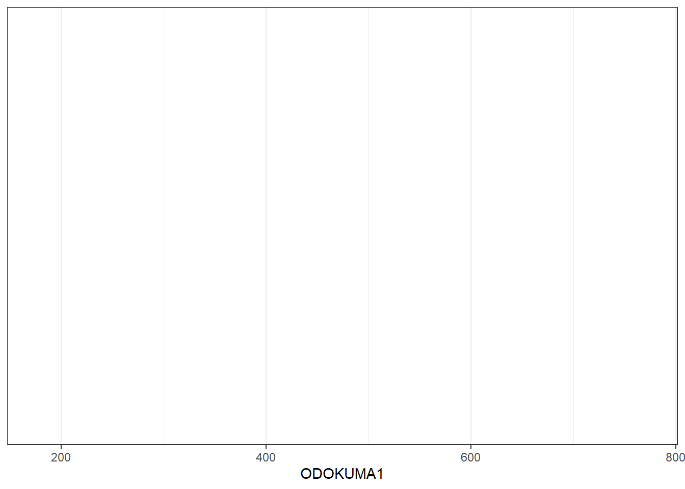

### Katman eklenmesi


```r
grafik_1 + geom_histogram()
```

```
## `stat_bin()` using `bins = 30`. Pick better value with `binwidth`.
```

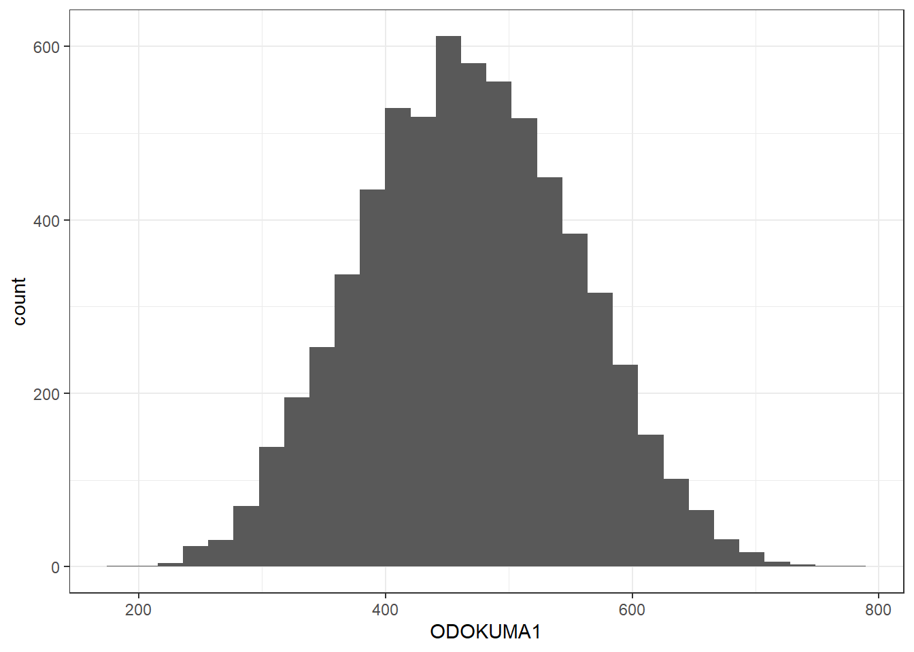

###  Yüzey eklenmesi


```r
grafik_1 +
  geom_histogram()  +
  facet_wrap(~CINSIYET, nrow=2)
```

```
## `stat_bin()` using `bins = 30`. Pick better value with `binwidth`.
```


```r
grafik_1 + 
  geom_histogram() +
   facet_wrap(~SINIF, nrow=2)
```

```
## `stat_bin()` using `bins = 30`. Pick better value with `binwidth`.
```


- **facet_grid** fonksiyonu ise hem tek hem de iki değişkenin panellerde gösterimi için 

  - **facet_grid(satırdeğişkeni~sütundeğişkeni)** 
  
  - **facet_grid(satırdeğişkeni~.)** veya     
  
  - **facet_grid(.~sütundeğişkeni)**


- Yüzeyde kategorik değişkenlerin düzeylerini görebilmek için **factor** değişken olarak tanımlamak gerekir.


```r
library(haven)
PISA_OGR_2018 <- 
  PISA_OGR_2018 %>% 
  mutate_if(is.labelled, funs(as_factor(.)))
```


```r
 ggplot(PISA_OGR_2018, aes(x=ODOKUMA1)) +
  geom_histogram()+
  facet_grid(SINIF~CINSIYET)
```

```
## `stat_bin()` using `bins = 30`. Pick better value with `binwidth`.
```

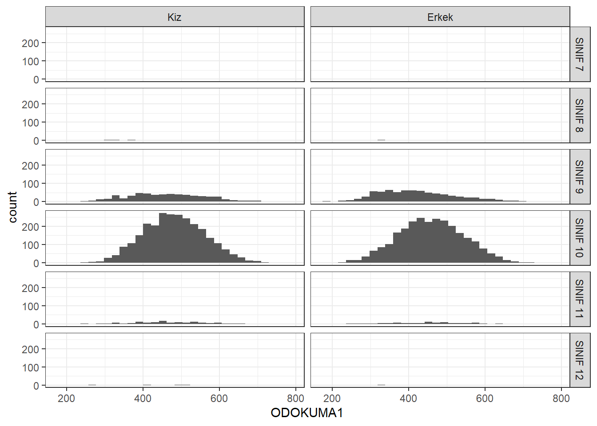


- Yüzeylerin sütunda oluşturulması


```r
ggplot(PISA_OGR_2018,aes(x=ODOKUMA1))+
  geom_histogram()+
  facet_grid(.~CINSIYET)
```

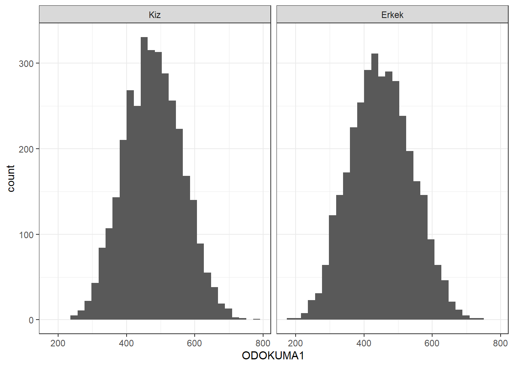

- Yüzeylerin satırlarda oluşturulması

```r
ggplot(PISA_OGR_2018,aes(x=ODOKUMA1))+
  geom_histogram()+
  facet_grid(CINSIYET~.)
```

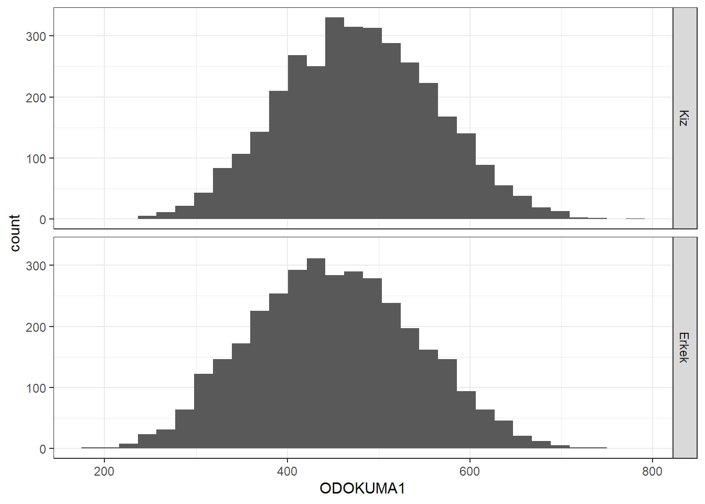


```r
ggplot(PISA_OGR_2018,aes(x=ODOKUMA1))+
  geom_histogram()+
  facet_grid(.~SINIF)
```

```
## `stat_bin()` using `bins = 30`. Pick better value with `binwidth`.
```


```r
ggplot(PISA_OGR_2018,aes(x=ODOKUMA1))+
  geom_histogram()+
  facet_grid(SINIF~.)
```

```
## `stat_bin()` using `bins = 30`. Pick better value with `binwidth`.
```


###  gruplama değişkenleri

- Renklendirme, sembol şekli, sembol büyüklüğü ve çizgi türü belirleyen fonksiyonlar yardımıyla gruplama yapılmaktadır.


#### color ile gruplandırma

- Açıklama kutucukları otomatik çıkar!


```r
p1 <- ggplot(
      PISA_OGR_2018 %>% 
      group_by(SINIF,CINSIYET) %>%
      mutate(ort=mean(ODOKUMA1)) %>% ungroup(),
     aes(x=SINIF, y=ort, color=CINSIYET )) +
  geom_point() +  
  xlab("Sınıf Düzeyi")+
  ylab("Ortalama Puan") 

p1
```


- Yüzey eklenmiş garfiklerde de gruplama değişkeni kullanılabilir.


```r
ggplot(PISA_OGR_2018,aes(x=ODOKUMA1,y=OK_YETERLIK,color=CINSIYET)) +
  geom_point()+
  facet_grid(.~SINIF)	
```

```
## Warning: Removed 199 rows containing missing values (`geom_point()`).
```


## Grafik nesnesi

- Oluşturulan grafik **p** nesnesine atanmıştır. **p** nesnesine **+** ile katmanlar eklenebilir.
- Kategorik degişkenler eksen değerlerini belirler.


```r
p <- ggplot(mtcars, aes(cyl, mpg)) +
  geom_point()
p
```


- cyl değişkenin sadece 4,6 ve 8 değerlerini eksende belirtmek için factor olarak tanımlamak gerekir.


```r
ggplot(mtcars, aes(factor(cyl), mpg)) +
  geom_point()
```


- Grafikler üç bölümden oluşur

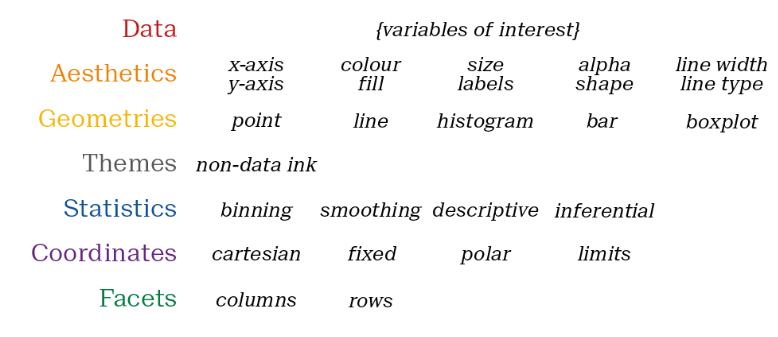

## **AESTHETICS** 

    -   fill
    -   color
    -   size
    -   shape
    -   alpha
    -   linetype
    -   labels


### **color** parametresi


```r
ggplot(PISA_OGR_2018, aes(CINSIYET, OK_YETERLIK)) +
  geom_point(color = "blue")
```

```
## Warning: Removed 199 rows containing missing values (`geom_point()`).
```

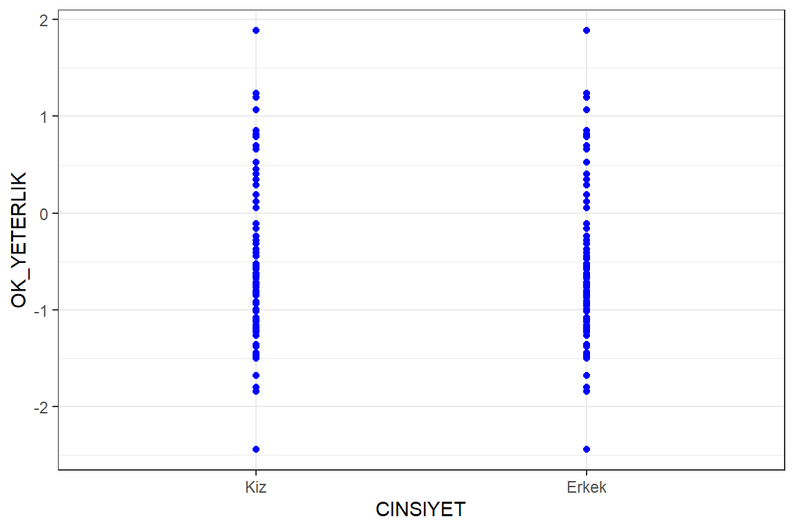

### **size** ve **shape** parametresi

- her iki parametrenin de olağan değeri 1 dir. 

```r
ggplot(PISA_OGR_2018, aes(CINSIYET, OK_YETERLIK)) +
  geom_point(color = "blue",size=5,shape="a")
```

```
## Warning: Removed 199 rows containing missing values (`geom_point()`).
```

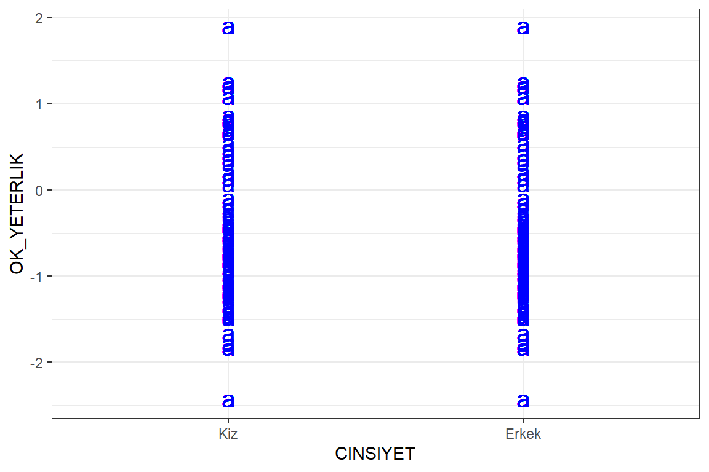


- Veri seti her bir okul türünden 5 kişi alınarak veri seti boyutu küçültülmüştür.


```r
df <- PISA_OGR_2018 %>% group_by(OKUL_TUR)%>% sample_n(5) %>% ungroup()

ggplot(df, aes(CINSIYET, OK_YETERLIK, color = SINIF)) +
  geom_point()
```

```
## Warning: Removed 10 rows containing missing values (`geom_point()`).
```

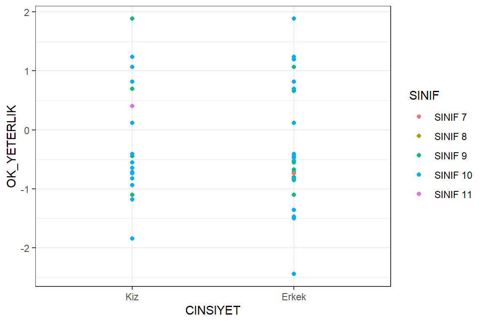


- Üstüse gelen noktalar için **position**

-   identity
-   dodge
-   stack
-   fill
-   jitter
-   jitterdodge
-   nudge


```r
ggplot(df, aes(CINSIYET, OK_YETERLIK, color = SINIF)) +
  geom_point()
```

```
## Warning: Removed 10 rows containing missing values (`geom_point()`).
```


```r
ggplot(df, aes(CINSIYET, OK_YETERLIK, color = SINIF)) +
  geom_point(position = "jitter")
```

```
## Warning: Removed 10 rows containing missing values (`geom_point()`).
```


### **size** parametresi

- parametreler için veri setinden bir değişken değeri seçilebilir.


```r
ggplot(df, aes(CINSIYET, OK_YETERLIK, size = SINIF)) +
  geom_point()
```

```
## Warning: Using size for a discrete variable is not advised.
```

```
## Warning: Removed 10 rows containing missing values (`geom_point()`).
```

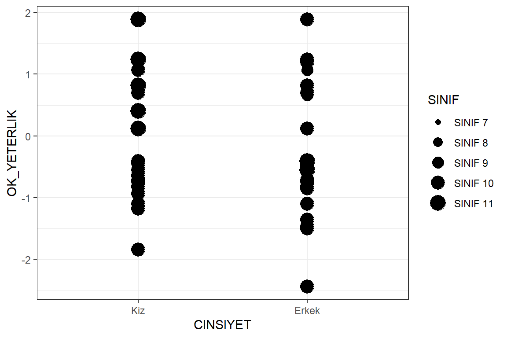

- **size** parametresi  üst üste binen noktaları kaydırarak ayırma


```r
ggplot(df, aes(CINSIYET, OK_YETERLIK, size = SINIF)) +
  geom_point(position = "jitter")
```

```
## Warning: Using size for a discrete variable is not advised.
```

```
## Warning: Removed 10 rows containing missing values (`geom_point()`).
```


## Katmanlar


### alpha

- Şeffaflık düzeyi için **alpa**

```r
ggplot(df, aes(ODOKUMA1, OK_YETERLIK, color = SINIF)) +
  geom_point(alpha = 0.4)
```

```
## Warning: Removed 10 rows containing missing values (`geom_point()`).
```


- Katmanları nesneye ekleme
**grafik1** adlı nesneye istenilen katmanlar eklenebilir.


```r
grafik1 <- ggplot(df, aes(ODOKUMA1, OK_YETERLIK, color = SINIF))
grafik1 +geom_point(alpha = 1.2)
```

```
## Warning: Removed 10 rows containing missing values (`geom_point()`).
```

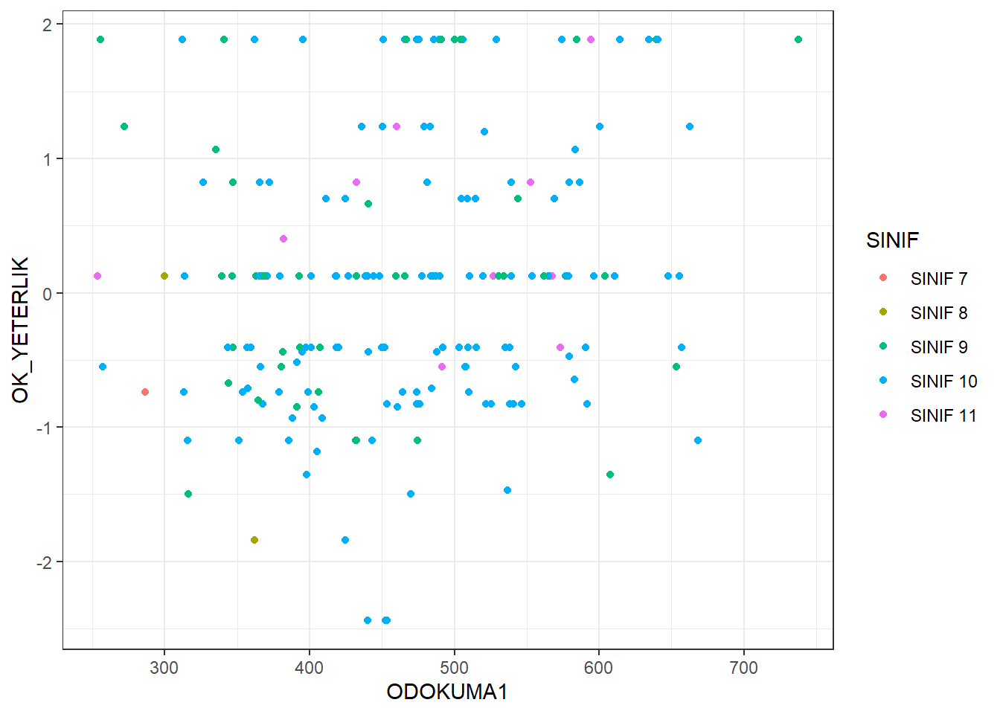


**grafik1** adlı nesneye CINSIYET değişkenine göre şekil ekleme

```r
grafik1 +geom_point(aes(shape=CINSIYET))
```

```
## Warning: Removed 10 rows containing missing values (`geom_point()`).
```


### **text**

Değişken adları **text** komutu ile veri sembolu olarak eklenebilir. Gösterim amacıyla **df** veri setinin sadece ilk 10 satırı kullanılmıştır.


```r
ggplot(df[1:10,], aes(ODOKUMA1, OK_YETERLIK))+
         geom_text(aes(label = CINSIYET))
```


### Scale

Scale fonksiyonları
  -   scale_x() 
  -   scale_y() 
  -   scale_color() 
  -   scale_fill() 
  -   scale_shape() 
  -   scale_linetype() 
  -   scale_size() 
  -   scale_x_continuous() 
  -   scale_y() 
  -   scale_color_discrete() 
  -   scale_fill() 
  -   scale_shape() 
  -   scale_linetype() 
  -   scale_size() 


```r
ggplot(df, aes(x = ODOKUMA1,y = OK_YETERLIK, color = CINSIYET)) +
geom_point(position = "jitter") +
scale_x_continuous("Okuma Puanları") +
scale_color_discrete("Cinsiyet")
```

```
## Warning: Removed 10 rows containing missing values (`geom_point()`).
```

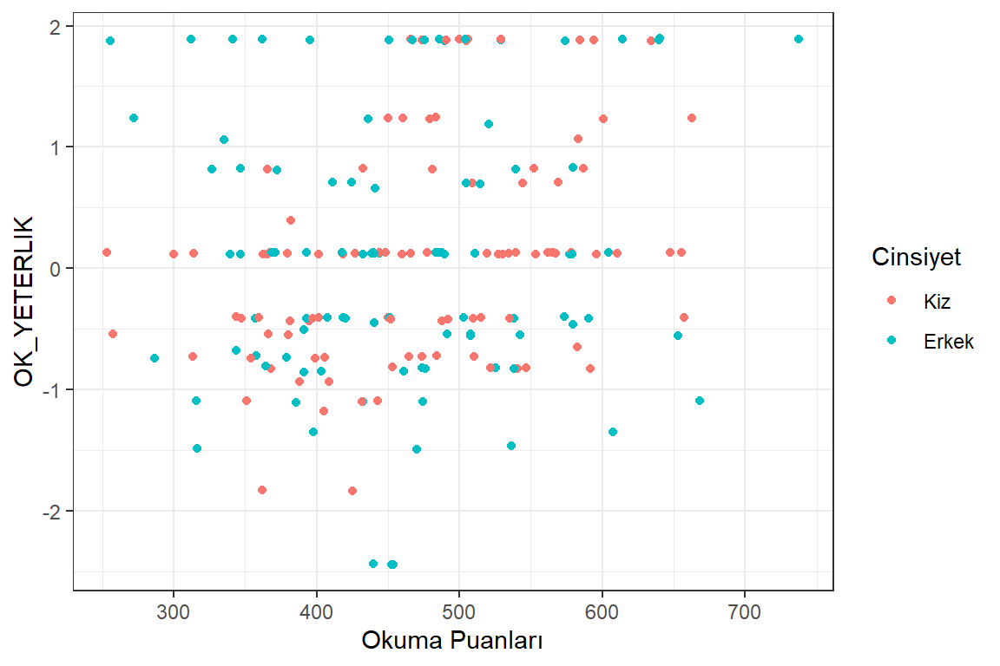

### *limits**


```r
ggplot(df, aes(x = ODOKUMA1,
y = OK_YETERLIK,
color = CINSIYET)) +
geom_point(position = "jitter") +
scale_x_continuous("Okuma Puanları",limits = c(100,900)) +
scale_color_discrete("Cinsiyet")
```

```
## Warning: Removed 10 rows containing missing values (`geom_point()`).
```


### *breaks


```r
ggplot(df, aes(x = ODOKUMA1,
y = OK_YETERLIK,
color = CINSIYET)) +
geom_point(position = "jitter") +
scale_x_continuous("Okuma Puanları",limits = c(100,900),
         breaks=seq(100,900,100)) +
scale_color_discrete("Cinsiyet")
```

```
## Warning: Removed 10 rows containing missing values (`geom_point()`).
```

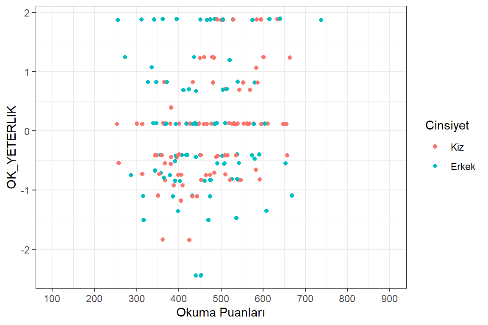


###  expand


```r
ggplot(df, aes(x = ODOKUMA1,
y = OK_YETERLIK,
color = CINSIYET)) +
geom_point(position = "jitter") +
scale_x_continuous("Okuma Puanları",limits = c(100,900),
                   breaks=seq(100,900,100),
                   expand=c(0,0)) +
scale_color_discrete("Cinsiyet")
```

```
## Warning: Removed 10 rows containing missing values (`geom_point()`).
```


### labs


```r
ggplot(df, aes(x = ODOKUMA1,
y = OK_YETERLIK,
color = CINSIYET)) +
geom_point(position = "jitter") +
  labs(x = "\nBasari Puanları",
       y = "\nYeterlik Puanları",
       color = "Grup")
```

```
## Warning: Removed 10 rows containing missing values (`geom_point()`).
```


## Bar Grafiği


```r
ggplot(df, aes(CINSIYET, fill = SINIF)) +   geom_bar() +
  labs(x = "Cinsiyet",
       y = "Frekans")
```

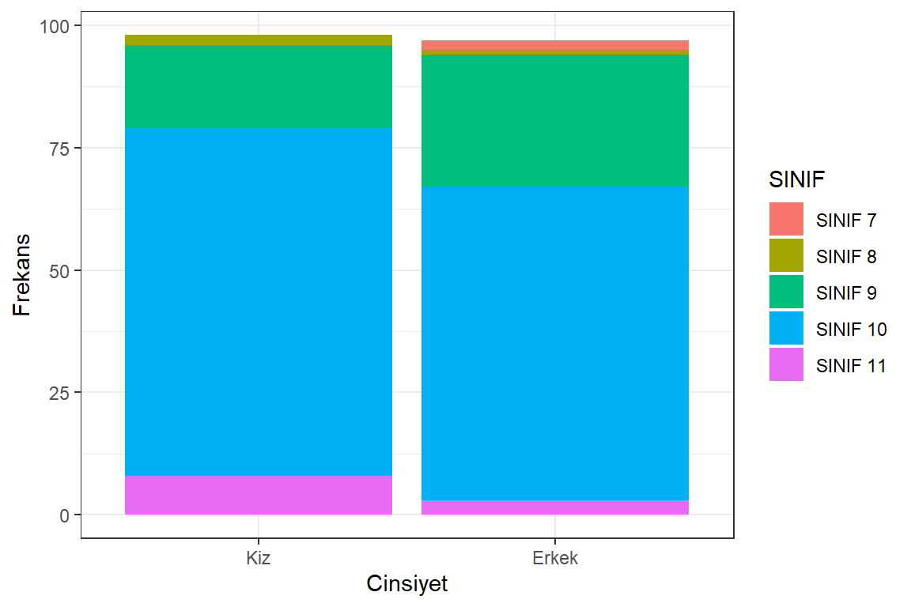

## scale_fill


```r
ggplot(df, aes(CINSIYET, fill = SINIF)) +
  geom_bar() +
   labs(x = "Cinsiyet",
       y = "Frekans") +
  scale_fill_manual("CINSIYET", values = c("red","blue","orange","green",
                                           "darkblue","purple"))
```

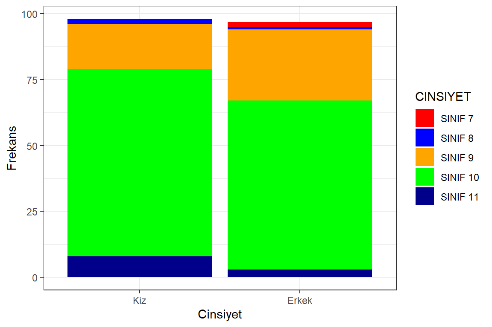


## Bar Grafikleri

```r
dat <- PISA_STU_2018 %>%
  group_by(ST004D01T) %>%
  summarise(ort = mean(PV1READ),
            sd = sd(PV1READ),
            n = n()) %>%
  ungroup()

ggplot(data = PISA_STU_2018, mapping = aes(x = ST004D01T)) +
  geom_bar()
```


```r
dat <- mutate(PISA_STU_2018, Cinsiyet = factor(
  ST004D01T,
  c(1, 2),
  c("kiz", "erkek")
))

ggplot(data = dat, mapping = aes(x = Cinsiyet)) +
  geom_bar()
```


```r
ggplot(data = dat, mapping = aes(x = Cinsiyet)) + 
  geom_bar(aes(y = (..count..)/sum(..count..))) + 
  scale_y_continuous(name = "Yüzde", labels=scales::percent) 
```

```
## Warning: The dot-dot notation (`..count..`) was deprecated in ggplot2 3.4.0.
## ℹ Please use `after_stat(count)` instead.
## This warning is displayed once every 8 hours.
## Call `lifecycle::last_lifecycle_warnings()` to see where this warning was
## generated.
```


- teşekkürler !

--


- 😕

<<<<<<< HEAD
- 😆
=======
- 😀
>>>>>>> 0d7dfe2e0520aad595526b603786ccc1fbe9b63c


