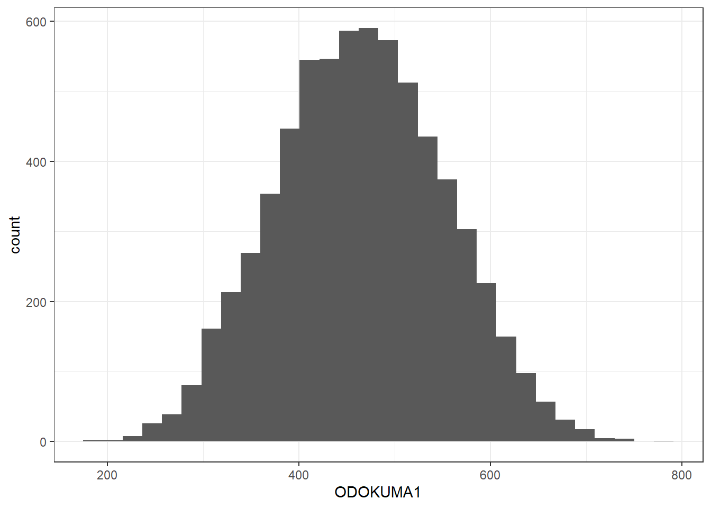
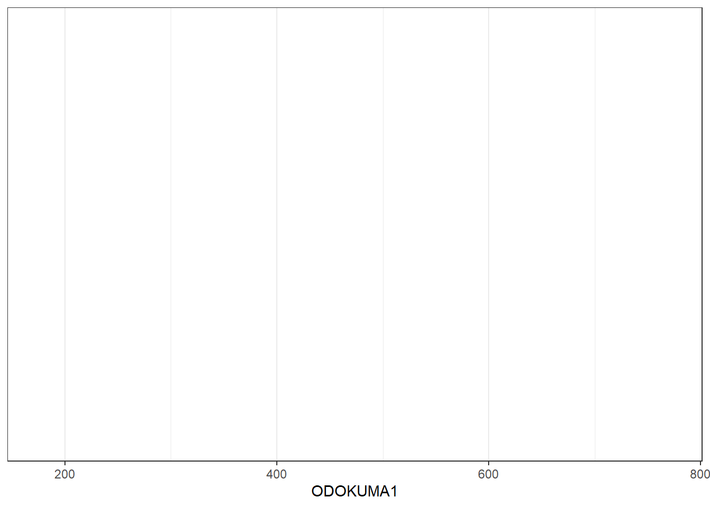
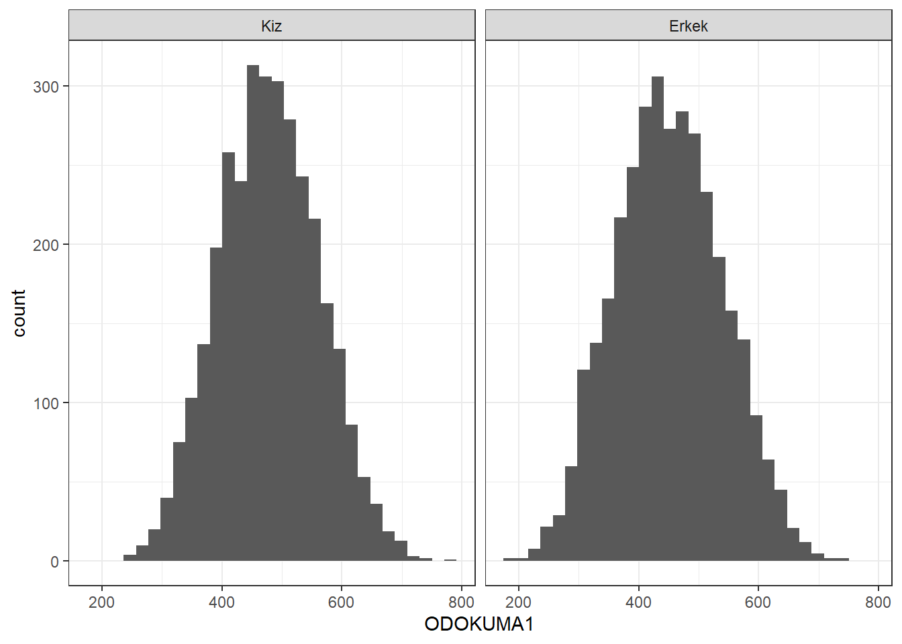

# Gorselleştirme

<!-- https://statsandr.com/blog/descriptive-statistics-in-r/ -->

<!-- https://rpubs.com/williamsurles/298945 -->

<!-- https://rpubs.com/odenipinedo/introduction-to-data-visualization-with-ggplot2 -->

{width="50%"}

{width="50%"}

-   Grafikler bir **veri kümesini anlamamıza yardımcı olur ve örüntüyü
    yorumlayabilmek** önemli bir araçtır. Grafikler veriyi betimlemek
    amacıyla kullanılır.

-   Grafiklerin olabildiğince ayrıntı içermesine bunu yaparken de
    ayrıntıların ne kadarına yorumlayabileceğinize odaklanın.

-   Grafikleri sunarken editoryal kararlar gereklidir. Vurgulamak
    istediğiniz temel özellikleri vurgulayın. Gereksiz ayrıntıları
    ortadan kaldırın.

-   Grafik sistemleri

    -   **Base:** öğrenmesi en kolay olan

    -   **Grid:** diğer araçları geliştirmek için güçlü moduller

    -   **lattice:** gridler üzerine kurulu genel amaçlı grafikler

    -   **ggplot2:** grafiklerin grammeri

-   `tidyverse` paketi veri düzenlemeleri, görselleştirmeleri,
    modellemeleri kolay bir şekilde yapabilmemizi sağlayan, R'ın birçok
    paketini içinde bulunduran pakettir. Bu paketin içeriğinde veri
    görselleştirme amacıyla `ggplot2` paketi de yer almaktadır.


```r
# install.packages("tidyverse", repos="https://cran.rstudio.com")
library("tidyverse")
```

-   Grafikler oluşturulurken, genellikle birden fazla değişkene ilişkin
    gözlemlerin yer aldığı veri setleri kullanılır.

-   Grafiklerin kolay okunması adına `PISA_OGR_2018` veri setinden veri
    sayısının azaltılması amacıyla select() fonksiyonu ile bazı
    değişkenler seçilmiştir. Veri setinde sadece 9. ve 10. sınıflar
    filitrelenmiştir.

-   Faktor olan değişlenlerde `to_factor` fonksiyonu ile kaetgorik hale
    dönüştürülmüştür.


```r
library(tuev)
library(sjlabelled)
data(PISA_OGR_2018)
df1 <- PISA_OGR_2018 %>%
select(CINSIYET, SINIF,KITAPSAYISI, SES, Anne_Egitim, Baba_Egitim,Okuloncesi_yil,OKUL_TUR,OKUMA_ZEVK,
       OK_YETERLIK,ODOKUMA1) 
# kategorik değişkenlerin faktör olarak kaydı

library(labelled)

 
df1 <- df1 %>%  mutate(across(.cols=c(CINSIYET:KITAPSAYISI,
                      Anne_Egitim:OKUL_TUR), labelled::to_factor))

df1 <- df1 %>%  filter(SINIF == "SINIF 9" | SINIF == "SINIF 10")
```

## ggplot

-   Grafikleri iyi bilinen **ggplot2** paketi grafikleri üzerinden
    işleyeceğiz.

-   **ggplot2** paketindeki grafikler genellikle daha iyi bir görünüme
    sahiptir ancak daha gelişmiş kodlama becerileri gerektirir (daha
    fazla bilgi edinmek için "Graphics in R with ggplot2" makalesine
    bakın).

-   Grafiklerinizi yayınlamanız veya paylaşmanız gerekiyorsa, mümkünse
    **ggplot2** kullanmanızı öneririm, aksi takdirde varsayılan
    grafikler işinizi görecektir.

::: {.info data-latex=""}
İpucu: Yakın zamanda
[**esquisse**](https://dreamrs.github.io/esquisse/index.html)
eklentilerinden ggplot2 oluşturucusunu keşfettim. Kendiniz kodlamak
zorunda kalmadan **ggplot2** paketinden nasıl kolayca grafik
çizebileceğinizi görün.
:::

-   Bu sayfa görüntülenen tüm grafikler özelleştirilebilir. Örneğin,
    başlığı, x ve y ekseni etiketlerini, rengi vb. düzenlemek mümkündür.


```r
library(ggplot2)
ggplot(df1,aes(x=ODOKUMA1)) + geom_histogram()
```

```
## `stat_bin()` using `bins = 30`. Pick better value with `binwidth`.
```



-   **ggplot2** paketi, **lattice** paketi gibi verilerdeki birden çok
    değişkeni aynı grafik üzerinde göstermek ve veriler arasındaki çok
    düzeyli ilişkileri özetlemek amacıyla geliştirilmiştir.

-   Açılımı grafiğin grameri (grammer of graphics) şeklindedir.

-   **lattice** grafiklerindeki gibi grafikler nesneler olarak
    kaydedilmekte ve birden çok grafiği tek bir grafiğin üzerinde
    gösterebilmektedir.

-   **lattice** paketine göre en önemli farkı **katman** mantığıyla
    çalışmasıdır.

    -   Metin ekleme,
    -   renklendirme,
    -   açıklama kutucukları vb... özelleştirmeler toplama **(+)**
        işareti ile kodlara eklenebilmektedir.

-   **ggplot2** paketnde Temel Fonksiyonların Kullanımı aşağıdaki
    şekildedir.

    ```         
    -   **qplot()** ve **ggplot()** fonksiyonları
    -   **qplot()**, hızlı grafik (quick plot) çizimi anlamına gelmektedir.

      -   **qplot(x, y, data, geom)** veya

      -   **ggplot(x, y, data, geom)** veya

      -   **ggplot( data, aes(x, y)) + geom.grafikismi()**
    ```

-   **aes()** her bir değişkenin alacağı rolü belirlemede kullanılır.

-   **geom()** argümanı çizilecek grafiği türünü belirlemek için
    kullanılmaktadır. Geometrik nesneler (geometric objects) olarak
    adlandırılmaktadır.

-   Örneğin **yoğunluk grafiği** çizilmek istendiğinde;

    -   **ggplot(x, y, data, geom="density")** veya

    -   **ggplot( data, aes(x, y)) + geom.density()**

-   ggplot2 paketinde yer alan tüm grafikler aşağıda listelenmiştir.


```r
library(ggplot2)
ls(pattern = '^geom_', env = as.environment('package:ggplot2'))
```

```
##  [1] "geom_abline"            "geom_area"              "geom_bar"              
##  [4] "geom_bin_2d"            "geom_bin2d"             "geom_blank"            
##  [7] "geom_boxplot"           "geom_col"               "geom_contour"          
## [10] "geom_contour_filled"    "geom_count"             "geom_crossbar"         
## [13] "geom_curve"             "geom_density"           "geom_density_2d"       
## [16] "geom_density_2d_filled" "geom_density2d"         "geom_density2d_filled" 
## [19] "geom_dotplot"           "geom_errorbar"          "geom_errorbarh"        
## [22] "geom_freqpoly"          "geom_function"          "geom_hex"              
## [25] "geom_histogram"         "geom_hline"             "geom_jitter"           
## [28] "geom_label"             "geom_line"              "geom_linerange"        
## [31] "geom_map"               "geom_path"              "geom_point"            
## [34] "geom_pointrange"        "geom_polygon"           "geom_qq"               
## [37] "geom_qq_line"           "geom_quantile"          "geom_raster"           
## [40] "geom_rect"              "geom_ribbon"            "geom_rug"              
## [43] "geom_segment"           "geom_sf"                "geom_sf_label"         
## [46] "geom_sf_text"           "geom_smooth"            "geom_spoke"            
## [49] "geom_step"              "geom_text"              "geom_tile"             
## [52] "geom_violin"            "geom_vline"
```

## Histogram

-   Aşağıdaki kod sadece ilk katmanı oluşturur.


```r
grafik_1 <- ggplot(df1, aes(x=ODOKUMA1))
grafik_1 
```



### Katman eklenmesi


```r
grafik_1 + geom_histogram()
```

```
## `stat_bin()` using `bins = 30`. Pick better value with `binwidth`.
```


### Yüzey eklenmesi


```r
grafik_1 +
  geom_histogram()  +
  facet_wrap(~CINSIYET, nrow=2)
```

```
## `stat_bin()` using `bins = 30`. Pick better value with `binwidth`.
```


```r
grafik_1 + 
  geom_histogram() +
   facet_wrap(~SINIF, nrow=2)
```

```
## `stat_bin()` using `bins = 30`. Pick better value with `binwidth`.
```


-   **facet_grid** fonksiyonu ise hem tek hem de iki değişkenin
    panellerde gösterimi için

    -   **facet_grid(satırdeğişkeni\~sütundeğişkeni)**

    -   **facet_grid(satırdeğişkeni\~.)** veya

    -   **facet_grid(.\~sütundeğişkeni)**

-   Yüzeyde kategorik değişkenlerin düzeylerini görebilmek için
    **factor** değişken olarak tanımlamak gerekir.


```r
 ggplot(df1, aes(x=ODOKUMA1)) +
  geom_histogram()+
  facet_grid(SINIF~CINSIYET)
```

```
## `stat_bin()` using `bins = 30`. Pick better value with `binwidth`.
```


-   Yüzeylerin sütunda oluşturulması


```r
ggplot(df1,aes(x=ODOKUMA1))+
  geom_histogram()+
  facet_grid(.~CINSIYET)
```



-   Yüzeylerin satırlarda oluşturulması


```r
ggplot(df1,aes(x=ODOKUMA1))+
  geom_histogram()+
  facet_grid(CINSIYET~.)
```


```r
ggplot(df1,aes(x=ODOKUMA1))+
  geom_histogram()+
  facet_grid(.~SINIF)
```

```
## `stat_bin()` using `bins = 30`. Pick better value with `binwidth`.
```


```r
ggplot(df1,aes(x=ODOKUMA1))+
  geom_histogram()+
  facet_grid(SINIF~.)
```

```
## `stat_bin()` using `bins = 30`. Pick better value with `binwidth`.
```


### gruplama değişkenleri

-   Renklendirme, sembol şekli, sembol büyüklüğü ve çizgi türü
    belirleyen fonksiyonlar yardımıyla gruplama yapılmaktadır.

#### color ile gruplandırma

-   Açıklama kutucukları otomatik çıkar!


```r
p1 <- ggplot(
      df1 %>% 
      group_by(SINIF,CINSIYET) %>%
      mutate(ort=mean(ODOKUMA1)) %>% ungroup(),
     aes(x=SINIF, y=ort, color=CINSIYET )) +
  geom_point() +  
  xlab("Sınıf Düzeyi")+
  ylab("Ortalama Puan") 

p1
```


-   Yüzey eklenmiş garfiklerde de gruplama değişkeni kullanılabilir.


```r
ggplot(df1,aes(x=ODOKUMA1,y=OK_YETERLIK,color=CINSIYET)) +
  geom_point()+
  facet_grid(.~SINIF)	
```

```
## Warning: Removed 190 rows containing missing values (`geom_point()`).
```


## Grafik nesnesi

-   Oluşturulan grafik **p** nesnesine atanmıştır. **p** nesnesine **+**
    ile katmanlar eklenebilir.
-   Kategorik degişkenler eksen değerlerini belirler.


```r
p <- ggplot(mtcars, aes(cyl, mpg)) +
  geom_point()
p
```


-   cyl değişkenin sadece 4,6 ve 8 değerlerini eksende belirtmek için
    factor olarak tanımlamak gerekir.


```r
ggplot(mtcars, aes(factor(cyl), mpg)) +
  geom_point()
```


-   Grafikler üç bölümden oluşur


## **AESTHETICS**

```         
-   fill
-   color
-   size
-   shape
-   alpha
-   linetype
-   labels
```

### **color** parametresi


```r
ggplot(df1, aes(CINSIYET, OK_YETERLIK)) +
  geom_point(color = "blue")
```

```
## Warning: Removed 190 rows containing missing values (`geom_point()`).
```


### **size** ve **shape** parametresi

-   her iki parametrenin de olağan değeri 1 dir.


```r
ggplot(df1, aes(CINSIYET, OK_YETERLIK)) +
  geom_point(color = "blue",size=5,shape="a")
```

```
## Warning: Removed 190 rows containing missing values (`geom_point()`).
```


-   color argümanı ile renklendirme


```r
ggplot(df1, aes(CINSIYET, OK_YETERLIK, color = SINIF)) +
  geom_point()
```

```
## Warning: Removed 190 rows containing missing values (`geom_point()`).
```


-   Üstüse gelen noktalar için **position**

-   identity

-   dodge

-   stack

-   fill

-   jitter

-   jitterdodge

-   nudge


```r
ggplot(df1, aes(CINSIYET, OK_YETERLIK, color = SINIF)) +
  geom_point()
```

```
## Warning: Removed 190 rows containing missing values (`geom_point()`).
```


```r
ggplot(df1, aes(CINSIYET, OK_YETERLIK, color = SINIF)) +
  geom_point(position = "jitter")
```

```
## Warning: Removed 190 rows containing missing values (`geom_point()`).
```


### **size** parametresi

-   parametreler için veri setinden bir değişken değeri seçilebilir.


```r
ggplot(df1, aes(CINSIYET, OK_YETERLIK, size = SINIF)) +
  geom_point()
```

```
## Warning: Using size for a discrete variable is not advised.
```

```
## Warning: Removed 190 rows containing missing values (`geom_point()`).
```


-   **size** parametresi üst üste binen noktaları kaydırarak ayırma


```r
ggplot(df1, aes(CINSIYET, OK_YETERLIK, size = SINIF)) +
  geom_point(position = "jitter")
```

```
## Warning: Using size for a discrete variable is not advised.
```

```
## Warning: Removed 190 rows containing missing values (`geom_point()`).
```


## Katmanlar


### alpha

-   Şeffaflık düzeyi için **alpa**


```r
ggplot(df1, aes(ODOKUMA1, OK_YETERLIK, color = SINIF)) +
  geom_point(alpha = 0.4)
```

```
## Warning: Removed 190 rows containing missing values (`geom_point()`).
```


-   Katmanları nesneye ekleme **grafik1** adlı nesneye istenilen
    katmanlar eklenebilir.


```r
grafik1 <- ggplot(df1, aes(ODOKUMA1, OK_YETERLIK, color = SINIF))
grafik1 +geom_point(alpha = 1.2)
```

```
## Warning: Removed 190 rows containing missing values (`geom_point()`).
```


**grafik1** adlı nesneye CINSIYET değişkenine göre şekil ekleme


```r
grafik1 +geom_point(aes(shape=CINSIYET))
```

```
## Warning: Removed 190 rows containing missing values (`geom_point()`).
```


### **text**

Değişken adları **text** komutu ile veri sembolü olarak eklenebilir.
Gösterim amacıyla **df** veri setinin sadece ilk 10 satırı
kullanılmıştır.


```r
ggplot(df1[1:10,], aes(ODOKUMA1, OK_YETERLIK))+
         geom_text(aes(label = CINSIYET))
```


### Scale

Scale fonksiyonları - scale_x() - scale_y() - scale_color() -
scale_fill() - scale_shape() - scale_linetype() - scale_size() -
scale_x_continuous() - scale_y() - scale_color_discrete() -
scale_fill() - scale_shape() - scale_linetype() - scale_size()


```r
ggplot(df1, aes(x = ODOKUMA1,y = OK_YETERLIK, color = CINSIYET)) +
geom_point(position = "jitter") +
scale_x_continuous("Okuma Puanları") +
scale_color_discrete("Cinsiyet")
```

```
## Warning: Removed 190 rows containing missing values (`geom_point()`).
```


### \*limits


```r
ggplot(df1, aes(x = ODOKUMA1,
y = OK_YETERLIK,
color = CINSIYET)) +
geom_point(position = "jitter") +
scale_x_continuous("Okuma Puanları",limits = c(100,900)) +
scale_color_discrete("Cinsiyet")
```

```
## Warning: Removed 190 rows containing missing values (`geom_point()`).
```


### \*breaks


```r
ggplot(df1, aes(x = ODOKUMA1,
y = OK_YETERLIK,
color = CINSIYET)) +
geom_point(position = "jitter") +
scale_x_continuous("Okuma Puanları",limits = c(100,900),
         breaks=seq(100,900,100)) +
scale_color_discrete("Cinsiyet")
```

```
## Warning: Removed 190 rows containing missing values (`geom_point()`).
```


### expand


```r
ggplot(df1, aes(x = ODOKUMA1,
y = OK_YETERLIK,
color = CINSIYET)) +
geom_point(position = "jitter") +
scale_x_continuous("Okuma Puanları",limits = c(100,900),
                   breaks=seq(100,900,100),
                   expand=c(0,0)) +
scale_color_discrete("Cinsiyet")
```

```
## Warning: Removed 190 rows containing missing values (`geom_point()`).
```


### labs


```r
ggplot(df1, aes(x = ODOKUMA1,
y = OK_YETERLIK,
color = CINSIYET)) +
geom_point(position = "jitter") +
  labs(x = "\nBasari Puanları",
       y = "\nYeterlik Puanları",
       color = "Grup")
```

```
## Warning: Removed 190 rows containing missing values (`geom_point()`).
```


## Bar Grafiği


```r
ggplot(df1, aes(CINSIYET, fill = SINIF)) +   geom_bar() +
  labs(x = "Cinsiyet",
       y = "Frekans")
```


## scale_fill


```r
ggplot(df1, aes(CINSIYET, fill = SINIF)) +
  geom_bar() +
   labs(x = "Cinsiyet",
       y = "Frekans") +
  scale_fill_manual("CINSIYET", values = c("red","blue","orange","green",
                                           "darkblue","purple"))
```


## Bar Grafikleri


```r
ggplot(data = PISA_OGR_2018, mapping = aes(x = CINSIYET)) +
  geom_bar()
```


```r
# df2 <- mutate(df2, Cinsiyet = factor(
#   CINSIYET,
#   c(1, 2),
#   c("kiz", "erkek")
# ))

ggplot(data = df1, mapping = aes(x = CINSIYET)) +
  geom_bar()
```


```r
ggplot(data = df1, mapping = aes(x = CINSIYET)) + 
  geom_bar(aes(y = (..count..)/sum(..count..))) + 
  scale_y_continuous(name = "Yüzde", labels=scales::percent) 
```

```
## Warning: The dot-dot notation (`..count..`) was deprecated in ggplot2 3.4.0.
## ℹ Please use `after_stat(count)` instead.
## This warning is displayed once every 8 hours.
## Call `lifecycle::last_lifecycle_warnings()` to see where this warning was
## generated.
```


## Kaynaklar

-   [ggplot2: elegant graphics for data
    analysis](https://ggplot2-book.org/) by Hadley Wickham, Danielle
    Navarro, and Thomas Lin Pedersen

-   [Fundamentals of Data
    Visualization](https://clauswilke.com/dataviz/) by Claus O. Wilke

-   [Data Visualization: A practical introduction](https://socviz.co/)
    by Kieran Healy

<!-- -->

-   😕

-   😄
