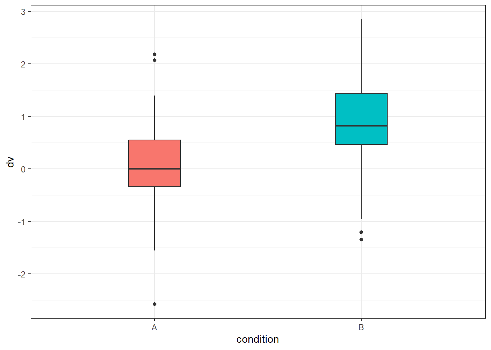

## Veri Üretim

Burada iki koşullu bir çalışmadan elde edilen verileri simüle edeceğiz. 
A koşulundaki ortalama 0 ve B koşulundaki ortalama 1'dir.


```r
n <- 100

data <- data.frame(
  id = 1:n,
  condition = c("A", "B") |> rep(each = n/2),
  dv = c(rnorm(n/2, 0), rnorm(n/2, 1))
)
```

## Grafik


